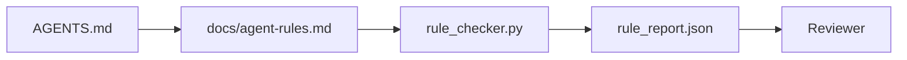

# Chỉ thị của đại lý như một ràng buộc có thể thực hiện

> Sử dụng văn bản viết ra chỉ thị là mong muốn. Sử dụng ràng buộc viết ra chỉ thị là kiểm tra.

**类型：**构建
**语言：**Python (stdlib)
**前置要求：**Giai đoạn 14 · 32 (Minimum Workbench)
**时间：**约50分钟

## Học mục tiêu

- Để hướng dẫn và quy tắc hoạt động tách biệt.
- Để bắt đầu quy tắc, cấm vận hành, hoàn thành định nghĩa, xử lý không chắc chắn và phê duyệt giới hạn biểu hiện cho các thiết bị kiểm tra được.
- Thực hiện một bộ kiểm tra quy tắc, sử dụng bộ quy tắc để đánh giá một lần chạy.
- 让规则集便于变化, để đánh giá có thể xem xét những thay đổi đã xảy ra.

## 问题

 điển hình`AGENTS.md`阅读起来像进入职档. Nó nói với Đại diện cần phải thận trọng và kiểm tra đầy đủ, cũng như không chắc chắn về câu hỏi.

Khi chỉ thị là có thể vận hành, chúng rất mạnh; khi chỉ thị chỉ là như hình ảnh, chúng rất yếu.

## 概念

Quy tắc nên được đặt `docs/agent-rules.md`Trung,远离简短的根路由器──每条规则都名称──类别和检查项──



### 覆盖大多数规则的五个类别

| 类别 | 规则回答的问题 | 示例 |
|----------|---------------------------|---------|
| Startup | 工作开始前必须满足什么？ | “state file exists and is fresh” |
| Forbidden | 什么事情绝对不能发生？ | “do not edit `scripts/release.sh`” |
| Definition of done | 什么能证明任务已完成？ | “pytest exits 0 and acceptance line passes” |
| Uncertainty | Agent 不确定时该做什么？ | “open a question note instead of guessing” |
| Approval | 什么需要人工审批？ | “any new dependency, any prod write” |

Không thể được đưa vào một trong 5 quy tắc này, thường nên được chia thành hai quy tắc.

### Quy tắc là dễ đọc

Mỗi quy tắc có một câu, một loại, một dòng mô tả, và một`check`字段,指向 `rule_checker.py`Một hàm trong số đó. Quy tắc thêm có nghĩa là thêm kiểm tra.

### Quy tắc dễ khác nhau

规则在一个Markdown文件中,每条规则占据一个标题. 规则的名称在不同中可见. 规则的名称在不同中可见. 规则的名称在不同中可见. 规则的名称在不同中可见. 规则的名称在不同中可见. 规则的名称在不同中可见. 规则的名称在不同中可见. 规则的名称在不同中可见. 规则的名称在不同中可见. 规则的名称在不同中可见. 规则的名称在不同中可见. 规则的名称在不同中可见. 规则的名称在不同中可见. 规则的名称在不同类别的顶部. 规则的内容应删除,而不是注释.

### 规则与框架 bảo vệ

框架 guardrails(OpenAI Agents SDK guardrails、LangGraph interrupts) trong hành động ở cấp độ thực thi quy tắc。

### Khám phá tiến bộ: 地图, thay vì百科全书

`AGENTS.md`Sẽ liên tục thay đổi, bởi vì mỗi sự cố sẽ có thêm một quy tắc, nhưng rất ít sự cố sẽ xóa một quy tắc. Một năm sau, tài liệu này có thể có hai ngàn dòng; đại lý đọc xong màn hình đầu tiên sẽ tiêu tốn hết sự chú ý của mình vào ngân sách, chỉ có thể thực hiện một phần nhỏ trong số đó.

Cách sửa chữa không phải là viết một tệp ngắn hơn, mà viết một tệp phân cấp. Router gốc cần phải nhỏ đến mỗi phiên đều có thể đọc xong, và chỉ lưu chỉ mục. Nội dung sâu sắc được đặt trong tệp chủ đề, chỉ khi nhiệm vụ chạm vào chủ đề ứng phó.

```text
AGENTS.md                  # router，少于 50 行：这个 repo 是什么、去哪里看、5 条硬规则
docs/
  agent-rules.md           # 完整规则集（本课）
  architecture.md          # 任务触及 module boundaries 时加载
  testing.md               # 任务编写或运行 tests 时加载
  deploy.md                # 只在 release 工作中加载，并受 approval rule 保护
feature_list.json          # backlog（Phase 14 · 36）
```

| Tier | 存放位置 | 读取时机 | 大小预算 |
|------|----------|----------|----------|
| Router | `AGENTS.md` | 每个 session，始终读取 | 少于约 50 行 |
| Rules | `docs/agent-rules.md` | 每个 session 启动时 | 每个 category 一屏 |
| Topic docs | `docs/<topic>.md` | 只有任务触及该主题时 | 需要多深就多深 |

两个测试能让分层保持诚实――第一是可达性测试:agent 应该能从路由器出发,最多两跳到任何规则,所以路由器 必须按路径 链接每个主题 doc,而不是用散文 模糊描述――第二是新鲜性测试:路由器 足够短,评论员会在每个 PR 里重读它,这是防止它长回百科全书的唯一方法――指针效率失效比缺一条规则更糟糕,所以路由器中断链 本身就是启动检查违规――


```figure
wb-rule-checkoff
```

##  xây dựng nó

`code/main.py`提供:

- `agent-rules.md`Parser,将规则加载到数据类 中──
- `rule_checker.py`风格的检查函数, mỗi `check`引用对应一个.
- Một nhân viên demo đã chạy, nó vi phạm hai quy tắc, và một lần nữa có thể bắt được những vi phạm này qua kiểm tra.

运行 nó:

```
python3 code/main.py
```

输出:解析后的规则集、运行追踪、每条规则的通过/失败,以及保存在脚本旁边的 `rule_report.json`

## 生产中的模式

Có ba mô hình có thể phân biệt một tập hợp quy tắc có thể kéo dài trong một quý, với một tập hợp quy tắc về suy thoái trong một tuần.

**编写时标注严重性。**Mỗi quy tắc đều có.`severity`- Có thể là:`block``warn`Hoặc`info`❖ kiểm tra viên sẽ báo cáo; vận hành chỉ sẽ ở `block`上拒绝──大多数 nhóm sớm sẽ đánh giá cao mức độ nghiêm trọng, sau đó làm suy yếu nó dưới áp lực thời hạn kết thúc; trong khi viết, đánh dấu sẽ buộc nhóm提前校准── với cổng xác minh (Phase 14 · 38) hợp tác sử dụng, nó sẽ đưa bất kỳ đối thủ nào vào`block`规则的过渡 签入 `overrides.jsonl`sổ kiểm toán.

**规则过期作为强制机制。**Mỗi quy tắc đều có.`expires_at`日期(默认是编写后 90 天)  Khi một điều khoản không quá hạn quy tắc连续 60 天没有任何违规时, kiểm tra器 sẽ phát hành cảnh báo; lần tiếp theo Quarterly Review hoặc giải thích lý do để giữ lại nó, hoặc sẽ làm suy yếu nó vì`info`, hoặc xóa nó. AI Code Review của Cloudflare sản xuất dữ liệu: 2026 năm 4 月,30 天内跨 5,169 repo运行 131,246 lần xem xét) cho thấy, có quy tắc của cơ chế hết hạn rõ ràng có thể duy trì trong mỗi repo 30 条 quy tắc; không có cơ chế hết hạn quy tắc tập hợp tăng lên 80+, và hầu hết không bao giờ chạm vào.

**Markdown 作为 source，JSON 作为 cache。** `agent-rules.md`là tác giả và bảo vệ tài liệu;`agent-rules.lock.json`là kiểm tra器 trong đường nóng 中读取的缓存──lock bởi pre-commit hook 重新生成──Markdown khác nhau 便于评审; JSON parsing sẽ không vào mỗi lượt──形态与`package.json`- `package-lock.json`和 `Cargo.toml`- `Cargo.lock`Tương tự như vậy.

## Sử dụng nó

Trong sản xuất:

- Claude Code、Code、Cursor  bắt đầu phiên  đọc các quy tắc, và từ chối sử dụng khi trích dẫn chúng── kiểm tra sẽ tái sử dụng các quy tắc này trong CI, để bắt được không động động.
- OpenAI Agents SDK guardrails 将同样检查注册为输入和输出 guardrails──Markdown là docs 表面;SDK là运行时表面──
- LangGraph gián đoạn 会在执行的节点 违反规则时触发── gián đoạn trình xử lý 读取规则,询问人类,然后恢复──

Quy tắc này có thể được chuyển giữa ba người, vì nó chỉ là Markdown + hàm tên.

## 交付 nó

`outputs/skill-rule-set-builder.md`Chủ sở hữu dự án cuộc phỏng vấn, phân loại các lệnh散文 hiện có của họ thành năm loại, và xuất bản một phiên bản `agent-rules.md`Một cái máy kiểm tra.

## 练习

1. Nếu sản phẩm của bạn thực sự cần thứ sáu, hãy thêm nó.
2. 扩展检查器,让规则可以携带严重性(`block``warn``info`),并让报告按严重性聚聚──
3. Để kiểm tra kết nối CI: Nếu các quy tắc nghiêm trọng trong hoạt động của đại lý mới nhất thất bại, thì hãy xây dựng thất bại.
4. Vì mỗi quy tắc thêm một expiry字段──90 天内没有检查失败──后该规则进入评审──
5. Tìm một cái thật`AGENTS.md`, và viết lại nó thành 5 loại quy tắc. Trong số đó có bao nhiêu đường là có thể vận hành?

## 关键术语

| 术语 | 人们的说法 | 它实际意味着什么 |
|------|----------------|------------------------|
| Operational rule | “一条真正的指令” | 工作台可在运行时检查的规则 |
| Aspirational rule | “谨慎一点” | 没有检查的规则；要么删除，要么升级 |
| Definition of done | “Acceptance” | 证明任务已完成的客观、基于文件的证据 |
| Block severity | “硬规则” | 违规会中止运行；没有 operator 不能静默处理 |
| Rule expiry | “过时规则清理” | 在 N 天内没有失败的规则可以考虑退役 |

## 延伸阅读

- [OpenAI Agents SDK guardrails](https://platform.openai.com/docs/guides/agents-sdk/guardrails)
- [LangGraph interrupts](https://langchain-ai.github.io/langgraph/how-tos/human_in_the_loop/breakpoints/)
- [Anthropic, Building Effective Agents](https://www.anthropic.com/research/building-effective-agents)
- [Rick Hightower, Agent RuleZ: A Deterministic Policy Engine](https://medium.com/@richardhightower/agent-rulez-a-deterministic-policy-engine-for-ai-coding-agents-9489e0561edf) 生产中的 bloc/warn/info 严重性
- [Cloudflare, Orchestrating AI Code Review at Scale](https://blog.cloudflare.com/ai-code-review/) 131k 次 review 运行,规则组合经验
- [microservices.io, GenAI development platform — part 1: guardrails](https://microservices.io/post/architecture/2026/03/09/genai-development-platform-part-1-development-guardrails.html) 规则 và sự phòng thủ sâu sắc giữa CI
- [Type-Checked Compliance: Deterministic Guardrails (arXiv 2604.01483)](https://arxiv.org/pdf/2604.01483) Lean 4  như quy tắc kiểm tra của giới hạn trên
- [logi-cmd/agent-guardrails](https://github.com/logi-cmd/agent-guardrails) merge-gate 实现:scope、mutation testing、violation budget
- Giai đoạn 14 · 32  Quy tắc tập hợp của các kết nối bàn làm việc tối thiểu
- Giai đoạn 14 · 38  消费规则报告的验证门
- Giai đoạn 14 · 39  Đánh giá viên đối với quy tắc 合规性评分
