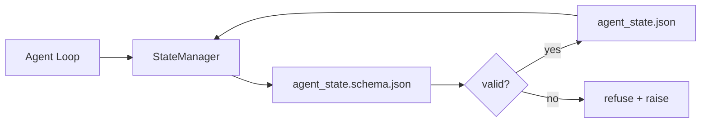

# Khoảnh khắc Repo và trạng thái bền vững

> Lịch sử trò chuyện là dễ mất. Repo là lâu dài.

**Type:** Build
**Languages:** Python (stdlib + `jsonschema` optional)
**Prerequisites:** Phase 14 · 32 (Minimal Workbench)
**Time:** ~60 minutes

## Học mục tiêu
- 定义属于 repo memory,属于聊天历史的什么?
- Vì vậy`agent_state.json`和 `task_board.json`编写 JSON Schemas。
- Xây dựng một nhà quản lý nhà nước, sử dụng để vận chuyển hạt nhân hóa, xác nhận, thay đổi và duy trì nhà nước.
- Sử dụng schema trong xấu viết phá vỡ bàn làm việc  trước khi từ chối chúng.

## 问题
đại lý hoàn thành một phiên. Chat kết thúc. Next session mở và hỏi từ đâu bắt đầu. Model nói: Hãy để tôi kiểm tra các tập tin, đọc các ghi chú đã qua, sau đó lặp lại đã hoàn thành công việc.

Phương pháp sửa đổi của workbench là bộ nhớ repo: trạng thái 存在 repo trong JSON 文件里, theo schema 写入,以原子方式持久化,并且在代码审查中对对差友好。Chat là cấp dữ liệu tạm thời;repo là hệ thống ghi lại。

## 概念


### 什么属于 repo memory

| 属于 | 不属于 |
|---------|-----------------|
| Active task id | 原始 chat transcripts |
| 本 session 触碰过的文件 | Token-level reasoning traces |
| agent 做出的假设 | "The user seemed frustrated" |
| 未解决的 blockers | Sampled completions |
| 下一步 action | Vendor-specific model ids |

判断标准是持久性: 3 tháng sau khi CI tái运行, nó có còn hữu ích không?

### Chương trình đầu tiên

JSON Schema là một hiệp ước. Không có nó, mỗi đại lý sẽ phát triển một đoạn mới, mỗi nhà phê bình sẽ học một hình dạng mới, mỗi kịch bản CI đều phải làm một trường hợp đặc biệt đối với phiên bản trước đó.

schema 覆盖:

- Chìa khóa cần thiết.
- 允许的 `status`Giá trị:
- 禁止的值(例如阵列的 `null`(■)
- Các hạn chế mô hình(đồ nhận dạng nhiệm vụ 匹配 `T-\d{3,}`(■)
- Sử dụng trong trường phiên bản của di cư.

### Atomic viết

State 写入需要能承受部分失败:写入tempfile,fsync,然后改名覆盖目标──state file là nguồn gốc của sự thật;写到一半的状态文件比没有文件更糟──

### Di cư

Khi schema  biến đổi, trong schema bump 旁边交付一个迁移脚本――状态文件 带有 带有`schema_version`field;manager sẽ từ chối tải lên phiên bản không thể di chuyển của các file.


```figure
wb-state-persist
```

##  xây dựng nó
`code/main.py`实现:

- `agent_state.schema.json`和 `task_board.schema.json`
- Một chỉ sử dụng stdlib của xác thực viên(JSON Schema 子集:required、type、enum、pattern、items)
- 带有原子-temp-and-rename 写入的 `StateManager.load``StateManager.update``StateManager.commit`
- Một demo:变更状态,持久化,重新加载,并证明回路.

运行 nó:

```
python3 code/main.py
```

kịch bản 会写入 `workdir/agent_state.json`和 `workdir/task_board.json`, qua hai vòng 变更 chúng, và mỗi bước in thông qua tình trạng chứng minh.

## Thực tế trong tình hình sản xuất

Có 4 phương pháp để biến tối thiểu của bài học này thành một đơn vị đa đại lý dễ chịu.

**Atomic temp-and-rename 不是可选项。**Một báo cáo lỗi dự án Hive tháng 3 năm 2026 đã ghi lại rõ chế độ thất bại này:`state.json` Thông qua `write_text()`写入,并且例外 被捕后静默忽略──部分写入让会议 在没有信号的情况下基于损坏状态 恢复──修复永远是: 在与目标相似的目录中使用`tempfile.mkstemp`, viết vào,`fsync`- Tôi không biết.`os.replace`(Với POSIX và Windows trên là đổi tên nguyên tử)`atomic_write`Đúng vậy.

**每个非幂等 tool call 都要有 idempotency keys。**Nếu đại lý trong điều khiển công cụ 之后、checkpoint 结果之前崩,恢复过程会重试该工具调用. 对阅读安全; 对电子邮件,DB插入,文件上传 危险.`pending_calls.jsonl` 重试时检查该 ID; nếu có, nhảy qua调用并使用缓存 kết quả。Anthropic 和 LangChain đều chỉ ra điều này trong hướng dẫn 2026; LongGraph của kiểm tra chỉ số xuất phát từ cùng một lý do kéo dài chờ viết。

**将大型 artifacts 与 state 分离。**Đừng để CSVs 长 transcripts hoặc tạo ra các tập tin  lưu trữ `agent_state.json`△将 artefact 保存为单独文件(或上传到物体存储),state 中只保留路径──检查点 保持小而快; artefact 独立增长──

**Event sourcing 用于 audit，snapshots 用于 resume。**Mỗi đột biến đều được thêm vào nhật ký sự kiện`state.events.jsonl`); chụp nhanh thường xuyên đến `state.json`✿ Resume 读取 snapshot, rồi play snapshot timestamp ✿ tất cả các sự kiện sau đó.

**Schema migrations，否则拒绝加载。** `schema_version`Integer là契约── khi quản lý tải lên các file phiên bản chưa biết, nó sẽ từ chối đọc── trong schemap bump 旁边交付迁移脚本;`tools/migrate_state.py`Trong mỗi lần khởi động 时等运行.

## Sử dụng nó
Trong sản xuất:

- **LangGraph checkpointers。**Cùng một ý tưởng, lưu trữ khác nhau. Checkpointer sẽ định hình trạng thái  kéo dài thành SQLite. Postgres hoặc tùy chỉnh backend.
- **Letta memory blocks。**带结构 hóa các kế hoạch khối liên tục ]]Phase 14 · 08)。
- **OpenAI Agents SDK session store。**Pluggable backends, schema-aware. 本课中的状态文件就是本课中的状态文件.

## 交付 nó
`outputs/skill-state-schema.md`会生成对项目特定JSON Schema(state + board) 、一个连接到原子写的Python `StateManager`, cũng như một sàn di chuyển, đảm bảo lần sau một cú đập kế hoạch sẽ không phá hủy bàn làm việc.

## 练习
1. 添加一个 `last_human_touch`Tiêu khắc thời gian. Từ chối chỉnh sửa của con người.
2. 扩展 xác nhận 以支持 `oneOf`, nhiệm vụ này có thể là xây dựng nhiệm vụ, cũng có thể là nhiệm vụ xem xét, và cả hai đều có các lĩnh vực yêu cầu khác nhau.
3. 添加 `schema_version`trường,并编写 từ v1 đến v2 của di chuyển`blockers`重命名为 `risks`(■)
4. sẽ lưu trữ backend từ tập tin địa phương  chuyển đến SQLite。 giữ `StateManager`API không thay đổi.
5. Hãy để hai đại lý viết bài trong 50 ms cùng lúc viết vào cùng một tập tin nhà nước.

## 关键术语
| Term | What people say | What it actually means |
|------|----------------|------------------------|
| Repo memory | "Notes file" | 按 schema 存储在 repo 的 tracked files 中的 state |
| Schema-first | "Validate inputs" | 先定义契约再写 writer，拒绝漂移 |
| Atomic write | "Just rename" | 写入 temp，fsync，rename，因此 partial failures 无法破坏 |
| Migration | "Schema bump" | 将 vN state 转换为 v(N+1) state 的 script |
| System of record | "Source of truth" | workbench 视为权威的 artifact |

## 延伸阅读
- [JSON Schema specification](https://json-schema.org/specification.html)
- [LangGraph checkpointers](https://langchain-ai.github.io/langgraph/concepts/persistence/)
- [Letta memory blocks](https://docs.letta.com/concepts/memory)
- [Fast.io, AI Agent State Checkpointing: A Practical Guide](https://fast.io/resources/ai-agent-state-checkpointing/) Đường kiểm soát đầu tiên với
- [Fast.io, AI Agent Workflow State Persistence: Best Practices 2026](https://fast.io/resources/ai-agent-workflow-state-persistence/) kiểm soát đồng thời TTL  nguồn cung cấp sự kiện
- [Hive Issue #6263 — non-atomic state.json writes silently ignored](https://github.com/aden-hive/hive/issues/6263) thực tế dự án Trung ương chế thất bại
- [eunomia, Checkpoint/Restore Systems: Evolution, Techniques, Applications](https://eunomia.dev/blog/2025/05/11/checkpointrestore-systems-evolution-techniques-and-applications-in-ai-agents/) Từ OS 历史 应用于 đại lý của CR nguyên thủy
- [Indium, 7 State Persistence Strategies for Long-Running AI Agents in 2026](https://www.indium.tech/blog/7-state-persistence-strategies-ai-agents-2026/)
- [Microsoft Agent Framework, Compaction](https://learn.microsoft.com/en-us/agent-framework/agents/conversations/compaction) Giám đốc điểm kiểm soát của nhà cung cấp
- Giai đoạn 14 · 08  Các khối bộ nhớ và tính toán thời gian ngủ
- Giai đoạn 14 · 32  本课为其方案化三档最小
- Giai đoạn 14 · 40  Từ cùng một kế hoạch 读取的交付包
