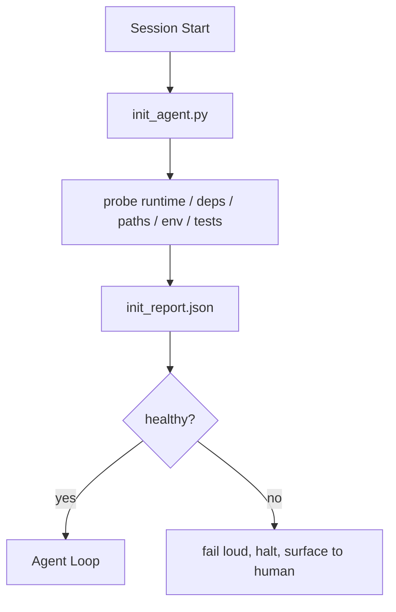

# Biểu bản khởi đầu của Agent

> Mỗi phiên khởi động lạnh đều phải trả giá. Đại lý sẽ đọc cùng một tài liệu, thử lại cùng một tìm kiếm, và tìm lại cùng một đường.

**Type:** Build
**Languages:** Python (stdlib)
**先修要求：**Giai đoạn 14 · 32 (Minimum Workbench), Giai đoạn 14 · 34 (Repo Memory)
**Time:** ~45 分钟

## Học mục tiêu
- 识别代理不应在每次会议中重复完成工作──
- Xây dựng một kịch bản init xác định, để tìm kiếm thời gian chạy, phụ thuộc và sức khỏe repo.
- 持久化查查结果,让代理读取它, thay vì tái运行检查.
- Khi sự khởi nghiệp thất bại, hãy响亮、快速地 thất bại,并 cung cấp vị trí tìm kiếm duy nhất.

## 问题
打开一个会议――Agent 猜 Python version――Guess test command――为了找到入口点,列出 repo root 五次――尝试进口一个未安装的包――询问用户配置文件 在哪里――等到它真正开始编辑时,已经有十万代币花在本应由一个脚本完成的设置工作 上――

修复方式是使用一个初始化脚本: nó chạy trước khi Agent làm bất cứ điều gì,并写入一个供 Agent 启动时读取的`init_report.json`

## 概念


### init script 探查什么

| Probe | 为什么重要 |
|-------|------------|
| Runtime versions | 错误的 Python 或 Node version 意味着悄无声息的错误版本 bug |
| Dependency availability | 缺失的 package 如果到后面才发现，成本会是现在捕获它的十倍 |
| Test command | Agent 必须知道如何 verify；如果 command 缺失，workbench 就坏了 |
| Repo paths | Hard-coded paths 会漂移；一次性解析并固定下来 |
| Environment variables | 缺失 `OPENAI_API_KEY` 是一个 failure surface，而不是 runtime mystery |
| State + board freshness | 崩溃 session 留下的陈旧 state 是一个 footgun |
| Last-known-good commit | 作为 session 结束时 handoff diff 的锚点 |

### 快速显然失败,并集中在一个失败的地方

Thử nghiệm  thất bại có nghĩa là ngừng và trình bày cho con người. Đừng nói Công viên sẽ tự làm rõ .

### Không có khả năng

连续运行两次──第二次除刷新时间之外应该是没有开放――Idepotency 让你能把脚本连接到CI、hooks或预任务 slash命令──

### Init vs quy tắc khởi động

Quy tắc (Phase 14 · 33) 描述行动前必须满足什么――Init là thiết lập những quy tắc này có thể được kiểm tra trong văn bản――没有 init的规则会变成要小心──没有规则的 init会变成精致的失败――


```figure
wb-init-probes
```

##  xây dựng nó
`code/main.py`实现 `init_agent.py`- Có thể là:

- 5 quả thăm dò: Phiên bản Python, qua`importlib.util.find_spec`列出的依赖性, kiểm tra lệnh giải quyết tính năng, yêu cầu môi trường, trạng thái tệp tươi mới.
- Mỗi con thám hiểm quay lại`(name, status, detail)`
- 脚本写入包含完整探测组 的 `init_report.json`, và bất kỳ thử nghiệm khối nghiêm trọng nào thất bại khi không hoàn thành tình trạng không có gì.

运行 nó:

```
python3 code/main.py
```

脚本会打印探测表,写入 `init_report.json`, trên đường hạnh phúc lên đến trạng thái không, hoặc trong thất bại không đến trạng thái không và liệt kê các thử nghiệm thất bại.

## Thực tế trong tình hình sản xuất

Có 3 mô hình có thể phân biệt các kịch bản khởi đầu và cảm giác nghi thức hữu ích.

**Last-known-good commit anchoring.**sẽ hiện tại cam kết với thành công kết hợp lần trước 时写入 `LKG`File  tiến hành tìm kiếm. Nếu khác nhau  vượt quá ngân sách (默认 50 文件), từ chối khởi động,并 yêu cầu con người xác nhận cơ sở mới. Đây chính là cách thức để giới hạn các đại lý kiểm tra AI của Cloudflare.

**Lock files with TTL.**Trong cuộc điều tra thành công đầu tiên  sau khi ghi lại `prereqs.lock`▽后续运行会在 N 小时内信任该锁(默认 24h),并跳过昂贵的探测.

**No network, no LLM, no surprises in the hot path.**Các thăm dò Init là ống nước xác định. 调用 LLM để phân loại thất bại, hoặc truy cập dịch vụ bên ngoài.

## Sử dụng nó
Trong sản xuất:

- **Claude Code hooks.** `pre-task`Hook 调用 init script, và thất bại khi từ chối khởi động Agent.
- **GitHub Actions.** `setup-agent`công việc 运行 init script; công việc đại lý phụ thuộc vào nó.
- **Docker entrypoint.**Cụ thể container trong exec agent runtime  trước khi chạy init script;失败时呈现日志──

init script là có thể di chuyển, vì nó không sử dụng bất kỳ khung cụ thể nào.

## 交付 nó
`outputs/skill-init-script.md`Hội nghị dự án, sẽ làm việc thiết lập phân loại cho các cuộc thăm dò,并产出项目特定 `init_agent.py`, cũng như một trong bất kỳ bước của đại lý  trước khi chạy thông tin thông tin thông tin của nó.

## 练习
1. 添加一个探测器,用来不同 当前提交 和最后知名好的提交; nếu变更超过50文件,就拒绝启动――
2. Đưa văn bản vào, để nó được viết vào.`prereqs.lock`File, và khóa 超過七天時拒絕啟動──
3. 添加一个 `--fix`cờ, tự động cài đặt thiếu phụ thuộc của dev, nhưng chưa được phê duyệt không sửa đổi phụ thuộc thời gian chạy.
4. Sẽ chuyển các con thám từ các chức năng mã hóa cứng sang registry YAML.
5. Để mỗi con thám hiểm  thêm ngân sách thời gian :

## 关键术语
| Term | 人们会怎么说 | 它实际意味着什么 |
|------|--------------|------------------|
| Probe | “一个 check” | 返回 `(name, status, detail)` 的确定性函数 |
| Init report | “Setup output” | 与 state 放在一起、写有 probe results 的 JSON |
| Idempotent | “可以安全重新运行” | 连续两次运行会生成除 timestamp 外完全相同的 reports |
| Fail loud | “不要吞掉” | 停止并呈现给 human；没有 silent fallback |
| Setup tax | “Bootstrap cost” | Agent 每个 session 为重新发现显而易见信息所花费的 Token |

## 延伸阅读
- [Anthropic, Effective harnesses for long-running agents](https://www.anthropic.com/engineering/effective-harnesses-for-long-running-agents)
- [GitHub Actions, composite actions for setup](https://docs.github.com/en/actions/sharing-automations/creating-actions/creating-a-composite-action)
- [microservices.io, GenAI 开发平台：guardrails](https://microservices.io/post/architecture/2026/03/09/genai-development-platform-part-1-development-guardrails.html) dự định trước + CI 检查作为 init
- [Augment Code, How to Build Your AGENTS.md (2026)](https://www.augmentcode.com/guides/how-to-build-agents-md) kỳ vọng init
- [Codex Blog, Codex CLI Context Compaction](https://codex.danielvaughan.com/2026/03/31/codex-cli-context-compaction-architecture/) bắt đầu phiên như bắt đầu có ý thức về sự nén
- Giai đoạn 14 · 33   此脚本启动规则集
- Giai đoạn 14 · 34   此脚本播种的状态文件
- Giai đoạn 14 · 38  init script  cung cấp cửa thông tin xác minh
- Giai đoạn 14 · 40  消费 init báo cáo của cuối cùng được biết đến tốt
