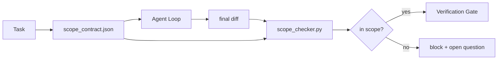

# phạm vi hợp đồng và nhiệm vụ biên giới

> mô hình không biết công việc ở đâu kết thúc;. hợp đồng phạm vi là một tệp mỗi nhiệm vụ, để giải thích công việc từ đâu bắt đầu ≠ ở đâu kết thúc, cũng như một khi越界 phải rolloback;. hợp đồng này Đặt trong phạm vi                                                                                                                                                                                                                                  

**类型:**Xây dựng
**语言:**Python (stdlib)
**先修:**Giai đoạn 14 · 32 (Tổ số làm việc tối thiểu), Giai đoạn 14 · 33 (Điều lệ như các hạn chế)
**时间:**~ 50 phút

## Học mục tiêu

-  biên soạn một hợp đồng phạm vi, để đại lý trong nhiệm vụ bắt đầu đọc,并 để xác minh trong nhiệm vụ kết thúc đọc.
- 指定允许文件"",禁止文件"",tích lệ chấp nhận"", kế hoạch quay lại và giới hạn phê duyệt").
- Thực hiện một kiểm tra phạm vi, sẽ khác với hợp đồng so với không đánh dấu vi phạm.
- 让范围 creep 可见、自动化且可审查──

## 问题

Trưởng phòng sẽ creep. nhiệm vụ là sửa lỗi đăng nhập. Phân biệt. Nhấp vào đường đăng nhập. Email trợ lý. Database driver. Readme và bản phát hành. Mỗi lần chạm vào trong thời điểm đó có một lý do có vẻ hợp lý.

Scope creep là chế độ thất bại thiếu giám sát nhất trong công việc của đại lý, vì đại lý sẽ trung thực kể lại từng bước.

## 概念



### phạm vi hợp đồng bao gồm những gì

| Field | Purpose |
|-------|---------|
| `task_id` | 链接到 board 上的 task |
| `goal` | reviewer 可以验证的一句话 |
| `allowed_files` | agent 可以写入的 globs |
| `forbidden_files` | agent 即使意外也不得触碰的 globs |
| `acceptance_criteria` | 证明完成的 test commands 或 assertion lines |
| `rollback_plan` | 如果需要 halt，operator 可以执行的一段说明 |
| `approvals_required` | scope 外需要明确 human sign-off 的 actions |

Không có gì`forbidden_files`Hợp đồng là không hoàn chỉnh. Không gian là một nửa hợp đồng.

### Sử dụng các cầu, thay vì các con đường nguyên liệu

Thực tế, tôi sẽ chuyển các tài liệu.`app/**/*.py`- `tests/test_signup*.py`), như thế phiên 间发生 refactor 时不会让合同 失效──

### Rollback là một phần của phạm vi

列出如何滚回会迫使合同作者思考可能出什么问题――不能滚回的合同是不应批准的合同――

### Kiểm tra phạm vi là kiểm tra sự khác biệt

Agent 写出 diff―checker 读取 diff―allowed globe、forbidden globe,以及任何已运行的接受命令的列表──每个违规都是一个带标签的发现,验证门可以拒绝它──

### Scope of the two kinds height: danh sách tính năng và hợp đồng nhiệm vụ

scope contract 约束的是一个任务――它不约束整个项目――agent có thể hoàn toàn留在合同内, nhưng next一轮又决定项目还需要设置页面, dark mode toggle,以及路由重写――contract 从此没有被问过该项目范围是什么,它只回答该任务的文件在范围──

Thứ hai cần một cái nguyên thủy của mình: một phiên`feature_list.json` Đó là bộ phận dự án  có thể đọc được  có thể tìm thấy `status`Vì vậy`todo`Chất tính của nó, đưa nó ra.`id`写入活域合约,并被禁止启动第二个功能在同一会议中.

```json
{
  "project": "knowledge-base",
  "active": "import-pdf",
  "features": [
    { "id": "import-pdf", "status": "in_progress", "goal": "import a PDF into the library", "done_when": "pytest tests/test_import.py && a sample PDF appears in the library view" },
    { "id": "full-text-search", "status": "todo", "goal": "search document text and rank hits", "done_when": "query returns ranked results with snippets" },
    { "id": "cite-answers", "status": "todo", "goal": "answers carry source citations", "done_when": "every answer renders at least one clickable citation" }
  ]
}
```

| Field | Purpose |
|-------|---------|
| `active` | 当前 session 唯一允许触及的 feature；为空时表示选择一个并设置它 |
| `features[].id` | scope contract 的 `task_id` 指向的稳定 slug |
| `features[].status` | `todo`、`in_progress`、`done`、`blocked`；同一时间最多一个 `in_progress` |
| `features[].goal` | reviewer 能验证的一句话 |
| `features[].done_when` | 将 `in_progress` 翻转为 `done` 的 acceptance line |

两条规则让这个名单成为承重结构,而不是装饰.`at most one in_progress`Đây là một tính năng không thay đổi 本身就是启动 kiểm tra (Phase 14 · 33): Nếu danh sách 里 xuất hiện hai, phiên sẽ từ chối khởi động cho đến khi con người 解决。 Thứ hai, danh sách tính năng là một tài liệu, không phải là tin nhắn trò chuyện, vì trò chuyện sẽ rộn ra trong bối cảnh, và tài liệu sẽ xuyên suốt các phiên、 xuyên qua các đại lý 持久存在──handoff(Phase 14 · 40) sẽ hoàn thành trạng thái tính năng 写回`done`, Vì vậy, phiên tiếp theo mở ra để xem là bảng xác thực, thay vì tái giới thiệu còn lại gì.

hợp đồng với danh sách  thông qua quyền lợi nhỏ nhất 组合,方式与下文描述的融合 相同:任务合同的 `allowed_files`必须落在活动特征所触及范围内的,不能越界.


```figure
wb-scope-bounce
```

##  xây dựng nó

`code/main.py`实现:

- `scope_contract.json`schema(JSON Schema 的子集, toàn cầu array)。
- Một phân tích khác nhau, sẽ chạm vào các tệp 列表 và chạy lệnh 列表转换为 `RunSummary`
- Một `scope_check`, theo hợp đồng  trả lại `(violations, in_scope, off_scope)`
- 2 bản demo: 1 giữ trong phạm vi, 1 giữ trong phạm vi, 1 giữ trong phạm vi, 1 giữ trong phạm vi.

运行:

```
python3 code/main.py
```

输出: hợp đồng, hai lần chạy, mỗi lần chạy phán quyết, cũng như lưu giữ`scope_report.json`

## Trình mẫu trong thực tế sản xuất

Một chuyên gia trong ngành quản lý dịch vụ dịch vụ dịch vụ dịch vụ dịch vụ dịch vụ dịch vụ dịch vụ dịch vụ dịch vụ dịch vụ dịch vụ dịch vụ dịch vụ dịch vụ dịch vụ dịch vụ dịch vụ dịch vụ dịch vụ dịch vụ dịch vụ dịch vụ dịch vụ dịch vụ dịch vụ dịch vụ dịch vụ dịch vụ dịch vụ dịch vụ dịch vụ dịch vụ dịch vụ dịch vụ dịch vụ dịch vụ dịch vụ dịch vụ dịch vụ dịch vụ dịch vụ dịch vụ dịch vụ dịch vụ dịch vụ dịch vụ dịch vụ dịch vụ dịch vụ dịch vụ dịch vụ dịch vụ dịch vụ dịch vụ dịch vụ dịch vụ dịch vụ dịch vụ dịch vụ dịch vụ dịch vụ dịch vụ dịch vụ dịch vụ dịch vụ dịch vụ dịch vụ dịch vụ dịch vụ dịch vụ dịch vụ dịch vụ dịch vụ dịch vụ dịch vụ dịch vụ dịch vụ dịch vụ dịch vụ dịch vụ dịch vụ dịch vụ dịch vụ dịch vụ dịch vụ dịch vụ dịch vụ dịch vụ dịch vụ dịch vụ dịch vụ dịch vụ dịch vụ dịch vụ dịch vụ dịch vụ dịch vụ dịch vụ dịch vụ dịch vụ dịch vụ dịch vụ dịch vụ dịch vụ dịch vụ dịch vụ dịch vụ dịch vụ dịch vụ dịch vụ dịch vụ dịch vụ dịch vụ dịch vụ dịch vụ dịch vụ dịch vụ dịch vụ dịch vụ dịch vụ dịch vụ dịch vụ dịch vụ dịch vụ dịch vụ dịch vụ dịch vụ dịch vụ dịch vụ dịch vụ dịch vụ dịch vụ dịch vụ dịch vụ dịch vụ dịch vụ dịch vụ dịch vụ dịch vụ dịch vụ dịch vụ dịch vụ dịch vụ dịch vụ dịch vụ dịch vụ dịch vụ dịch vụ dịch vụ dịch vụ dịch vụ dịch vụ dịch vụ dịch vụ dịch vụ dịch vụ dịch vụ dịch vụ dịch vụ dịch vụ dịch vụ dịch vụ dịch vụ dịch vụ dịch vụ dịch vụ dịch vụ dịch vụ dịch vụ dịch vụ dịch vụ dịch vụ dịch vụ dịch vụ dịch vụ dịch vụ dịch vụ dịch vụ dịch vụ dịch vụ dịch vụ dịch vụ dịch vụ dịch vụ dịch vụ dịch vụ dịch vụ dịch vụ dịch vụ dịch vụ dịch vụ dịch vụ dịch vụ dịch vụ dịch vụ dịch vụ dịch vụ dịch vụ dịch vụ dịch vụ dịch vụ dịch vụ dịch vụ dịch vụ dịch vụ dịch vụ dịch vụ dịch vụ dịch vụ dịch vụ dịch vụ dịch vụ dịch vụ dịch vụ dịch vụ dịch vụ dịch vụ dịch vụ dịch vụ dịch vụ dịch vụ dịch vụ dịch vụ dịch vụ dịch vụ dịch vụ dịch vụ dịch vụ dịch vụ dịch vụ dịch vụ dịch vụ dịch vụ dịch vụ dịch vụ dịch vụ dịch vụ dịch vụ dịch vụ dịch vụ dịch vụ dịch vụ dịch vụ dịch vụ dịch vụ dịch vụ dịch vụ dịch vụ dịch vụ dịch vụ dịch

**Violation budgets，而不是 binary failures。** `agent-guardrails`(Claude Code、Cursor、Windsurf、Codex  thông qua MCP sử dụng của OSS merge gate) cho mỗi nhiệm vụ  cung cấp `violationBudget`: Các tờ rơi trong ngân sách sẽ được đưa ra như là cảnh báo; chỉ vượt quá ngân sách, cửa hợp nhất sẽ bị từ chối.`violationSeverity: "error" | "warning"`Sử dụng: Ngân sách này quyết định cổng sẽ được chấp nhận hay sẽ bị nhóm của nó ghét bỏ.

**按 path family 做 severity asymmetry。**Đối với`docs/**`của ngoài phạm vi viết thường là `warn`; đối với `scripts/**``migrations/**``config/prod/**`của ngoài phạm vi viết 总是 `block`◊ Sự bất đồng này phải tồn tại trong hợp đồng, chứ không phải trong thời gian chạy, vì nó là cụ thể cho dự án, và mỗi nhiệm vụ sẽ thay đổi.

**Time 和 network budgets 与 file budgets 并列。** `time_budget_minutes`trường 约束 tường đồng hồ; thời gian chạy trong trường hợp không được phê duyệt lại từ chối tiếp tục vượt qua nó.`network_egress`Allowlist  ngăn chặn nhân viên  truy cập không thuộc về API bên ngoài nhiệm vụ.

**Multi-contract merge semantics（least privilege）。**Khi hai hợp đồng phạm vi đồng thời áp dụng khi (ví dụ: hợp đồng toàn dự án cộng với hợp đồng cụ thể về nhiệm vụ), hợp nhất quy tắc là:**intersect** `allowed_files`(Hai hợp đồng đều phải cho phép con đường này),**union** `forbidden_files`(bất cứ một có thể cấm),`time_budget_minutes`取最严格值(min),`approvals_required`累积――`network_egress`Trung,`None`biểu hiện không thực thi,`[]`Nói là phủ nhận tất cả,`[...]`表示 Allowlist;mối hợp`None`让位于另一侧,两个列表取交集,否认-所有 保持否认-所有.

## Sử dụng nó

Các mô hình sản xuất:

- **Claude Code slash commands.** `/scope`lệnh 写入合同,并将其固定为会议背景──Subagents 在行动前读取合同──
- **GitHub PRs.**Để hợp đồng 作为 JSON file 推送到 PR body 中,或作为检查的文物──CI 会针对合并不同运行范围检查器──
- **LangGraph interrupts.**Vi phạm vi vi vi phạm vi vi vi phạm vi vi vi phạm vi vi phạm vi vi phạm vi vi phạm vi phạm vi phạm vi phạm vi phạm vi phạm vi phạm vi phạm vi phạm vi phạm vi phạm vi phạm vi phạm vi phạm vi phạm vi phạm vi phạm vi phạm vi phạm vi phạm vi phạm vi phạm vi phạm vi phạm vi phạm vi phạm vi phạm vi phạm vi phạm vi phạm vi phạm vi phạm vi phạm vi phạm vi phạm vi phạm vi phạm vi phạm vi phạm vi phạm vi phạm vi phạm vi phạm vi phạm vi phạm vi phạm vi phạm vi phạm vi phạm vi phạm vi phạm vi phạm vi phạm vi phạm vi phạm vi phạm vi phạm vi phạm vi phạm vi phạm vi phạm vi phạm vi phạm vi phạm vi phạm vi phạm vi phạm vi phạm vi phạm vi phạm vi phạm vi phạm vi phạm vi phạm vi phạm vi phạm vi phạm vi phạm vi phạm vi phạm vi phạm vi phạm vi phạm vi phạm vi phạm vi phạm vi phạm vi phạm vi phạm vi phạm vi phạm vi phạm vi phạm vi phạm vi phạm vi phạm vi phạm vi phạm vi phạm vi phạm vi phạm vi phạm vi phạm vi phạm vi phạm vi phạm vi phạm vi phạm vi phạm vi phạm vi phạm vi phạm vi phạm vi phạm vi phạm vi phạm vi phạm vi phạm vi phạm vi phạm vi phạm vi phạm vi phạm vi phạm vi phạm vi phạm vi phạm vi phạm vi phạm vi phạm vi phạm vi phạm vi phạm vi phạm vi của hợp pháp.

hợp đồng với nhiệm vụ chuyển tiếp. Khi nhiệm vụ đóng, hợp đồng sẽ được lưu trữ.`outputs/scope/closed/`

## 交付 nó

`outputs/skill-scope-contract.md`Để mô tả nhiệm vụ, tạo ra một hợp đồng phạm vi, cũng như một thể cảm nhận toàn cầu và kiểm tra hoạt động của mỗi đại lý trong CI.

## 练习

1. 添加一个 `network_egress`field,列出允许的外部主机──拒绝触碰其他主机的运行──
2.  mở rộng kiểm tra, để nó đối với `docs/**`软失败 对于 `scripts/**`硬失败――说明 lý do của sự bất đối xứng này――
3. Sử dụng quy tắc tĩnh đặt không sử dụng LLM)`goal`trường 推导 `allowed_files`❖ Trường hợp đầu tiên sẽ có vấn đề gì?
4. 添加 `time_budget_minutes`, và đồng hồ tường  vượt qua nó sau từ chối tiếp tục.
5. Đối với cùng một khác nhau 运行 hai hợp đồng. Khi cả hai đều áp dụng, hợp nhất chính xác nghĩa học là gì?

## 关键术语

| Term | What people say | What it actually means |
|------|----------------|------------------------|
| Scope contract | “任务 brief” | per-task JSON，列出 allowed/forbidden files、acceptance、rollback |
| Scope creep | “它还 touched 了...” | 同一 task 中发生了 contract 外的文件变更 |
| Rollback plan | “我们可以 revert” | 用于 halt 的一段 operator runbook |
| Approval boundary | “需要 sign-off” | contract 中列出的、需要明确 human approval 的 action |
| Diff check | “Path audit” | 将 touched files 与 contract globs 比较 |

## 延伸阅读

- [LangGraph human-in-the-loop 中断](https://langchain-ai.github.io/langgraph/concepts/human_in_the_loop/)
- [OpenAI Agents SDK tool approval policies](https://platform.openai.com/docs/guides/agents-sdk)
- [logi-cmd/agent-guardrails — merge gates 与 scope validation](https://github.com/logi-cmd/agent-guardrails) ngân sách vi phạm, mức độ nghiêm trọng
- [Dev|Journal, Preventing AI Agent Configuration Drift with Agent Contract Testing](https://earezki.com/ai-news/2026-05-05-i-built-a-tiny-ci-tool-to-keep-ai-agent-configs-from-drifting-in-my-repo/) 无 ngoại giao deps 的 `--strict`chế độ
- [Agentic Coding Is Not a Trap (production logs)](https://dev.to/jtorchia/agentic-coding-is-not-a-trap-i-answered-the-viral-hn-post-with-my-own-production-logs-33d9) thu nhập về các thông số kỹ thuật số:52% → 21%
- [OpenCode permission globs](https://opencode.ai/docs/agents/) 细粒度 per-permission phạm vi
- [Knostic, AI Coding Agent Security: Threat Models and Protection Strategies](https://www.knostic.ai/blog/ai-coding-agent-security) 作为最小特权 一部分的范围
- [Augment Code, AI Spec Template](https://www.augmentcode.com/guides/ai-spec-template) Hệ thống biên giới ba tầng(must/ask/never)
- Giai đoạn 14 · 27  Với khóa phạm vi 配套的快速注射防御
- Giai đoạn 14 · 33  Hợp đồng này  đối với mỗi nhiệm vụ  quy tắc cụ thể
- Giai đoạn 14 · 38  kiểm tra 汇报 nhập của cổng xác minh
