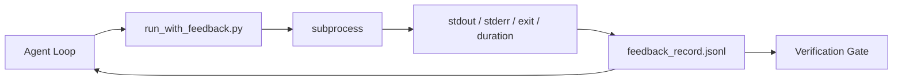

# Các vòng lặp phản hồi thời gian chạy

> Xem không đến thực tế lệnh xuất phát của Agent chỉ có thể đoán. Người chạy phản hồi sẽ xem stdout, stderr, code thoát và thời gian  nắm bắt để ghi lại cấu trúc, để tiếp theo.

**Type:** Build
**Languages:** Python (stdlib)
**先修要求：**Giai đoạn 14 · 32 (Minimum Workbench), Giai đoạn 14 · 35 (Init Script)
**Time:** ~50 minutes

## Học mục tiêu
- 区分 runtime feedback với khả năng quan sát theo chiều dài.
- Xây dựng một bộ chạy phản hồi, sử dụng nó để đóng gói các lệnh shell và giữ được các hồ sơ cấu trúc.
- Để xác định cách cắt giảm các sản xuất lớn, để chu kỳ duy trì trong ngân sách token trong.
- Khi phản hồi 缺失时, từ chối tiến hành vòng lặp.

## 问题
Trưởng lý nói  đang chạy các thử nghiệm── 下一条消息说 tất cả các thử nghiệm đều qua ── thực tế là không có bất kỳ thử nghiệm nào được chạy ── Trưởng lý tưởng rằng xuất phát, hoặc nó đã chạy lệnh nhưng chưa bao giờ đọc kết quả, hoặc nó đã đọc kết quả nhưng đã cắt đường thất bại──

feedback runner sẽ xóa bỏ sự thiếu hụt này. Mỗi lệnh đều qua runner.

## 概念


### hồ sơ phản hồi chứa những gì

| Field | 为什么重要 |
|-------|----------------|
| `command` | 精确 argv，避免 shell expansion 意外 |
| `stdout_tail` | 最后 N 行，确定性截断 |
| `stderr_tail` | 最后 N 行，与 stdout 分开 |
| `exit_code` | 明确无歧义的成功信号 |
| `duration_ms` | 暴露缓慢探测和失控进程 |
| `started_at` | 用于 replay 的 timestamp |
| `agent_note` | Agent 写下的一行预期说明 |

### Truncation là xác định

50 MB của log 会 phá hủy vòng. Người chạy sẽ giữ đầu và đuôi,并加入 `...truncated N lines...`marker; đây là xác định, do đó cùng một output总会产生 cùng một记录── không làm mẫu;Agent 需要看到的部分(最终错误、最终总结) nằm ở đuôi──

### Phản hồi so với điện đo

Telemetry (Phase 14 · 23, OTel GenAI) được sử dụng cho người vận hành 跨时间审查 chạy.

### Không phản hồi, từ chối thăng tiến.

Nếu người chạy trốn trong khi bắt lối ra  trước khi ra khỏi, ghi lại sẽ chứa `exit_code: null`和 `error: <reason>`◊Công cụ vòng  phải từ chối `null`上 exit声称成功──没有出口,就没有进步──


```figure
wb-feedback-loop
```

##  xây dựng nó
`code/main.py`实现:

- `run_with_feedback(command, agent_note)`:包装 `subprocess.run`, bắt đầu / bước ra / ra khỏi / thời gian, xác định tính cắt,并追加到 `feedback_record.jsonl`
- Một bộ tải nhỏ, sẽ truyền JSONL vào danh sách Python 中.
- Một demo, chạy ba lệnh, và in lại từng lệnh.

运行:

```
python3 code/main.py
```

输出: 三条 hồ sơ phản hồi 会追加到 `feedback_record.jsonl`,并 inline 打印每条的最后一条──跨多次重运尾这个文件, bạn có thể xem vòng lặp tích lũy như thế nào──

## Trình mẫu sản xuất trong thực tế sản xuất

Có 3 kiểu dáng có thể làm cho người chạy tăng lên lên độ cao.

**写入时 redaction，而不是读取时 redaction。**Bất kỳ liên hệ nào với các bạn hoặc các hồ sơ của bạn đều có thể tiết lộ bí mật.`^Bearer ``password=``api[_-]?key=``AKIA[0-9A-Z]{16}`(AWS)`xox[baprs]-`(Slack) 行的──读取时编辑 là súng; tài liệu trên đĩa chỉ là những gì kẻ tấn công có thể nhận được── mỗi mùa dựa trên thời gian chạy sản xuất 审核 các định dạng bí mật được quan sát trong các mô hình biên tập──

**Rotation policy，而不是单个文件。**sẽ`feedback_record.jsonl` giới hạn cho mỗi file 1 MB; tràn xuất khi quay đến `.1``.2`, bỏ rơi`.5`◦Bộ buo của đại lý chỉ đọc được các file trước, do đó chi phí thời gian chạy có giới hạn.

**用于 retry chains 的 parent-command id。**Mỗi ghi chép đều có.`command_id`; Retry 携带 `parent_command_id`, chỉ trên một lần thử, kiểm tra của người xem  thất bại  danh sách (Phase 14 · 40) và kiểm tra của cổng xác minh sẽ đi dọc theo chuỗi này  theo dõi, không có liên kết này, các thử trông giống như thành công độc lập của nhau, kiểm tra sẽ ẩn trong lịch sử thất bại.

## Sử dụng nó
Các mô hình sản xuất:

- **Claude Code Bash tool。**Công cụ này đã bắt được sự xuất hiện, xuất hiện và thời gian.
- **LangGraph nodes。**Để bất kỳ nút vỏ  gói vào runner, để ghi lại 持久化在图形状态 之外──
- **CI logs。**Đưa ống JSONL đến cửa hàng đồ tạo của bạn; các nhà xem có thể chơi lại lệnh tùy ý, không cần phải chạy lại phiên họp.

Runner là một gói mềm; nó có thể vượt qua mỗi lần di chuyển khung, bởi vì nó nắm giữ hình dạng ghi chép.

## 交付 nó
`outputs/skill-feedback-runner.md`会生成 một dự án cụ thể `run_with_feedback.py`, chứa đúng ngân sách cắt giảm ∞ kết nối với JSONL của bàn làm việc, cũng như Agent Mỗi vòng đọc tải ∞

## 练习
1. Vì mỗi kỷ lục 添加 `cwd`trường, do đó từ các mục khác nhau hoạt động cùng một lệnh có thể được phân biệt.
2. 添加一个 `redaction`bước, rời khỏi sự phù hợp`^Bearer `Hoặc`password=`                                                                                                                                                                                                                                                              
3. Chuyển qua`.1``.2`文件,将 `feedback_record.jsonl`总大小限制为 1 MB──为轮换政策 辩护──
4. 添加 `parent_command_id`, để thử lại chuỗi 可见: Which command  generated the next command 消费的输入──
5. Đưa ống JSONL vào một TUI nhỏ, cao sáng mới nhất không bằng 0 xuất cảnh.

## 关键术语
| Term | 人们常说 | 实际含义 |
|------|----------------|------------------------|
| Feedback record | “Run log” | 包含 command、output、exit、duration 的结构化 JSONL entry |
| Tail truncation | “Trim the log” | 确定性 head+tail 捕获，让 records 适配 token budget |
| Refuse-on-null | “Block on missing data” | 当 `exit_code` 为 null 时，loop 不得推进 |
| Agent note | “Expectation tag” | Agent 在读取结果前写下的一行预测 |
| Telemetry split | “Two log files” | Feedback 用于下一轮，telemetry 用于 operator |

## 延伸阅读
- [OpenTelemetry GenAI semantic conventions](https://opentelemetry.io/docs/specs/semconv/gen-ai/)
- [Anthropic, Effective harnesses for long-running agents](https://www.anthropic.com/engineering/effective-harnesses-for-long-running-agents)
- [Guardrails AI x MLflow — deterministic safety, PII, quality validators](https://guardrailsai.com/blog/guardrails-mlflow) sẽ chỉnh sửa các mẫu như là các bài kiểm tra hồi quy
- [Aport.io, Best AI Agent Guardrails 2026: Pre-Action Authorization Compared](https://aport.io/blog/best-ai-agent-guardrails-2026-pre-action-authorization-compared/) công cụ 前/后捕获
- [Andrii Furmanets, 2026 年的 AI Agents：面向 Tools、Memory、Evals、Guardrails 的实用架构](https://andriifurmanets.com/blogs/ai-agents-2026-practical-architecture-tools-memory-evals-guardrails) 可观测性界面
- Giai đoạn 14 · 23  các hội nghị OTel GenAI về điện tử
- Giai đoạn 14 · 24  các nền tảng quan sát tác nhân ((Langfuse, Phoenix, Opik)
- Giai đoạn 14 · 33   yêu cầu phải có phản hồi trước khi tuyên bố hoàn thành quy tắc
- Giai đoạn 14 · 38  读取 JSONL của cổng xác minh
