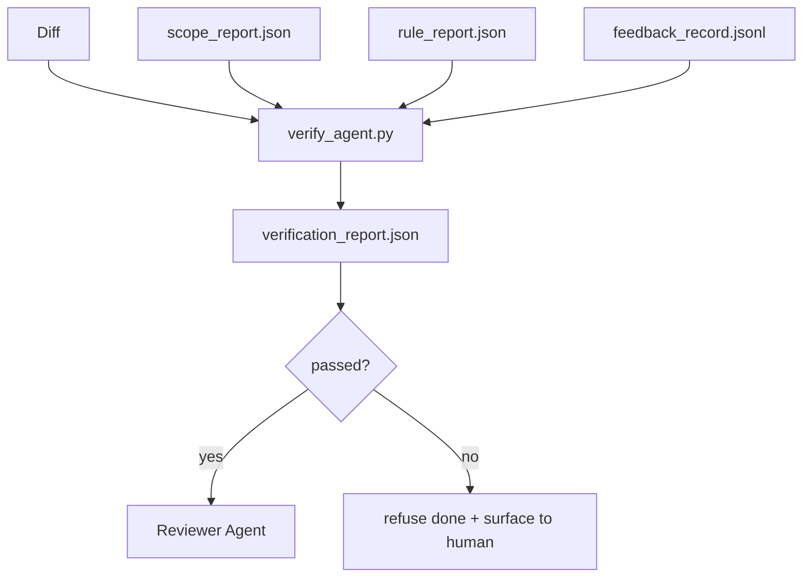

# Cổng xác minh

> Đại lý không thể đánh dấu công việc của mình để hoàn thành. Cổng kiểm tra 会 đọc phạm vi hợp đồng.

**Type:** Build
**Languages:** Python (stdlib)
**Prerequisites:** Phase 14 · 33 (Rules), Phase 14 · 36 (Scope), Phase 14 · 37 (Feedback)
**Time:** ~55 分钟

## Học mục tiêu
- 将验证门 定义为作用于工作桌文物的确定性函数──
- sẽ báo cáo quy tắc, báo cáo phạm vi, hồ sơ phản hồi và sự khác biệt thành một phán quyết.
- 输出审核代理和CI 都能读取的 `verification_report.json`
- Nếu có bất kỳ thất bại nào về độ nghiêm trọng của khối, không có ngoại lệ nào từ chối tiến hành nhiệm vụ.

## 问题
Các đại lý 太容易宣称成功──三种失败形态最常见:

-  trông không sai.  mô hình  đọc được sự khác biệt của mình, rồi nhận ra nó là đúng.
- 测试通过了──说得很自信──但没有测试实际运行的记录──
-  đáp ứng chấp nhận.  tiêu chí chấp nhận được giải thích đủ lỏng lẻo, cho đến khi bất cứ điều gì như là hoàn thành đều được hoàn thành.

Workbench của sửa đổi phương thức là một cổng xác minh, nó đọc lấy đại lý đã tạo ra các hiện vật và đưa ra phán quyết.

## 概念


### cổng 检查什么

| Check | Source artifact | Severity |
|-------|-----------------|----------|
| 所有 acceptance commands 都已运行 | `feedback_record.jsonl` | block |
| 所有 acceptance commands 都以零退出码结束 | `feedback_record.jsonl` | block |
| Scope check 没有 forbidden writes | `scope_report.json` | block |
| Scope check 没有 off-scope writes | `scope_report.json` | block or warn |
| 所有 block-severity rules 都通过 | `rule_report.json` | block |
| feedback 中没有 `null` exit codes | `feedback_record.jsonl` | block |
| Touched files 匹配 `scope.allowed_files` | both | warn |

`warn`tìm kiếm 会给 phán quyết 添注释;`block`tìm thấy 会阻止 `passed: true`

### 确定性, chứ không phải概率性

Đối với cùng một bộ đồ tạo vật,gate Mỗi lần đều phải tạo ra cùng một phán quyết. Không phải thẩm phán LLM.

### Một báo cáo, một con đường

Mỗi nhiệm vụ kết thúc, Gate City sẽ đưa ra một.`verification_report.json`, viết vào`outputs/verification/<task_id>.json`✿CI 消费同一个路──使用不同路的多个门 会分叉真理源──

### Không ngoại lệ từ chối

Các phát hiện về độ nghiêm trọng khối không thể được thay đổi bởi các tác nhân. Chúng chỉ có thể được thay đổi bởi con người, và phải ghi lại.`override_reason`和 `overridden_by`User id――override 是一次签名变更, không phải là đại lý 决策──


```figure
wb-gate-sequence
```

##  xây dựng nó
`code/main.py`实现:

- Mỗi bộ tải của các tác phẩm nhập, tất cả đều ở stub địa phương, làm cho bài học tự chứa.
- Một `verify(task_id, artifacts) -> VerdictReport`chức năng thuần túy.
- Một máy in, hiển thị kết quả của mỗi kiểm tra và kết quả vượt qua / thất bại.
- 三个任务场景的演示:clean pass,scope creep,missing acceptance,

运行 nó:

```
python3 code/main.py
```

输出: ba bản án, mỗi bản được lưu lại cho đến biên bản bên cạnh.

## Thực tế trong tình hình sản xuất

4 kiểu sẽ đưa cánh cổng từ một công việc khác  nâng cao cho cạnh quyết định 。

**Defense-in-depth，而不是 single gate。**Hook trước giao dịch → kiểm tra tình trạng CI → hook trước công cụ authz → trước kết hợp cổng。 mỗi tầng đều xác định, do đó thất bại trong một tầng 会被下一层捕获。microservices.io của 2026 年 3 月 playbook 明确指出: hook trước giao dịch là không thể vượt qua, bởi vì với kỹ năng bên mô hình khác nhau, nó không phụ thuộc vào đại lý 遵循指令。 kiểm tra cổng 位于 CI / pre-merge 层。

**通过确定性 check 做 defense，model-judge 只处理细微差别。**Phép hợp chuẩn mực lai 2026 của Anthropic:可验证 rewards ((thử nghiệm đơn vị, kiểm tra sơ đồ, mã thoát) trả lời code 是否解决了问题?LLM rubrics 回答code 是否可读、安全、符合风格?gate 运行第一类;reviewer(Phase 14 · 39)运行第二类──混用它们会让信号塌──

**签名 override log，而不是 Slack threads。**Mỗi lần qua lệnh thành phố sẽ gặp nhau`outputs/verification/overrides.jsonl`Trong输出一行,包含:chứng dấu thời gian, tìm ra mã, lý do, ký kết người dùng, ủy ban HEAD hiện tại.

**将 coverage floor 作为一等 check。** `coverage_report.json`会输入一个`coverage_floor`(được chuẩn bị 80%) kiểm tra. Nếu bảo hiểm của các thử nghiệm thấp hơn sàn, hoặc thấp hơn 1 điểm trăm điểm của lần sáp nhập trước, cửa sẽ thất bại.

**`--strict` mode 会将 warns 提升为 blocks。**Đối với các chi nhánh phát hành, PR ngăn chặn tàu hoặc phân loại sau sự cố,`--strict`Sẽ khiến mọi cảnh báo đều trở thành thất bại khó khăn.

## Sử dụng nó
Các mô hình sản xuất:

- **CI step。** `verify_agent`Job 会针对代理的最终文物 运行门──没有`passed: true`, Bảo vệ hợp nhất sẽ từ chối.
- **Pre-handoff hook。**Không có phán quyết màu xanh, không có việc giao tiếp.
- **Manual triage。**Khi đại lý tuyên bố thành công và con người nghi ngờ, các nhà điều hành sẽ đọc báo cáo.

Cổng là dòng chảy của bàn làm việc ở giữa cạnh quyết định.

## 交付 nó
`outputs/skill-verification-gate.md`将 gate 接入一个具体项目: những lệnh chấp nhận sẽ输入 nó, những quy tắc là khối nghiêm trọng, những chữ ngoài phạm vi được chấp nhận, vượt quá nhật ký kiểm toán 如何存储──

## 练习
1. 添加一个 `coverage_floor`kiểm tra: lệnh kiểm tra  phải tạo ra báo cáo bảo hiểm, và đạt ít nhất 80% ⋅ quyết định tạo vật  mang sàn ⋅
2. 支持 `--strict`Mode, sẽ mỗi `warn`提升为`block` ghi lại chế độ nghiêm ngặt 适合作为默认值的场景──
3. 让 gate ngoài JSON 另外还生成Markdown summary──论证 哪些字段应属于总结──
4. 添加一个 `time_since_last_human_touch`kiểm tra: Nhập công phím của con người 后 60秒内编辑过的任何文件,都免于离范围旗──
5. Trong sản phẩm của bạn đại lý thực sự khác nhau trên cửa hàng vận hành.

## 关键术语
| Term | What people say | What it actually means |
|------|----------------|------------------------|
| Verification gate | “阻止事情的 check” | 作用于 workbench artifacts 的确定性函数，生成 pass/fail verdict |
| Block severity | “Hard fail” | 会阻止 `passed: true` 并要求签名 override 的 finding |
| Override log | “我们为什么放行它” | 带有 reason 和 user id 的签名条目，由 review 审计 |
| Acceptance command | “证明” | 一个 shell command，其零退出码就是 `done` 的含义 |
| One report path | “Source of truth” | `outputs/verification/<task_id>.json`，由 CI 和 humans 共同消费 |

## 延伸阅读
- [Anthropic, Harness design for long-running application development](https://www.anthropic.com/engineering/harness-design-long-running-apps)
- [OpenAI Agents SDK guardrails](https://platform.openai.com/docs/guides/agents-sdk/guardrails)
- [microservices.io, GenAI dev platform: guardrails](https://microservices.io/post/architecture/2026/03/09/genai-development-platform-part-1-development-guardrails.html) dự định trước và phòng thủ sâu sắc giữa CI
- [ICMD, The 2026 Playbook for Agentic AI Ops](https://icmd.app/article/the-2026-playbook-for-agentic-ai-ops-guardrails-costs-and-reliability-at-scale-1776661990431) cửa phê duyệt 阶梯(mở → phê duyệt → xe hơi dưới ngưỡng)
- [Type-Checked Compliance: Deterministic Guardrails (arXiv 2604.01483)](https://arxiv.org/pdf/2604.01483) Lean 4 作为确定性门的上界
- [logi-cmd/agent-guardrails — merge gate 规范](https://github.com/logi-cmd/agent-guardrails) phạm vi + cổng thử nghiệm đột biến
- [Guardrails AI x MLflow](https://guardrailsai.com/blog/guardrails-mlflow) xác nhận xác định 作为 CI 评分器
- [Akira, Real-Time Guardrails for Agentic Systems](https://www.akira.ai/blog/real-time-guardrails-agentic-systems) công cụ 调用 trước/ sau của cổng
- Giai đoạn 14 · 27  phòng thủ tiêm nhanh ((cặp đối thủ của cổng)
- Giai đoạn 14 · 36  Điều khoản hợp đồng thực thi
- Giai đoạn 14 · 37                                                                                                                                                                                                                                                            
- Giai đoạn 14 · 39  cổng giao cho đến đại lý kiểm tra
