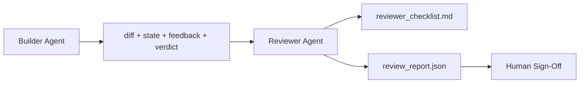

# Trình viên đánh giá: Nhà xây dựng và Đồ đánh dấu chia rẽ

> 写代码的代理 不能给它打分──评论家是第二循环,使用不同的系统提示、不同的目标,并且对构建者 产生的所有内容只有阅读访问权限──构建者与评论家之间的间隔,是大部分可靠性所在──

**Type:** Build
**Languages:** Python (stdlib)
**Prerequisites:** Phase 14 · 38 (Verification Gate)
**Time:** ~55 分钟

## Học mục tiêu
- Nói cho tôi biết tại sao một đại lý không thể kiểm tra công việc của mình một cách đáng tin cậy.
- 构建一个审核代理 循环,它消费建筑物,并输出结构化审核报告――
- 编写 một mục đánh giá, theo các định nghĩa cụ thể, chứ không phải theo cảm giác.
- Sẽ tham khảo  vào bàn làm việc, để phép xem xét nhân tạo 步骤 từ thực tế tạo vật 开始──

## 问题
Bạn hãy để đại lý sửa chữa một lỗi. Nó đã chỉnh sửa bốn tập tin, chạy thử nghiệm,并 báo cáo hoàn thành.`passed: true`Hai ngày sau, bạn nhận ra rằng việc sửa chữa này là một nửa của lỗi, chứ không phải là một nửa chính xác.

Sự chấp nhận là cần thiết, nhưng không đầy đủ. Người xem sẽ hỏi sự chấp nhận không thể đặt ra câu hỏi: liệu đây có giải quyết đúng vấn đề không?

## 概念


### Đề tài đánh giá

5 chiều, mỗi chiều đánh giá từ 0 đến 2

| Dimension | Question |
|-----------|----------|
| Problem fit | 这个变更是否解决了任务所陈述的问题，而不是相近的问题？ |
| Scope discipline | 编辑是否限制在 contract 内，或者 contract 的扩展是否是有意为之？ |
| Assumptions | 所有隐藏 assumptions 是否都写在了某个可 review 的地方？ |
| Verification quality | acceptance command 是否真的证明了目标，还是只证明了一个更弱的版本？ |
| Handoff readiness | 下一个 session 是否能从当前状态干净地接手？ |

总分 10 分──低于 7 分是软失败;低于 5 分是硬失败──

### Reviewers là một vai trò độc lập, không phải một mô hình độc lập.

Bạn có thể sử dụng mô hình tương tự với trình xây dựng 运行评论员──关键约束是角色分离: khác nhau hệ thống prompt、 khác nhau输入、 đối với khác nhau 没有写权──姿态的变化就是信号的变化──

### reviewer 不能编辑 khác nhau

reviewer 读取 diff、state、feedback、verdict──它写了一个报告──它不补差──如果报告说修复这个,下一轮构建者转去做修复; reviewer 回到 review──混合角色会破坏这个段间隔──

### Đối với mục đánh giá và cửa kiểm tra

(Phase 14 · 38) kiểm tra sự xác định thực tế: chấp nhận liệu có hoạt động không, quy tắc có được thông qua không, phạm vi không, không giữ không, xét duyệt làm một quyết định xác định:


```figure
wb-builder-marker
```

##  xây dựng nó
`code/main.py`实现:

- Một `ReviewerInputs`Dataclass, dùng để打包 reviewer 读取的文物──
- Một điểm số viên quy tắc, mỗi chiều kích một hàm. Mỗi hàm đều xác định, và để sử dụng Stub-grade trong các khóa học.
- Một `review_report.json`Nhà văn, chứa 5 phần tử, tổng phần và phán quyết`pass``soft_fail``hard_fail`(■)
- Hai trường hợp demo: một sự thay đổi trong sạch, và một sự thay đổi trong chính xác, sai lầm trong vấn đề.

运行:

```
python3 code/main.py
```

输出: 2 bản báo cáo đánh giá 写入磁盘, và hiển thị trong máy tính bảng

## Thực tế trong tình hình sản xuất

证据如下:Cloudflare trong hệ thống AI Code Review tháng 4 năm 2026, trong 30 天内跨 5,169 个 repos、48,095 个 merge yêu cầu 运行 131,246 lần review。 review 完成时间中位数为 3 分 39 秒──最多七专家评论员 ((security、performance、code quality、doc、release management、compliance、Engineering Codex) 在 Review Coordinator 下并行运行,由模型协调员 去重结并判断严重度──顶级 仅保留协调员;专家运行在更便宜的层上──

Có 4 kiểu hình thức để nó có thể quy mô vận hành.

**Specialist pool, not one big reviewer.**Đối với các repos đơn, một người xem 5 维 rubric 足够. Một khi cơ sở mã có các bề mặt an ninh-chẩn đoán, hiệu suất-chẩn đoán và các tài liệu, hãy phân chia thành các đơn giản hơn hơn các chuyên gia nhỏ hơn.

**Bias mitigation as design requirement, not optimization.**Các thẩm phán LLM 会表现出四类稳定偏见(Adnan Masood,2026年 4 月): vị trí thiên vị(GPT-4 在 (A,B) 与 (B,A) 排序上约40%不一致) Verbosity bias(更长输出有约15% điểm số lạm phát) 自偏好( thẩm phán 偏好同样模型家族的输出) 权威( thẩm phán 会高估对知名作者的引用) 缓解方式:同时评估两种排序,只计算一致获胜;使用明确奖励简洁度的1-4 thang;跨模型家庭 轮换评审;评分前移除作者姓名.

**Calibration set, not vibes.** chuẩn bị một tập hợp bao gồm 10-20 nhiệm vụ lịch sử ≠ có một tập hợp các phán quyết chính xác được biết đến  Mỗi lần sửa đổi prompt  sau đó tất cả các hoạt động của nhà phê bình  Nếu sự phù hợp với lịch sử ghi lại thấp hơn 80%, rubric trong việc phát hành nhà phê bình  cần sửa đổi  mỗi nhóm cuối cùng sẽ tái phát hiện điều này; tốt nhất là bắt đầu làm như vậy 

**Hybrid norm with the gate.**Cổng kiểm tra xác minh(Phase 14 · 38) xử lý kiểm tra xác định(tận dụng không có hành trình, kiểm tra không có thông qua không có phạm vi, không giữ) ――Tình kiểm tra kiểm tra ngữ nghĩa (Reviewer 处理语义检查(Đây là một công việc đúng không, giả định không có hồ sơ, tài trợ không có sẵn) ――Giới thiệu năm 2026 của Anthropic 明确 nhấn mạnh sự phân chia này: đừng để người xem làm việc nặng 已证明的事情――

## Sử dụng nó
Các mô hình sản xuất:

- **Claude Code subagents.**reviewer subagent 在 constructor 关闭任务后运行──它在 PR 上发布带有 rubric scores 的评论──
- **OpenAI Agents SDK handoffs.**Nhà xây dựng trong nhiệm vụ hoàn thành bàn tay của mình cho người xem. Người xem có thể mang theo danh sách phát hiện của mình.
- **Two-model pairing.**Builder 运行在更快、更便宜的模型 上──Reviewer 运行在更强的模型 上, sử dụng更小的背景, tập trung vào phán đoán──

Người đánh giá là khi con người không thể tự hoàn thành mỗi đánh giá, bàn làm việc 长出的第二双眼――

## 交付 nó
`outputs/skill-reviewer-agent.md`生成一个项目专业评论员 rubric、一个接入建设器文物的评论员代理 stub,以及与验证门的集成,让人工评论从书面报告开始,而不是从空白页开始──

## 练习
1. Thêm thứ 6 về các kích thước liên quan đến sản phẩm của bạn.
2. Sử dụng hai loại hệ thống khác nhau yêu cầu (thứ, thứ ba, thứ hai) vận hành đánh giá.
3. Để mỗi kích thước thêm `confidence`trường: ⋅ khi mức độ tin tưởng tối thiểu thấp hơn 0,6 ⋅ thời gian, từ chối xuất bản báo cáo: ⋅
4. Xây dựng một bộ hiệu chuẩn: 10 个带有已知正确判决的历史任务闭合――对它们运行审查员――它在哪里与历史记录不一致?
5. 添加一个请求更多证据 供应:评论员 có thể trong评分前要求构建者运行某特定测试――适合的后退是什么,才能避免循环?

## 关键术语
| Term | What people say | What it actually means |
|------|----------------|------------------------|
| Reviewer rubric | “Checklist” | 五维 0-2 评分，每个维度都有一个书面问题 |
| Soft fail | “Needs revisions” | 总分低于 7；builder 获得需要处理的 findings |
| Hard fail | “Reject” | 总分低于 5，或任一维度为 0；暂停并呈现给 human |
| Role separation | “Different prompt” | 同一个 model 可以承担两个角色；关键约束是 inputs 和 posture |
| Confidence floor | “Don't ship low-signal reports” | 当 rubric 不确定时，拒绝输出 verdict |

## 延伸阅读
- [OpenAI Agents SDK handoffs](https://platform.openai.com/docs/guides/agents-sdk/handoffs)
- [Anthropic Claude Code subagents](https://docs.anthropic.com/en/docs/agents-and-tools/claude-code/sub-agents)
- [Cloudflare, Orchestrating AI Code Review at Scale](https://blog.cloudflare.com/ai-code-review/) 7 个 chuyên gia + điều phối viên 架构,30 天 131k 次 run
- [Agent-as-a-Judge: Evaluating Agents with Agents (OpenReview / ICLR)](https://openreview.net/forum?id=DeVm3YUnpj) Định nghĩa chuẩn của DevAI,366 yêu cầu giải pháp hàng đầu
- [Adnan Masood, Rubric-Based Evaluations and LLM-as-a-Judge: Methodologies, Biases, Empirical Validation](https://medium.com/@adnanmasood/rubric-based-evals-llm-as-a-judge-methodologies-and-empirical-validation-in-domain-context-71936b989e80)4 loại thiên vị và cách giảm thiểu
- [MLflow, LLM-as-a-Judge Evaluation](https://mlflow.org/llm-as-a-judge) Sử dụng công cụ sản xuất của người xây dựng/hạ toán tách biệt
- [LangChain, How to Calibrate LLM-as-a-Judge with Human Corrections](https://www.langchain.com/articles/llm-as-a-judge) Luôn hoạt động được thiết lập bằng hiệu chuẩn
- [Evidently AI, LLM-as-a-judge: a complete guide](https://www.evidentlyai.com/llm-guide/llm-as-a-judge)
- [Arize, LLM as a Judge — Primer and Pre-Built Evaluators](https://arize.com/llm-as-a-judge/)
- Giai đoạn 14 · 05  Tự tinh chỉnh và CRITIC(tầm điểm tự đánh giá đơn vị)
- Giai đoạn 14 · 30  Phát triển chất vận hành bằng Eval (Eval-driven agent development)
- Giai đoạn 14 · 38  kiểm tra viên 读取的验证门
- Giai đoạn 14 · 40  báo cáo của nhà phê bình 输入的交付包
