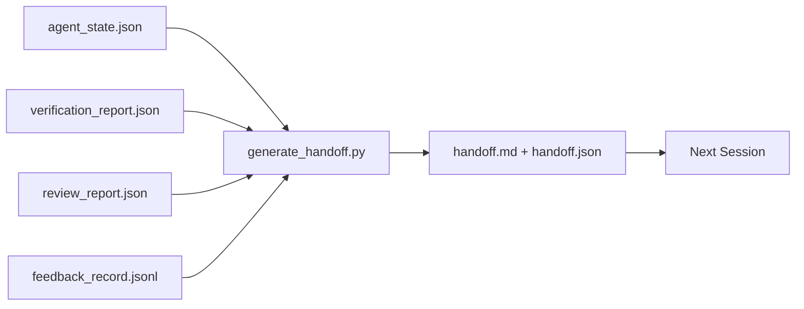

# Việc giao tiếp nhiều phiên

> Trò chơi phải kết thúc. 工作还没有结束. 包包是一种文物,它把Agent 工作一个小时转化为下一个会议. 在第一分钟就能产出.

**类型:**Xây dựng
**语言:**Python (stdlib)
**先修:**Giai đoạn 14 · 34 (Tưởng nhớ báo cáo), Giai đoạn 14 · 38 (Tính xác), Giai đoạn 14 · 39 (Đánh giá)
**时间:**~ 50 phút

## Học mục tiêu

- 识别每个交付包都需要的七字段──
- Từ đồ tạo tác bàn làm việc 生成 handover, thay vì viết tay说明文字.
- Để có những nhật ký phản hồi lớn  cắt thành phù hợp với bản tóm tắt của việc trao tặng.
- 让下一个会议的第一动作具有确定性──

## 问题

Trình họp kết thúc. Trình họp nói: "Điều tốt rồi, chúng ta đã tiến bộ". Trình họp tiếp theo mở. Trình họp tiếp theo hỏi: "Chúng ta đã dừng lại ở đâu lần cuối?" Trình họp tiếp theo không thấy câu trả lời. Trình họp tiếp theo tìm thấy vấn đề, chạy lại cùng một lệnh, hỏi lại cùng một vấn đề với con người, và mất 30 phút để phục hồi một phiên.

Chi phí giao dịch xấu, sẽ được trả liên tục trong mỗi phiên trong vòng đời nhiệm vụ. Phục hồi sẽ tự động tạo ra một gói: thay đổi gì, làm gì thay đổi gì, cố gắng gì, thất bại gì, còn lại gì, làm gì lần sau.

## 概念



### Mỗi giao hàng đều mang theo 7 đoạn

| Field | 它回答的问题 |
|-------|---------------------|
| `summary` | 一段话说明完成了什么 |
| `changed_files` | 一眼看清 diff |
| `commands_run` | 实际执行过什么 |
| `failed_attempts` | 尝试过什么，以及为什么没有成功 |
| `open_risks` | 下个 session 可能踩到什么坑，附 severity |
| `next_action` | 下个 session 采取的第一个具体步骤 |
| `verdict_pointer` | 指向 verification + review reports 的路径 |

`next_action`字段是承重字段──一个包含所有内容但缺少`next_action`Handoff là báo cáo tình trạng, chứ không phải là handoff.

### Handoff là tạo ra, không viết ra

手写手当,就是在困难日子里会被跳过的手当――Tăng máy 读取工作桌文物并输出包――Tân vụ của đại lý là để làm việc bàn 处于生成器 可以总结的状态, chứ không phải viết bản tóm tắt riêng――

### 两种形式: người đọc và máy đọc

`handoff.md`供人 阅读。`handoff.json`供一个下一个代理 加载──两者来自同一批原始文物──如果它们出现分歧,以 JSON 为准──

### Nhận xét log 裁剪

完整的 `feedback_record.jsonl`Có thể có hàng trăm bài đăng. Chỉ cần mang theo K 条 cuối cùng, cũng như các bài đăng không có cục nào.

### 留下干净 trạng thái

Handoff 描述工作; trạng thái sạch 让工作可恢复──它们 không phải là cùng một thứ── nếu phiên tiếp theo 打开时面对的是半截差、代理 忘了的临时文件、游离分支,以及尚未真正运行就报错的测试, thì再完美`handoff.md`Cũng không có giá trị. Một đại lý tiếp theo sẽ đầu tiên dành 10 phút để dọn dẹp một phiên, thay vì tiếp tục xây dựng; chi phí này sẽ tăng trưởng lợi nhuận trong mỗi phiên trong vòng đời nhiệm vụ.

Vì vậy, phiên không kết thúc khi tính năng có thể chạy, nhưng trên bàn làm việc có thể kết luận, phiên tiếp theo có thể tin tưởng được kết thúc.

| Check | Clean means | Dirty blocks because |
|-------|-------------|----------------------|
| Working tree | 每个变更都已 commit，或明确 stash 并附带说明 | 半截 diff 会被下一个 agent 看成有意图的工作 |
| Temp artifacts | 没有 `*.tmp`、scratch dirs、debug prints 或留下的注释块 | 游离文件会污染 diff 和下一个 agent 的 mental model |
| Tests | 绿色，或红色但在 `open_risks` 中命名了失败 | 沉默的红色 test 是下一个 session 会踩进去的陷阱 |
| Feature board | `feature_list.json` status 反映真实状态（Phase 14 · 36） | 过期 board 会把下一个 session 派去做已经完成的工作 |
| Branch | 位于预期 branch，没有 detached HEAD，没有 orphan branches | 错误 branch 会让下一个 session 的第一个 commit 落到错误位置 |

dọn dẹp 阶段会产出一个 `clean_state.json`, trong đó có các vấn đề chặn;空列表是 handoff generator 写包 前要断言的前置条件。建立在脏树上的 handoff 不是 handoff,而是转发混乱──两个文物 成对出现:


```figure
wb-handoff-packet
```

##  xây dựng nó

`code/main.py`实现:

- Một loader, sẽ trạng thái, kết luận, đánh giá và phản hồi`WorkbenchSnapshot`
- Một `generate_handoff(snapshot) -> (markdown, payload)`函数。
- Một bộ lọc, chọn các mục phản hồi cuối cùng K 条 cộng với tất cả các lối ra không-零。
- Một bản demo chạy, viết bên cạnh kịch bản.`handoff.md`和 `handoff.json`

运行 nó:

```
python3 code/main.py
```

输出: Bức ảnh được in, cùng với hai tài liệu trên đĩa.

## Thực sự sản xuất mô hình

Codex CLI、Claude Code 和 OpenCode từng cung cấp các giải pháp nén khác nhau; cấu trúc hóa gói giao hàng nằm trên này.

**Compaction 策略各不相同；packet schema 不变。**Codex CLI's POST /v1/responses/compact là một blob AES không rõ ràng bên máy chủ(OpenAI models 的快速路径);fallback là một bản địa handoff tóm tắt, như `_summary`Thông điệp vai trò người dùng 追加──Claude Code trong bối cảnh  đạt 95% 时运行五阶段 tiến bộ nén nhỏ gọn──OpenCode sử dụng dựa trên dấu thời gian thông điệp ẩn cộng với 5 tiêu đề LLM tổng kết──三种不同机制,同一个需求:把压缩后保留下来的内容序列化成可移植文物──包包就是这个文物──

**Fresh-session handoff 不是 compaction。**Compaction 延长一个会议;handoff 干净地关闭一个会议,并启动下一个── Hermes Issue #20372 的框架(2026 年 4 月) là对的: Khi nén trong chỗ 开始降低质量时,Agent 应该写一个紧的交付,结束会议, và恢复在新背景中──包包 让这种转换变便宜──错误做法是直压到质量崩;修复方式是为早期的干净的交付 预留预算──

**每个 branch 和 topic 只保留一个 active handoff。**Sự phối hợp đa đại lý  hơn là do giao hàng cũ, chứ không phải là mô hình xấu `branch``last_known_good_commit`, và`active | superseded | archived`之一 của `status`❖ Những giao hàng vẫn được lưu trữ; chỉ có một phiên hoạt động mới có thể thúc đẩy tiếp theo.

**在 50-75% context 之前收尾，不要等到撞墙。**Handwriting Mode playbook(CLAUDE.md + HANDOVER.md) báo cáo, trong phiên họp trong bối cảnh ngân sách 50-75% kết thúc, chứ không phải 95% 时, hiệu quả tốt nhất.

## Sử dụng nó

生产模式:

- **Session-end hook。**runtime 在用户关闭聊天 时触发发电机──paket 写入 `outputs/handoff/<session_id>/`
- **PR template。**Đánh dấu của máy phát triển cũng có thể được sử dụng như một cơ quan PR.
- **Cross-agent handoff。**Sử dụng một sản phẩm xây dựng (Claude Code), sử dụng một khác tiếp tục (Codex) ⋅ gói là ngôn ngữ phổ biến (通用语).

gói 小、规则、生成成本低──节省 下来的成本会随着每个会议 复利增长──

##  phát hành nó

`outputs/skill-handoff-generator.md`Sẽ tạo ra một bộ phát triển của các con đường tạo vật dự án thích hợp, một bộ chạy nó cuối phiên, và một tiếp theo của Agent  khi khởi động `handoff.json`Chương trình:

## 练习

1. 添加一个 `assumptions_to_validate`字段, người xây dựng đã ghi lại nhưng đánh giá không vượt quá 1 của mỗi giả định.
2. Đối với các chạy thất bại 和 chạy qua sử dụng khác nhau cách cắt cắt kết phản hồi tổng kết.
3. 加入一个 问题对人类列表――一个问题进入包, thay vì vào tin nhắn trò chuyện 值是什么?
4. 让发电机 具备无效:运行两次产生相同的包――要成立,需要什么内容保持稳定?
5. 添加一个 下一个会议预备节,精确列出 下一个会议 在行动前必须加载的文物──

## 关键术语

| Term | 人们常说 | 实际含义 |
|------|----------------|------------------------|
| Handoff packet | “Session summary” | 携带七个字段的生成 artifact，同时包含 markdown 和 JSON |
| Next action | “首先做什么” | 启动下一个 session 的一个具体步骤 |
| Feedback trim | “Log summary” | 最后 K 条 records 加上每个非零 exit |
| Status report | “我们做了什么” | 缺少 `next_action` 的文档；有用，但不是 handoff |
| Verdict pointer | “Receipt” | 指向 verification + review reports 的路径，用于 traceability |

## 延伸阅读

- [Anthropic，面向 long-running agents 的有效 harnesses](https://www.anthropic.com/engineering/effective-harnesses-for-long-running-agents)
- [OpenAI Agents SDK handoffs](https://platform.openai.com/docs/guides/agents-sdk/handoffs)
- [Codex Blog，Codex CLI Context Compaction：架构、配置、管理长会话](https://codex.danielvaughan.com/2026/03/31/codex-cli-context-compaction-architecture/) POST /v1/ phản ứng/đơn giản 和 local fallback
- [Justin3go，Shedding Heavy Memories：Context Compaction in Codex, Claude Code, OpenCode](https://justin3go.com/en/posts/2026/04/09-context-compaction-in-codex-claude-code-and-opencode) 3 nhà cung cấp của compaction đối với
- [JD Hodges，Claude Handoff Prompt：如何跨 Sessions 保持 Context (2026)](https://www.jdhodges.com/blog/ai-session-handoffs-keep-context-across-conversations/) CLAUDE.md + HANDOVER.md,50-75% ngân sách trong bối cảnh
- [Mervin Praison，Managing Handoffs in Multi-Agent Coding Sessions：Fresh Context Without Losing Continuity](https://mer.vin/2026/04/managing-handoffs-in-multi-agent-coding-sessions-fresh-context-without-losing-continuity/) hệ thống phân tán 视角
- [Hermes Issue #20372 — compression 变得有风险时自动 fresh-session handoff](https://github.com/NousResearch/hermes-agent/issues/20372)
- [Hermes Issue #499 — Context Compaction Quality Overhaul](https://github.com/NousResearch/hermes-agent/issues/499) Codex CLI 中面向交付的提示
- [Microsoft Agent Framework，Compaction](https://learn.microsoft.com/en-us/agent-framework/agents/conversations/compaction)
- [OpenCode，Context Management and Compaction](https://deepwiki.com/sst/opencode/2.4-context-management-and-compaction)
- [LangChain，Context Engineering for Agents](https://www.langchain.com/blog/context-engineering-for-agents)
- Giai đoạn 14 · 34  máy phát điện 读取的状态文件
- Giai đoạn 14 · 38  gói 指向的验证判决
- Giai đoạn 14 · 39  打包进包包 的审查报告
