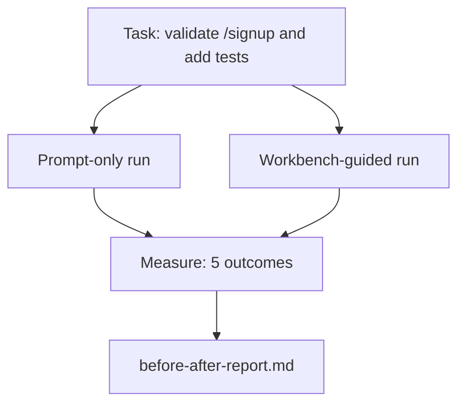

# Trong thực tế Repo 上 sử dụng bàn làm việc

> 十一节 về bề mặt, nếu không thể chịu đựng được kiểm tra cơ sở mã thực tế, thì không có giá trị.

**Type:** Build
**Languages:** Python (stdlib)
**Prerequisites:** Phases 14 · 32 to 14 · 40
**Time:** ~60 minutes

## Học mục tiêu
- Để tập hợp 7 bề mặt bàn làm việc thành một ứng dụng nhỏ.
- Sẽ cùng một nhiệm vụ chạy hai lần (chỉ đơn giản và chỉ hướng dẫn trên bàn làm việc),并 cân bằng năm kết quả.
- 阅读 trước/sau báo cáo,并判断 những bề mặt 提供最大杆──
- 面对但我的模型已经足够好的反驳时,为工作板辩护

## 问题
Trong nhiệm vụ đồ chơi trên làm demo nói lời không phục vụ ai. Giá trị của bàn làm việc phải được thể hiện trong một repo có cảm giác thực tế trên hoàn thành một nhiệm vụ có cảm giác thực tế khi: ít thất bại hơn, ít đảo ngược hơn, và sản xuất một phiên tiếp theo có thể sử dụng gói.

Bài học này cung cấp một repo có cảm giác thực sự, và cho phép cùng một nhiệm vụ đi qua hai đường ống. Kết quả là bạn có thể giao cho nghi phạm trước / sau báo cáo.

## 概念


### Ứng dụng mẫu

`sample_app/`Một trong những bộ xử lý FastAPI 风格:

- `app.py`, bao gồm`/signup`(尚无验证)
- `test_app.py`, bao gồm một bài kiểm tra đường hạnh phúc.
- `README.md`和 `scripts/release.sh`, như mồi trong khu vực cấm.

### Nhiệm vụ

> Vì vậy`/signup`Thêm xác thực đầu vào: từ chối từ khóa 8 chữ cái, trả lại với gói lỗi nhập vào của 422── thêm một bài kiểm tra để chứng minh hành vi mới──

### Hai đường ống dẫn

Chỉ cần:

1. 阅读 README。
2. 阅读 `app.py`
3. 编辑文件。
4. 声称完成──

Đạo hướng dẫn trên bàn làm việc:

1. 运行 init script (Dạy 35)
2. 阅读 phạm vi hợp đồng (Dạy 36):
3. 读取 trạng thái (Lớp 34):
4. Chỉ chỉnh sửa các tài liệu được phép.
5. 通过反运行 运行 命令接受命令 (Dạy 37)
6. 运行 cửa thông tin kiểm tra (Dạy 38)
7. 运行 reviewer (Phương pháp kiểm tra) (Phương pháp kiểm tra)
8. 生成 giao tiếp (Dạy 40)

### 5 kết quả của phép đo

| Outcome | Why it matters |
|---------|----------------|
| `tests_actually_run` | 大多数“tests passed”声明都无法验证 |
| `acceptance_met` | 证明目标达成的 test 必须就是实际运行过的 test |
| `files_outside_scope` | Scope creep 是主要的静默 failure |
| `handoff_quality` | 下一次 session 会为此付出代价或从中受益 |
| `reviewer_total` | 在 gate 之上的定性判断 |


```figure
wb-ab-runs
```

##  xây dựng nó
`code/main.py`针对 cùng một mẫu ứng dụng 编排两条管道──两条管道 都是脚本的(loop 中没有LLM),因此测量可复现──该脚本会将比较 写入`before-after-report.md`和 `comparison.json`

运行:

```
python3 code/main.py
```

输出: theo đường ống  hiển thị bảng điều khiển kết quả, lưu đến báo cáo đánh dấu bên cạnh kịch bản, cũng như đưa ra các bản vẽ người sử dụng JSON。

## Trình mẫu sản xuất trong thực tế sản xuất

 Câu hỏi của những nghi ngờ là:đàn làm việc có bao nhiêu sự giúp đỡ?2026 năm số hơn giải thích có sức thuyết phục hơn.

**Terminal Bench Top-30 到 Top-5，使用同一个 model。**LangChain của *Anatomy of an Agent Harness*(2026 年 4 月): Một bộ phận mã hóa chỉ bằng cách thay đổi dây đeo, từ 30 名开外跃升到第 5 名── cùng một mô hình── bề mặt khác nhau──25 个名次的差距──

**Vercel 通过删除 tools 从 80% 到 100%。**Vercel  báo cáo, xóa 80% công cụ của đại lý của nó  sau đó, tỷ lệ thành công từ 80%  nâng cao lên 100% ⋅ bề mặt công cụ nhỏ hơn ⋅ phạm vi rõ ràng hơn ⋅ ít đường thất bại ⋅ không gian thua lỗ ⋅

**Harvey 仅靠 harness 实现 2x accuracy。**Các đại lý pháp lý sẽ nâng cao độ chính xác lên hai lần, không thay đổi mô hình.

**88% 的企业 AI agent projects 未能进入 production。**Bài báo của preprints.org về *Harness Engineering for Language Agents* (Tạm dịch: Kỹ thuật sử dụng ngôn ngữ cho các đại lý ngôn ngữ) sẽ thất bại vì thời gian chạy, chứ không phải là lý luận: trạng thái cố định, nỗ lực tái tạo yếu, bối cảnh quá tròn, sự suy giảm khả năng phục hồi của lỗi trung gian.

**Long-context collapse。**WebAgent cơ sở 40-50% thành công trong bối cảnh dài  điều kiện giảm xuống còn 10% 以下, nguyên nhân chính là vòng lặp vô hạn và mất mục tiêu;; Ralph Loop và gói giao dịch là để hấp thụ những vấn đề này và tồn tại của;;

**False negatives 仍然存在。**Các nhiệm vụ thực tế từng bước, các dòng đơn, các trình diễn định dạng, bất kỳ mô hình nào đã từng chữ ghi nhớ nội dung, những điều này chỉ sử dụng các bước nhanh hơn.

Kết luận không phải là harness 永远获胜──Models 会随着时间吸收harness thủ thuật── kết luận là: Hôm nay, tải kỹ thuật rơi trên bảy bề mặt trên, và số chứng minh điều này──

## Sử dụng nó
Khi xảy ra các tình huống sau đây, có thể trích dẫn bài học này như hồ sơ:

- Có ai hỏi tại sao mọi công việc PR đều có`agent-rules.md`和 phạm vi hợp đồng.
- 团队 nghĩ về việc chạy đua này để bỏ qua cổng xác minh.
- Một sản phẩm đại lý mới được phát hành, và bạn cần một tiêu chuẩn di động để quyết định liệu nó có thực sự tiết kiệm thời gian hay không.

Số chữ truyền đi xa hơn là giải thích.

## 交付 nó
`outputs/skill-workbench-benchmark.md`Đây là một thiết bị đánh giá di động, bạn có thể cho phép bất kỳ sản phẩm đại lý nào trong một dự án  ứng dụng mẫu của riêng bạn 上跑过两条管线,并报告五个结果──

## 练习
1. 添加第六个结果: thời gian-to-first-meaningful-edit──如何干净地衡量它?
2. Trong cơ sở mã của bạn một nhiệm vụ thực tế ngày thứ hai trên trên chạy so sánh.
3. 添加一个 假负通过:列出快速只有 本会更快, bàn làm việc trên cao là nhiệm vụ của thực phí.
4. Để thay đổi với cuộc gọi LLM thực sự. Kết quả sẽ trở nên ồn ào hơn.
5. 写 một trang tổng kết cho người không phải kỹ sư.

## 关键术语
| Term | What people say | What it actually means |
|------|----------------|------------------------|
| Sample app | “Toy repo” | 足够小，但也足够现实，能够演练全部七个 surface |
| Pipeline | “Workflow” | agent 遵循的 surface read/write 有序序列 |
| Before/after report | “The receipts” | 你交给怀疑者的 artifact |
| False negative | “Workbench overkill” | prompt-only 更快的任务；诚实列出它们很有用 |
| Workbench benchmark | “Reliability score” | 在你的 codebase 上运行 comparison 的 portable harness |

## 延伸阅读
- [LangChain, The Anatomy of an Agent Harness](https://blog.langchain.com/the-anatomy-of-an-agent-harness/) Đứng chỉ của Terminal Bench Top-30 đến Top-5
- [MongoDB, The Agent Harness: Why the LLM Is the Smallest Part of Your Agent System](https://www.mongodb.com/company/blog/technical/agent-harness-why-llm-is-smallest-part-of-your-agent-system) Vercel + Harvey 数字
- [preprints.org, Harness Engineering for Language Agents](https://www.preprints.org/manuscript/202603.1756)88% tỷ lệ thất bại doanh nghiệp
- [HN: Improving 15 LLMs at Coding in One Afternoon. Only the Harness Changed](https://news.ycombinator.com/item?id=46988596) Trong 15 mô hình 上复现
- [Cloudflare, Orchestrating AI Code Review at Scale](https://blog.cloudflare.com/ai-code-review/) sản xuất 中 30 天 / 131k review runs
- [Anthropic, Building Effective Agents](https://www.anthropic.com/research/building-effective-agents)
- Các giai đoạn 14 · 32 đến 14 · 40  本课端到端演练的表面
- Giai đoạn 14 · 19  SWE-bench、GAIA、AgentBench, như các điểm chuẩn macro bổ sung cho bài học này
- Giai đoạn 14 · 30  phát triển chất liệu dựa trên đánh giá, cùng một vòng xoáy có thể kết nối với chúng
