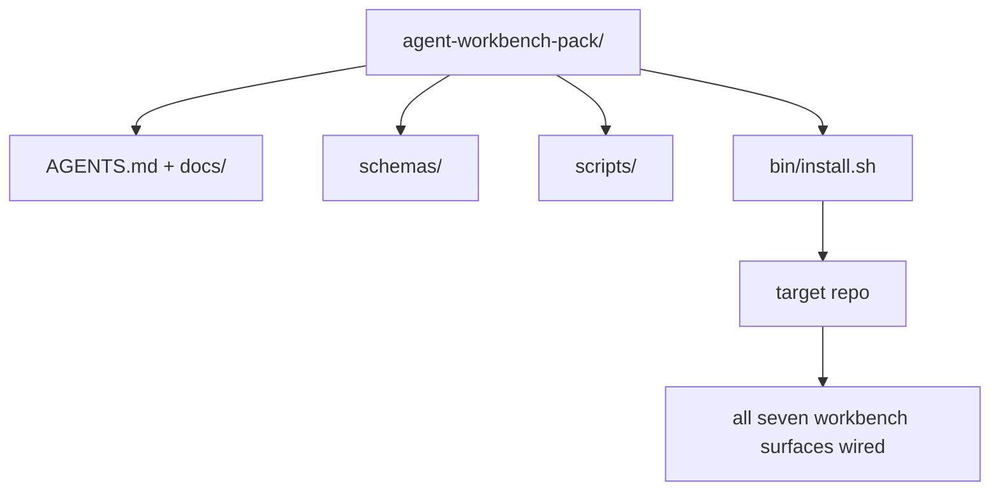

# Capstone:交付一个可复用代理工作板包

> Bộ phim này được tạo ra bằng một bộ nhớ có thể được đặt trong bất kỳ gói repo nào.`cp -r`Và vào sáng hôm sau, chúng tôi sẽ cho đại lý làm việc ổn định.

**类型：**Xây dựng
**语言：**Python (stdlib)
**前置要求：**Các giai đoạn 14 · 31 đến 14 · 41
**时间：**~ 75 phút

## Học mục tiêu

- Thập 7 bề mặt bàn làm việc vào một danh mục trực tiếp.
- Fixed schema、script 和 template,让新 repo 获得一个已知可用的基线──
- Thêm một kịch bản cài đặt, sử dụng cách như vậy để đặt gói này.
- Quyết định những gì trong gói, những gì ở bên ngoài, và cho mỗi người lấy biện hộ.

## 问题

Một Workbench tồn tại trong Google Doc, chat lịch sử và ba kịch bản chỉ được nhớ lại, một Workbench được xây dựng lại mỗi quý. Giải pháp là một gói phiên bản: một repo hoặc danh mục, bao gồm bề mặt, sơ đồ, kịch bản, và một lệnh cài đặt có thể chạy.

Khi học kết thúc, anh sẽ giao hàng trên đĩa.`outputs/agent-workbench-pack/`, và một người có thể đưa nó vào bất kỳ mục tiêu repo `bin/install.sh`

## 概念



### Layout gói

```
outputs/agent-workbench-pack/
├── AGENTS.md
├── docs/
│   ├── agent-rules.md
│   ├── reliability-policy.md
│   ├── handoff-protocol.md
│   └── reviewer-rubric.md
├── schemas/
│   ├── agent_state.schema.json
│   ├── task_board.schema.json
│   └── scope_contract.schema.json
├── scripts/
│   ├── init_agent.py
│   ├── run_with_feedback.py
│   ├── verify_agent.py
│   └── generate_handoff.py
├── bin/
│   └── install.sh
└── README.md
```

### 什么留下,什么放外面

留下:

- Chế hoạch bề mặt. Chúng là hợp đồng.
- 4 kịch bản trên đây.
- Bốn phần văn bản. Chúng là quy tắc và quy tắc.

 đặt bên ngoài:

- 项目特定任务──任务 thuộc về nhóm quản trị của mục tiêu repo, không thuộc về gói.
- 供应商 SDK 调用──这个包与框架无关──
- Đăng nhập 文案──This pack  đặt đội đã có nhập nhập 旁边, thay vì đặt trong đó──

### Thiết lập

Một câu ngắn gọn `bin/install.sh`(hoặc `bin/install.py`):

1. Không có gì`--force`时, từ chối bao phủ cài đặt cho đến khi đã có gói lên.
2. Sẽ đóng gói 复制进目标 repo.
3. Nếu có`.github/workflows/`,则接入 CI.
4. 打印后续步骤:填写板、设置 chấp nhận lệnh、运行 init script。

### 版本管理

Cái gói này đi với một cái.`VERSION`文件──需要迁移的 schema bump 和 script 变更会碰碰碰碰碰碰碰碰碰碰碰碰碰碰碰碰碰碰碰碰碰碰碰碰碰碰碰碰碰碰碰碰碰碰碰碰碰碰碰碰碰碰碰碰碰碰碰碰碰碰碰碰碰碰碰碰碰碰碰碰碰碰碰碰碰碰碰碰碰碰碰碰碰碰碰碰碰碰碰碰碰碰碰碰碰碰碰碰碰碰碰碰碰碰碰碰碰碰碰碰碰碰碰碰碰碰碰碰碰碰碰碰碰碰碰碰碰碰碰碰碰碰碰碰碰碰碰碰碰碰碰碰碰碰碰碰碰碰碰碰碰碰碰碰碰碰碰碰碰碰碰碰碰碰碰碰碰碰碰碰碰碰碰碰碰碰碰碰碰碰碰碰碰碰碰碰碰碰碰碰碰碰碰碰碰碰碰碰碰碰碰碰碰碰碰碰碰碰碰碰碰碰碰碰碰碰碰碰碰碰碰碰碰碰碰碰碰碰碰碰碰碰碰碰碰碰碰碰碰碰碰碰碰碰碰碰`agent_state.json`记录 nó khởi động khi đối phó với phiên bản gói.


```figure
wb-pack-install
```

##  xây dựng nó

`code/main.py`Tôi sẽ đưa gói hàng đến lớp bên cạnh.`outputs/agent-workbench-pack/`Trong khi đó, hãy sử dụng các bản đồ và kịch bản trong bài học trước đây, cũng như tài liệu bạn đã viết như một phần.

运行 nó:

```
python3 code/main.py
```

Bản ghi này sẽ sao chép và cố định bề mặt, viết vào README, in gói cây, sau đó bằng không 退出──重复运行是等的──

## Thực sự sản xuất mô hình

Một gói chỉ có giá trị khi có thể chịu được đòn ≠ update và không thân thiện ≠ upstream.

**`VERSION` 是 contract，不是 marketing。**Bốp lớn  cần di chuyển trạng thái  Bốp nhỏ  cần tái chạy kiểm tra  Bốp đệm chỉ được sử dụng trong doc  Lắp đặt mỗi lần cài đặt `.workbench-version`写入目标 repo; Nếu mục tiêu của khóa với gói của `VERSION`Không đồng nhất,`lint_pack.py`会拒绝交付. Đó là điều tôi muốn nói.`npm``Cargo`和 `pyproject.toml`能经受 10年 churn 的方式;agent 不会改变这些规则──

**跨工具分发的单一来源。**Nx  cung cấp một `nx ai-setup`, từ một cấu hình  đặt `AGENTS.md``CLAUDE.md``.cursor/rules/``.github/copilot-instructions.md`和一个MCP server──这个包也应该这样做; cài đặt 输出 symlink(`ln -s AGENTS.md CLAUDE.md`), để một sự thật đơn giản được phát ra cho mỗi nhân viên lập trình.

**`uninstall.sh` 会在存在非平凡 state 时拒绝执行。** Unload this pack Không thể xóa user's `agent_state.json``task_board.json`Hoặc`outputs/`❖ Uninstaller 会 xóa schema、script、doc 和 `AGENTS.md`(带 `--keep-agents-md`opt-out), và nếu tập tin nhà nước có bất kỳ thay đổi chưa được gửi,就拒绝继续── Nhà nước thuộc về người dùng; gói không sở hữu nó──

**Skill-as-publishable。SkillKit-style 分发。**Bộ này  như SkillKit kỹ năng 交付:`skillkit install agent-workbench-pack`Từ một nguồn duy nhất để đặt nó lên 32 đại lý AI Trung  Pack repo là thực tế nguồn;SkillKit là phân phát 道;.

## Sử dụng nó

Bao bì sẽ được giao tại 3 địa điểm:

- **作为一个你放进 repo 的目录。** `cp -r outputs/agent-workbench-pack /path/to/repo`
- **作为一个公开 template repo。**Cánh và tùy chỉnh,并用 `VERSION`控制漂移.
- **作为一个 SkillKit skill。**接入你的代理 产品,让一条命令完成放置──

Bác là công thức. Mỗi lần cài đặt là một dịch vụ.

## 交付 nó

`outputs/skill-workbench-pack.md`Sẽ tạo ra một gói điều chỉnh dự án: quy tắc sẽ được làm rõ hơn, phạm vi toàn cầu sẽ phù hợp với repo, chiều kích quy tắc sẽ mở rộng một lĩnh vực cụ thể.

## 练习

1. Quyết định một tài liệu thứ 5 có thể chọn được nâng cao vào gói kinh điển.
2. Sử dụng Python 重写 cài đặt,并添加 `--dry-run`Flag──将 Ergonomics với bash đối với.
3. 添加一个 `bin/uninstall.sh`, an toàn chuyển gói, và lưu trữ trong hồ sơ nhà nước có lịch sử bất thường khi từ chối thực hiện.
4. 添加一个 `lint_pack.py`, đóng gói       `VERSION`时失败──把它 vào gói 自身 repo 的 CI──
5. 写 một cuốn sách chạy từ bàn làm việc làm tay  chuyển sang gói này  Những hoạt động nào có thể giảm thiểu thời gian ngừng hoạt động?

## 关键术语

| 术语 | 人们常说 | 它实际含义 |
|------|----------------|------------------------|
| Workbench pack | “starter kit” | 一个带版本的目录，携带全部七个 surface |
| Installer | “Setup script” | 以幂等方式放置 pack 的 `bin/install.sh` |
| Pack version | “VERSION” | schema/script 变更使用 major bump，仅 doc 变更使用 patch |
| Drop-in pack | “cp -r and go” | Pack 在第一天无需按 repo 定制即可工作 |
| Forkable template | “GitHub template” | GitHub 的 “Use this template” 可以从中 clone 的公开 repo |

## 延伸阅读

- Các giai đoạn 14 · 31 đến 14 · 41  Cái gói này 打包 của mỗi bề mặt
- [SkillKit](https://github.com/rohitg00/skillkit) Trong 32 đại lý AI cài đặt kỹ năng này
- [Nx Blog, Teach Your AI Agent How to Work in a Monorepo](https://nx.dev/blog/nx-ai-agent-skills) 跨六种工具的单一来源发电机
- [agents.md — the open spec](https://agents.md/) Các router của gói của bạn  phải thực hiện nội dung
- [HKUDS/OpenHarness](https://github.com/HKUDS/OpenHarness) gói tương đương của tham khảo thực hiện
- [andrewgarst/agentic_harness](https://github.com/andrewgarst/agentic_harness) 带 eval suite của Redis hỗ trợ 参考实现
- [Augment Code, A good AGENTS.md is a model upgrade](https://www.augmentcode.com/blog/how-to-write-good-agents-dot-md-files) gói doc 的质量门
- [Anthropic, Effective harnesses for long-running agents](https://www.anthropic.com/engineering/effective-harnesses-for-long-running-agents)
- [Anthropic, Harness design for long-running application development](https://www.anthropic.com/engineering/harness-design-long-running-apps)
- Giai đoạn 14 · 30  消费这个包的验证门的评估驱动代理开发
- Giai đoạn 14 · 41  Nhập trình này cần được cải tiến trước/sau khi tham chiếu
