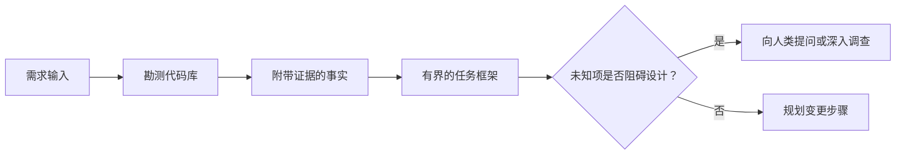

# Trong Agent 写代码前框定任务

> 编码智能体(Coding Agent) có thể thực hiện một nhiệm vụ rõ ràng rất nhanh.

**Type:** Learn + Build
**Languages:** Python (stdlib)
**Prerequisites:** Phase 14 第 31 课与第 36 课
**Time:** ~60 分钟

## Học mục tiêu

- Trước khi sửa đổi mã, sẽ chuyển đổi nhu cầu ban đầu thành khung nhiệm vụ có giới hạn rõ ràng (Task Framework).
- Các vấn đề về việc đặt ra các vấn đề về các vấn đề về các vấn đề về các vấn đề về các vấn đề về các vấn đề về các vấn đề về các vấn đề về các vấn đề về các vấn đề về các vấn đề về các vấn đề về các vấn đề về các vấn đề về các vấn đề về các vấn đề về các vấn đề về các vấn đề về các vấn đề về các vấn đề về các vấn đề về các vấn đề về các vấn đề về các vấn đề về các vấn đề về các vấn đề về các vấn đề về các vấn đề về các vấn đề về các vấn đề về các vấn đề về các vấn đề về các vấn đề về các vấn đề về các vấn đề về các vấn đề về các vấn đề về các vấn đề về các vấn đề về các vấn đề về các vấn đề về các vấn đề về các vấn đề về các vấn đề về các vấn đề về các vấn đề về các vấn đề về các vấn đề về các vấn đề về các vấn đề về các vấn đề về các vấn đề về các vấn đề về các vấn đề về các vấn đề về các vấn đề về các vấn đề về các vấn đề về các vấn đề về các vấn đề về các vấn đề về các vấn đề về các vấn đề về các vấn đề về các vấn đề về các vấn đề về các vấn đề về các vấn đề về các vấn đề về các vấn đề về các vấn đề về các vấn đề về các vấn đề về các vấn đề về các vấn đề về các vấn đề về các vấn đề về các vấn đề về các vấn đề về các vấn đề về các vấn đề về các vấn đề về các vấn đề về các vấn đề về các vấn đề về các vấn đề về các vấn đề về
- 明确定义 cho phép sửa đổi đường lối, cấm tiếp xúc đường lối và chứng nhận.
- 判断何时代码勘测(Recognition) đã đủ, có thể thực hiện công việc chính thức。

## 代价高昂的失败

 tăng cường bảo vệ hộp thư lặp lại  nghe có vẻ rất rõ ràng, nhưng thực tế không phải vậy. Thử nghiệm độc đáo này có nên được đặt ở tầng API ̇ tầng dịch vụ trong lĩnh vực hay tầng cơ sở dữ liệu?

Một cơ thể thông minh có khả năng rất mạnh sẽ sử dụng những lựa chọn hợp lý để lấp đầy những khoảng trống này. Và đây chính là tình huống nguy hiểm nhất: mã hóa của nó có thể hoàn toàn đẹp, đơn giản nhưng vẫn không phù hợp với toàn bộ hệ thống.

Do đó, đơn vị đầu tiên của việc mã hóa của một bộ máy thông minh không phải là sửa đổi mã trực tiếp, mà là xây dựng một khuôn khổ nhiệm vụ được hỗ trợ bởi bộ thư viện mã hóa thực sự.

## 任务框架(Task Frame)

Một khuôn khổ nhiệm vụ thực tế bao gồm sáu yếu tố cốt lõi:

| 字段 | 核心问题 |
|---|---|
| 目标（Goal） | 必须改变哪些可观测的行为？ |
| 代码库事实（Repository facts） | 你在代码、测试、配置或历史提交中验证了什么？ |
| 允许修改路径（Allowed paths） | 变更允许落在哪些位置？ |
| 禁止触碰路径（Forbidden paths） | 哪些文件与目录必须保持原样？ |
| 验收证据（Acceptance evidence） | 哪些具体命令或观测现象能证明目标已达成？ |
| 未知项（Unknowns） | 哪些决策仍需补充证据或依赖人类判断？ |

Thực tế phải kèm theo bằng chứng xác định. API gặp phải các dự án lặp lại không phải là thực tế cho đến khi bạn xác định rõ ràng các trường hợp thử nghiệm hoặc yêu cầu xử lý hàm vị trí.



## 勘测旨在寻找约束

Đừng cố gắng đọc toàn bộ bộ bộ thư mục. Bạn nên tìm kiếm những gì có thể đối phó với các thay đổi của các khối kết cấu bề mặt khác nhau:

1. Hiện hành vi hiện hành và cách sử dụng nó.
2. Các trường hợp thử nghiệm gần đây nhất đã có.
3. 公共契约或序列化后的数据结构──
4. 管辖该路径的项目规范与指令──
5. 构建与验证命令──
6. Những thay đổi tương tự đã được hoàn thành, từ mô hình mã hóa trong bộ.

Khi mỗi quyết định trong kế hoạch đã có bằng chứng khách quan, đã được ủy quyền cho quyết định đại diện, hoặc đã được liệt kê như một dự án chưa biết, việc kiểm tra là dừng lại.

## Không biết không làm việc sai

Các điều chưa biết là những thông tin không có kiểm soát; còn những giả thuyết không được chứng minh là những giả thuyết không có kiểm soát về không gian này.

Để mỗi phần không biết:

- **可探查的（Discoverable）：**代码库 tự nó hoặc hệ thống trong hoạt động có thể cung cấp câu trả lời.
- **可自决的（Decidable）：**任务契约 đã được trao quyền tự chọn của智能体.
- **需人类判断的（Human）：**Sự lựa chọn sẽ thay đổi hành vi sản phẩm, chi phí, hệ thống rủi ro hoặc khả năng tương thích bên ngoài.
- **延后处理的（Deferred）：**Các lựa chọn vượt ra ngoài phạm vi của các đoạn hiện tại, thuộc về không mục tiêu (Non-goals)

Các cơ thể thông minh nên tự chủ xử lý các vấn đề chưa biết được tìm hiểu và tự quyết định được ủy quyền; nhưng khi gặp phải các vấn đề chưa biết cần sự phán đoán của con người, họ phải tạm dừng và xác nhận chủ động trước khi các quyết định được cố định đến mã hóa.

## 实现之前先定验收标准

Trong việc viết sửa chữa trước, trước tiên viết ra chứng minh hoàn thành.

- Một lệnh kiểm tra đơn vị hoặc kiểm tra tập hợp nhắm mục tiêu;
- Một lần xác định giao diện và trạng thái dự kiến của trình duyệt hoạt động cuối đến cuối;
- Một yêu cầu mạng và thỏa thuận đáp ứng hoàn toàn phù hợp;
- Một số hiệu suất đạt được một giá trị cụ thể;
- Một xác nhận không có tài liệu liên quan được sửa đổi kiểm tra phạm vi.

 Test passing并不是一个有效证明方案──必须明确确定具有裁决权的试用例及其证明的主张──

##  xây dựng nó

Bài học này sẽ tạo ra một`TaskFrame`đối tượng, kiểm tra biên giới của nó và tính hiệu quả của chứng cứ,并输出`outputs/task-frame.md`

Trong danh sách khóa học hiện tại:

```bash
python3 code/main.py
python3 -m unittest discover code/tests -v
```

尝试通过四种方式故意破坏示例: xóa mục tiêu, xóa thực chứng, tạo ra các đường dẫn cho phép và các đường cấm, cũng như xóa lệnh chấp nhận.

## Trong thực tế

Trong yêu cầu sửa đổi mã trước:

1. Để thể hiện mục tiêu cho hành vi cụ thể, chứ không phải sửa đổi một tài liệu nào đó.
2. 记录两到三条带有确凭证的代码库事实──
3. 指定最小的允许修改路径集合──
4. 明确写出禁止触碰的负空间 (Negative space)
5. 编写能够宣告任务闭环的验证命令或观测手段──
6. 列出你目前未查清且没有决定权的决策项──

任务框架 nên được thể hiện hoàn toàn trong một màn hình. Nếu vượt ra khỏi một màn hình, chỉ ra rằng nhiệm vụ có thể chứa nhiều thay đổi có thể được chứng minh độc lập, nên được phân chia.

## 练习

1. Vì bạn có một bug thực sự trong một thư viện mã 框 định một khung nhiệm vụ, và toàn bộ quá trình không đưa ra bất kỳ giải pháp cụ thể nào.
2. 找出任务框架中的一条实际上只是主张的主张的主张主观假设,用客观证据取代它.
3. Tăng một điều sẽ thay đổi các hiệp ước công khai bên ngoài, do đó phải được đưa ra bởi những quyết định của con người không rõ ràng.
4. Để phân chia một phạm vi quá rộng cho phép sửa đổi đường dẫn thành các bộ đường an toàn tối thiểu.
5. Trong chứng nhận nhận thêm một chứng chỉ phạm vi được sử dụng để phòng chống các biến đổi giới hạn (Scope receipt)

## 延伸阅读

- [Nuseibeh and Easterbrook, Requirements Engineering: A Roadmap](https://www.cs.toronto.edu/~sme/papers/2000/ICSE2000.pdf): tìm hiểu cách thức để software đạt được  định trên mục tiêu thế giới thực với các điều kiện liên tục phát triển.
- [Yang et al., SWE-agent: Agent-Computer Interfaces Enable Automated Software Engineering](https://arxiv.org/abs/2405.15793): chứng minh rằng hệ thống kết nối và kết nối xung quanh hệ thống mã hóa có ảnh hưởng quyết định đến hiệu quả làm việc của nó.

## 交付物与沉

Xin hãy giữ lại sản phẩm`outputs/task-frame.md`Nó là một phần trực tiếp của bài học tiếp theo, nơi mà khung này sẽ được chuyển thành một kế hoạch thực hiện được chứng minh.
