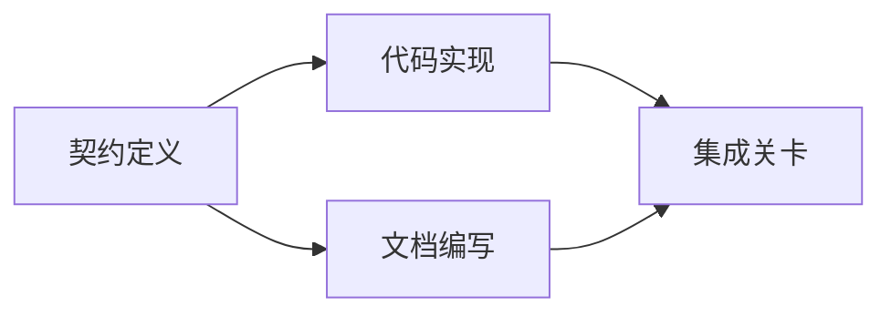

#  xây dựng kế hoạch thực hiện dựa trên bằng chứng

> 计划绝对不是一个更美观的待办清单 (To-do list) . Nó là một biểu đồ phụ thuộc: mỗi thay đổi trong đó có lý do, mỗi nút cuối có chứng minh xác minh rõ ràng.

**Type:** Learn + Build
**Languages:** Python (stdlib)
**Prerequisites:** Phase 14 第 43 课
**Time:** ~65 分钟

## Học mục tiêu

- Việc chuyển đổi khung nhiệm vụ thành các công việc có bằng chứng khách quan và chứng minh chứng minh.
- sẽ thực hiện các bước liên kết dựa trên hình ảnh, chứ không phải các bước liên kết của văn bản.
- Trong sửa đổi mã trước kiểm tra sự thiếu hụt thực tế, phụ thuộc không biết và phụ thuộc vòng lặp.
- 区分哪些步骤可以并行执行,哪些步骤必须按序等.

## Tại sao kế hoạch của một người thông minh luôn luôn thất bại?

脆弱的计划只是在未来时态中将用户需求重复复述:

1. 更新API.
2. 添加测试──
3. 更新文档――

Trong danh sách này không có gì nói về việc tìm ra những điều kiện mã hóa, lý do tại sao sửa đổi các tài liệu này là đúng, những điều kiện cần được sửa đổi ưu tiên, cũng không nói về những công việc có thể được tiến hành.

Một kế hoạch vững chắc cho mỗi công việc (Tạm dịch: Work Item) đã thực hiện năm cam kết:

| 承诺要素 | 核心作用 |
|---|---|
| 标识符（Identifier） | 用于依赖声明与会话交接（Handoff）的稳定引用 |
| 变更内容（Change） | 最小颗粒度的行为或契约改动 |
| 事实证据（Evidence） | 证明该变更合情合理且必要据实的代码库证据 |
| 前置依赖（Dependencies） | 必须率先完成并成立的前置工作项 |
| 验收证明（Proof） | 能够确凿宣告该工作项闭环的检查手段 |

## Trong thực hiện trước kế hoạch hợp đồng

Khi nhiều mã hóa khác nhau bề mặt phụ thuộc vào một hành vi tương tự, phải ưu tiên xác định hiệp ước hành vi đó. Như vậy, thử nghiệm, thực hiện, tài liệu và thành tựu tập hợp có thể chia sẻ cùng một hiệp ước, thay vì từng người tạo ra bốn phiên bản không tương thích với nhau.



Chụp dựa trên này minh họa rõ ràng khả năng phát triển an toàn: sau khi hợp đồng được cố định, việc thực hiện mã có thể tiến hành cùng với việc viết tài liệu, trong khi giai đoạn kết thúc của sự tích hợp là chờ đợi cả hai đều sẵn sàng.

## Thực tế chứng cứ phải có khả năng thay đổi kế hoạch

Thực tế là có thể có được những điểm không thể có được, nó phải có thể thực sự ảnh hưởng đến kế hoạch làm việc:

- 发现已有的辅助函数,从而取消原本计划新建的抽象层──
- Sự tồn tại của các thử nghiệm khả năng tương thích, trong kế hoạch bắt buộc phải tăng chuyển dữ liệu một bước.
- 部署环境的约束,将模式(Schema) biến đổi và phân chia thành một nhiệm vụ độc lập khác.
- Phương pháp kiểu phản ứng công cộng, thay đổi quy trình thực hiện mã và sau sau của việc biên tập tài liệu.

Nếu một cái gọi là bằng chứng không thể thay đổi kế hoạch của bạn, thì nó có thể không phải là bằng chứng chính xác cho quyết định đó.

## 面向会话中断而设计

编码智能体的会话往往会无预警中断―― một kế hoạch có khả năng phục hồi được, quy mô công việc của nó đủ chi tiết, để một cuộc họp khác có thể phán quyết ngay lập tức:

- 哪项工作已完成;
- 哪项验收证明 đã chạy rồi;
- 哪些产品文件已修改;
- 哪些依赖项目已经解除阻塞;
- Next có thể thực hiện an toàn công việc là gì?

Đừng để trạng thái thực hiện chỉ được lưu trong hộp chọn trong cửa sổ trò chuyện.

## 计划有效性校验

Trong quá trình thực hiện chính thức, nếu có những tình huống sau đây nên trực tiếp từ chối kế hoạch:

- 存在重复工作项标识符;
- 某工作项缺乏事实证支;
- 某工作项缺乏验证;
- Tùy thuộc vào một công việc không tồn tại;
- Dựa trên hình ảnh có một vòng tròn dựa trên chu kỳ);
- Trước khi sự bất ổn liên quan chưa được loại bỏ, đã sắp xếp hoạt động không thể đảo ngược thứ nhất.

Năm kiểm tra trước có thể được hoàn thành tự động bằng cách tự động hóa quy trình; thứ cuối cùng cần khả năng phán quyết kỹ thuật, nên được nhấn mạnh trong đánh giá:

##  xây dựng nó

`code/main.py`建模了工作项,校验其证凭证,通过拓排序计算执行波次(Execution Waves),并将结果写入 `outputs/evidence-plan.json`

运行命令:

```bash
python3 code/main.py
python3 -m unittest discover code/tests -v
```

Ví dụ này sẽ tạo ra ba hành động: trước tiên thực hiện thỏa thuận được xác định; sau đó có mã hóa thực hiện và biên tập và phát hành; cuối cùng là tập hợp các hành vi.

## 配合编码智能体使用

Trước khi cho phép Intelligent Modify Code File, yêu cầu nó trước tiên phát hành kế hoạch này.

1. Mỗi đường lối và hành vi có có có một bộ phận mã hóa cụ thể hay không.
2. Có phải mỗi công việc có một chứng minh hoàn thành rõ ràng đơn lẻ không?
3. Tùy thuộc vào việc liệu công việc sẽ tốn kém hay không thể đảo ngược được hoãn cho đến khi sự không chắc chắn về sự phụ thuộc của nó được loại bỏ.

审核 là một kế hoạch rõ ràng cụ thể, chứ không phải là một câu trống 我会小心行事──

## 练习

1. Thêm một dự án chuyển giao cơ sở dữ liệu cần được nhân loại phê duyệt rõ ràng.
2. Xây dựng một vòng tròn phụ thuộc, và giải thích sự phân chia sản phẩm ẩn đằng sau nó.
3. 拆分一个包含两条不同证明命令的工作项.
4. Thêm một có thể chạy trong sóng thứ hai và không chạm vào bất kỳ công việc nào có sẵn.
5. sẽ lập trình 染 cho biểu diễn theo kiểu Markdown, đồng thời giữ JSON như một nguồn thực tế đơn lẻ.

## 延伸阅读

- [Nuseibeh and Easterbrook, Requirements Engineering: A Roadmap](https://www.cs.toronto.edu/~sme/papers/2000/ICSE2000.pdf): khám phá các mối quan hệ giữa mục tiêu, quy tắc, đồng thuận và phát triển.
- [Barry Boehm, A Spiral Model of Software Development and Enhancement](https://dl.acm.org/doi/10.1145/12944.12948): giải thích cách tổ chức quá trình nghiên cứu và phát triển xung quanh các chuỗi liên kết không liên quan đến

## 交付物与沉

Xin hãy giữ lại sản phẩm`outputs/evidence-plan.json`Nó sẽ được coi là một điều ước của nhiệm vụ ủy thác trong next section.
