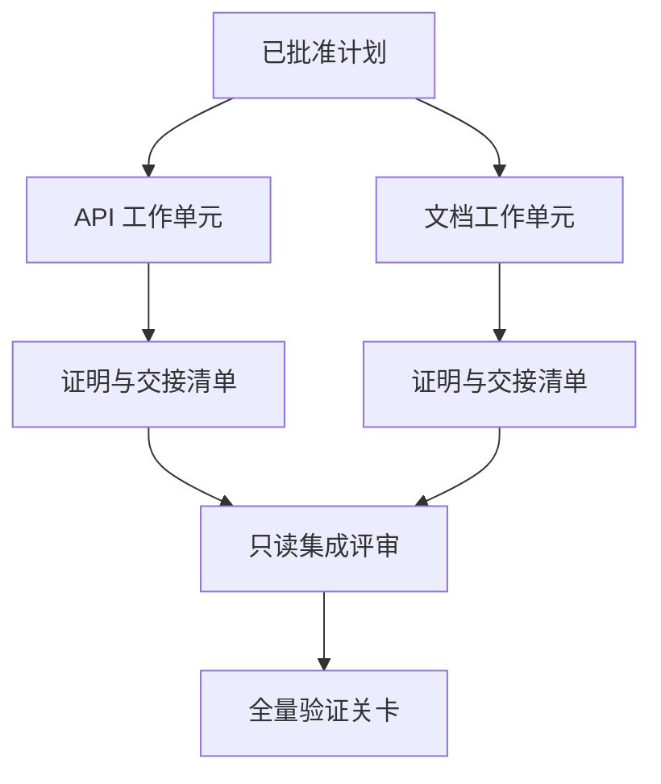

# 带隔离与合并契约的代理委托

> Và các cơ thể thông minh chỉ có thể tiết kiệm thời gian vật lý khi thực sự độc lập với nhau trong công việc. Nếu không, chúng chỉ biến một nhiệm vụ rõ ràng thành chi phí phối hợp cao hơn, tốc độ thất bại nhanh hơn và thảm họa phối hợp nhanh hơn.

**Type:** Learn + Build
**Languages:** Python (stdlib)
**Prerequisites:** Phase 14 第 39 课与第 44 课
**Time:** ~70 分钟

## Học mục tiêu

- Theo thực sự độc lập của nhiệm vụ đánh giá được ủy thác và đồng hành có hợp lý không.
- Đối với mỗi đơn vị công việc, người lao động được cấp quyền sửa đổi văn bản của mình và chứng minh hoàn thành rõ ràng.
- 基于依赖关系计算安全的执行波次 (基于依赖计算安全的执行波次)
- 设计合并契约(Mối hợp đồng) để hợp nhất an toàn nhiều sản phẩm làm việc thông minh.

## Các tiêu chuẩn kiểm tra

Không chỉ vì có nhiều cơ thể thông minh hơn có thể sử dụng cho việc giao nhiệm vụ cho người mù. Chỉ khi đáp ứng ít nhất một điều kiện sau đây, người giao nhiệm vụ có tính hợp lý:

- 两项调查能够独立解答不同的未知问题;
-  2 code thực hiện có các file pathway và giao ước không chồng chéo;
- 评审智能体(Đánh giá viên) có thể kiểm tra độc lập trong khuôn khổ không sửa đổi sản phẩm;
- Việc kiểm tra bên ngoài có thể được tiến hành trong thời gian dài hơn trong khi việc làm tại địa phương được tiến hành sau đó.

Khi nhiều cơ thể thông minh cần sửa đổi cùng một tài liệu, phụ thuộc vào cùng một quyết định chưa được giải quyết, hoặc phụ thuộc vào cùng một môi trường thay đổi dễ dàng, phải kiên trì thực hiện liên tục.

## 工作单元就是一份契约

Mỗi đơn vị công việc được ủy quyền đều cần phải có quy định rõ ràng:

| 字段 | 含义 |
|---|---|
| 目标（Goal） | 单一可观测的结果 |
| 负责人（Owner） | 单一负责执行的工作智能体 |
| 路径（Paths） | 排他的写入所有权 |
| 前置依赖（Dependencies） | 启动前必须已完工的前置单元 |
| 证明（Proof） | 返回给集成者的确凿验证证据 |
| 交接清单（Handoff） | 已修改的文件、已做出的决策以及残留风险 |

 xử lý hậu端逻辑 không phải là đơn vị làm việc đủ điều kiện.`app/accounts.py`Trong thực hiện kiểm tra tái lập và qua các bài kiểm tra chuyên môn đối với tài khoản chứng minh才是合格的工作单元──

## Hệ thống ba tầng

1. **文件系统隔离（Filesystem isolation）：**独立工作树 (từ làm việc) hoặc沙箱, ngăn ngừa sự xảy ra bất ngờ并发共享写入.
2. **所有权隔离（Ownership isolation）：**嚴嚴的契約限制, ngăn chặn hai cơ thể thông minh cố tình sửa đổi cùng một đường.
3. **状态隔离（State isolation）：**独立日志和输出目录, ngăn chặn một cơ thể thông minh phủ một cơ thể thông minh khác 

文件系统隔离无法解决设计所有权问题―― hai cây làm việc sạch vẫn có thể phát sinh ra cấu trúc đối đầu với nhau.



## 集成者不负责重构代码

Các trách nhiệm của 集成者(Integrator) là:

1. xác nhận rằng mỗi kết quả giao tiếp đều nằm trong phạm vi phân phối của nó;
2. 认真审查验证证证的输出, chứ không chỉ là bản tóm tắt của người mù tin工作智能体 tự viết;
3. 按照依赖关系的时间序依次合并改动;
4. 运行覆盖跨单元的全量验证关卡;
5. 坚决拒绝任何隐藏的范围扩散;
6. Đăng ký xung đột vì cần phải giải quyết các quyết định mới, thay vì thay đổi bằng cách cố tình.

Nếu giai đoạn tích hợp cần viết lại phần lớn sản phẩm mã của một work intelligence, hãy giải thích rằng việc phân giải nhiệm vụ ban đầu là sai lầm.

## Sự phân chia vai trò của con người và cơ thể thông minh

Việc ủy nhiệm không có nghĩa là từ bỏ khả năng phán đoán của con người. Con người vẫn nắm vững những quyết định cốt lõi sẽ thay đổi hành vi bên ngoài hệ thống, cấp độ rủi ro, quyền an ninh hoặc mang lại chi phí không thể đảo ngược.

Đó là điều đó.**校准型自主（Calibrated Autonomy）**Hệ thống cho cơ thể thông minh một mức độ tự do cao ở nơi có bằng chứng đầy đủ và dễ dàng xoay quanh, trong những yếu tố quan trọng sau đó buộc phải thiết lập thẻ kiểm tra con người.

##  xây dựng nó

Chương trình thử nghiệm của bài này sẽ kiểm tra các đường dẫn chồng lên, xác minh sự phụ thuộc, và kết quả sẽ được xuất phát.`outputs/delegation-plan.json`

运行命令:

```bash
python3 code/main.py
python3 -m unittest discover code/tests -v
```

尝试修改文档单元, để nó sở hữu `app/`Hiện tại quyền sở hữu: vì các đơn vị của API và các đường dẫn này đang chồng chéo, kế hoạch nên được tự động chặn và báo cáo.

## 练习

1. Việc phân chia một doanh nghiệp thực sự thành hai đơn vị công việc độc lập và một vai trò tập hợp.
2. Tìm ra một chương trình phân chia đường bộ có vẻ ngoài độc lập nhưng thực tế là kết hợp, rõ ràng chỉ ra các quyết định bí mật chung của họ.
3. 增加一个只读的研究型智能体 (Phác nhân nghiên cứu), sản phẩm của nó được tạo thành một thực tế biểu tượng.
4. 增加一个合并关卡(Merge Gate),对照所有工作单元契约检查最终修改的文件集合──
5. Đối với đơn vị làm việc được định nghĩa là: khi việc làm trước bị mất hiệu lực,及时停止后续执行.

## 延伸阅读

- [Reid Smith, The Contract Net Protocol](https://doi.org/10.1109/TC.1980.1675516): phân phối nhiệm vụ phân phối và kết quả báo cáo hình thức hóa cổ điển sớm.
- [Eric Horvitz, Principles of Mixed-Initiative User Interfaces](https://dl.acm.org/doi/10.1145/302979.303030): khám phá cơ chế tự động hóa khi nào nên tự hành động, khi nào nên trao quyền kiểm soát lại cho con người.

## 交付物与沉

Xin hãy giữ lại sản phẩm`outputs/delegation-plan.json`Nó ghi lại lý do tại sao giải thể phân chia là an toàn, mỗi con đường trở lại thuộc sở hữu của ai, và sự tích hợp phải chấp nhận những chứng minh nào.
