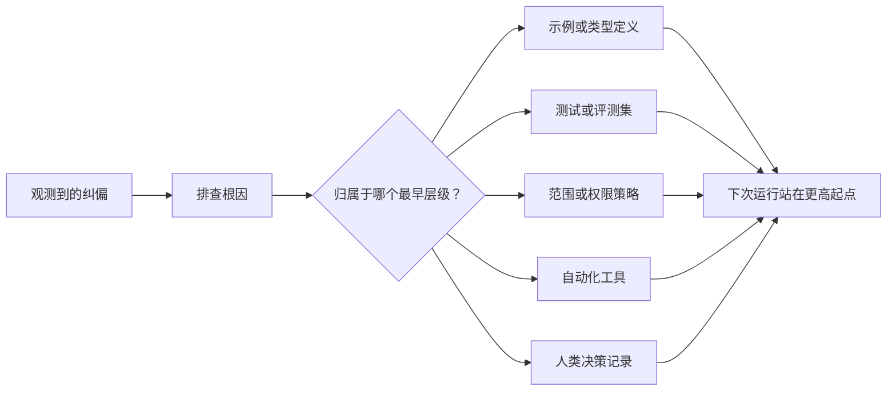

# Để mỗi đại lý được chuyển đổi thành cải tiến hệ thống

> Chỉ cần ở lại trong hồ sơ trò chuyện, sự cố trong bản ghi chuyện chỉ có thể sửa chữa được lần này trước đây.

**Type:** Learn + Build
**Languages:** Python (stdlib)
**Prerequisites:** Phase 14 第 37 至 41 课
**Time:** ~65 分钟

## Học mục tiêu

- sẽ chuyển đổi các cơ chế kiểm soát hệ thống lâu dài nhằm vào các cơ thể thông minh.
- Đặt mỗi cơ chế kiểm soát để ngăn chặn vấn đề tái phát ở cấp độ sớm nhất (Tầng ban đầu nhất)
- Sử dụng đặc điểm dấu vân tay ổn định để thực hiện bài học tái hấp thụ
- 及时退役 những người không còn đối phó với thực tế风险 của quy tắc kiểm soát cũ.

## Sự cố tự mình là bằng chứng quý giá

Khi bạn nói với một người thông minh rằng không nên chỉnh sửa tài liệu đó, bạn thực sự đã nhận thấy: giới hạn phạm vi hiện có (scope boundary) thiếu hạn chế có thể thực hiện. Khi bạn chỉ ra rằng các định dạng đầu ra này là sai, bạn thực sự nhận thấy thiếu các ví dụ tiêu chuẩn hoặc thử nghiệm tự động hóa. Khi cấu hình môi trường lại báo cáo sai, bạn nhận ra rằng kiến thức khởi tạo môi trường nên nằm trong bản thảo tự động hóa.

 nên xem sự cố định về cơ thể thông minh như là một cái nhìn quan sát về những thiếu sót của hệ thống làm việc, chứ không phải là một sự thất bại trong ngôn ngữ đơn giản khi viết 

## 提升沉 đến cấp độ hiệu quả sớm nhất

遵循以下控制优先级:

| 频发故障类型 | 长效沉淀去处 |
|---|---|
| 错误计算结果或代码回归 | 自动化测试或评测集（Test / Evaluation） |
| 超范围越界或不安全操作 | 范围契约或权限策略（Scope / Permission Policy） |
| 重复出现的环境配置或命令错误 | 自动化脚本或专用工具（Automation / Tool） |
| 重复出现的输出格式错误 | 标准规范示例外加数据校验器（Canonical Example + Validator） |
| 模糊不清的本地工程惯例 | 附带具体场景检查的指令（Instruction + Scenario Check） |
| 产品层面的分歧与争议 | 人类决策记录（Human Decision Record） |

越早有效的控制机制成本越低―― một loại định nghĩa hoàn toàn không hiệu quả từ cấp độ hệ thống kiểu, hơn nhiều hơn các nhận xét trong quá trình đánh giá mã tiếp theo; một đơn vị thử nghiệm nhắm mục tiêu, còn hơn nhiều hơn trong 快速 里苦口婆心写一段长篇大论要求智能体牢记有效更多――



## 反棘轮记录 (The Ratchet Record)

完整的记录应包含:

- 故障表象(Symptom);
- 根因分析 (do nguyên nhân gốc);
- 造成的后果(Hậu quả);
- 重复出现次数 (tương tự là số lần tái phát);
- Hệ thống kiểm soát được lựa chọn (Choose control);
- Phương pháp xác minh của cơ chế kiểm soát (verification);
- 责任人(Tất chủ);
- 审查或退役日期(Sự xem xét / Ngày nghỉ hưu)。

Không cần phải cố định vĩnh viễn từng sự thích nghi cá nhân tạm thời. Chỉ khi tần suất tái phát hoặc mức độ nghiêm trọng của hậu quả của vấn đề đó đủ để chứng minh sự hợp lý của sự phức tạp bảo trì lâu dài, mới được nâng cao thành cơ chế kiểm soát vĩnh viễn.

## 区分根因与表象

智能体修改 README只是表象──其背后的根因可能有:

- 任务框架允许修改 toàn bộ code库根目录;
- 文件文件被默认总是可以安全编辑的;
- 执行计划将功能实现与文件编写捆绑在一起;
- 两个工作智能体存在重叠文件所有权──

Các hệ thống sẽ vẫn bị mất hiệu lực khi một lần sau một vấn đề tương tự xuất hiện dưới dạng thay đổi một chút.

##  kiểm soát quy tắc cũng sẽ suy thoái

Các quy tắc kiểm soát cũ sẽ gây xung đột, mở rộng trên cửa sổ văn bản dưới đây, và củng cố những gói hệ thống cũ đã không tồn tại trước đây. Mỗi quy tắc được nâng cao đều cần kiểm tra trục xuất thường xuyên. Trong các trường hợp sau đây, nên quyết định xóa hoặc viết lại:

- Cơ cấu tầng dưới đã thay đổi;
- Có cơ chế kiểm soát thực thi mạnh hơn sẽ thay thế nó;
- Trong một khoảng thời gian dài, tình trạng này không bao giờ xảy ra nữa.
- Những trở ngại và xung đột do quy tắc gây ra đã vượt quá rủi ro mà nó tự phòng thủ.

Ưu điểm của công trình không phải là viết các tài liệu chỉ dẫn dài nhất, mà sử dụng cơ chế hệ thống tối thiểu để bảo vệ khả năng phán đoán công trình khó khăn.

##  xây dựng nó

Các chương trình thử nghiệm trong bài này sẽ phân loại các biến cố, nâng cao nó thành cơ chế kiểm soát, tạo dấu vân tay để tạo ra các tác dụng lặp lại, và ghi lại kết quả.`outputs/feedback-ratchet.json`

运行命令:

```bash
python3 code/main.py
python3 -m unittest discover code/tests -v
```

尝试输入两条表述不同但根源于相同的纠偏记录――持续优化归化逻辑, cho đến khi chúng có thể hợp nhất thành một cơ chế kiểm soát thống nhất, đồng thời không sai lầm hợp nhất không liên quan đến故障――

## 练习

1. Từ bài viết viết gần đây nhất, chọn ra 5 bài viết, phân tích và đưa chúng vào các cấp độ thực sự của bản viết.
2. Để xây dựng lại một quy tắc văn bản như một bài kiểm tra tự động có thể thực hiện.
3. 增加后果权重 (tín trọng hậu quả) đánh giá, làm cho những sai lầm nghiêm trọng cao nguy cơ đầu tiên cũng có thể được nâng cấp ngay lập tức để kiểm soát thường xuyên.
4. Trong quá trình thử nghiệm, người chịu trách nhiệm bổ sung cho mỗi cơ chế kiểm soát và thời gian nghỉ hưu.
5. 审查 một chỉ thị về các cơ thể thông minh hiện có, và chứng minh rằng có cơ chế kiểm soát mạnh hơn đã tồn tại và xóa nó.

## 延伸阅读

- [Basili, Caldiera, and Rombach, The Goal Question Metric Approach](https://www.cs.toronto.edu/~sme/CSC444F/handouts/GQM-paper.pdf): tìm hiểu cách chuyển đổi các mục tiêu cao cấp thành các vấn đề và chỉ số đo có thể vận hành
- [Shinn et al., Reflexion](https://arxiv.org/abs/2303.11366):介绍 làm thế nào để sử dụng phản theo dõi nâng cao chất lượng quyết định tiếp theo, mà không cần phải điều chỉnh mô hình quyền trọng lượng
- [Madaan et al., Self-Refine](https://arxiv.org/abs/2303.17651): trong nhiệm vụ kết thúc vòng trong thực hiện 代式反与自我修改.

## 交付物与沉

Xin hãy giữ lại sản phẩm`outputs/feedback-ratchet.json` Đó là kết quả lâu dài của đường lối kỹ thuật hỗ trợ cơ thể thông minh, cũng là sự phát triển tiếp theo trong tương lai của Workbench.
