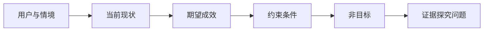

# Trong lựa chọn đầu ra trước xác định hiệu quả

> Khả năng thực hiện mã hóa của 飞速 thay vào đó làm tăng chi phí của vấn đề chọn sai. Chỉ có những kết quả thực chất mà bạn đang tìm kiếm.

**Type:** Learn + Build
**Languages:** Python (stdlib)
**Prerequisites:** None
**Time:** ~60 分钟

## Học mục tiêu

- Trong khuôn khổ không có dự đoán về giải pháp cụ thể, viết kết quả khung kết quả khung kết quả.
- 明确目标用户, diễn biến tình hình, hiện tại và dự kiến cải thiện các chỉ số.
- 显式声明硬性约束 (tránh giới hạn)
- 识别解决方案泄漏(Solution Leakage), ngăn chặn quá sớm cố định cho phạm vi phát triển.

## 交付产品不等于实质成效

 xây dựng một trợ lý khẩn cấp cố tình chỉ định chỉ là một sản phẩm nào đó (output)  Nó hoàn toàn không nói rõ ai cần nó  chỉ định gì sẽ được cải thiện, cũng như những yếu tố phòng ngừa cần phải giữ an toàn 

So với kết quả khung (Outcome Framework) là như sau:

> Khi tình hình môi trường sản xuất xảy ra, kỹ sư có thể xác định tình trạng cố tình trong hai phút và xác nhận hoạt động an toàn tiếp theo, trong khi toàn bộ quá trình kiểm tra chỉ được đọc và có theo dõi kiểm toán đầy đủ.

Kết quả được định nghĩa bởi câu này, có thể được thực hiện bằng một bộ phần mềm, cũng có thể được thực hiện bằng cách tối ưu hóa vận tải và lưu trữ (runbook)  sửa dữ liệu, hoặc thực hiện một lần thay đổi giao diện nhẹ hơn để đạt được. Nó giúp nhóm luôn cố gắng giải quyết vấn đề cuối cùng, thay vì chết sớm trên bộ sản phẩm cụ thể đầu tiên mà ai đó đã tưởng tượng.

## 6 yếu tố lớn của hệ thống hiệu quả

| 构成要素 | 核心问题 |
|---|---|
| 用户（User） | 谁在直接面对并承受该问题？ |
| 情境（Situation） | 该问题何时、何地发生？ |
| 当前现状（Current behavior） | 现状如何运作，包括现有的各种临时变通手段（Workarounds）？ |
| 期望成效（Desired outcome） | 哪些可观测的状态应当得到实质改善？ |
| 约束条件（Constraints） | 哪些安全、策略、成本或兼容性底线是固定的？ |
| 非目标（Non-goals） | 哪些极具诱惑但相关的邻近工作被明确排除在外？ |



## 识别 giải pháp rò rỉ

Khi kết quả trong mô tả đã mang lại các chứng minh đầy đủ về hình thức sản phẩm, hình dạng giao diện, mô hình lựa chọn, khung kỹ thuật hoặc cấu trúc tầng dưới, đã xảy ra rò rỉ giải pháp:

-  người dùng nhận được một bản tóm tắt AI mỗi tuần:
-  người dùng có thể hiểu chính xác trước khi phê duyệt tài khoản: trình bày là hiệu quả thực sự.
- 部署向量数据库: rò rỉ các loại cơ sở hạ tầng
- Trong thời gian kiểm tra có thể dễ dàng nhận được các quy định liên quan theo quy định: biểu diễn là nâng cao khả năng thực sự.

Khi hệ thống hiện có và khả năng tương thích thực sự khóa một công nghệ, trong các điều kiện ràng buộc có thể đặt tên cho công nghệ đó, nhưng phải ghi rõ lý do khách quan của nó bị khóa.

## 约束条件守护成效底线

Các điều kiện không phải là những chi tiết thực hiện đơn giản, chúng là một phần không thể chia rẽ của mục tiêu của thế giới thực:

- Trong thời gian chẩn đoán cố tật, cấm nghiêm cấm thực hiện bất kỳ hoạt động nhập cảnh nào đối với môi trường sản xuất;
- Ứng dụng thời gian phải được kiểm soát trong ngân sách thời gian xử lý tai nạn;
- Ước tính duy nhất của các vụ kiểm toán hiện có phải được duy trì;
- Không cho phép giới thiệu các cơ sở phụ thuộc mới;
- 无障碍访问(Khả năng tiếp cận) hỗ trợ phải được duy trì hoàn hảo.

Nếu một hệ thống, mặc dù trên bề mặt đạt được mục tiêu dự kiến, nhưng vi phạm bất kỳ ràng buộc nào, thì hệ thống đó là thất bại hoàn toàn.

## Dựa trên không mục tiêu lập biên giới

Không mục tiêu có thể ngăn chặn hiệu quả một phần chức năng thực tế nhỏ nên phát triển thành một nền tảng lớn.

- Không làm tự động hóa cố định sửa chữa;
- Không làm toàn bộ hệ thống thông báo mới;
- Không thay thế hiện trường事故指挥官 (Đội trưởng vụ tai nạn);
- 本切片中不涉及历史数据分析功能.

##  xây dựng nó

Chương trình thử nghiệm của bài này sẽ được thực hiện.`OutcomeFrame`                                                                                                                                                                                                                                                              `outputs/outcome-frame.json`

运行命令:

```bash
python3 code/main.py
python3 -m unittest discover code/tests -v
```

尝试将期望成效修改为使用故障应急助手──校验器应敏地指出: sản phẩm được đề xuất đã bị rò rỉ trong định nghĩa thành效──

## 练习

1. Để có thể thực hiện một dự án, bạn cần phải viết lại một trong các chức năng trong Backlog để làm một khuôn khổ hiệu quả tiêu chuẩn.
2. Thêm một bài viết sẽ thay đổi cơ bản các giải pháp khả thi trong không gian.
3. 添加两条能够确保 đầu tiên phát triển các mảnh giữ cho tinh tế của không mục tiêu.
4. 找出能够证伪 期望成效的最早观测指标──
5. 构想三种完全不同, nhưng tất cả đều có thể đáp ứng cùng một hiệu quả được định nghĩa với hình thức sản phẩm.

## 延伸阅读

- [Nuseibeh and Easterbrook, Requirements Engineering: A Roadmap](https://www.cs.toronto.edu/~sme/papers/2000/ICSE2000.pdf): khám phá các mục tiêu của thế giới hiện tại như là ý tưởng cốt lõi của công nghệ phần mềm.
- [Dardenne, van Lamsweerde, and Fickas, Goal-Directed Requirements Acquisition](https://doi.org/10.1016/0167-6423(93)90021-G): giải thích cách các mục tiêu cao cấp sẽ được phân tích từng bước thành các quy tắc hoạt động và quy tắc cụ thể.

## 交付物与沉

Xin hãy giữ lại sản phẩm`outputs/outcome-frame.json` 下一节课将对照人们实际执行工作流程进行对照.
