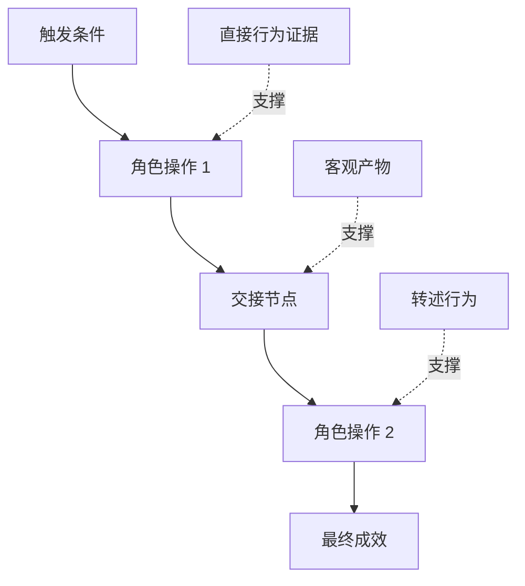

# 发掘人们 thực sự thực hiện dòng công việc

> Những nhu cầu thực sự không bao giờ có thể ngồi trong phòng họp như bạn đến để thu thập. Chúng nằm nằm trong những hành động thực tế của người ta, những phương tiện thay đổi, những kỷ lục lịch sử và những sự phân chia khác nhau.

**Type:** Learn + Build
**Languages:** Python (stdlib)
**Prerequisites:** Phase 14 第 47 课
**Time:** ~70 分钟

## Học mục tiêu

- Để xây dựng các quy trình hoạt động hiện có được dựa trên các chứng cứ thực hiện.
- 严格区分直接观测到事实与转述或推断的行为──
- 定位流程中的摩擦阻力(Tình gợn) 交接节点 (交接节点) 交付) 审批权限 (权威) 及隐性状态 (隐性状态) 隐性状态 (隐性状态) 
- 保持不确定主张的显而易见性,而非轻率地将其直接转变为硬性需求──

## Từ hệ thống hiện có phát triển

Đừng bắt đầu hỏi người dùng muốn làm gì. Bạn nên làm gì để trả lại cho họ những gì đã xảy ra.

Đối với mỗi bước trong dòng công việc, ghi lại các đoạn sau:

| 字段 | 示例 |
|---|---|
| 执行角色（Actor） | 值班工程师 |
| 触发条件（Trigger） | 生产环境告警到达 |
| 具体操作（Action） | 打开告警详情，随后在监控看板中搜索 |
| 输入信息（Input） | 告警 Payload 与发布记录 |
| 产出结果（Output） | 疑似故障服务及责任人 |
| 摩擦阻力（Friction） | 在三个不同运维工具之间来回切换上下文 |
| 审批权限（Authority） | 事故指挥官批准执行写入操作 |
| 支撑证据（Evidence） | 屏幕录像、事故复盘日志、运维手册 |

Giao diện thực tế của công việc xa hơn so với màn hình. Nó bao gồm thời gian chờ, sao chép dán, chia sẻ riêng tư, quá trình phê duyệt, phục hồi sai lầm, cũng như những động tác nhỏ mà mọi người đã quen và thậm chí không chú ý đến.

## Bằng chứng là có cấp độ mạnh yếu

建立简单的证据阶梯(Dấu chứng:

1. **直接行为（Direct behavior）：**现场观测、系统调用追踪(Trace) 、屏幕录屏或系统事件日志──
2. **客观产物（Artifact）：**工单记录、运维手册、审计日志、表单或已完成成果文件──
3. **转述行为（Reported behavior）：**Người ta nói về những gì họ thường làm.
4. **主观推断（Inference）：**Đội ngũ xác định sẽ có gì xảy ra.

Bốn nguồn thông tin này có giá trị, nhưng chỉ hai nguồn trước có thể chứng minh trực tiếp hành vi thực tế hiện tại.



## 重点搜寻四大要素

- **摩擦阻力（Friction）：**重复繁劳动、无需等待延迟、数据重复录入或繁的故障恢复──
- **隐性状态（Hidden state）：**Chỉ còn lại trong tâm trí nhân viên, tức thời thông tin, ghi chép trò chuyện hoặc thông tin trong ghi chép cá nhân.
- **审批权限（Authority）：**Có quyền đưa ra những quyết định quan trọng có hậu quả cao cho nhân viên cụ thể hoặc hệ thống kiểm soát.
- **异常分支（Exceptions）：**Normal process occurs interrupted  không còn theo các phụ trách về các hoạt động bên cạnh.

AI 功能之所以经常在交交与异常处理时崩,往往是因为最初 chỉ được thiết kế nhằm mục đích hướng dẫn lý tưởng của mọi thứ tốt đẹp.

## Đừng qua 求平均抹杀分歧

Hai người dùng sử dụng các quy trình hoạt động khác nhau, thường có lý do chính đáng. Trước khi hiểu rõ nguyên nhân sâu sắc của nó, nên giữ lại các phân tử này, vì chúng có thể đại diện cho:

- Các vai trò và quyền trách nhiệm khác nhau trong tổ chức;
- Diversified风险 tolerance cấp độ;
- 遗留旧流程与当前新流程的交换;
- Sự khác biệt giữa kinh nghiệm chuyên môn và kỹ năng;
- Chiến lược kinh doanh thực sự và sự phân biệt quản lý.

Một dòng công việc bị buộc phải làm trung bình, thường không thể mô tả được bất kỳ người nào thực sự.

##  xây dựng nó

Chương trình thử nghiệm của bài này được thực hiện theo từng bước ghi lại chứng chỉ chứng minh của dòng công việc, quy trình thực hiện và tin tưởng của trường, tính toán tỷ lệ chứng minh trực tiếp (Direct-evidence ratio), và sẽ ghi kết quả.`outputs/workflow-evidence.json`

运行命令:

```bash
python3 code/main.py
python3 -m unittest discover code/tests -v
```

尝试增加一条部署记录缺失的异常分支路径──保持主流程顺序不变,并清晰记录该分支的起点位置──

## 练习

1. Không phỏng vấn bất kỳ người nào, chỉ có một hệ thống hoạt động nhật ký để xuất hiện một dòng công việc hoàn chỉnh.
2. 面谈一位真实用户,标注出其主张中所有仍缺乏直接客观证支的陈述──
3. 增加一处权限审批边界 (Gần giới hạn thẩm quyền) và bước cố障恢复流程──
4.  tạo ra hai biến thể quy trình khác nhau đối với cùng một tình huống, không cần phải bắt buộc chúng cùng nhau.
5. Tìm ra một chức năng mới của một đề xuất: nó mặc dù trên bề mặt loại bỏ một bước hoạt động có thể nhìn thấy, nhưng hoàn toàn không chạm vào việc ẩn sau.

## 延伸阅读

- [Nuseibeh and Easterbrook, Requirements Engineering: A Roadmap](https://www.cs.toronto.edu/~sme/papers/2000/ICSE2000.pdf)Đặc biệt, cần lưu ý rằng việc thu thập nhu cầu là giải thích, xây dựng và chứng minh chứ không phải là một cách đơn giản.
- [Gotel and Finkelstein, An Analysis of the Requirements Traceability Problem](https://doi.org/10.1109/ICRE.1994.292398): phân tích các thách thức nghiêm trọng về mối quan hệ theo dõi giữa nhu cầu bảo trì và nguồn gốc dựa trên nó.

## 交付物与沉

Xin hãy giữ lại sản phẩm`outputs/workflow-evidence.json`Trong bài học tiếp theo, nó sẽ chuyển đổi các kháng cự và không chắc chắn xung đột được quan sát thành một bản đồ giả định (được giả định là bản đồ)
