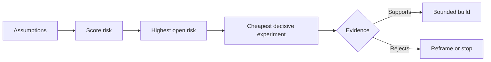

# 理假设并优先化解最高风险

> 产品路线图 (路线图) 往往把不确定性掩盖在功能列表中;而假设图谱 (假设图谱) 则揭示: Trước khi các chức năng này có giá trị được xây dựng, trước tiên phải xác minh được những điều kiện tiên quyết nào được thiết lập.

**Type:** Learn + Build
**Languages:** Python (stdlib)
**Prerequisites:** Phase 14 lesson 48
**Time:** ~65 minutes

## Học mục tiêu

- Việc được đề xuất sẽ được giải tán và chuyển thành những giả thuyết rõ ràng (được giả định rõ ràng)
- 分别对影响程度 (Impact) 无确定性 (Uncertainty) 和不可逆性 (Irreversibility) (Điều ảnh hưởng)
- 根据风险排序选择下一个实验,而不是凭主观热情驱动.
- Sử dụng chứng minh và kết luận quyết định đã được xác định thay thế giả thuyết đã được thử nghiệm.

## Mỗi lần xây dựng đều là một cược

Một bộ các công cụ tìm kiếm cố tình (Incident Tool) giá trị, có thể phụ thuộc vào việc các giả định đặt trước của các mục sau đây có hoàn toàn hợp lệ hay không:

-  cảnh báo trên có đủ thông tin để xác định dịch vụ cố định;
- 工程师信任他们并非亲自推得出的推结果;
- Thời gian phản ứng dự kiến thực sự quan trọng ở cấp độ vận tải;
- Có thể truy cập dữ liệu cần thiết theo cơ sở không giới thiệu quyền không an toàn của Cơ quan An toàn;
- Tỷ lệ xảy ra của dòng công việc đủ cao để chứng minh chi phí bảo trì hệ thống này là hợp lý.

Những điều này không phải là đơn giản về các nhiệm vụ thực hiện mã hóa, mà là để xây dựng trở nên có giá trị, có giá trị, có thể sử dụng, có thể thực hiện và an toàn.

## 假设的类别

| 类别 | 核心问题 |
|---|---|
| 价值（Value） | 产出的最终结果是否足够重要？ |
| 可用性（Usability） | 用户能否理解并据此采取行动？ |
| 可行性（Feasibility） | 现有系统能否利用可获取的数据和约束产出该结果？ |
| 存续性（Viability） | 组织能否长期承受其成本、归属权与运维负担？ |
| 安全性（Safety） | 系统出现故障时是否不会造成无法接受的后果？ |

Để viết giả thuyết thành những tuyên bố có thể xác minh được. Các tuyên bố có thể giả lập được.

## 风险并非单一维度的数字

Cuộc thử nghiệm này từ 1 đến 5 phút đánh giá ba chiều:

- **影响（Impact）：**Nếu giả định không thành công, mức độ thiệt hại gây ra cho hệ thống hoặc kinh doanh.
- **不确定性（Uncertainty）：**Cấp độ yếu của chứng cứ trước đây.
- **不可逆性（Irreversibility）：**Trong thực hiện cam kết hoặc đầu tư lớn chỉ phát hiện ra chi phí trả lại sai lầm.

Ví dụ đánh giá sẽ ảnh hưởng đến sự không chắc chắn, tăng lên tính không thể đảo ngược.



## 设计实验, chứ không phải nghi lễ xác nhận

Một thí nghiệm có giá trị thực sự có các yếu tố sau:

- Một chủ đề có thể bị chứng minh giả;
- Một nhóm người tiếp nhận thực sự hoặc một mẫu người đại diện;
- Một kết quả quan sát được quan sát;
- Trong khi nhìn thấy kết quả trước đó đã xác định giá trị đánh giá;
- 针对通过、失败和模糊证据各自明确下一步决策路径──

避免设计 kiểu chỉ để chứng minh nhóm có khả năng đưa ra ý tưởng này  xác nhận nghi thức kiểu thử nghiệm.

## 可逆性会改变构建顺序

Kết quả: sự lựa chọn nghiêm trọng và không thể đảo ngược cần được chứng cứ sớm hơn. Chỉ cần đọc lại.

 Nhịp độ tiến bộ của cấu trúc hệ thống, nên phù hợp với tốc độ giải quyết không chắc chắn.

## 动手实现

Trong thí nghiệm này, các giả thuyết được sắp xếp, phân biệt các kết luận đã được chứng minh và chưa được quyết định, chọn ra các giả thuyết chưa được quyết định cao nhất, và tạo ra`outputs/assumption-map.json`

```bash
python3 code/main.py
python3 -m unittest discover code/tests -v
```

 sửa đổi tình trạng chứng cứ trên giả thuyết cao nhất, quan sát hệ thống đề xuất tiếp theo của thí nghiệm sẽ làm thế nào động thái điều chỉnh.

## 课后练习

1. Vì bạn đang chuẩn bị xây dựng một chức năng viết ra 5 giả định quan trọng.
2. 补充一条您原本的功能列表中遗漏的安全假设──
3. Đặt một cái sẽ khiến bạn quyết định chấm dứt sự cứng rắn của cấu trúc này.
4. Thay thế một thử nghiệm thử nghiệm lớn ban đầu với chi phí thấp hơn và có tính quyết định.
5. Đối với các ưu tiên rủi ro và ưu tiên đường dẫn sản phẩm gốc,并 giải thích lý do tại sao có những sai lầm.

## 延伸阅读

- [Barry Boehm, A Spiral Model of Software Development and Enhancement](https://dl.acm.org/doi/10.1145/12944.12948), tìm kiếm trong một vòng lặp phát triển thúc đẩy rủi ro trong một giai đoạn sâu hơn để giải quyết sự không chắc chắn.
- [Dardenne, van Lamsweerde, and Fickas, Goal-Directed Requirements Acquisition](https://doi.org/10.1016/0167-6423(93)90021-G), tìm hiểu các mục tiêu tinh tế của hệ thống trong khi tiếp tục khám phá các trở ngại và ràng buộc dần dần.

## 交付物沉

Bảo trì`outputs/assumption-map.json` 下一节课将借此文件选择能够产生决策性证据的最小片片──
