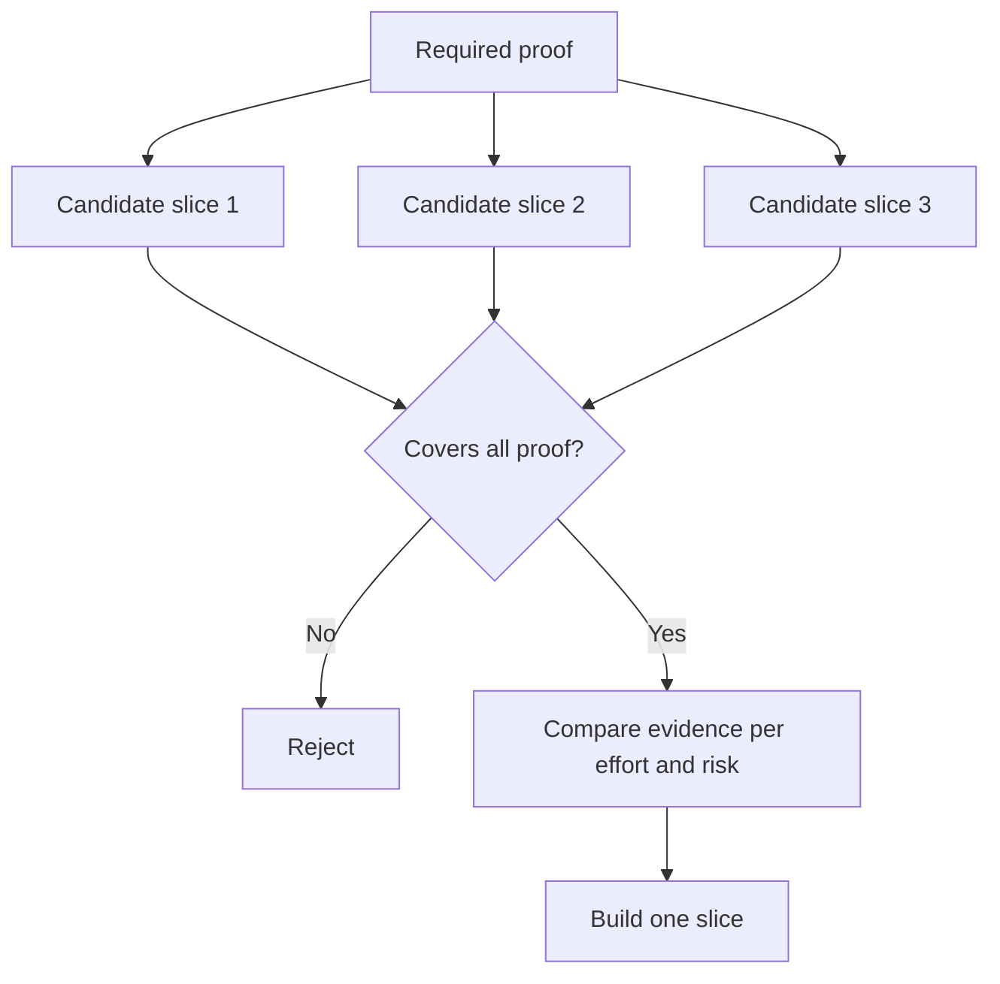

# 选择能够改变决策的最小片

> Chỉ khi một vấn đề quan trọng được chứng minh, thì sự tinh chỉnh mới có giá trị. Một cấu trúc nhỏ của một quyết định bước tiếp theo không thể thay đổi được, chỉ là một phần hoàn thành.

**Type:** Learn + Build
**Languages:** Python (stdlib)
**Prerequisites:** Phase 14 lesson 49
**Time:** ~65 minutes

## Học mục tiêu

- Theo giả định cốt lõi của việc cắt có thể chứng minh để xác định cắt (slice)
- 权衡结果价值(Outcome Value) 无确定性化解、研发投入与潜在后果──
- Ưu tiên chọn chứng minh thực tế, chứ không phải cam kết sinh sớm hơn.
- Quyết định không quyết định những người cố gắng tránh những công việc

## 垂直切片 nghĩa là kết thúc kết thúc thực tế

垂直切片 (垂直切片) là dòng thực tế thực tế tối thiểu cần thiết để trải qua một kết quả nào đó. Nó có thể rất hẹp về số lượng người dùng, quy mô dữ liệu, chu kỳ chạy và phạm vi chức năng, nhưng không thể loại trừ sự không chắc chắn cốt lõi của việc thử nghiệm.

Ví dụ:

- Dựa trên 10 起真故障的只读重放 (đọc-chỉ-lại), có thể kiểm tra dịch vụ nhận biết sự chính xác và sự tin tưởng của người điều hành.
- Dựa trên các dữ liệu tổng hợp được xây dựng trên một bộ máy thiết bị tinh tế có thể kiểm tra độ hiểu biết giao diện, nhưng hoàn toàn không thể kiểm tra khả năng có được dữ liệu.
- Trong môi trường sản xuất, máy sửa lỗi tự động, cố gắng thử nghiệm một lần tất cả các phần, nhưng mang lại nguy cơ phá hủy không thể chịu đựng được.

## Trước tiên xác định cần thiết chứng cứ

提取风险最高的未决假设,将其转化为必证集 (必证集) ── 候选片片只有在完全覆盖该证集时,才具备入选资格 (必证集) ──

Sau đó, đánh giá so sánh giữa các mảnh đã qua kiểm tra:

| 评估维度 | 期望方向 |
|---|---|
| 产出价值（Outcome value） | 越大越好 |
| 化解的不确定性（Uncertainty reduced） | 越多越好 |
| 研发投入（Effort） | 越小越好 |
| 潜在后果（Consequence） | 越轻越好 |
| 可逆性（Reversibility） | 越高越好 |

Mô hình đánh giá được sử dụng trong thí nghiệm này cố gắng giữ đơn giản, vì đủ điều kiện nhập học (Eligibility Gate) còn quan trọng hơn so với việc tính toán kỹ thuật số.



## 常见的伪极小值陷

- **纯界面极小值（UI-only minimum）：** tránh việc thu thập dữ liệu quan trọng nhất và vận chuyển không chắc chắn.
- **纯基础设施极小值（Infrastructure-only minimum）：**证明 tính khả thi của công nghệ, nhưng không thể kiểm tra giá trị người dùng.
- **纯顺境极小值（Happy-path minimum）：**刻意省略构成大部分风险的异常边界处理.
- **演示极小值（Demo minimum）：**Các sản phẩm đã được sản xuất có thể thuyết phục rất nhiều, nhưng không thể cung cấp một đánh giá định lượng có thể thực hiện được.
- **平台化极小值（Platform minimum）：**Trong khi đó, các công trình đơn lẻ chưa xác nhận giá trị của nó, quá sớm xây dựng các bộ phận tái sử dụng chung.

## 预先设定停止规则

Trước khi bắt đầu thực hiện, phải提前书面写明如果该片测试失败将采取的对策:

-  bỏ qua kết quả dự kiến;
- Thay đổi mục tiêu nhóm người dùng hoặc tình hình kinh doanh;
- 测试替代的技术机制;
-  thu thập bằng chứng cấp dưới chất lượng cao hơn;
- 进一步缩短系统的执行权限──

Nếu kết quả của mỗi thử nghiệm cuối cùng đều hướng dẫn tiếp tục xây dựng, thì mảnh này không phải là một thí nghiệm thực sự.

## 动手实现

Thực nghiệm này dựa trên chứng cứ cần thiết                                                                                                                                                                                                                                                           `outputs/slice-decision.json`

```bash
python3 code/main.py
python3 -m unittest discover code/tests -v
```

尝试添加一个成本较低但只能验证单项必要假设的候选片――观察它, ngay cả khi tổng số lượng phân分极高, tại sao nó vẫn trực tiếp được đủ điều kiện bị chặn――

## 课后练习

1. 针对 cùng một kết quả dự kiến, thiết kế ba đoạn xác nhận các cấp độ khác nhau đối phó với các hậu quả.
2. Trước khi đánh giá các ứng cử viên, hãy liệt kê rõ các chứng cứ cần thiết.
3. 尝试裁减一项功能, đồng thời đảm bảo có thể giữ lại các chứng cứ quyết định quan trọng.
4. Để thử nghiệm các chương trình bổ sung một điều thực tế thực hiện dừng quy tắc.
5. Tìm ra một lý do nào đó nên bị trì hoãn cho việc kiểm tra đoạn sau khi khởi động lại các bộ phận nền tảng chung.

## 延伸阅读

- [Barry Boehm, A Spiral Model of Software Development and Enhancement](https://dl.acm.org/doi/10.1145/12944.12948), tìm hiểu cách để phù hợp với từng vòng phát triển của thế hệ với các rủi ro hiện tại phải giải quyết.
- [Lenarduzzi and Taibi, MVP Explained: A Systematic Mapping Study on the Definitions of Minimal Viable Product](https://arxiv.org/abs/1609.07592), trong thực tế kỹ thuật phần mềm phân tích đối với độ mờ nhất định với độ có thể thực hiện.

## 交付物沉

Bảo trì`outputs/slice-decision.json`                                                                                                                                                                                                                                                              
