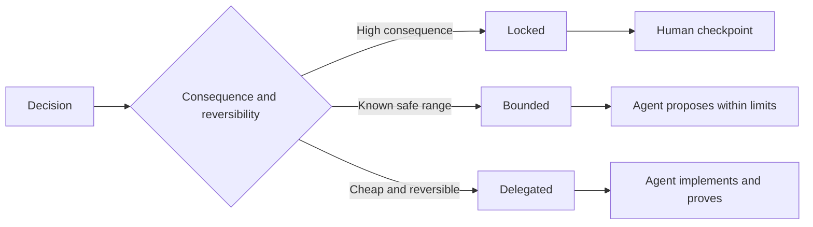

# 编写 quy định nhiệm vụ giữ quyền tự do quyết định

> Các quy tắc có giá trị nên được xác định không thay đổi với chứng cứ, đồng thời giữ cho sự lựa chọn thực hiện ngược lại mở.

**Type:** Learn + Build
**Languages:** Python (stdlib)
**Prerequisites:** Phase 14 lesson 50
**Time:** ~75 minutes

## Học mục tiêu

- 将预期产出、不变量(Invariants)、范例、非目标(Non-goals)
- 将决策划分为锁定 (đóng) 限 (đóng) 绑定 (đóng) với ủy ban (đóng) 委托 (đóng) 三种模式――
- Trong việc chọn các quy mô chi phí thấp và cao có thể đảo ngược, giữ lại đầy đủ quyền tự quyết của Đại lý.
- Trong các điểm liên quan đến hậu quả nghiêm trọng hoặc phá hoại hành vi công cộng, bắt buộc thiết lập các điểm kiểm tra kiểm tra nhân tạo (Human Checkpoints).

## 2 cực xấu

规范不足 (Undetermined) của nhiệm vụ bắt buộc Cấp 凭空猜测系统行为; còn quá quy định (Over specified) của nhiệm vụ thì làm cho Cấp 机械照抄可能本身存在缺陷的具体设计――

Điểm hiệu quả của giải pháp là**可执行契约（Executable Contract）**- Có thể là:

| 规范要素 | 核心作用 |
|---|---|
| 预期产出（Outcome） | 可直接观测的最终交付结果 |
| 不变量（Invariants） | 必须始终严格成立的前置与后置约束 |
| 范例（Examples） | 能够直观展现真实意图的具体用例 |
| 非目标（Non-goals） | 明确刻意排除在外的周边行为 |
| 决策策略（Decision policy） | 标明哪些选择属于锁定、受限或完全委派 |
| 验证证据（Proof） | 任务验收前必须提供的测试或观测实据 |

## 三种决策模式

- **锁定（Locked）：**严禁代理 擅自选择;; áp dụng cho công cộng兼容性"", viết quyền"", an ninh",不可逆成本" hoặc các cam kết của sản phẩm cốt lõi;;
- **受限（Bounded）：**允许 Agent trong một khu vực an ninh được xác định rõ ràng tự chọn.
- **委派（Delegated）：**授权代理 全权裁量并附带解释说明. 适用于 局部代码结构,命名规范,可逆重构及内部实现细节.



## Thông qua các ví dụ cụ thể định nghĩa hành vi

Sử dụng ví dụ cụ thể truyền tải ý định, xa hơn nhiều so với nhiều từ ngữ có hiệu quả hơn.                                                                                                                                                                                                                                                   

范例无法替代不变量: trường hợp sử dụng thành công được thông qua một lần, không thể chứng minh các quy tắc an toàn toàn toàn cầu được đảm bảo.

## Bằng chứng chứng minh phải phù hợp với mức độ tuyên bố

- 单元测试(Unit Test) được sử dụng để chứng minh hàm局部契约。
- 传输协议测试 (Wire Test) được sử dụng để chứng minh chuỗi hóa với các hoạt động giao tiếp mạng.
- 浏览器旅程(Browser Journey) được sử dụng để chứng minh user interface của user interface.
- 重放测试集(Replay Set) được sử dụng để chứng minh hệ thống trong tình huống đại diện trong toàn bộ biểu hiện.
- 审计日志(Log kiểm toán) được sử dụng để chứng minh hệ thống quyền hạn giới hạn luôn có hiệu lực.

Không cần phải xem xét các bài kiểm tra cấp thấp như là bằng chứng chấp nhận các tuyên bố cấp cao.

## 刻意保留合理的未知空间

Quy định có thể xác định rõ ràng: thực hiện cụ thể có thể được lựa chọn để đáp ứng thời gian kéo dài ngân sách.

Với sự tích lũy của chứng cứ nhận thức, quy tắc nên được đưa vào thời gian.

## 动手实现

Trong bài viết này, các quy định của quy định của quy định của quy định, kiểm tra tính hợp pháp của mô hình quyết định, và tạo ra`outputs/executable-specification.json`

```bash
python3 code/main.py
python3 -m unittest discover code/tests -v
```

尝试将生产环境写权从锁定调整为委派──分析为什么数据方案 能够通过校验,而产品层面风险控制却坚决不允许这种变化──

## 课后练习

1. Một phần của một phần của một phần của một phần của một phần của một phần của một phần của một phần của một phần của một phần của một phần của một phần của một phần của một phần của một phần của một phần của một phần của một phần của một phần của một phần của một phần của một phần của một phần của một phần của một phần của một phần của một phần của một phần của một phần của một phần của một phần của một phần của một phần của một phần của một phần của một phần của một phần của một phần của một phần của một phần của một phần của một phần của một phần của một phần của một phần của một phần của một phần của một phần của một phần của một phần của một phần của một phần của một phần của một phần của một phần của một phần của một phần của một phần của một phần của một phần của một phần của một phần của một phần của một phần của một phần của một phần của một phần của một phần của một phần của một phần của một phần của một phần của một phần của một phần của một phần của một phần của một phần của một phần của một phần của một phần của một phần của một phần của một phần của một phần của một phần của một phần của một phần của một phần của một phần của một phần của một phần của một phần của một phần của một phần của một phần của một phần của một phần của một phần của một phần của một phần của một phần của một phần của một phần của một phần của một của một phần của một phần của một phần của một phần của một phần của một phần của một phần của một phần của một phần của một phần của một phần của một phần của một phần của một phần của một phần của một phần của một phần của một của một phần của một phần của một phần của một phần của một phần của một phần của một phần của một phần của một phần của một phần của một phần của một phần của một phần của một phần của một phần của một phần của một phần của một phần của một phần của một phần của một phần của một phần của một phần của một phần của một phần của một của một phần của một của một phần của một phần của một phần của một phần của một của một phần của một phần của một phần của một phần của một của một phần của một phần của một của một phần của một phần của một của một phần của một phần của một của một của một phần của một phần của một
2. Sử dụng một quy tắc không thay đổi thêm hai ví dụ điển hình, thay thế để thay thế mô tả chỉ dẫn của 3 quy tắc.
3. Mỗi quyết định trong nhiệm vụ đánh dấu, và cho mỗi nơi được khóa hoặc hạn chế lý do lựa chọn.
4. Vì quy định trong mỗi điều không thay đổi bổ sung cho chứng minh chứng minh chứng minh đối phó.
5. Tìm ra một điều đã không có lý do chính xác và bất kể lý do nào, các kết nối dư thừa sẽ bị xóa bỏ.

## 延伸阅读

- [Nuseibeh and Easterbrook, Requirements Engineering: A Roadmap](https://www.cs.toronto.edu/~sme/papers/2000/ICSE2000.pdf), thám lý các mục tiêu, xác định quy định, xác nhận, đồng ý và các hệ thống liên quan.
- [Zave and Jackson, Four Dark Corners of Requirements Engineering](https://doi.org/10.1145/237432.237434), sâu sắc phân tích các giả thuyết môi trường, nhu cầu hệ thống và quy tắc kỹ thuật của người khác.
- [Gotel and Finkelstein, An Analysis of the Requirements Traceability Problem](https://doi.org/10.1109/ICRE.1994.292398), tìm hiểu cách duy trì nguyên nhân và khả năng truy xuất nhu cầu xuất hiện.

## 交付物沉

Bảo trì`outputs/executable-specification.json`Nó sẽ trở thành hợp đồng hợp tác được thực hiện chung với các nhà đánh giá nhân loại.
