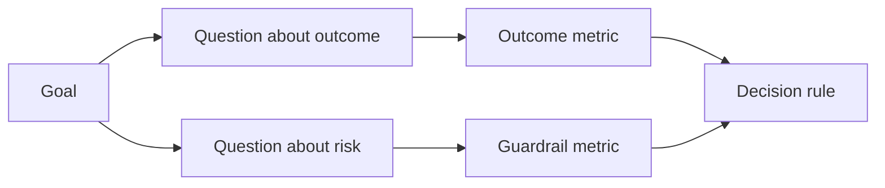

# Trong kết quả tạo ra trước thiết kế chỉ số thành công

> Chỉ số đo nên phục vụ cho các quyết định hành động, chứ không chỉ là trang trí của bảng thiết bị.

**Type:** Learn + Build
**Languages:** Python (stdlib)
**Prerequisites:** Phase 14 lessons 47 and 51
**Time:** ~70 minutes

## Học mục tiêu

- Từ mục tiêu kết quả dự kiến đưa ra các vấn đề và chỉ số đo lường.
- Trong việc quan sát kết quả thực tế trước, trước tiên xác định giá trị, cửa sổ thời gian, nguồn dữ liệu và hướng tối ưu hóa.
- Sẽ sản xuất chỉ số và bảo vệ chỉ số và đo chỉ số
- Để đánh giá chứng cứ phù hợp với các quyết định cụ thể cần hỗ trợ xây dựng này.

## 目标、问题与指标(GQM)

Từ mục tiêu (goal) xuất phát:

> 缩短 thời gian cần thiết cho dịch vụ bị ảnh hưởng, đồng thời không tăng bất kỳ hoạt động không an toàn nào.

推导出问题:

- 定位正确服务速度有多快吗?
- Ưu điểm xác thực dịch vụ được định vị cao như thế nào?
- Quá trình chẩn đoán có phải luôn luôn được giữ nguyên?
- Chuyển động làm việc có dẫn đến cảnh báo thường xuyên bị bỏ qua hoặc gánh nặng người điều hành không?

Sau đó chọn các vấn đề này để làm việc



## Mỗi chỉ số đều cần quy định hợp đồng

Mỗi chỉ số phải có:

| 契约字段 | 示例 |
|---|---|
| 指标名称（Name） | `median_identification_seconds` |
| 方向（Direction） | 至多不超过（at most） |
| 阈值（Threshold） | 120 |
| 窗口（Window） | 10 次故障事件重放 |
| 数据源（Source） | 重放事件日志 |
| 统计样本（Population） | 参与试点的在岗工程师 |
| 类别（Kind） | 成果指标（outcome）或护栏指标（guardrail） |

Nếu thiếu nguồn dữ liệu và cửa sổ thống kê, bất kỳ số nào không thể được thực hiện; Nếu thiếu dự định giá trị, chỉ số không thể thúc đẩy quyết định rõ ràng.

## Chỉ số kết quả 护 chỉ số và chỉ số cân bằng

- **成果指标（Outcome metric）：**期望 cải thiện tình trạng có thực sự tăng lên không?
- **护栏指标（Guardrail）：**Điều kiện an ninh và ràng buộc đã được xác định luôn luôn được tuân thủ không?
- **制衡指标（Counter-metric）：**Việc cải thiện tại địa phương có chuyển chi phí ẩn hoặc phá hủy sang các lĩnh vực khác không?

Đối với dòng công việc tìm kiếm lỗi, ánh sáng nhanh là không đủ.

## 离线证据与在线证据

离线重放(Offline Replay) rất thích hợp với kiểm tra khả thi tái hiện và tỷ lệ phủ sóng cảnh cạnh;受控试点(Binded Pilot)则擅长检查真实人类行为、信任度建立与工作流上下游影响──二者互补,不可替代──

始终选择能够支现前决策的最低成本证据――绝不能仅仅因为代码已经写好就商业将真实用户暴露于未知风险――

## Trước đó là định đo

Trước khi nhìn thấy kết quả thống kê, phải xác định trước mặt bằng văn bản thông qua, thất bại và lộ diện tình huống hành động. Nếu không, nhóm rất dễ dàng thông qua thay đổi tạm thời để mở ra các kết quả xây dựng hiện có.

Quy tắc:

- 通过(Pass): dịch vụ định vị xác định không thấp hơn 0,9, và định vị thời gian trung gian không quá 120 giây;
- 失败(Fail): xuất hiện bất kỳ hoạt động sản xuất bất hợp pháp nào, hoặc tỷ lệ xác định vị trí thấp hơn 0,75;
- 模糊(Ambiguous): hiệu suất mặc dù có một chút nâng cao nhưng rất lớn, cần phải mở rộng lại và thử lại.

## 动手实现

Trong thí nghiệm này, tính toàn diện của kế hoạch đo lường, đánh giá bao gồm giá trị biên giới, ghi lại chỉ số thiếu hụt, và xuất khẩu.`outputs/measurement-report.json`

```bash
python3 code/main.py
python3 -m unittest discover code/tests -v
```

尝试删除护指标 trong kế hoạch đo lường, để xem tại sao ngay cả khi chỉ số kết quả vẫn tồn tại, toàn bộ kế hoạch vẫn sẽ được hệ thống đánh giá là bất hợp pháp.

## 课后练习

1. Từ cùng một mục tiêu kết quả, đưa ra ba vấn đề trọng tâm khác nhau.
2. 补一条能够捕获因当前优化导致其他角色负担加重的衡量指标――
3. Để mỗi chỉ số xác định nguồn dữ liệu của nó, nhóm mô hình thống kê và cửa sổ thời gian.
4. Trước khi tạo ra giá trị thực tế, trước tiên viết dưới thông qua 失败和模糊三种情况的决策.
5. Tìm ra một thống kê dễ dàng nhưng không thể thay đổi bất kỳ chỉ số phụ của quyết định nào, và sẽ loại bỏ nó.

## 延伸阅读

- [Basili, Software Modeling and Measurement: The Goal/Question/Metric Paradigm](https://drum.lib.umd.edu/items/8119803a-362b-42ec-b6ce-2311713e7236), giới thiệu cách đưa ra một hệ thống đo lường có thể thực hiện từ mục tiêu rõ ràng (GQM) 范式) 
- [Basili, Caldiera, and Rombach, The Goal Question Metric Approach](https://www.cs.toronto.edu/~sme/CSC444F/handouts/GQM-paper.pdf), giải thích sẽ mô tả phương pháp này như là thực hành của hệ thống kết thúc phản  và cải tiến liên tục.

## 交付物沉

Bảo trì`outputs/measurement-report.json`Nó sẽ trở thành một trong những giai đoạn đầu tiên của giai đoạn sản xuất.
