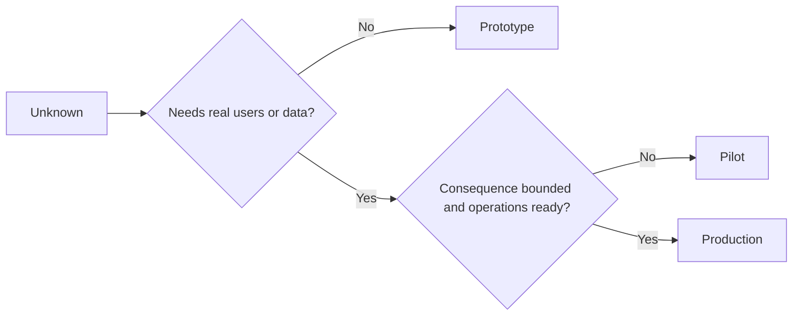

# 审慎择原型、试点还是生产

> Chúng đại diện cho môi trường nhận thức khác nhau, chứ không phải sự khác biệt tinh tế đơn giản.

**Type:** Learn + Build
**Languages:** Python (stdlib)
**Prerequisites:** Phase 14 lessons 50 to 52
**Time:** ~70 minutes

## Học mục tiêu

- Theo loại không rõ, phạm vi người xem, độ nhạy dữ liệu, tác dụng và vận hành, sự trưởng thành, lựa chọn cẩn thận giai đoạn xây dựng.
- 制定各阶段专属的管控措施 (Các biện pháp kiểm soát)
- 防止原型系统在无人责任的情况下演变为生产系统──
- Trong chứng cứ và vận tải bảo đảm đầy đủ sẵn sàng trước khi,

## Ba vấn đề cốt lõi khác nhau

| 阶段 | 核心问题 |
|---|---|
| 原型（Prototype） | 该技术机制到底能不能产生预期的实证结果？ |
| 试点（Pilot） | 在受控真实受众与真实工况下，它能否安全稳定运行？ |
| 生产（Production） | 组织能否按照既定的可靠性与风险承诺，持续对该系统承担长期责任？ |

Một mô hình nguyên mẫu hoàn thiện về kỹ thuật, vẫn có thể được thiết kế để sử dụng chất thải sau khi bỏ rơi; một thử nghiệm có thể sử dụng dữ liệu sản xuất thực tế, nhưng quy mô và quyền hoạt động của nó phải được giới hạn nghiêm ngặt; và chỉ khi tổ chức chính thức tiếp thị và chịu trách nhiệm lâu dài, giai đoạn sản xuất mới thực sự mở ra.

## 原型阶段

Khi cần giải quyết giả định không biết không cần phải giới thiệu người dùng thực hoặc dữ liệu sản xuất thực, sử dụng giai đoạn nguyên mẫu.

- 随时可废弃 (có thể bỏ đi);
- 严格隔离(được cô lập);
- 功能边界狭窄 (khách thức nhỏ);
- 核心验证问题显式明确 (Xuất rõ về câu hỏi học tập);
- Không作假的运维稳定性承诺.

Trong khi cơ chế tự nó chưa chứng minh giá trị của nó vào giai đoạn tiếp theo, đừng quá sớm tối ưu hóa toàn bộ cấu trúc hệ thống.

## 试点阶段

Khi giả định không rõ phải dựa trên hành vi hoạt động thực tế, dữ liệu thực tế hoặc dòng công việc thực tế để kiểm tra, nhưng phá hủy hậu quả hoặc vận hành vẫn chưa đủ để hỗ trợ việc phát hành toàn diện, áp dụng giai đoạn thử nghiệm.

Một điểm thử nghiệm đủ điều kiện phải có:

- Chỉ số số người dùng
- 明确 nhân lực;
-  Thời gian vận hành và quyền vận hành bị hạn chế nghiêm ngặt;
- Chương trình kiểm toán theo dõi và nhanh chóng quay trở lại;
- Chỉ số kết quả và chỉ số bảo vệ giá trị;
- Định nghĩa về việc mở rộng, sửa đổi hoặc hoàn toàn chấm dứt quy định về việc rút lui.

## 生产阶段

生产阶段 không chỉ bằng với việc triển khai mã hóa hoàn thành:

- 明确的服务等级目标(SLO);
- 值班排班与故障事件处理责任人;
- Chuyên gia kiểm tra an ninh và bảo mật;
- Kiểm soát dung lượng và dung lượng;
-  cơ chế hoàn chỉnh tái diễn và khôi phục thảm họa;
- 7x24 小时全天候监控;
- 清晰的退役与下线路径──



## 阶段漂移陷

Khi mã gốc chưa được thiết lập trong một hệ thống trách nhiệm vận hành lâu dài, và đã có được quyền hoạt động của người dùng thực tế, dữ liệu nhạy cảm hoặc lõi, nó sẽ trở nên nguy hiểm.**阶段漂移（Stage Drift）** phải được thiết lập trong hệ thống định vị, kiểm soát quyền hạn, chỉ số đo lường và trong tài liệu kiến trúc, buộc phải xác định các biên giới cứng của nguyên mẫu và thử nghiệm chỉ cần treo trên giao diện một bản thử nghiệm cảnh báo横幅是远远不够的

Các giai đoạn trong hệ thống, nên có thể được quan sát và thử nghiệm trực tiếp trong trạng thái hoạt động của hệ thống.

## 动手实现

Thực nghiệm này dựa trên quyết định trên bản dưới đây tự động đề xuất phù hợp giai đoạn, quay lại các biện pháp quản lý cần thiết trong từng giai đoạn,并输出 `outputs/stage-decisions.json`

```bash
python3 code/main.py
python3 -m unittest discover code/tests -v
```

Để sửa đổi thí điểm thử nghiệm cho hậu quả phá hủy thấp và có vận hành và sự trưởng thành.

## 课后练习

1. 根据认知探索阶段 (không phải là trạng thái triển khai mã đơn giản), các dự án hiện có trên đầu bạn được phân loại lại.
2. 编写 một văn bản có chứa 果断终止 果断选项的试点退出准则──
3. Tăng cường một biện pháp kiểm soát kỹ thuật, ngăn chặn mã nguyên mẫu chạm vào dữ liệu môi trường sản xuất từ cơ bản.
4. Tìm ra những mục tiêu đầu tiên của hệ thống thực sự chuyển sang trách nhiệm vận hành và trách nhiệm cấp sản xuất.
5. Để được giới hạn thử nghiệm thiết kế một bộ hoàn chỉnh vòng quay hoạt động bằng chứng.

## 延伸阅读

- [Barry Boehm, A Spiral Model of Software Development and Enhancement](https://dl.acm.org/doi/10.1145/12944.12948), tìm hiểu cách để phù hợp với mức độ rủi ro đã được giải quyết của mỗi thế hệ nguồn lực đầu tư.
- [Fagerholm et al., Building Blocks for Continuous Experimentation](https://doi.org/10.1145/2601248.2601276), phân tích liên tục tiến hành các thử nghiệm kỹ thuật cần thiết quy trình và kỹ thuật tổ chức.

## 交付物沉

Bảo trì`outputs/stage-decisions.json`Nó ghi lại lý do tại sao các giai đoạn được chọn, cũng như các biện pháp quản lý cần được thực hiện trước khi bước vào giai đoạn tiếp theo.
