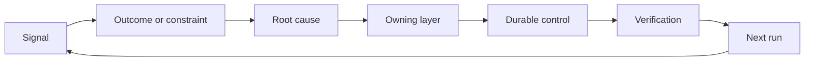

#  xây dựng vòng quay chống tròn của cơ chế nhập cư và退役

> Việc phát hành mã hóa kết thúc vòng xây dựng của thời gian hiện tại, đồng thời mở ra vòng học tập lâu dài.

**Type:** Learn + Build
**Languages:** Python (stdlib)
**Prerequisites:** Phase 14 lessons 46 and 53
**Time:** ~75 minutes

## Học mục tiêu

- Việc chuyển đổi sự cố, đánh giá dữ liệu, hành vi người dùng và điều chỉnh ngược lại thành hành động thuộc về trách nhiệm.
- Để xác định các tín hiệu khác nhau từ đường đến các bài viết dưới đây, các tập hợp đánh giá, các chiến lược an toàn, thời gian vận hành hoặc nhu cầu chờ đợi.
-  Định vị ưu tiên đối với rủi ro tái phát dựa trên mức độ nghiêm trọng và thường xuyên tái phát.
- Đối với mỗi cơ chế kiểm soát hệ thống thiết lập xác định các điều kiện退役 (Retirement Condition)

## 反本身也是基础设施

Một nhóm có thể thu thập rất nhiều hệ thống liên kết theo dõi (trước) 评测记录, hỗ trợ đơn và nhật ký cố tình, nhưng hoàn toàn không lấy bất kỳ bài học nhận thức nào từ đó.**晋级通道（Promotion）**Từ quan sát thực tế, hướng đến có trách nhiệm rõ ràng, chứng minh hệ thống duy trì của chứng minh thay đổi đường cố định.

Chuyện kết thúc của phản ứng Ratchet là:

1. 观测到具体实测信号;
2. Kết nối với kết quả sản xuất dự kiến, điều kiện buộc hoặc giả định đặt trước;
3. 识别 đối với các yếu tố chịu trách nhiệm thuộc về cấp hệ thống cấp dưới nhất;
4. 实施受控的持久化改进;
5. 验证 tỷ lệ mắc bệnh này đã được giảm xuống;
6. 定期复审该控制机制是否应继续保留──

## 精准路由至应对责任层级

| 信号类型 | 归属目的地 |
|---|---|
| 误报、功能倒退、错误输出结果 | 评测集（Evaluation）或自动化测试 |
| 上下文缺失、重复劳动、过时事实 | 上下文数据源或检索路由策略 |
| 不安全操作或越权漏洞 | 安全策略（Policy）或权限硬边界 |
| 超时、重试风暴、依赖服务不可用 | 运行时控制（Runtime Control） |
| 新的产品需求或尚未决断的权衡取舍 | 经过规范成型（Shaped）的待办项 |

Khi các quyền tự động hóa kiểm tra hoặc cứng đủ để làm cho lỗi hoàn toàn không thể xảy ra, đừng bao giờ thêm một đoạn gợi ý trong Prompt.



## 责任归属本身就是控制机制的一部分

Mỗi chương trình hoạt động cần phải có rõ ràng:

- 唯一的人类责任人 (tổ chức)
- Ưu tiên dựa trên đánh giá tổng thể về hậu quả thiệt hại và tần suất tái phát;
- 拟修改的目标系统组件(Điều vật);
-  chứng minh chương trình chứng minh thực tế của sửa đổi;
- 复审或自动失效窗口;
- 明确的退役条件(Cả kiện nghỉ hưu)

Một chương trình cải tiến vô người được nhận thức, đầy đủ chỉ là một đoạn bài viết về những quan điểm nhỏ bé.

## 果断退役过时的控制机制

Trong những trường hợp sau đây, nên có cơ chế kiểm soát và kiểm soát chủ động và hoàn thành:

- Hệ thống cấu trúc hoặc dòng công việc kinh doanh đã có những thay đổi cơ bản;
- Cơ chế không thay đổi của tầng dưới đã hoàn toàn thay thế các lệnh văn bản của tầng trên;
- Trong cửa sổ thời gian dự kiến, bị cố tình không bao giờ xuất hiện trở lại;
- Các quy tắc kiểm soát cản trở tần suất tiến hành kinh doanh bình thường, đã vượt quá lợi ích của nó trong phòng ngừa nguy hiểm.

退役控制项 cũng cần thực chứng支,绝不能 chỉ vì 看起来年头太久就随手删除

## 打通 sản phẩm xây dựng và mã hóa đại lý của phản  kết thúc

Một cơ chế bánh răng rắn có thể phục vụ cùng lúc trong kinh doanh sản phẩm và phát triển trí tuệ hai tuyến:

- 产品业务实证驱动预期产出框架"",假设图谱"",mặt nhất cắt hoặc kế hoạch đo lường tiến bộ;
- Việc điều chỉnh hoạt động của Cử nhân mã hóa hoặc điều khiển kiểm tra tự động hóa                                                                                                                                                                                                                                                      
- 线上真故障既能促成产品功能边界调整,也能促成代理工作台的加固──

Đó là lý do tại sao khung nhiệm vụ không phải là giai đoạn kết thúc trước khi lập trình được công bố, nó trải qua mỗi lần được hệ thống chấp nhận trong sự thay đổi.

## 动手实现

Trong thí nghiệm này, các tín hiệu thực nghiệm được phân loại, tạo ra các chương trình hành động liên quan đến trách nhiệm, theo thứ tự ưu tiên, và xuất`outputs/feedback-backlog.json`

```bash
python3 code/main.py
python3 -m unittest discover code/tests -v
```

尝试添加一个运行时超时信号,验证它 sẽ được chính xác chuyển từ tầng kiểm soát thời gian vận hành, chứ không phải là tổng hợp vào danh sách chờ đợi nhu cầu chung.

## 课后练习

1. Một số vụ vi phạm trong thời gian gần đây và một vụ phàn nàn thực sự của người dùng, được chuyển thành các hoạt động cụ thể.
2. Chỉ định có thể ngăn chặn sự tái phát của nó từ cơ bản ở cấp độ hệ thống cơ bản nhất.
3. Để thực hiện các lệnh kiểm tra tự động hoặc chỉ số quan sát thực hiện thực tế.
4. Để một quy tắc chiến lược an ninh hiện có thiết lập các điều kiện hoàn toàn rõ ràng.
5. Để đưa một bài học được hệ thống chấp nhận, ngược theo dõi và hòa nhập vào khung nhiệm vụ tiếp theo.

## 延伸阅读

- [Basili, Caldiera, and Rombach, The Goal Question Metric Approach](https://www.cs.toronto.edu/~sme/CSC444F/handouts/GQM-paper.pdf), tìm hiểu cách thực hiện các cơ chế đo lường hướng tới mục tiêu để đạt được nhận thức liên tục ở cấp độ tổ chức.
- [Fagerholm et al., Building Blocks for Continuous Experimentation](https://doi.org/10.1145/2601248.2601276), phân tích sẽ chứng minh thực tế bằng chứng liên kết với các sản phẩm liên tục nghiên cứu và phát triển của các công nghệ và tổ chức kết thúc.
- [Nuseibeh and Easterbrook, Requirements Engineering: A Roadmap](https://www.cs.toronto.edu/~sme/papers/2000/ICSE2000.pdf), giải thích nhu cầu được xem như trong suốt toàn bộ hệ thống chu kỳ sinh hoạt động tiến triển từ góc độ kỹ thuật.

## 交付物沉

Bảo trì`outputs/feedback-backlog.json`它是产品判断力与交付产品判断和交付学习路径的收束产品,也开启下一个预期产出框架的输入起点
