# 通信协议

> Không thể nói cùng một ngôn ngữ là một nhóm. Họ không phải là một nhóm.

**Type:** Build
**Languages:** TypeScript
**Prerequisites:** 第 14 阶段（代理工程），第 16.01 课（为什么使用多代理）
**Time:** ~120 分钟

## Học mục tiêu

- 实现 MCP 工具发现调用, để đại diện có thể sử dụng các công cụ công khai của máy chủ bên ngoài
- Xây dựng A2A  đại lý thẻ và điểm kết thúc nhiệm vụ, cho phép một đại lý qua HTTP sẽ giao công việc cho một đại lý khác
- So sánh MCP (MCP) 工具访问)  A2A (A2A) 代理对代理 (ACP) 企业审计 (企业审计) và ANP (ANP) 去中心化信任) 并解释哪种协议解决哪种问题
- Để kết nối nhiều giao thức vào một hệ thống, đại lý thông qua MCP  phát hiện công cụ và thông qua A2A  ủy nhiệm nhiệm vụ

## 问题

您将系统分成多代理――研究员――编辑员――审阅者――他们擅长自己的个人工作――但现在你需要他们真正交谈――

Ưu tiên đầu tiên của bạn rất rõ ràng: truyền string. Các nhà nghiên cứu quay lại một nhóm văn bản, biên tập viên càng tốt càng tốt để phân tích nó. Nó vẫn còn hiệu quả cho đến khi biên tập viên hiểu sai đoạn trích nghiên cứu, hoặc hai đại lý bị mắc kẹt trong tình huống chờ đợi của nhau, hoặc bạn cần phải hợp tác bởi các đại lý được xây dựng bởi các nhóm khác nhau.

Đó là vấn đề của hiệp định giao tiếp. Nếu không có hiệp ước chia sẻ về cách trao đổi thông tin của đại lý, hệ thống đa đại lý là yếu kém, không thể kiểm tra, và không thể mở rộng ra ngoài một số đại lý nhỏ mà bạn tự viết.

Hệ sinh thái nhân tạo thông minh đã làm được 4 thỏa thuận đáp ứng, mỗi thỏa thuận giải quyết các phần khác nhau của vấn đề:

- **MCP**用于工具访问
- **A2A**Sử dụng để làm việc
- **ACP**Sử dụng cho doanh nghiệp kiểm toán
- **ANP**Sử dụng để phân tâm danh tính và tin tưởng

Bài học này rất sâu sắc. Bạn sẽ học từ mỗi quy tắc một kiểu đường thực tế, xây dựng và thực hiện, và sẽ kết nối tất cả bốn trong một hệ thống thống nhất.

## 概念

### 协议格局

Để xem bốn thỏa thuận này như một tầng, mỗi tầng giải quyết các vấn đề khác nhau:

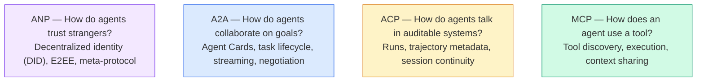

Họ không phải là đối thủ cạnh tranh. Họ giải quyết các vấn đề khác nhau ở các cấp độ khác nhau.

### MCP(回顾)

MCP trong giai đoạn 13 đã tiến hành một cuộc thảo luận sâu sắc.**客户端-服务器**协议,代理(客户端) tìm thấy并调用服务器公开的工具──

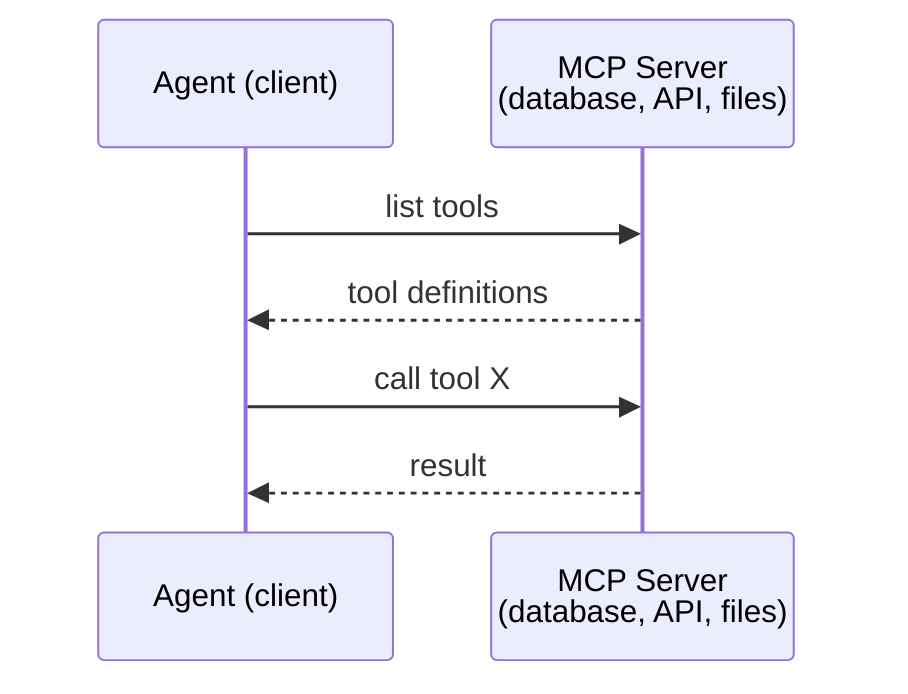

MCP là**代理到工具**通信── nó không giúp đỡ để các đại diện giao tiếp với nhau──

### A2A(Agent2Agent 协议)

**创建者：**Google hiện thuộc về Linux 基金会, tên gọi `lf.a2a.v1`(văn)
**规格版本：**1.0.0
**问题：**Làm thế nào để các đại diện tự do hợp tác, đàm phán và ủy nhiệm nhiệm vụ?

A2A là**点对点代理协作**MCP sẽ nối tiếp với công cụ, và A2A sẽ nối tiếp với các đại lý khác.**代理卡**, các đại diện khác sẽ tìm thấy nó ¦được thảo luận và chuyển sang nhiệm vụ ủy nhiệm của nó ¦

#### A2A 的运作方式

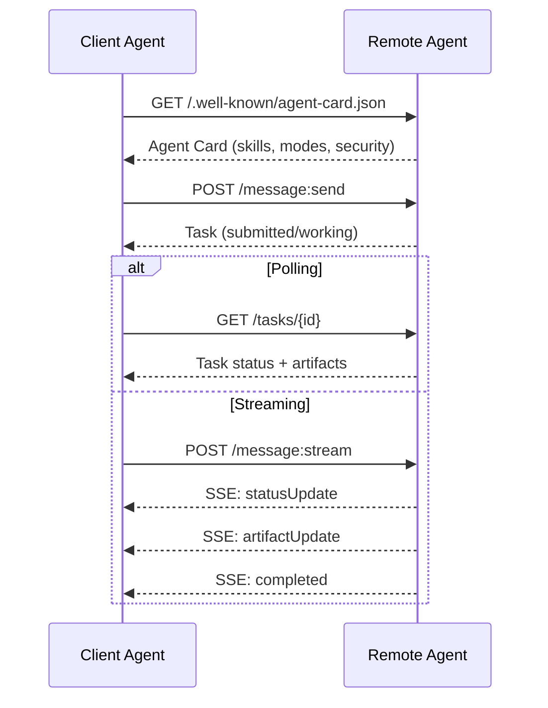

#### Trình công thực

Đó là cách thực tế của A2A.`GET /.well-known/agent-card.json`- Có thể là:

```json
{
  "name": "Research Agent",
  "description": "Searches documentation and summarizes findings",
  "version": "1.0.0",
  "supportedInterfaces": [
    {
      "url": "https://research-agent.example.com/a2a/v1",
      "protocolBinding": "JSONRPC",
      "protocolVersion": "1.0"
    },
    {
      "url": "https://research-agent.example.com/a2a/rest",
      "protocolBinding": "HTTP+JSON",
      "protocolVersion": "1.0"
    }
  ],
  "provider": {
    "organization": "Your Company",
    "url": "https://example.com"
  },
  "capabilities": {
    "streaming": true,
    "pushNotifications": false
  },
  "defaultInputModes": ["text/plain", "application/json"],
  "defaultOutputModes": ["text/plain", "application/json"],
  "skills": [
    {
      "id": "web-research",
      "name": "Web Research",
      "description": "Searches the web and synthesizes findings",
      "tags": ["research", "search", "summarization"],
      "examples": ["Research the latest changes in React 19"]
    },
    {
      "id": "doc-analysis",
      "name": "Documentation Analysis",
      "description": "Reads and analyzes technical documentation",
      "tags": ["docs", "analysis"],
      "inputModes": ["text/plain", "application/pdf"],
      "outputModes": ["application/json"]
    }
  ],
  "securitySchemes": {
    "bearer": {
      "httpAuthSecurityScheme": {
        "scheme": "Bearer",
        "bearerFormat": "JWT"
      }
    }
  },
  "security": [{ "bearer": [] }]
}
```

需要注意的关键事项:
- **技能**Đó là những gì người dùng có thể làm. Mỗi người đều có ID, thẻ và hỗ trợ nhập/luồng MIME loại. Đó là cách mà đại lý khách hàng quyết định liệu đại lý từ xa có thể xử lý yêu cầu của mình hay không.
- **supportedInterfaces**列出多协议绑定;;单个代理可以同时使用JSON-RPC、REST 和gRPC;;
- **安全**Trong thẻ. Khách hàng đã gửi một yêu cầu trước khi biết nó cần chứng minh nhân dạng.

####  nhiệm vụ đời

任务 là các đơn vị làm việc cốt lõi trong A2A.

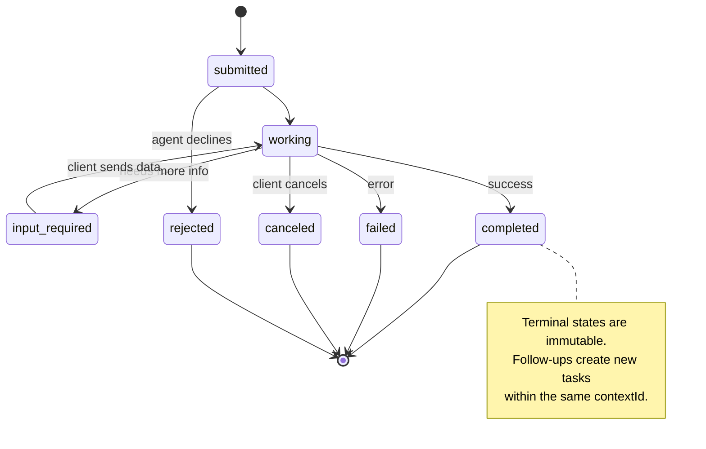

Tất cả 8 trạng thái`UNSPECIFIED`作为哨兵,这里省略):

|状态|终端？ |意义|
|---|---|---|
| `TASK_STATE_SUBMITTED` |没有 |已确认，尚未处理 |
| `TASK_STATE_WORKING` |没有 |正在积极处理中 |
| `TASK_STATE_INPUT_REQUIRED` |没有 |代理需要客户提供更多信息 |
| `TASK_STATE_AUTH_REQUIRED` |没有 |需要认证 |
| `TASK_STATE_COMPLETED` |是的 |顺利完成 |
| `TASK_STATE_FAILED` |是的 |已完成但有错误 |
| `TASK_STATE_CANCELED` |是的 |完成前取消 |
| `TASK_STATE_REJECTED` |是的 |特工拒绝了任务|

Một khi nhiệm vụ đạt đến trạng thái cuối cùng, nó là không thể thay đổi.`contextId`Trung tạo ra một nhiệm vụ mới.

#### Có hình thức

A2A sử dụng JSON-RPC 2.0.

**客户端发送任务：**
```json
{
  "jsonrpc": "2.0",
  "id": 1,
  "method": "SendMessage",
  "params": {
    "message": {
      "messageId": "msg-001",
      "role": "ROLE_USER",
      "parts": [{ "text": "Research React 19 compiler features" }]
    },
    "configuration": {
      "acceptedOutputModes": ["text/plain", "application/json"],
      "historyLength": 10
    }
  }
}
```

**代理响应任务：**
```json
{
  "jsonrpc": "2.0",
  "id": 1,
  "result": {
    "task": {
      "id": "task-abc-123",
      "contextId": "ctx-xyz-789",
      "status": {
        "state": "TASK_STATE_COMPLETED",
        "timestamp": "2026-03-27T10:30:00Z"
      },
      "artifacts": [
        {
          "artifactId": "art-001",
          "name": "research-results",
          "parts": [{
            "data": {
              "findings": [
                "React 19 compiler auto-memoizes components",
                "No more manual useMemo/useCallback needed",
                "Compiler runs at build time, not runtime"
              ]
            },
            "mediaType": "application/json"
          }]
        }
      ]
    }
  }
}
```

**通过 SSE 流式传输：**
```text
POST /message:stream HTTP/1.1
Content-Type: application/json
A2A-Version: 1.0

data: {"task":{"id":"task-123","status":{"state":"TASK_STATE_WORKING"}}}

data: {"statusUpdate":{"taskId":"task-123","status":{"state":"TASK_STATE_WORKING","message":{"role":"ROLE_AGENT","parts":[{"text":"Searching documentation..."}]}}}}

data: {"artifactUpdate":{"taskId":"task-123","artifact":{"artifactId":"art-1","parts":[{"text":"partial findings..."}]},"append":true,"lastChunk":false}}

data: {"statusUpdate":{"taskId":"task-123","status":{"state":"TASK_STATE_COMPLETED"}}}
```

### ACP (nước:

**创建者：**IBM / BeeAI
**规范版本：**0.2.0 (OpenAPI 3.1.1)
**状态：**合并到Linux 基金会下的 A2A
**问题：** đại diện làm thế nào để giao tiếp trong tình trạng hoàn toàn kiểm tra, liên tục trò chuyện và theo dõi đường?

ACP là**企业协议** Không giống như nhiều tuyên bố của ACP **不**Sử dụng JSON-LD. Nó là thông qua OpenAPI 定义 đơn giản REST / JSON API.**TrajectoryMetadata**Mỗi đại lý có thể mang theo để tạo ra nó.

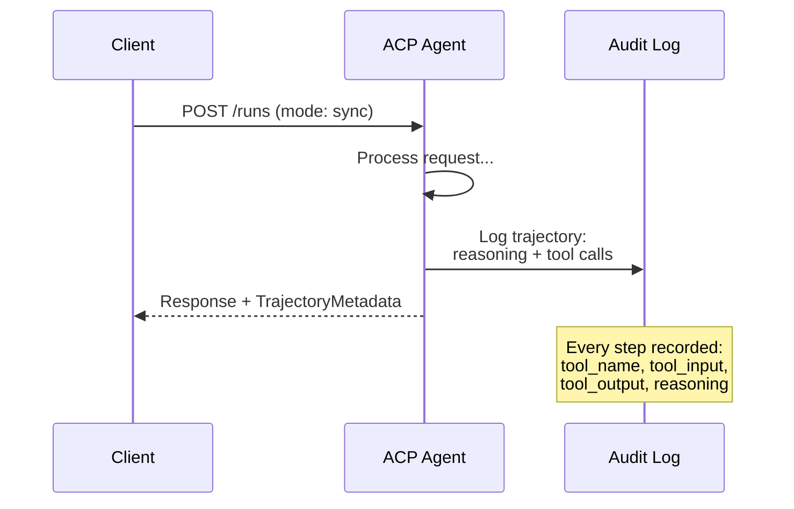

#### Nhận thấy các đại diện trong ACP

ACP đã xác định bốn phương pháp phát hiện:

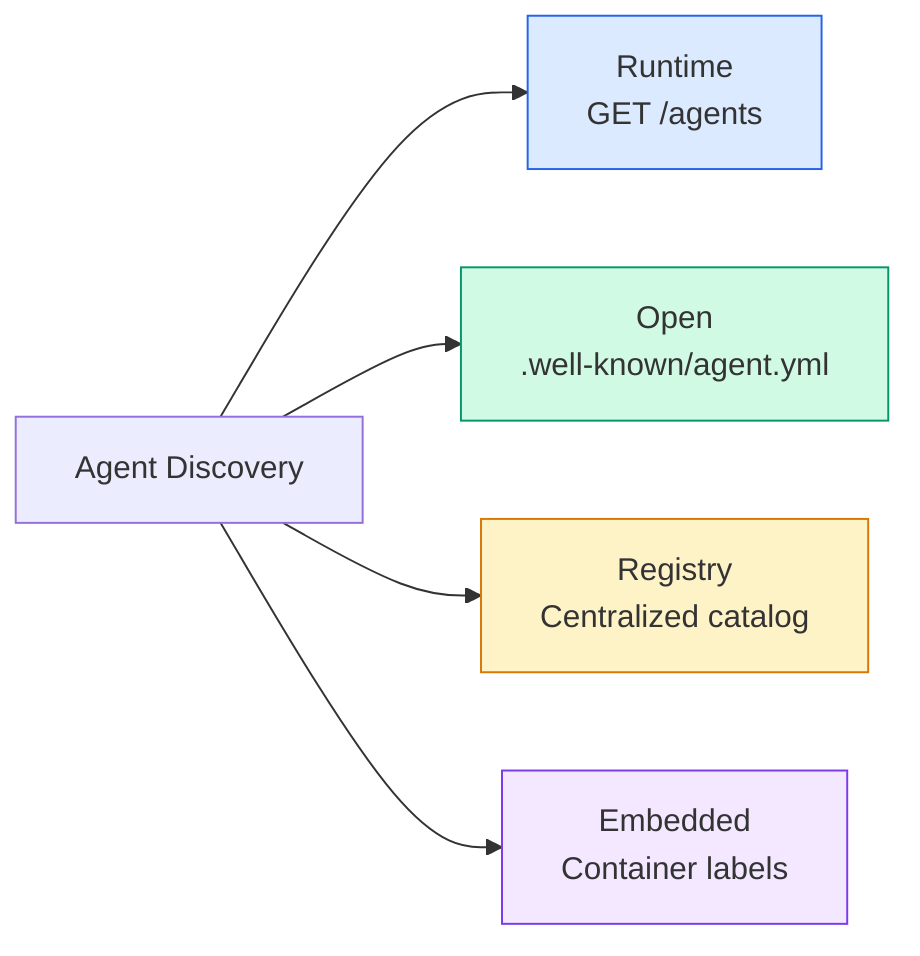

**AgentManifest**Hơn A2A's đại lý thẻ đơn giản hơn:

```json
{
  "name": "summarizer",
  "description": "Summarizes documents with source citations",
  "input_content_types": ["text/plain", "application/pdf"],
  "output_content_types": ["text/plain", "application/json"],
  "metadata": {
    "tags": ["summarization", "RAG"],
    "framework": "BeeAI",
    "capabilities": [
      {
        "name": "Document Summarization",
        "description": "Condenses long documents into key points"
      }
    ],
    "recommended_models": ["llama3.3:70b-instruct-fp16"],
    "license": "Apache-2.0",
    "programming_language": "Python"
  }
}
```

#### 运行 vòng đời

Sử dụng ACP运行 thay vì任务── Run là một bộ phận có 3 mô hình:

|模式|行为 |
|---|---|
| `sync` |阻塞。响应包含完整的结果。 |
| `async` |立即返回 202。轮询 `GET /runs/{id}` 的状态。 |
| `stream` | SSE 流。事件在代理工作时触发。 |

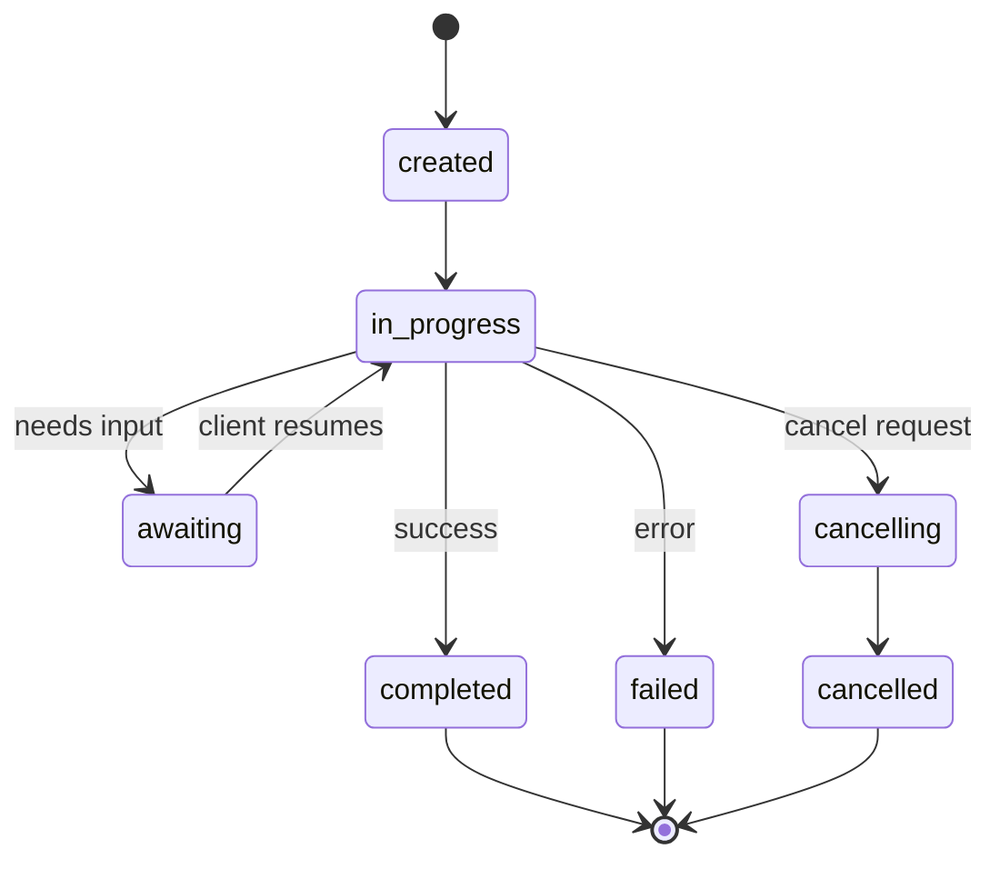

#### Trận chuyển (Phần số dữ liệu)

Đây là yếu tố khác biệt quan trọng của ACP. Mỗi phần tin tức có thể chứa dữ liệu chính xác cho thấy các hoạt động của đại lý:

```json
{
  "role": "agent/researcher",
  "parts": [
    {
      "content_type": "text/plain",
      "content": "The weather in San Francisco is 72F and sunny.",
      "metadata": {
        "kind": "trajectory",
        "message": "I need to check the weather for this location",
        "tool_name": "weather_api",
        "tool_input": { "location": "San Francisco, CA" },
        "tool_output": { "temperature": 72, "condition": "sunny" }
      }
    }
  ]
}
```

Đối với ngành công nghiệp được quản lý, đó là vàng. Mỗi câu trả lời đều mang một chuỗi suy luận có thể chứng minh được: đã sử dụng những công cụ nào, đã sử dụng những đầu vào nào, đã nhận những đầu ra nào.

ACP còn hỗ trợ**CitationMetadata**进行来源归因:

```json
{
  "kind": "citation",
  "start_index": 0,
  "end_index": 47,
  "url": "https://weather.gov/sf",
  "title": "NWS San Francisco Forecast"
}
```

### ANP(代理网络协议)

**创建者：**开源社区(常高伟创办)
**仓库：** [github.com/agent-network-protocol/AgentNetworkProtocol](https://github.com/agent-network-protocol/AgentNetworkProtocol)
**问题：**Không có quyền lực trung ương, làm thế nào các đại diện từ các tổ chức khác nhau có thể tin tưởng lẫn nhau?

ANP là**去中心化身份协议**Nó sử dụng W3C 去中心化标识符 (DID) và kết thúc đến kết thúc mật mã để xây dựng niềm tin.

ANP分为三层:

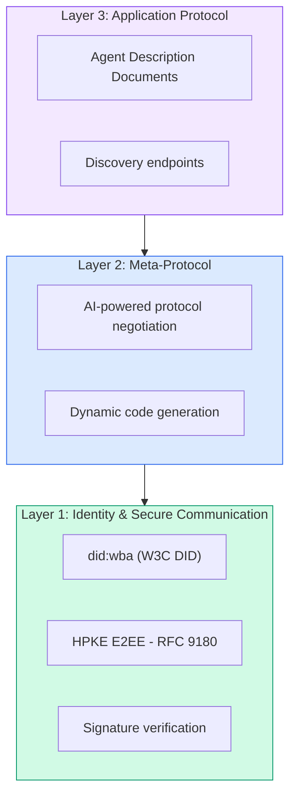

#### DID 文件(真实结构)

ANP 使用名为 `did:wba`(Based on Web of Agents) tự định nghĩa DID 方法── DID `did:wba:example.com:user:alice`解析为 `https://example.com/user/alice/did.json`- Có thể là:

```json
{
  "@context": [
    "https://www.w3.org/ns/did/v1",
    "https://w3id.org/security/suites/jws-2020/v1",
    "https://w3id.org/security/suites/secp256k1-2019/v1"
  ],
  "id": "did:wba:example.com:user:alice",
  "verificationMethod": [
    {
      "id": "did:wba:example.com:user:alice#key-1",
      "type": "EcdsaSecp256k1VerificationKey2019",
      "controller": "did:wba:example.com:user:alice",
      "publicKeyJwk": {
        "crv": "secp256k1",
        "x": "NtngWpJUr-rlNNbs0u-Aa8e16OwSJu6UiFf0Rdo1oJ4",
        "y": "qN1jKupJlFsPFc1UkWinqljv4YE0mq_Ickwnjgasvmo",
        "kty": "EC"
      }
    },
    {
      "id": "did:wba:example.com:user:alice#key-x25519-1",
      "type": "X25519KeyAgreementKey2019",
      "controller": "did:wba:example.com:user:alice",
      "publicKeyMultibase": "z9hFgmPVfmBZwRvFEyniQDBkz9LmV7gDEqytWyGZLmDXE"
    }
  ],
  "authentication": [
    "did:wba:example.com:user:alice#key-1"
  ],
  "keyAgreement": [
    "did:wba:example.com:user:alice#key-x25519-1"
  ],
  "humanAuthorization": [
    "did:wba:example.com:user:alice#key-1"
  ],
  "service": [
    {
      "id": "did:wba:example.com:user:alice#agent-description",
      "type": "AgentDescription",
      "serviceEndpoint": "https://example.com/agents/alice/ad.json"
    }
  ]
}
```

需要注意的关键事项:
- 强制执行**密钥分离** Đánh khóa ký hiệu (secp256k1) và Đánh khóa mật khẩu (X25519) là chia sẻ
- **`humanAuthorization`**Các công ty này cần phải xác định kỹ thuật nhân sự trước khi sử dụng.
- **`keyAgreement`**密钥 sử dụng cho HPKE 端到端加密 (RFC 9180)
- **服务**部分链接到代理描述文档──

#### 信任在 ANP 中如何运作

ANP **不**Sử dụng信任网或背书图.

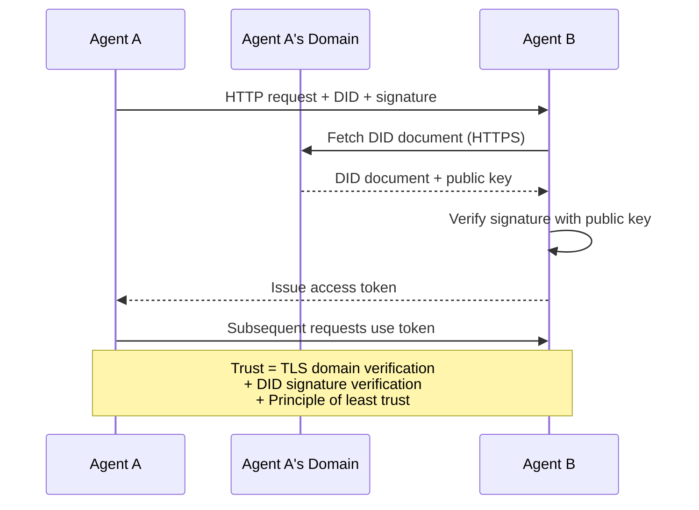

信任来自三个来源:
1. **域级 TLS**验证 DID 文档主机
2. **DID加密签名**验证代理身份
3. **最小信任原则**Chỉ cấp quyền hạn tối thiểu

Không dựa trên 8 của tín ngưỡng truyền tải hoặc PageRank 评分. Bạn có thể trực tiếp qua mỗi đại lý của DID để xác minh nó.

#### 元协议协商

Đây là chức năng mới nhất của ANP. Khi hai đại lý của hệ sinh thái khác nhau gặp nhau, họ không cần phải chuẩn bị trước về các định dạng dữ liệu.

```json
{
  "action": "protocolNegotiation",
  "sequenceId": 0,
  "candidateProtocols": "I can communicate using:\n1. JSON-RPC with hotel booking schema\n2. REST with OpenAPI 3.1 spec\n3. Natural language over HTTP",
  "modificationSummary": "Initial proposal",
  "status": "negotiating"
}
```

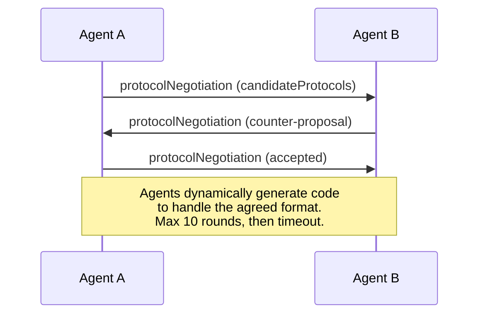

代理来回 (最多10轮) cho đến khi đạt được định dạng, sau đó động thái tạo mã để xử lý nó.`negotiating``rejected``accepted``timeout`

Điều này có nghĩa là hai đại lý chưa từng gặp nhau có thể tìm hiểu cách giao tiếp mà không cần ai định nghĩa trước một mô hình chia sẻ.

### 比较(已更正)

| | MCP| A2A |非加太 |心钠素 |
|---|---|---|---|---|
| **创建者** |人择 |谷歌/Linux基金会| IBM/BeeAI |社区 |
| **规格格式** | JSON-RPC | JSON-RPC / REST / gRPC | OpenAPI 3.1（休息）| JSON-RPC |
| **主要用途** |代理到工具 |代理对代理|代理对代理|代理对代理|
| **发现** |工具清单 | `/.well-known/agent-card.json` | `GET /agents`、`/.well-known/agent.yml` | `/.well-known/agent-descriptions`，DID服务端点|
| **身份** |隐式（本地）|安全方案（OAuth、mTLS）|服务器级| W3C DID (`did:wba`) 与 E2EE |
| **审计追踪** |不适用 |基本（任务历史记录）| TrajectoryMetadata（工具调用、推理） |未正式指定 |
| **状态机** |不适用 | 9 种任务状态 | 7 种运行状态 |不适用 |
| **流媒体** |不适用 |上交所 |上交所 |与传输无关 |
| **独特的功能** |工具模式|特工卡+技能|轨迹审计追踪|元协议协商|
| **最适合** |工具和数据|动态协作 |受监管行业 |跨组织信任 |
| **状态** |稳定|稳定（v1.0）|合并到A2A |积极发展|

### Họ làm việc như thế nào

Những hiệp định này không loại trừ lẫn nhau.

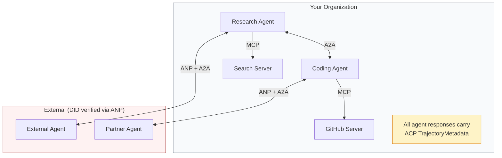

- **MCP**Mỗi đại lý sẽ kết nối với công cụ của mình
- **A2A**处理代理之间的协作(内部和外部)
- **ACP**Phản ứng bao bì trong dữ liệu của quỹ đạo để đạt được tính kiểm tra
- **ANP**Để bạn không thể kiểm soát đại lý cung cấp chứng nhận


```figure
swarm-message-bus
```

##  xây dựng nó

### 第1 步: loại thông tin trung tâm

Mỗi hệ thống đại lý đều bắt đầu theo hình thức tin nhắn. Chúng tôi xác định được mô tả cho các loại giao thức thực tế sử dụng:

```typescript
import crypto from "node:crypto";

type MessageRole = "user" | "agent";

type MessagePart =
  | { kind: "text"; text: string }
  | { kind: "data"; data: unknown; mediaType: string }
  | { kind: "file"; name: string; url: string; mediaType: string };

type TrajectoryEntry = {
  reasoning: string;
  toolName?: string;
  toolInput?: unknown;
  toolOutput?: unknown;
  timestamp: number;
};

type AgentMessage = {
  id: string;
  role: MessageRole;
  parts: MessagePart[];
  trajectory?: TrajectoryEntry[];
  replyTo?: string;
  timestamp: number;
};

function createMessage(
  role: MessageRole,
  parts: MessagePart[],
  replyTo?: string
): AgentMessage {
  return {
    id: crypto.randomUUID(),
    role,
    parts,
    replyTo,
    timestamp: Date.now(),
  };
}

function textMessage(role: MessageRole, text: string): AgentMessage {
  return createMessage(role, [{ kind: "text", text }]);
}
```

chú ý:`MessagePart`là nhiều mô hình (文本,结构化数据,文件), như A2A và ACP thực tế quy định.`TrajectoryEntry`捕获推理链,匹配 ACP's TrajectoryMetadata──

### Bước 2: A2A 代理卡和注册

构建符合真实A2A 规范的代理发现:

```typescript
type Skill = {
  id: string;
  name: string;
  description: string;
  tags: string[];
  inputModes: string[];
  outputModes: string[];
};

type AgentCard = {
  name: string;
  description: string;
  version: string;
  url: string;
  capabilities: {
    streaming: boolean;
    pushNotifications: boolean;
  };
  defaultInputModes: string[];
  defaultOutputModes: string[];
  skills: Skill[];
};

class AgentRegistry {
  private cards: Map<string, AgentCard> = new Map();

  register(card: AgentCard) {
    this.cards.set(card.name, card);
  }

  discoverBySkillTag(tag: string): AgentCard[] {
    return [...this.cards.values()].filter((card) =>
      card.skills.some((skill) => skill.tags.includes(tag))
    );
  }

  discoverByInputMode(mimeType: string): AgentCard[] {
    return [...this.cards.values()].filter(
      (card) =>
        card.defaultInputModes.includes(mimeType) ||
        card.skills.some((skill) => skill.inputModes.includes(mimeType))
    );
  }

  resolve(name: string): AgentCard | undefined {
    return this.cards.get(name);
  }

  listAll(): AgentCard[] {
    return [...this.cards.values()];
  }
}
```

Đây là một cách đơn giản hơn từ tên đến chức năng hiển thị rất phong phú. Bạn có thể thông qua các thẻ kỹ năng, nhập MIME loại hoặc tên để tìm thấy đại lý, giống như thực sự A2A quy định hỗ trợ.

### 步骤 3:A2A  nhiệm vụ chu kỳ sống

构建完整的任务状态机:

```typescript
type TaskState =
  | "submitted"
  | "working"
  | "input-required"
  | "auth-required"
  | "completed"
  | "failed"
  | "canceled"
  | "rejected";

const TERMINAL_STATES: TaskState[] = [
  "completed",
  "failed",
  "canceled",
  "rejected",
];

type TaskStatus = {
  state: TaskState;
  message?: AgentMessage;
  timestamp: number;
};

type Artifact = {
  id: string;
  name: string;
  parts: MessagePart[];
};

type Task = {
  id: string;
  contextId: string;
  status: TaskStatus;
  artifacts: Artifact[];
  history: AgentMessage[];
};

type TaskEvent =
  | { kind: "statusUpdate"; taskId: string; status: TaskStatus }
  | {
      kind: "artifactUpdate";
      taskId: string;
      artifact: Artifact;
      append: boolean;
      lastChunk: boolean;
    };

type TaskHandler = (
  task: Task,
  message: AgentMessage
) => AsyncGenerator<TaskEvent>;

class TaskManager {
  private tasks: Map<string, Task> = new Map();
  private handlers: Map<string, TaskHandler> = new Map();
  private listeners: Map<string, ((event: TaskEvent) => void)[]> = new Map();

  registerHandler(agentName: string, handler: TaskHandler) {
    this.handlers.set(agentName, handler);
  }

  subscribe(taskId: string, listener: (event: TaskEvent) => void) {
    const existing = this.listeners.get(taskId) ?? [];
    existing.push(listener);
    this.listeners.set(taskId, existing);
  }

  async sendMessage(
    agentName: string,
    message: AgentMessage,
    contextId?: string
  ): Promise<Task> {
    const handler = this.handlers.get(agentName);
    if (!handler) {
      const task = this.createTask(contextId);
      task.status = {
        state: "rejected",
        timestamp: Date.now(),
        message: textMessage("agent", `No handler for ${agentName}`),
      };
      return task;
    }

    const task = this.createTask(contextId);
    task.history.push(message);
    task.status = { state: "submitted", timestamp: Date.now() };

    this.processTask(task, handler, message).catch((err) => {
      task.status = {
        state: "failed",
        timestamp: Date.now(),
        message: textMessage("agent", String(err)),
      };
    });
    return task;
  }

  getTask(taskId: string): Task | undefined {
    return this.tasks.get(taskId);
  }

  cancelTask(taskId: string): boolean {
    const task = this.tasks.get(taskId);
    if (!task || TERMINAL_STATES.includes(task.status.state)) return false;
    task.status = { state: "canceled", timestamp: Date.now() };
    this.emit(taskId, {
      kind: "statusUpdate",
      taskId,
      status: task.status,
    });
    return true;
  }

  private createTask(contextId?: string): Task {
    const task: Task = {
      id: crypto.randomUUID(),
      contextId: contextId ?? crypto.randomUUID(),
      status: { state: "submitted", timestamp: Date.now() },
      artifacts: [],
      history: [],
    };
    this.tasks.set(task.id, task);
    return task;
  }

  private async processTask(
    task: Task,
    handler: TaskHandler,
    message: AgentMessage
  ) {
    task.status = { state: "working", timestamp: Date.now() };
    this.emit(task.id, {
      kind: "statusUpdate",
      taskId: task.id,
      status: task.status,
    });

    try {
      for await (const event of handler(task, message)) {
        if (TERMINAL_STATES.includes(task.status.state)) break;

        if (event.kind === "statusUpdate") {
          task.status = event.status;
        }
        if (event.kind === "artifactUpdate") {
          const existing = task.artifacts.find(
            (a) => a.id === event.artifact.id
          );
          if (existing && event.append) {
            existing.parts.push(...event.artifact.parts);
          } else {
            task.artifacts.push(event.artifact);
          }
        }
        this.emit(task.id, event);
      }
    } catch (err) {
      task.status = {
        state: "failed",
        timestamp: Date.now(),
        message: textMessage("agent", String(err)),
      };
      this.emit(task.id, {
        kind: "statusUpdate",
        taskId: task.id,
        status: task.status,
      });
    }
  }

  private emit(taskId: string, event: TaskEvent) {
    for (const listener of this.listeners.get(taskId) ?? []) {
      listener(event);
    }
  }
}
```

Điều này thực hiện thực sự A2A  nhiệm vụ chu kỳ cuộc sống: đã gửi  đang làm việc  cần nhập  cuối cùng của trạng thái  xử lý là một trình tạo khác, có thể tạo ra các sự kiện phù hợp với SSE 流 mô hình  trạng thái cập nhật và các khối công trình) 

### Bước 4:ACP 式审计跟踪

Thông qua đường mòn theo dõi thông tin:

```typescript
type AuditEntry = {
  runId: string;
  agentName: string;
  input: AgentMessage[];
  output: AgentMessage[];
  trajectory: TrajectoryEntry[];
  status: "created" | "in-progress" | "completed" | "failed" | "awaiting";
  startedAt: number;
  completedAt?: number;
  sessionId?: string;
};

class AuditableRunner {
  private log: AuditEntry[] = [];
  private handlers: Map<
    string,
    (input: AgentMessage[]) => Promise<{
      output: AgentMessage[];
      trajectory: TrajectoryEntry[];
    }>
  > = new Map();

  registerAgent(
    name: string,
    handler: (input: AgentMessage[]) => Promise<{
      output: AgentMessage[];
      trajectory: TrajectoryEntry[];
    }>
  ) {
    this.handlers.set(name, handler);
  }

  async run(
    agentName: string,
    input: AgentMessage[],
    sessionId?: string
  ): Promise<AuditEntry> {
    const entry: AuditEntry = {
      runId: crypto.randomUUID(),
      agentName,
      input: structuredClone(input),
      output: [],
      trajectory: [],
      status: "created",
      startedAt: Date.now(),
      sessionId,
    };
    this.log.push(entry);

    const handler = this.handlers.get(agentName);
    if (!handler) {
      entry.status = "failed";
      return entry;
    }

    entry.status = "in-progress";
    try {
      const result = await handler(input);
      entry.output = structuredClone(result.output);
      entry.trajectory = structuredClone(result.trajectory);
      entry.status = "completed";
      entry.completedAt = Date.now();
    } catch (err) {
      entry.status = "failed";
      entry.trajectory.push({
        reasoning: `Error: ${String(err)}`,
        timestamp: Date.now(),
      });
      entry.completedAt = Date.now();
    }
    return entry;
  }

  getFullAuditLog(): AuditEntry[] {
    return structuredClone(this.log);
  }

  getAuditLogForAgent(agentName: string): AuditEntry[] {
    return structuredClone(
      this.log.filter((e) => e.agentName === agentName)
    );
  }

  getAuditLogForSession(sessionId: string): AuditEntry[] {
    return structuredClone(
      this.log.filter((e) => e.sessionId === sessionId)
    );
  }

  getTrajectoryForRun(runId: string): TrajectoryEntry[] {
    const entry = this.log.find((e) => e.runId === runId);
    return entry ? structuredClone(entry.trajectory) : [];
  }
}
```

Mỗi lần thực hiện đại lý sẽ tạo ra một danh mục kiểm toán đầy đủ: nội dung vào, nội dung ra và các bước đưa ra trong giữa. Bạn có thể truy vấn theo đại lý, theo cuộc họp hoặc theo một cách riêng lẻ.

### 步骤 5: Báo chứng nhận nhân dạng ANP

 xây dựng dựa trên ID và chứng nhận:

```typescript
type VerificationMethod = {
  id: string;
  type: string;
  controller: string;
  publicKeyDer: string;
};

type DIDDocument = {
  id: string;
  verificationMethod: VerificationMethod[];
  authentication: string[];
  keyAgreement: string[];
  humanAuthorization: string[];
  service: { id: string; type: string; serviceEndpoint: string }[];
};

type AgentIdentity = {
  did: string;
  document: DIDDocument;
  privateKey: crypto.KeyObject;
  publicKey: crypto.KeyObject;
};

class IdentityRegistry {
  private documents: Map<string, DIDDocument> = new Map();

  publish(doc: DIDDocument) {
    this.documents.set(doc.id, doc);
  }

  resolve(did: string): DIDDocument | undefined {
    return this.documents.get(did);
  }

  verify(did: string, signature: string, payload: string): boolean {
    const doc = this.documents.get(did);
    if (!doc) return false;

    const authKeyIds = doc.authentication;
    const authKeys = doc.verificationMethod.filter((vm) =>
      authKeyIds.includes(vm.id)
    );

    for (const key of authKeys) {
      const publicKey = crypto.createPublicKey({
        key: Buffer.from(key.publicKeyDer, "base64"),
        format: "der",
        type: "spki",
      });
      const isValid = crypto.verify(
        null,
        Buffer.from(payload),
        publicKey,
        Buffer.from(signature, "hex")
      );
      if (isValid) return true;
    }
    return false;
  }

  requiresHumanAuth(did: string, operationKeyId: string): boolean {
    const doc = this.documents.get(did);
    if (!doc) return false;
    return doc.humanAuthorization.includes(operationKeyId);
  }
}

function createIdentity(domain: string, agentName: string): AgentIdentity {
  const did = `did:wba:${domain}:agent:${agentName}`;
  const { publicKey, privateKey } = crypto.generateKeyPairSync("ed25519");

  const publicKeyDer = publicKey
    .export({ format: "der", type: "spki" })
    .toString("base64");

  const keyId = `${did}#key-1`;
  const encKeyId = `${did}#key-x25519-1`;

  const document: DIDDocument = {
    id: did,
    verificationMethod: [
      {
        id: keyId,
        type: "Ed25519VerificationKey2020",
        controller: did,
        publicKeyDer,
      },
      {
        id: encKeyId,
        type: "X25519KeyAgreementKey2019",
        controller: did,
        publicKeyDer,
      },
    ],
    authentication: [keyId],
    keyAgreement: [encKeyId],
    humanAuthorization: [],
    service: [
      {
        id: `${did}#agent-description`,
        type: "AgentDescription",
        serviceEndpoint: `https://${domain}/agents/${agentName}/ad.json`,
      },
    ],
  };

  return { did, document, privateKey, publicKey };
}

function signPayload(identity: AgentIdentity, payload: string): string {
  return crypto
    .sign(null, Buffer.from(payload), identity.privateKey)
    .toString("hex");
}
```

Điều này phản ánh mô hình thực sự của ANP: đại lý có giấy chứng nhận cá nhân độc lập, bàn bạc khóa và tài liệu DID của khóa ủy quyền nhân tạo.`IdentityRegistry`Trong quá trình sản xuất, đây sẽ là HTTP được lấy từ các miền đại diện)

### 步骤 6:协议网关

Kết nối tất cả bốn giao thức với một hệ thống thống nhất:

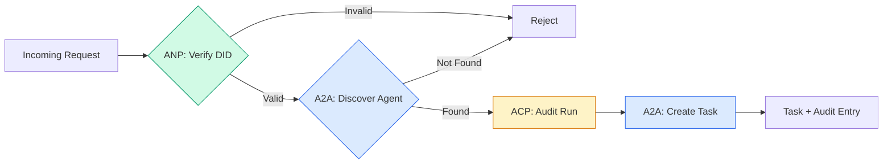

```typescript
class ProtocolGateway {
  private registry: AgentRegistry;
  private taskManager: TaskManager;
  private auditRunner: AuditableRunner;
  private identityRegistry: IdentityRegistry;

  constructor(
    registry: AgentRegistry,
    taskManager: TaskManager,
    auditRunner: AuditableRunner,
    identityRegistry: IdentityRegistry
  ) {
    this.registry = registry;
    this.taskManager = taskManager;
    this.auditRunner = auditRunner;
    this.identityRegistry = identityRegistry;
  }

  async delegateTask(
    fromDid: string,
    signature: string,
    targetAgent: string,
    message: AgentMessage,
    sessionId?: string
  ): Promise<{ task: Task; audit: AuditEntry } | { error: string }> {
    if (!this.identityRegistry.verify(fromDid, signature, message.id)) {
      return { error: "Identity verification failed" };
    }

    const card = this.registry.resolve(targetAgent);
    if (!card) {
      return { error: `Agent ${targetAgent} not found in registry` };
    }

    const audit = await this.auditRunner.run(
      targetAgent,
      [message],
      sessionId
    );
    const task = await this.taskManager.sendMessage(targetAgent, message);

    return { task, audit };
  }

  discoverAndDelegate(
    fromDid: string,
    signature: string,
    skillTag: string,
    message: AgentMessage
  ): Promise<{ task: Task; audit: AuditEntry } | { error: string }> {
    const candidates = this.registry.discoverBySkillTag(skillTag);
    if (candidates.length === 0) {
      return Promise.resolve({
        error: `No agents found with skill tag: ${skillTag}`,
      });
    }
    return this.delegateTask(
      fromDid,
      signature,
      candidates[0].name,
      message
    );
  }
}
```

网关在一次调用中完成四件事:
1. **ANP**Thông qua DID签名验证呼叫者身份
2. **A2A**: phát hiện mục tiêu đại lý并 kiểm tra khả năng
3. **ACP**: sẽ thực hiện bao bì trong theo dõi kiểm toán của có quỹ đạo
4. **A2A**: tạo nhiệm vụ theo dõi toàn bộ vòng đời

### Bước 7: Kết nối chúng với nhau

```typescript
async function protocolDemo() {
  const registry = new AgentRegistry();
  registry.register({
    name: "researcher",
    description: "Searches and summarizes findings",
    version: "1.0.0",
    url: "https://researcher.local/a2a/v1",
    capabilities: { streaming: true, pushNotifications: false },
    defaultInputModes: ["text/plain"],
    defaultOutputModes: ["text/plain", "application/json"],
    skills: [
      {
        id: "web-research",
        name: "Web Research",
        description: "Searches the web",
        tags: ["research", "search", "summarization"],
        inputModes: ["text/plain"],
        outputModes: ["application/json"],
      },
    ],
  });
  registry.register({
    name: "coder",
    description: "Writes code from specs",
    version: "1.0.0",
    url: "https://coder.local/a2a/v1",
    capabilities: { streaming: false, pushNotifications: false },
    defaultInputModes: ["text/plain", "application/json"],
    defaultOutputModes: ["text/plain"],
    skills: [
      {
        id: "code-gen",
        name: "Code Generation",
        description: "Generates code",
        tags: ["coding", "generation"],
        inputModes: ["text/plain", "application/json"],
        outputModes: ["text/plain"],
      },
    ],
  });

  const taskManager = new TaskManager();
  const auditRunner = new AuditableRunner();

  const researchTrajectory: TrajectoryEntry[] = [];

  taskManager.registerHandler(
    "researcher",
    async function* (task, message) {
      yield {
        kind: "statusUpdate" as const,
        taskId: task.id,
        status: { state: "working" as const, timestamp: Date.now() },
      };

      researchTrajectory.push({
        reasoning: "Searching for React 19 documentation",
        toolName: "web_search",
        toolInput: { query: "React 19 compiler features" },
        toolOutput: {
          results: ["react.dev/blog/react-19", "github.com/react/react"],
        },
        timestamp: Date.now(),
      });

      researchTrajectory.push({
        reasoning: "Extracting key findings from search results",
        toolName: "doc_analysis",
        toolInput: { url: "react.dev/blog/react-19" },
        toolOutput: {
          summary:
            "React 19 compiler auto-memoizes, no manual useMemo needed",
        },
        timestamp: Date.now(),
      });

      yield {
        kind: "artifactUpdate" as const,
        taskId: task.id,
        artifact: {
          id: crypto.randomUUID(),
          name: "research-results",
          parts: [
            {
              kind: "data" as const,
              data: {
                findings: [
                  "React 19 compiler auto-memoizes components",
                  "No more manual useMemo/useCallback needed",
                  "Compiler runs at build time, not runtime",
                ],
                sources: ["react.dev/blog/react-19"],
              },
              mediaType: "application/json",
            },
          ],
        },
        append: false,
        lastChunk: true,
      };

      yield {
        kind: "statusUpdate" as const,
        taskId: task.id,
        status: { state: "completed" as const, timestamp: Date.now() },
      };
    }
  );

  auditRunner.registerAgent("researcher", async () => ({
    output: [
      textMessage("agent", "React 19 compiler auto-memoizes components"),
    ],
    trajectory: researchTrajectory,
  }));

  const identityRegistry = new IdentityRegistry();

  const coderIdentity = createIdentity("coder.local", "coder");
  const researcherIdentity = createIdentity("researcher.local", "researcher");

  identityRegistry.publish(coderIdentity.document);
  identityRegistry.publish(researcherIdentity.document);

  const gateway = new ProtocolGateway(
    registry,
    taskManager,
    auditRunner,
    identityRegistry
  );

  console.log("=== Protocol Demo ===\n");

  console.log("1. Agent Discovery (A2A)");
  const researchAgents = registry.discoverBySkillTag("research");
  console.log(
    `   Found ${researchAgents.length} agent(s):`,
    researchAgents.map((a) => a.name)
  );

  console.log("\n2. Identity Verification (ANP)");
  const message = textMessage("user", "Research React 19 compiler features");
  const signature = signPayload(coderIdentity, message.id);
  const verified = identityRegistry.verify(
    coderIdentity.did,
    signature,
    message.id
  );
  console.log(`   Coder DID: ${coderIdentity.did}`);
  console.log(`   Signature verified: ${verified}`);

  console.log("\n3. Task Delegation (A2A + ACP + ANP)");
  const result = await gateway.delegateTask(
    coderIdentity.did,
    signature,
    "researcher",
    message,
    "session-001"
  );

  if ("error" in result) {
    console.log(`   Error: ${result.error}`);
    return;
  }

  console.log(`   Task ID: ${result.task.id}`);
  console.log(`   Task state: ${result.task.status.state}`);
  console.log(`   Artifacts: ${result.task.artifacts.length}`);

  console.log("\n4. Audit Trail (ACP)");
  console.log(`   Run ID: ${result.audit.runId}`);
  console.log(`   Status: ${result.audit.status}`);
  console.log(`   Trajectory steps: ${result.audit.trajectory.length}`);
  for (const step of result.audit.trajectory) {
    console.log(`     - ${step.reasoning}`);
    if (step.toolName) {
      console.log(`       Tool: ${step.toolName}`);
    }
  }

  console.log("\n5. Full Audit Log");
  const fullLog = auditRunner.getFullAuditLog();
  console.log(`   Total runs: ${fullLog.length}`);
  for (const entry of fullLog) {
    const duration = entry.completedAt
      ? `${entry.completedAt - entry.startedAt}ms`
      : "in-progress";
    console.log(`   ${entry.agentName}: ${entry.status} (${duration})`);
  }
}

protocolDemo().catch((err) => {
  console.error("Protocol demo failed:", err);
  process.exitCode = 1;
});
```

## Có vấn đề gì?

协议 giải quyết đường快乐之路. Sau đây là những gián đoạn trong sản xuất:

**架构漂移。**代理 A 发布代理卡广告 `application/json`输出── nhưng cấu trúc JSON sẽ thay đổi giữa các phiên bản──代理 B 解析旧格式并得到垃圾──修复:`version`

**状态机违规。**代理处理程序生成 `completed`事件, rồi cố gắng tạo thêm các công cụ. nhiệm vụ là không thay đổi.`TaskManager`Trong trạng thái cuối cùng sử dụng `break`强制执行此操作――

**信任解析失败。**代理 A 尝试验证代理 B 的 DID, nhưng miền của代理 B đã đóng cửa. Không thể lấy được DID 文档.

**轨迹膨胀。**ACP 轨迹记录功能强大,但价格昂贵. Mỗi lần vận hành 200 lần, các công cụ được sử dụng trong quá trình kiểm tra sẽ tạo ra rất nhiều quy trình kiểm tra.

**发现惊群。**50 đại lý tại thời điểm khởi động cùng lúc hỏi`GET /agents` sửa đổi: sử dụng TTL 缓存代理卡、错开发现间隔或 sử dụng dựa trên đăng ký gửi chứ không phải là hỏi.

## Sử dụng nó

### Thực hiện thực tế

**A2A**Đó là những thứ trưởng thành nhất của Google.[官方spec](https://github.com/google/A2A)Đây là nguồn mở của Linux Foundation. Được sử dụng cho Python và SDK của TypeScript. Nếu đại lý của bạn cần động phát hiện và hợp tác, xin hãy bắt đầu từ đây.

**ACP**đang hợp tác với A2A. IBM của[BeeAI 项目](https://github.com/i-am-bee/acp)Ưu tiên thay thế REST là ACP, nhưng khái niệm quỹ đạo dữ liệu đang được hấp thụ vào hệ sinh thái A2A.

**ANP**Đó là những gì thực nghiệm nhất.[社区 repo](https://github.com/agent-network-protocol/AgentNetworkProtocol)Có một Python SDK (AgentConnect) ⋅元协议协商概念确实很新──值得关注的跨组织代理部署──

**MCP**已在第13 阶段涵盖──如果您希望代理使用工具,MCP là tiêu chuẩn──

### 选择正确的协议

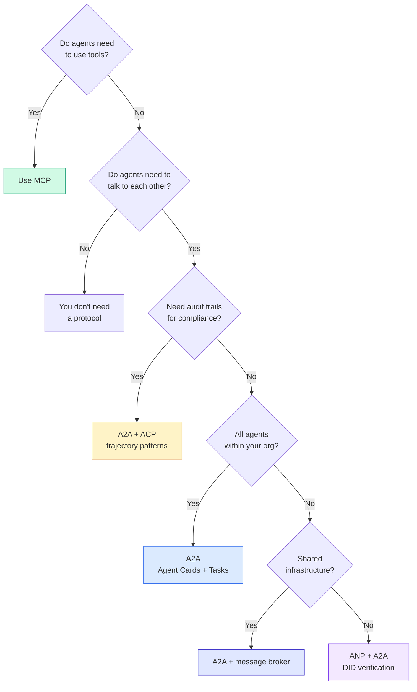

## 发货

本课产生:
- `code/main.ts`-- thực hiện đầy đủ tất cả bốn mô hình thỏa thuận
- `outputs/prompt-protocol-selector.md` giúp bạn cho hệ thống chọn giao thức

## 练习

1. **多跳任务委托。**扩展 `TaskManager`, để các trình xử lý đại lý có thể giao nhiệm vụ cho các đại lý khác. Các nhà nghiên cứu nhận được một nhiệm vụ, sẽ giao nhiệm vụ tìm kiếm cho hai đại lý chuyên gia, chờ đợi hai việc hoàn thành, sau đó kết quả sẽ được kết hợp với công trình của mình.

2. **流式审计跟踪。**修改`AuditableRunner`以支持流式模式──不必等待完整结果,而是在添加轨迹条目时实时更新产量 `AuditEntry`❖ sử dụng tạo 审核快照的异步生成器──

3. **DID 轮换。**将密钥轮换添加到 `IdentityRegistry` Trưởng lý nên có thể phát hành tài liệu mới DID có mật khẩu mới, đồng thời bảo trì`previousDid`引用──验证 viên nên trong thời gian hạn rộng chấp nhận ký hiệu của chìa khóa hiện tại và chìa khóa trước đây──

4. **协议协商。**实施ANP的元协议概念── hai đại diện được trao đổi theo hình thức ứng cử viên `protocolNegotiation`Ví dụ,我可以讲 JSON-RPC与我更喜欢 REST) .`TaskManager`Hoặc`AuditableRunner`

5. **速率限制发现。**添加 `RateLimitedRegistry`包装器, 包装器 sử dụng TTL 缓存代理卡查找,并限制每个代理每秒的发现查询――模拟100代理在启动时发现彼此的惊群并测量差异――

## 关键术语

|术语 |人们怎么说|它实际上意味着什么 |
|------|----------------|----------------------|
| MCP| “人工智能工具协议”|供代理发现和使用工具的客户端-服务器协议。代理到工具，而不是代理到代理。 |
| A2A | 《Google 的代理协议》| Linux 基金会下用于代理协作的点对点协议。通过代理卡进行发现，9 状态任务生命周期，通过 SSE 进行流式传输。支持 JSON-RPC、REST 和 gRPC 绑定。 |
|非加太 | 《企业代理消息传递》 | IBM/BeeAI 的代理 REST API 与 TrajectoryMetadata 一起运行：每个响应都携带完整的推理和工具调用链。合并到A2A。 |
|心钠素 | “去中心化代理身份”|使用 `did:wba` (DID) 进行加密身份的社区协议、用于 E2EE 的 HPKE 以及用于从未见过对方的代理的人工智能元协议协商。 |
|代理卡| 《代理人的名片》| `/.well-known/agent-card.json` 上的 JSON 文档描述了技能、支持的 MIME 类型、安全方案和协议绑定。 |
|确实 | “去中心化ID” |用于在代理自己的域上托管的可加密验证身份的 W3C 标准。 ANP使用`did:wba`方法。 |
|轨迹元数据 | “审计收据”| ACP 的机制，用于将推理步骤、工具调用及其输入/输出附加到每个代理响应。 |
|元协议| “代理人谈判如何交谈”| ANP 的方法是，代理使用自然语言动态地就数据格式达成一致，然后生成代码来处理它们。 |
|任务| “一个工作单元” | A2A 的状态对象跟踪工作从提交到完成。一旦终端就不可变。 |

## 进一步阅读

- [Google A2A 规范](https://github.com/google/A2A)-- 官方规范和 SDK(v1.0.0,Linux 基金会)
- [IBM/BeeAI ACP 规范](https://github.com/i-am-bee/acp)-- Sử dụng để đại lý vận hành và quỹ đạo dữ liệu OpenAPI 3.1  quy định
- [代理网络协议](https://github.com/agent-network-protocol/AgentNetworkProtocol)-- dựa trên danh tính của DID, E2EE,
- [模型上下文协议 docs](https://modelcontextprotocol.io/)-- MCP của nhân văn 规范(第 13 阶段涵盖)
- [W3C 去中心化标识符](https://www.w3.org/TR/did-core/)支 ANP's身份标准
- [RFC 9180 (HPKE)](https://www.rfc-editor.org/rfc/rfc9180)-- ANP sử dụng các giải pháp mã hóa E2EE
- [FIPA代理通信语言](http://www.fipa.org/specs/fipa00061/SC00061G.html)现代代理协议的学术先驱
