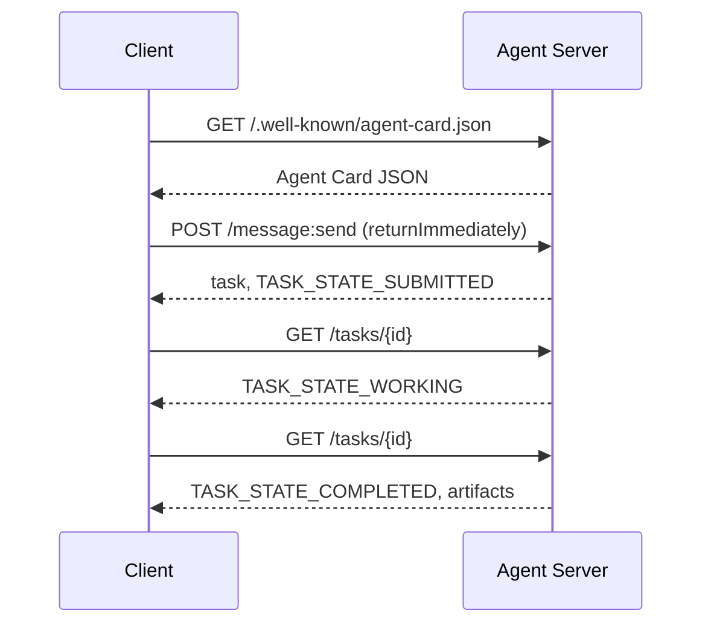

# A2A  智能体间通信协议(Nói thức giữa đại lý và đại lý)

> Google đã phát hành A2A vào tháng 4 năm 2025; đến tháng 4 năm 2026, quy định chính thức đã được phát triển đến 1.0.1, và nhận được sự hỗ trợ của 150+ cơ quan bao gồm AWS, Microsoft, Salesforce và các khác. A2A là giao thức tiếp nối chiều dài của MCP:MCP tập trung về phía phía phía phía phía phía phía phía phía phía phía phía phía phía phía phía phía phía phía phía phía phía phía phía phía phía phía phía phía phía phía phía phía phía phía phía phía phía phía phía phía phía phía phía phía phía phía phía phía phía phía phía phía phía phía phía phía phía phía phía phía phía phía phía phía phía phía phía phía phía phía phía phía phía phía phía phía phía phía phía phía phía phía phía phía phía phía phía phía phía phía phía phía phía phía phía phía phía phía phía phía phía phía phía phía phía phía phía phía phía phía phía phía phía phía phía phía phía phía phía phía phía phía phía phía phía phía phía phía phía phía phía phía phía phía phía phía phía phía phía phía phía phía phía phía phía phía phía phía phía phía phía phía phía phía phía phía phía phía phía phía phía phía phía phía phía phía phía phía phía phía phía phía phía phía phía phía phía phía phía phía phía phía phía phía phía phía phía bên phía phía phía phía phía phía phía phía phía phía phía phía phía phía phía phía phía phía phía bên của phía phía bên.

**Type:** Learn + Build
**Languages:** Python (stdlib, `http.server`, `json`)
**Prerequisites:** Phase 16 · 04（原语模型）
**Time:** ~75 分钟

## 问题背景

Khi đại lý của bạn cần được điều khiển để được triển khai trong một hệ thống khác hoặc tổ chức khác, đại lý nên giao tiếp như thế nào? Bạn chắc chắn có thể phát hiện ra một điểm cuối HTTP chuyên dụng, xác định Schema JSON tùy chỉnh, và hy vọng đối tác có thể điều khiển theo quy tắc của bạn.

A2A cho phép việc điều chỉnh các hệ thống này cung cấp các giao thức tuyến đường phổ biến (Wire Protocol)  Nó xác định các dịch vụ tiêu chuẩn được phát hiện, các phép rút ngắn tiêu chuẩn, các giao dịch tiêu chuẩn được kết nối và các sản phẩm xuất tiêu chuẩn, chẳng hạn như HTTP + REST được thiết kế cho các cơ sở hạ tầng của các cơ thể thông minh.

## 核心概念

### 4 yếu tố chính

**Agent Card（智能体名片）。**                                                                                                                                                                                                                                                              `/.well-known/agent-card.json`của JSON 文档, dùng để mô tả toàn diện Agent:名称、Skills、`supportedInterfaces`(端点 URL、协议绑定、协议版本) 、默认输入和输出媒体类型, cũng như yêu cầu quyền nhận dạng(`securitySchemes`Với`securityRequirements`(■)                                                                                                                                                                                                                                                              

```http
GET /.well-known/agent-card.json HTTP/1.1
Host: agent.example.com
```

```json
{
  "name": "code-review-agent",
  "description": "审查 Python 与 TypeScript 代码。",
  "version": "1.0.0",
  "supportedInterfaces": [
    {
      "url": "https://agent.example.com",
      "protocolBinding": "HTTP+JSON",
      "protocolVersion": "1.0"
    }
  ],
  "capabilities": {"streaming": false, "pushNotifications": false},
  "securitySchemes": {
    "bearer": {"httpAuthSecurityScheme": {"scheme": "Bearer"}}
  },
  "securityRequirements": [{"schemes": {"bearer": {"list": []}}}],
  "defaultInputModes": ["text/plain", "application/json"],
  "defaultOutputModes": ["application/json"],
  "skills": [
    {
      "id": "review-python",
      "name": "审查 Python 代码",
      "description": "审查传入的 Python 源码并给出改进建议。",
      "tags": ["code-review", "python"]
    },
    {
      "id": "review-typescript",
      "name": "审查 TypeScript 代码",
      "description": "审查传入的 TypeScript 源码并给出类型与逻辑改进建议。",
      "tags": ["code-review", "typescript"]
    }
  ]
}
```

**Task（任务）。**基本工作委托单元── một đối tượng có trạng thái khác nhau trong chu kỳ đời sống:`TASK_STATE_SUBMITTED`→ `TASK_STATE_WORKING`→ `TASK_STATE_COMPLETED`- `TASK_STATE_FAILED`- `TASK_STATE_CANCELED` Khách hàng 发送消息, Server 创建任务, sau đó Khách hàng 通过轮询或流式订阅获取更新──

**Artifact（产物）。**Nhiệm vụ 执行完毕产出的结构化结果──支持文本、结构化 JSON、图像、视频、音频等多模态媒体──Artifacts are strictly categorized: mỗi phần 携带`text``raw``url`Hoặc`data`之一并可指明其 `mediaType`

**不透明生命周期（Opaque Lifecycle）。**A2A 绝不规定远程代理 *内部*如何完成任务──客户 仅观察状态转换与最终产品;被调用方完全自由选择任何底层模型和框架──

### MCP và A2A

- **MCP**:Agent  Tool。Agent 借助 JSON-RPC 读写工具 Server,核心完全无状态。
- **A2A**:Agent  Agent。 đối với các hiệp định hợp tác, cả hai bên giao tiếp đều có khả năng suy luận độc lập.

Trong hệ thống sản xuất đa năng, hai người có cùng vận chuyển: A2A đối với các thiết bị MCP được sử dụng tại chỗ bên cạnh bản thân.

### 发现与调用时序



Các đường dẫn trên theo HTTP + JSON  ràng buộc quy tắc, và mỗi yêu cầu đều mang theo `A2A-Version: 1.0`Xin lỗi, trong trường hợp chấp nhận`SendMessage`会阻塞 đến khi nhiệm vụ kết thúc, do đó, các quy trình truy vấn của khách hàng  thiết lập `configuration.returnImmediately`Để ngay lập tức có được mục tiêu.

Đối với dòng truyền tải:`POST /message:stream`返回 Server-Send Events(首先输出 `task`, sau đó陆续推送`statusUpdate`Với`artifactUpdate`事件), và `/tasks/{id}:subscribe`则用于重新附加到运行中的任务――流在任务进入终态时正常关闭,报文中不包含单独的 `final`标志──

### 身份认证与安全 (tên nhận và an ninh)

A2A 原生支持三种主流安全模式:

- **Bearer Token**:OAuth2 或不透明 Token(`httpAuthSecurityScheme`Hoặc`oauth2SecurityScheme`(■)
- **mTLS**:双向 TLS 认证, tổ chức间强证明身份(`mtlsSecurityScheme`(■)
- **API Key**:位于请求头、URL 查询参数或 Cookie中的密钥(`apiKeySecurityScheme`(■)

认证规则在代理卡 中公布:`securitySchemes`命名方案,`securityRequirements`规定调用方必须满足的要求――

```figure
sw-agent-card-discovery
```

## 动手实践

`code/main.py` dựa trên A2A 1.0 HTTP+JSON 绑定协议, sử dụng Python 标准库 `http.server`Với`json`实现极简的 A2A Server与 Client.

- 暴露 `/.well-known/agent-card.json`-
-  chấp nhận `POST /message:send`调用;
- 管理 nhiệm vụ  trạng thái机转换;
- Trong `GET /tasks/{id}`上返品 

Khách hàng 功能包括:

- 拉取并解析 Thẻ đại lý;
- 发送带有 `returnImmediately`                                                                                                                                                                                                                                                              
- 持续轮询直至任务完成;
- 读取并验证 cuối cùng Artifact。

运行命令:

```bash
python3 code/main.py
```

脚本 sẽ khởi động Server trong các tuyến sau, sau đó do Khách hàng khởi động cho nó việc điều chỉnh toàn bộ quy trình, trực tiếp hiển thị phát hiện, gửi, hỏi và nhận sản phẩm toàn bộ quy trình.

## 交付物

本课交付 `outputs/skill-a2a-integrator.md` Để sử dụng trong việc lập kế hoạch thiết kế A2A tích hợp: Nội dung thẻ đại lý  Nhiệm vụ  Hợp đồng kiểm tra  Kiểu lựa chọn quyền và quy trình và chiến lược hỏi hàng.

## 核心专业术语

| 术语 | 规范定义 |
|------|---------|
| A2A | 跨系统异构智能体间互相调用的对等开放协议 |
| Agent Card | 暴露于 `/.well-known/agent-card.json` 的元数据卡片，声明技能、端点与鉴权要求 |
| Task | 具备明确生命周期、完成时生成产物的异步工作单元 |
| Artifact | 任务产出的具名、带类型结果（文本、结构化 JSON、音视频媒体等） |
| 不透明生命周期 (Opaque lifecycle) | 内部解决过程对调用方隐藏，仅对外暴露状态流转与产物 |
| 服务发现 (Discovery) | 通过发起 `GET /.well-known/agent-card.json` 获取名片并了解支持能力 |
| MCP 对比 A2A | MCP 属于垂直的 Agent 与工具交互，A2A 属于水平的 Agent 间对等协作 |

## 延伸阅读

- [A2A 规范主站](https://a2a-protocol.org/latest/specification/) 官方权威规范
- [A2A v1.0.1 源码发布](https://github.com/a2aproject/A2A/tree/v1.0.1) Quy tắc và quy định định của khóa học này
- [Google Developers Blog — A2A 发布说明](https://developers.googleblog.com/en/a2a-a-new-era-of-agent-interoperability/) 官方设计背景
