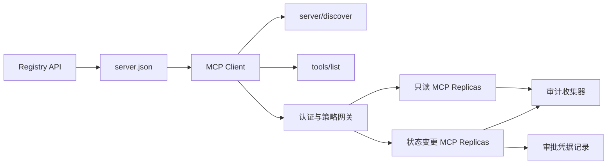

# 综合实战项目 13:带 Registry và quản lý không trạng thái MCP Server

> MCP cấp sản xuất không phải là một quá trình máy chủ đơn giản đơn giản. Nó là một bộ hợp đồng chuỗi: có thể phát hành dữ liệu sẵn, phát hiện dịch vụ thực tế, không có yêu cầu trạng thái.

**Type:** Capstone
**Languages:** Python 与 TypeScript 参考模型；支持任何生产级编程语言
**Prerequisites:** Phase 11, Phase 13, Phase 14, Phase 17 与 Phase 18
**必修 MCP 进阶课：** [Lesson 28: Tool Contracts](../../../13-tools-and-protocols/28-mcp-tool-contracts-and-content/docs/en.md)- [Lesson 29: 可靠性与流控](../../../13-tools-and-protocols/29-mcp-reliability-cancellation-and-flow-control/docs/en.md)- [Lesson 30: Registry 供应链](../../../13-tools-and-protocols/30-mcp-registry-supply-chain-and-drift/docs/en.md), 及 [Lesson 31: 一致性工程](../../../13-tools-and-protocols/31-mcp-conformance-versioning-and-operations/docs/en.md)
**目标协议规范：**MCP `2026-07-28`
**Time:** ~25 小时

## Học mục tiêu

- 实现合规的无状态 MCP 请求与结果 封面
- Để tìm thấy sự phân biệt nghiêm ngặt giữa Registry 静态元数据 và thực tế giao ước trong thời gian vận hành.
- 构建具备确定性排序与缓存感知工具发现体系──
- Đối với mỗi công cụ 调用强制执行签发者 (Mối quan trọng) 收藏人 (những người được xem) 作用域 (kháp diện) 及审批策略 (kháp diện) 及审批策略)
- 部署无 Session 亲和性绑定的流动 HTTP 集群──
- Trong các mạng lưới, cấp phép, chiến lược, đăng ký và kiểm toán biên giới cung cấp bằng chứng kỹ thuật đầy đủ.

## 必須修 MCP 前置路径

Trong khi dự án này được xem như đã sẵn sàng sản xuất, phải theo sau hoàn thành các chương trình bốn giai đoạn của giai đoạn 13 liên quan:

1. [Lesson 28](../../../13-tools-and-protocols/28-mcp-tool-contracts-and-content/docs/en.md): định nghĩa này Server  phải được lộ ra Công cụ Ưu điểm  cấu trúc nội dung  phân trang  tự động hoàn toàn  đường dẫn  lỗi phân loại 契约。
2. [Lesson 29](../../../13-tools-and-protocols/29-mcp-reliability-cancellation-and-flow-control/docs/en.md): định nghĩa取消竞态、截止期限、等性、背压、重试与断线重连行为──
3. [Lesson 30](../../../13-tools-and-protocols/30-mcp-registry-supply-chain-and-drift/docs/en.md): definição nomeacion espacial归属、来源追踪、准入锁定、Registry 状态、漂移检测、账本记录与回滚凭证──
4. [Lesson 31](../../../13-tools-and-protocols/31-mcp-conformance-versioning-and-operations/docs/en.md)Định nghĩa: định nghĩa tiêu chuẩn vàng và ngược chiều chuyển tiếp trường hợp sử dụng, phiên bản nghiêm ngặt thời đại, SDK  hành vi khác biệt, kiểm tra, chứng chỉ mạng đại diện, dữ liệu nhạy cảm, kiểm soát sức khỏe và ngăn chặn phát hành.

Dự án này chịu trách nhiệm tập hợp chặt chẽ các yếu tố cấp sản xuất này, không thể được xây dựng bằng một thử nghiệm SDK đơn giản.

## 问题背景

企业内部平台需要一套只读数据工具和少量具有状态变更能力的写操作工具――开发人员必须能够发现该服务器,了解如何连接,检查其实时运行能力,并且只能调用其被明确授权访问的操作――

Trọng tâm thực sự không phải là viết một hàm Python, mà là làm thế nào để giữ được độ phù hợp của 6 nguồn thực tại sau đây:

1. `server.json`声明 Server ở đâu cài đặt hoặc qua bất kỳ kết nối mạng nào truy cập;
2. `server/discover`声明 khả năng hỗ trợ thực tế cho các quá trình thực hiện đang hoạt động;
3. Mỗi yêu cầu xác định rõ ràng phiên bản giao dịch được sử dụng và tuyên bố khả năng của khách hàng;
4. 授权系统将调用方与合法的签发者、资源指示器(Resource Indicator) và phạm vi 绑定;
5. cờ động cơ chiến lược có sẵn sàng thực hiện quyết định độc lập về các hoạt động cụ thể và các thông tin nhập khẩu;
6. 审计日志 trung thành ghi lại mọi giao tiếp vượt biên giới, và không bao giờ tiết lộ các nhánh hoặc mật khẩu chứng minh.

Bất kỳ một phần nào xảy ra di chuyển, nền tảng có thể hiển thị không thể kết nối Server孤儿, lỗi đường không phù hợp của Client, sai sử dụng các token được phát hành cho các nguồn khác, hoặc thực hiện các hoạt động gây thiệt hại cao trong trường hợp không được phê duyệt.

## 两层发现机制 (Two Discovery Layer)

Registry 静态索引与实时的 MCP Server  trả lời là một câu hỏi hoàn toàn khác biệt:

| 发现层次 | 交互契约 | 回答的核心问题 |
|---|---|---|
| 发布层 (Publication) | `server.json` 与 Registry API | 该 Server 是什么？其代码包或远程网络端点在哪里？如何进行配置？ |
| 运行时 (Runtime) | `server/discover` | 该运行进程当前实际支持哪些协议版本、能力特性、扩展及 Server 身份？ |

官方 Registry 采用带版本控制的 `server.json`Chế hoạch. Một mục từ xa có thể tuyên bố Streamable HTTP địa chỉ:

```json
{
  "$schema": "https://static.modelcontextprotocol.io/schemas/2025-12-11/server.schema.json",
  "name": "com.example/internal-readonly",
  "title": "Internal Read-Only Tools",
  "description": "Read-only incident and data lookup tools.",
  "version": "1.0.0",
  "remotes": [
    {
      "type": "streamable-http",
      "url": "https://mcp.internal.example.com/readonly"
    }
  ]
}
```

Registry Schema 版本与 MCP 协议版本完全独立, đừng nhầm lẫn.

具備合规 Schema 不代表拥有命名空间所有权──对 `example.com`完成验证的发布者使用反向 DNS 命名空间 `com.example/*`Hoặc là không gian đặt tên.

Server phải được thực hiện`server/discover`Khách hàng có thể sử dụng nó trong quá trình khởi động kinh doanh:

```json
{
  "resultType": "complete",
  "supportedVersions": ["2026-07-28"],
  "capabilities": {
    "tools": {
      "listChanged": false
    }
  },
  "_meta": {
    "io.modelcontextprotocol/serverInfo": {
      "name": "com.example/internal-readonly",
      "version": "1.0.0"
    }
  },
  "ttlMs": 3600000,
  "cacheScope": "public"
}
```

## 无状态 MCP 核心(Stateless MCP Core)

MCP `2026-07-28`- Thỏa thuận bị xóa bỏ hoàn toàn.`initialize`握手与 `Mcp-Session-Id` Mỗi yêu cầu đều trong `params._meta`Trung携带协议上下文:

```json
{
  "io.modelcontextprotocol/protocolVersion": "2026-07-28",
  "io.modelcontextprotocol/clientCapabilities": {},
  "io.modelcontextprotocol/clientInfo": {
    "name": "internal-platform-client",
    "version": "1.0.0"
  }
}
```

 tải cân bằng có thể không lo lắng sẽ liên tục yêu cầu phân phát cho các bản sao khỏe mạnh khác nhau, vì bất kỳ bản sao nào đều có thể hoàn toàn từ bản báo cáo tự xác minh và xử lý yêu cầu.

常规成功结果返回 `resultType: "complete"`, và Server 应在 `_meta.io.modelcontextprotocol/serverInfo`中标明身份──协议版本非法返回 Không hợp lệ Params 错误码 `-32602`Đối với phiên bản hợp pháp nhưng không được hỗ trợ, trả lại `-32022`Không có trong dữ liệu chính xác`supported`Với`requested`

### 可缓存的服务发现

`tools/list`必须保证确定性排序, kết quả bao gồm:

- `ttlMs`: Façãu hướng khách hàng của sự mới mẻ缓存提示;
- `cacheScope`- Có thể là:`public`( công cộng cộng) hoặc `private`(上下文私有);
-  nghiêm ngặt ổn định các tool-quick, để các danh sách tương tự có thể sử dụng rất nhiều các mô hình kết thúc của Quick Cache;
- `resultType: "complete"`Với Server Identity:

 Kiểm soát quyền hạn đối với người dùng cụ thể, thường nên xuất `cacheScope: "private"`, không thể thực hiện các công cụ của người dùng có thể được nhìn thấy trong kho lưu trữ chung của công chúng.

## HTTP 传输 được phát trực tuyến

面向网络的服务器 暴露单一的 POST 端点──每个 JSON-RPC 请求或通知均为独立的 POST──

针对请求,Server 返回单个 JSON 响应或针对该次请求启动的请求作用域 SSE 流――长周期的变更通知通过 `subscriptions/listen`建立长连接流──

Ứng dụng phải được định nghĩa bởi HTTP Ứng dụng:

- `MCP-Protocol-Version`: phù hợp với yêu cầu của dữ liệu;
- `Mcp-Method`: với JSON-RPC 方法名一致;
- `Mcp-Name`: trong调用`tools/call`等方法时镜像工具名;
- `Accept: application/json, text/event-stream`

头部与请求体不一致时立即回归 `-32020`错误码――校验 `Origin`防御 DNS 重绑定,并将请求作用域 SSE 流的动断视为请求取消――



```figure
cf-mcp-gate
```

## 认证与策略决策

传输层元数据绝不等于权限凭证.

1. 动态发现受保护资源元数据;
2. Để lựa chọn tài nguyên đối phó với Server được ủy quyền;
3. 优先使用 Client ID Metadata Documents(CIMD) đăng ký khách hàng;
4. Trong quá trình ủy quyền gửi chỉ số nguồn lực;
5. 验证 trở lại của `iss`Có hay không với tài liệu được ủy quyền của Server 致;
6. 按发行人 隔离存储 凭据客户,绝不跨发行人 复用;
7. Trong MCP Server 侧验证 Token của người phát hành, người nhận, quá hạn thời gian và mục tiêu;
8. Thực hiện các quyết định chiến lược hai lần cho các công cụ cụ thể và các tham số thực tế.

### Việc phê duyệt nhân tạo là hồ sơ chứng minh, chứ không phải phạm vi phép thuật

状态变更调用需要一个结构化的人工审批凭证 (Bản ghi phê duyệt),与操作员、工具名、规范化参数哈希值 (Hành trướng) 、目标环境、过期时间及单次/多次使用策略深度绑定──单独一条聊天消息绝不能充当审批凭证──

Python mô hình sẽ tập hợp các quy định về các khóa thứ tự JSON 计算哈希,并将该 Digest và Token Subject、工具名、服务器 URL 和过期时间签名绑定──改哪怕一个参数段,该审批记录均不能重放──审批记录是独立证书证书,而不是直接进入 Access Token 里乱塞的 Scope──

## 动手构建步骤

1. **建模发布元数据**:编写并验证 `server.json`, đảm bảo không gian đặt tên phù hợp với quy định DNS ngược chiều.
2. **实现实时服务发现**: trong xử lý bất kỳ doanh nghiệp RPC trước tiên thực hiện`server/discover`
3. **实现无状态 Envelope**: mỗi yêu cầu phải điền vào phiên bản và năng lực của dữ liệu, di chuyển tất cả các tầng dưới của phiên  trạng thái.
4. **构建工具集**: cung cấp các công cụ thay đổi trạng thái chỉ đọc, chuẩn bị đóng gói JSON Schema với các gợi ý chính xác
5. **支持缓存感知的工具列表**:输出确定性排序的工具列表,并配置 `ttlMs`Với`cacheScope`
6. **接入认证与策略网关**Đồ chỉ số kiểm tra, và được chấp thuận bằng chứng trước khi kiểm tra kiểm tra kiểm tra kiểm tra kiểm tra kiểm tra kiểm tra kiểm tra kiểm tra kiểm tra kiểm tra kiểm tra kiểm tra kiểm tra kiểm tra kiểm tra kiểm tra kiểm tra kiểm tra kiểm tra kiểm tra kiểm tra kiểm tra kiểm tra kiểm tra kiểm tra kiểm tra kiểm tra kiểm tra kiểm tra kiểm tra kiểm tra kiểm tra kiểm tra kiểm tra kiểm tra kiểm tra kiểm tra kiểm tra kiểm tra kiểm tra kiểm tra kiểm tra kiểm tra kiểm tra kiểm tra kiểm tra kiểm tra kiểm tra kiểm tra kiểm tra kiểm tra kiểm tra kiểm tra kiểm tra kiểm tra kiểm tra kiểm tra kiểm tra kiểm tra kiểm tra kiểm tra kiểm tra kiểm tra kiểm tra kiểm tra kiểm tra kiểm tra kiểm tra kiểm tra kiểm tra kiểm tra kiểm tra kiểm tra kiểm tra kiểm tra kiểm tra kiểm tra kiểm tra kiểm tra kiểm tra kiểm tra kiểm tra kiểm tra kiểm tra kiểm tra kiểm tra kiểm tra kiểm tra kiểm tra kiểm tra kiểm tra kiểm tra kiểm tra kiểm tra kiểm tra kiểm tra kiểm tra kiểm tra kiểm tra kiểm tra kiểm tra kiểm tra kiểm tra kiểm tra kiểm tra kiểm tra kiểm tra kiểm tra kiểm tra kiểm tra kiểm tra kiểm tra kiểm tra kiểm tra kiểm tra kiểm tra kiểm tra kiểm tra kiểm tra kiểm tra kiểm tra kiểm tra kiểm tra kiểm tra kiểm tra kiểm tra kiểm tra kiểm tra kiểm tra kiểm tra kiểm tra kiểm tra kiểm tra kiểm tra kiểm tra kiểm tra kiểm tra kiểm tra kiểm tra kiểm tra kiểm tra kiểm tra kiểm tra kiểm tra kiểm tra kiểm tra kiểm tra kiểm tra kiểm tra kiểm tra kiểm tra kiểm tra kiểm tra kiểm tra kiểm tra kiểm tra kiểm tra kiểm tra kiểm tra kiểm tra kiểm tra kiểm tra kiểm tra kiểm tra kiểm tra kiểm tra kiểm tra
7. **分离静态 Registry 与运行时校验**: đối với`server.json`Với thời gian thực`server/discover`,及时上报漂移──
8. **接入脱敏审计日志**: toàn bộ ghi chép trên văn bản dưới đây,并 đối với các tham số nhạy cảm thực hiện 哈希或脱敏落盘。
9. **验证水平扩展**: trong load balancer sau khi đính kèm hai không trạng thái sao chép, phát hành và phát hành yêu cầu xác nhận không thân tính phụ thuộc.
10. **真实网络验证**Thông qua thực tế mạng bắt đầu yêu cầu với JSON 体, xác nhận các trường hợp sử dụng khác nhau

## 必备证据包(Dòng chứng)

Ứng dụng được gửi phải mang theo 5 loại chứng minh kỹ thuật sau:

| 证据类别 | 最低验证标准 | 来源课程 |
|---|---|---|
| 网络线路 (Wire) | 正反向用例中脱敏的原始 HTTP 头与 JSON-RPC 体，覆盖类型错误、头不匹配、不支持版本等 | [Lesson 31](../../../13-tools-and-protocols/31-mcp-conformance-versioning-and-operations/docs/en.md) |
| 代理网络 (Proxy) | 直连与经过代理转发的报文对比，证明协议错误未被粗暴折叠为 500 且流式传输未被缓冲 | [Lessons 29](../../../13-tools-and-protocols/29-mcp-reliability-cancellation-and-flow-control/docs/en.md) 与 [31](../../../13-tools-and-protocols/31-mcp-conformance-versioning-and-operations/docs/en.md) |
| 准入管理 (Admission) | 已验证的发布者命名空间、不可变 Registry 记录哈希、实时 `server/discover` 观察凭证与准入账本事件 | [Lesson 30](../../../13-tools-and-protocols/30-mcp-registry-supply-chain-and-drift/docs/en.md) |
| 重试与取消 (Retry) | 取消与完成的竞态测试、显式超时、安全只读重试、写操作幂等键、重连刷新机制 | [Lesson 29](../../../13-tools-and-protocols/29-mcp-reliability-cancellation-and-flow-control/docs/en.md) |
| 发布回滚 (Rollback) | 明确的先前版本哈希、描述符锁定、健康检查窗口、路由平滑切换结果与决策证据 | [Lessons 30](../../../13-tools-and-protocols/30-mcp-registry-supply-chain-and-drift/docs/en.md) 与 [31](../../../13-tools-and-protocols/31-mcp-conformance-versioning-and-operations/docs/en.md) |

## 本地参考模型运行

Mô hình Python mô tả trong trường hợp không mở các kết nối mạng bên ngoài, hoàn thành các quy trình kiểm tra không gian tên gọi, thực hiện thời gian phát hiện, xác định danh sách, yêu cầu kiểm tra dữ liệu, quyền nhận mã thông báo, dựa trên chứng chỉ phê duyệt và kiểm toán của Hash:

```bash
cd phases/19-capstone-projects/13-mcp-server-with-registry
python3 code/main.py
python3 -m unittest discover -s code/tests -v
```

TypeScript  dự án đã hiển thị trong trường hợp không vay SDK MCP bên ngoài, thông qua gốc stdio  lộ không trạng thái JSON-RPC 接口并 trả về các tham số bất hợp pháp `isError: true`- Có thể là:

```bash
cd phases/19-capstone-projects/13-mcp-server-with-registry/code/ts
npm install
npm run typecheck
npm test
npm run demo
```

## 线路协议报文范例

```http
POST /mcp HTTP/1.1
Host: mcp.internal.example.com
Content-Type: application/json
Accept: application/json, text/event-stream
MCP-Protocol-Version: 2026-07-28
Mcp-Method: tools/call
Mcp-Name: postgres.readonly
Authorization: Bearer REDACTED

{
  "jsonrpc": "2.0",
  "id": 42,
  "method": "tools/call",
  "params": {
    "name": "postgres.readonly",
    "arguments": {"sql": "SELECT 1"},
    "_meta": {
      "io.modelcontextprotocol/protocolVersion": "2026-07-28",
      "io.modelcontextprotocol/clientCapabilities": {},
      "io.modelcontextprotocol/clientInfo": {
        "name": "internal-platform-client",
        "version": "1.0.0"
      }
    }
  }
}
```

## 核心专业术语

| 术语 | 行业俗称 | 规范真实定义 |
|---|---|---|
| 无状态 MCP (Stateless MCP) | “到处都没有状态” | 协议层不存在 Session；跨调用状态属于显式传递且由业务服务端持久化管理 |
| `server.json` | “工具清单清单” | Registry 静态元数据，用于定义发布命名、代码打包、配置项与传输端点 |
| `server/discover` | “传统握手” | 强制实现的常规业务 RPC，用于获取实时支持的版本与能力，而非建立会话 |
| 缓存作用域 (Cache scope) | “能不能缓存？” | 标识可缓存结果是否可以被跨上下文公共复用（`public`）或仅限当前上下文（`private`） |
| 策略决策 (Policy decision) | “Token 允许就能调” | 针对调用者主体、工具、操作目标、参数载荷及外部上下文的细粒度二次判定 |
| 审批凭证 (Approval record) | “人工在群里点了同意” | 绑定至具体操作者、确切参数哈希与过期时间的强防篡改凭据证据 |
| 显式句柄 (Explicit handle) | “Session ID” | 业务层具名状态的普通应用标识符，绝非底层传输连接会话 |

## 延伸阅读

- [MCP 2026-07-28 核心变更](https://modelcontextprotocol.io/specification/2026-07-28/changelog)
- [Streamable HTTP 传输规范](https://modelcontextprotocol.io/specification/2026-07-28/basic/transports/streamable-http)
- [MCP 服务发现](https://modelcontextprotocol.io/specification/2026-07-28/server/discover)
- [MCP 鉴权与授权规范](https://modelcontextprotocol.io/specification/2026-07-28/basic/authorization)
- [官方 Registry server.json 要求](https://github.com/modelcontextprotocol/registry/blob/main/docs/reference/server-json/official-registry-requirements.md)
