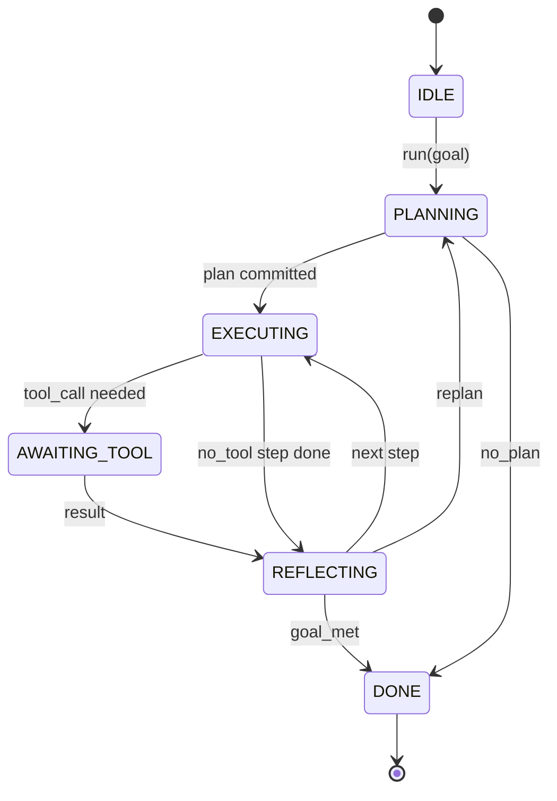

# Hợp đồng vòng lặp của đại lý Harness

> Harness là đại lý, mô hình là bộ xử lý, bạn có thể kết nối bất kỳ mô hình nào của vòng hợp đồng.

**Type:** Build
**Languages:** Python
**Prerequisites:** Phase 13 lessons 01-07, Phase 14 lesson 01
**Time:** ~90 minutes

## Mục tiêu học tập


```figure
cf-loop-contract
```
- Để định nghĩa vòng lặp sử dụng đại lý cho một máy trạng thái xác định có chuyển đổi rõ ràng.
- Thực hiện 10 chủ đề vòng đời, các nhà điều hành có thể đưa chính sách, viễn thông và hàng rào vào trong đó.
- 定义 hai điểm kéo, vòng trong những vị trí này đưa quyền kiểm soát trở lại cho người gọi, và đưa vào mới lên phục hồi.
- 强制执行 mỗi phiên ngân sách (tập tắt, gọi công cụ, đồng hồ tường), đồng thời trong quá hạn không泄漏 trạng thái một phần.
- 发发包含十一种事件类型的类型类型类型类型类型类型类型类型类型类型类型类型类型类型类型类型类型类型类型类型类型类型类型类型类型类型类型类型类型类型类型类型类型类型类型类型类型类型类型类型类型类型类型类型类型类型类型类型类型类型类型类型类型类型类型类型类型类型类型类型类型类型类型类型类型类型类型类型类型类型类型类型类型类型类型类型类型类型类型类型类型类型类型类型类型类型类型类型类型类型类型类型类型类型类型类型类型类型类型类型类型类型类型类型类型类型类型类型类型类型类型类型类型类型类型类型类型类型类型类型类型类型类型类型类型类型类型类型类型类型类型类型类型类型类型类型类型类型类型类型类型类型类型类型类型类型类型类型类型类型类型类型类型类型类型类型类型类型类型类型类型类型类型类型类型类型类型类型类型类型类型类型类型类型类型类型类型类型类型类型类型类型类型类型类型类型类型类型类型类型类型类型类型类型类型类型类型类型类型类型类型类型类型类型类型类型类型类型类型类型类型类型类型类型类型类型类型类型类型类型类型类型类型类型类型类型类型类型类型类型类型类型类型类型类型类型类型类型类型类型类型类型类型类型类型类型类型类型类型类型

## 框架

Một người vô dụng có giá trị để chạy bốn mươi vòng của bộ phận mã hóa không phải là vòng lặp trò chuyện. Nó là một máy trạng thái, người vận hành có thể chặn các nút của nó, cũng có thể kiểm tra các cạnh của nó. Một khi bạn viết hợp đồng, thay thế các mô hình, công cụ hoặc chính sách sẽ không còn là tái cấu trúc, mà sẽ trở thành một cuộc gọi đăng ký.

Đây là hợp đồng được xây dựng trong bài học này. Chúng tôi sẽ đặt tên 6 quốc gia, 10 chủ đề, 2 điểm kéo, 10 loại sự kiện, cùng một phong bì ngân sách.

## bang

vòng có 6 trạng thái. 5 trạng thái hoạt động.



`IDLE`Đó là điểm nhập cảnh hợp pháp duy nhất.`DONE`Đó là xuất khẩu hợp pháp duy nhất.`AWAITING_TOOL`Chính là trạng thái duy nhất sẽ tạo ra điểm kéo. Tất cả các chuyển đổi khác đều là nội bộ.

Máy trạng thái này là xác định. Được định nghĩa với cùng một nhật ký sự kiện, phần tử sẽ được tái nhập vào cùng một trạng thái.

## chủ đề cào

Hooks là một nhà điều hành 接入循环的接口──harness 会触发十个话题──每个话题可接受任意数量的订阅者──订阅者 按注册 顺序触发──一个订阅者可变用负载、升起来中止 当前转,或返回一个哨兵跳过下一步──

```text
before_plan         after_plan
before_tool_call    after_tool_call
before_step         after_step
on_error
on_pause
on_budget_exceeded
on_complete
```

Hình dạng này đã mô tả Claude Code, Cursor và OpenCode đến giữa năm 2025 đều xu hướng được sử dụng theo mô hình.`rm -rf`của ốc  đặt `before_tool_call` gửi OpenTelemetry span của hook  đặt `after_step` Trong phiên tạm dừng                                                                                                                                                                                                                                                            `on_pause`

## điểm kéo

Lòng sẽ được trao quyền kiểm soát lần đầu tiên là`AWAITING_TOOL`Khi nó không có kết quả công cụ, nó không thể tiếp tục tiến hành.`on_pause`, khi ngân sách 耗尽, hoặc một cái móng 明确 yêu cầu người xem xét 时.

Điểm kéo không phải ngoại lệ. Nó là một lần quay lại. Người gọi kiểm tra trạng thái của vòng xoáy, lấy vòng xoáy.`resume(payload)`◊harness 会从停止位置继续── đây là hình dạng giống như máy phát điện Python── kéo điểm trên của vận chuyển bởi bạn chọn── trong TUI nó là keypress── thông qua MCP 时它 là`tools/call`                                                                                                                                                                                                                                                              

## dòng sự kiện

loop 会在合同中的特定位置把事件添加到输入的流. 流. 流. 流. 流. 流. 流. 流. 流. 流. 流. 流.流.流.流.流.流.流.流.流.流.流.流.流.流.流.流.流.流.流.流.流.流.流.流.流.流.流.流.流.流.流.流.流.流.流.流.流.流.流.流.流.流.流.流.流.流.流.流.流.流.流.流.流.流.流.流.流.流.流.流.流.流.流.流.流.流.流.流.流.流.流.流.流.流.流.流.流.流.流.流.流.流.流.流.流.流.流.流.流.流.流.流.流.流.流.流.流.流.流.流.流.流.流.流.流.流.流.流.流.流.流.流.流.流.流.流.流.流.流.流.流.流.流.流.流.流.流.

- `session.start` 调用 `run(goal)`时发出 một lần
- `plan.draft` lập kế hoạch  quay lại dự thảo kế hoạch 时发出
- `plan.commit` Dự thảo được đệ trình cho kế hoạch hoạt động 后发发
- `step.start` Mỗi bước thực hiện  bắt đầu thời gian phát hành
- `step.end` Mỗi bước thực hiện kết thúc xuất phát
- `tool.call` 需要工具的步骤将控制权交给调用人 发发出
- `tool.result` Sử dụng kết quả công cụ 恢复时发出
- `tool.error` Sử dụng lỗi 恢复时, hoặc hook abort call 时发出
- `budget.warn`  đạt giới hạn ngân sách 时发出
- `session.pause` loop vì pause (khuyến thăm)
- `session.complete` vòng đến `DONE`时发出 một lần

Sự kiện không sao sao nhỉ. Hook là bắt buộc của mình.

## gói ngân sách

Một phiên 携带三个限制── quay số, số lượng công cụ gọi, giây đồng hồ tường── mỗi lượt sẽ làm cho quay thêm一── mỗi cuộc gọi công cụ sẽ làm cho công cụ gọi thêm一── mỗi lần chuyển đổi trạng thái sẽ kiểm tra đồng hồ tường── một khi đạt đến bất kỳ giới hạn nào, vòng sẽ触发`on_budget_exceeded`, phát hành`budget.warn`, rồi ở điểm kéo tiếp theo chuyển đổi lên đến`IDLE`,并附带 ngân sách vượt quá lý do.

ngân sách không phải là chuyển đổi giết người. Nó là một lợi nhuận. Người gọi quyết định là mở rộng ngân sách và tiếp tục, hoặc đóng phiên.

## 本课不做什么

Nó sẽ không sử dụng mô hình. Nó sẽ không đăng ký các công cụ thực sự. Nó sẽ không thực hiện vận chuyển.

`main.py`Các kế hoạch định nghĩa trung tâm là thay thế. Nó trở lại một kế hoạch ba bước được mã hóa cứng, trong đó hai bước cần kết quả công cụ.

## 如何阅读代码

`HarnessLoop`Nó có trạng thái, kích hoạt các hook, phát ra các sự kiện.`Budget`Theo giới hạn.`Event`                                                                                                                                                                                                                                                              `HookRegistry`Đó là bàn giao dịch.`_transition`là chức năng duy nhất sẽ thay đổi trạng thái, vì vậy các biến số máy trạng thái đều tập trung vào một nơi.

Từ trên xuống đọc `main.py`✿ rồi đọc ✿`code/tests/test_loop.py` kiểm tra sẽ cố định từng chuyển tiếp và từng lệnh bắn cá.

## 继续深入

Trong môi trường sản xuất, phần khó nhất trong việc xây dựng cáp không phải là máy nhà nước, mà là để hợp đồng có thể được thực hiện.`before_tool_call`Trong nâng . Trong bài học này, các bài kiểm tra sẽ bao gồm các chế độ thất bại này.

下一课将添加工具注册册. 再下一课是 JSON-RPC运输. 再后是发送器. 到第 24 课时, 循环 trong file sẽ hướng tới các công cụ thực tế.
