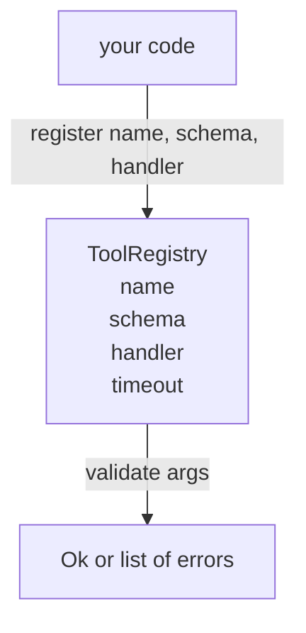

# 带 Schema Validation Tool Registry

> công cụ không thể xác minh của đại lý,就是 đại lý không thể sử dụng công cụ.

**Type:** Build
**Languages:** Python
**Prerequisites:** Phase 13 lessons 01-07, Phase 14 lesson 01
**Time:** ~90 minutes

## Mục tiêu học tập


```figure
cf-registry-validate
```
- Có một loại registry, tên công cụ chiếu → schema → handler, để người phát sóng chỉ cần hỏi một lần, sau đó即可信任。
- 实现 JSON Schema 2020-12的一个子集,覆盖百分之九十的工具调用 实际使用的关键字──
- Trở lại đúng ≠ hình dạng như đường sai của chỉ số json, để mô hình có thể tự sửa trong một lần quay lại
- Trong trường hợp không có sự vượt trội rõ ràng, từ chối đăng ký lại, vì sự đóng lặng là lý do để các danh mục công cụ sản xuất di chuyển.
- 保持 validator 纯净(无I/O、无时间、无全球), để nó có thể được sử dụng lại trên bản ghi lại.

## Tại sao đăng ký cần phải là công cụ trước

2026 năm đại lý lập trình sở hữu các công cụ đăng ký, so với mô hình có thể đặt vào một cửa sổ ngữ cảnh đơn ủ hơn. Một vòng đeo bất thường sẽ đăng ký hai trăm công cụ, và trong vòng bất kỳ tiết lộ mười đến bốn mươi. Registry là nguồn thực tế duy nhất của những vấn đề này:

Chúng ta phải tránh những sai lầm, là phát hành không có kế hoạch, hoặc phát hành không có xác nhận kế hoạch. Cả hai đều rất phổ biến. Cả hai đều sẽ biến tầng dưới của bài học thành trò chơi đoán, và mô hình thất bại duy nhất là người điều hành bỏ ra dấu vết hàng đống.

## ghi công cụ 长什么样

```text
ToolRecord
  name        : str          (unique, lowercase alphanumeric and underscore segments separated by dots, e.g., snake_case.segment.case)
  description : str          (one line, shown to the model)
  schema      : dict         (JSON Schema 2020-12 subset)
  handler     : Callable     (async or sync, returns Any)
  idempotent  : bool         (dispatcher uses this for retry decisions)
  timeout_ms  : int          (override per-tool dispatcher default)
```

Schema là validator 唯一会触碰的字段──处理器对它是不透明──我们故意分开二者──schema是数据──处理器是代码──把它们混在一起,会诱惑你把验证逻辑 放进处理器,而这正是我们要阻止的 bug──

## JSON Schema 2020-12 子集

完整的2020-12 spec 是一篇论文──我们需要八个关键字──

```text
type           string / number / integer / boolean / object / array / null
properties     map of property name -> schema
required       list of property names
enum           list of allowed primitive values
minLength      integer, applies to strings
maxLength      integer, applies to strings
pattern        ECMA-262-compatible regex, applies to strings
items          schema applied to every array element
```

Đây là đủ để bao gồm công cụ API  thực tế cần nội dung. Chúng tôi không thêm các từ khóa (oneOf, anyOf, allOf, $ref, điều kiện) trong các kế hoạch sản xuất là hiệu quả, nhưng sẽ biến xác thực viên thành một bộ đi bộ cây với chu kỳ. Chúng tôi xây dựng là đăng ký, không phải là JSON Schema engine.

## Json chỉ dẫn 错误路径

validation 失败时,validator 返回一个错误列表―― mỗi lỗi đều mang theo một hướng dẫn vào đầu vào 内部的 json-pointer path――pointer là một chuỗi có đường thẳng, được tạo từ các tên thuộc tính và chỉ số hàng 组成――

```text
{"a": {"b": [1, 2, "x"]}}
                    ^
                    /a/b/2
```

mô hình 读取错误 paths 的能力强于读取句子的能力──如果 schema 要求 `args.user.email`, và mô hình truyền vào một số nguyên, lỗi  nên là `/user/email`,并带有`expected_type: string`❖ mô hình 会在下一次调用中修正它, không cần một vòng说明 ngôn ngữ tự nhiên.

## 注册与过渡

`register(name, schema, handler, **opts)`默认拒绝重复注册──调用方必须传进 `override=True`才能替换── đây là thói quen y tế ở cấp độ hoạt động── hai phần của thư viện mã được đăng ký một cách tĩnh lặng với cùng một tên công cụ, là loại lỗi mà sẽ mất một tuần để tìm thấy trong sản xuất──

registry 暴露三个读取方法──`get(name)`返回记录或抛出异常──`validate(name, args)`Trở lại một`Ok`Hoặc một nhóm sai lầm.`names()`按注册顺序返回 công cụ tên gọi。

## Validator là gì, không phải gì

Nó là một lần quay lại trên cây schema. Nó là một hàm đơn giản. Nó không sử dụng người xử lý. Nó không thực hiện kiểu chuyển đổi bắt buộc.`"42"`Không được thông qua chương trình số (※)

Nó không phải là biên giới an toàn. 通过后,恶意处理器 仍然可能行为不当.

## Hình dạng



## 如何阅读代码

`code/main.py`定义了 `ToolRegistry``ToolRecord``ValidationError`, cũng như 8 chức năng xác nhận.`schema["type"]`gửi đi`enum`处理) ⋅ mỗi loại xác nhận cần phải hoặc quay lại空列表, phải hoặc quay lại `ValidationError`列表──tầng trên người đi bộ 会拼接 lỗi, và chuyển về phía dưới 递归时前置路段──

`code/tests/test_registry.py`覆盖 đăng ký, vượt quá, thành công xác thực, thất bại xác thực các con đường, cũng như mỗi từ khóa trong tập hợp này.

## 继续深入

Sau khi khóa học này kết thúc, bạn sẽ muốn hai phần mở rộng là: đối với các khối định nghĩa địa phương.`$ref`- Phân tích, cũng như sử dụng hình dạng nghiêm ngặt`additionalProperties: false`◊ Chúng tôi đã để chúng bên ngoài bài học, để các tài liệu có thể được đọc trong một lần đọc.

下一课(twenty-two) sẽ xây dựng JSON-RPC vận chuyển studio, đưa registry này 暴露 cho mô hình khách hàng。再下一课(twenty-three) sẽ đưa người thứ hai bao gồm trong một带 timeouts 和 retries của các nhà phát triển 后面。
