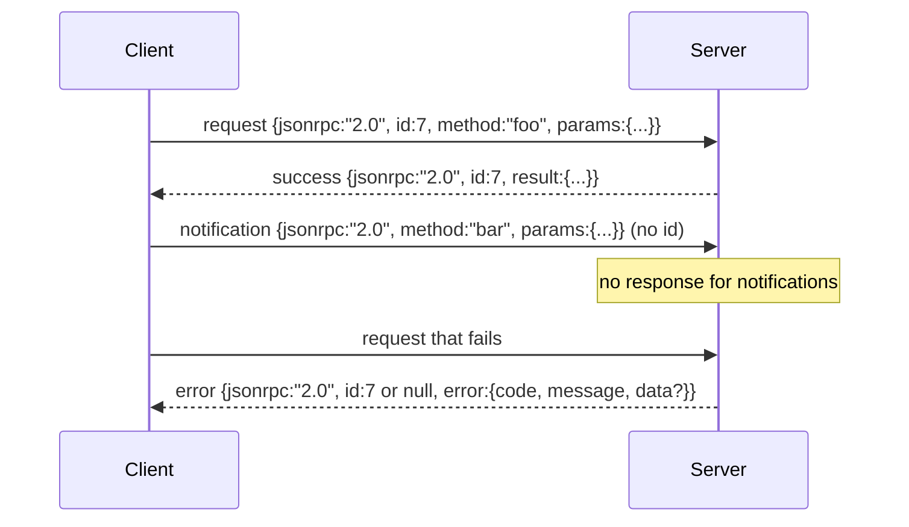

#  dựa trên Newline-Delimited Stdio của JSON-RPC 2.0

> Phân chuyển giữa mô hình client và máy chủ công cụ là dựa trên JSON-RPC của studio.

**Type:** Build
**Languages:** Python
**Prerequisites:** Phase 13 lessons 01-07, Phase 14 lesson 01
**Time:** ~90 minutes

## Mục tiêu học tập


```figure
cf-jsonrpc-frames
```
- Sử dụng thông qua stdin 和 stdout 上的 newline-delimited JSON framing của JSON-RPC 2.0 通信。
- 映射五个标准错误代码(-32700, -32600, -32601, -32602, -32603),并以正确语义暴露它们──
- 区分 yêu cầu, phản ứng, thông báo và lô, không phát triển khóa phong bì mới
- Mỗi hành trình xử lý một lỗi phân tích, không gây ô nhiễm phần còn lại của dòng chảy.
- Sử dụng io.BytesIO  xây dựng một bản demo tự kết thúc, để các khóa học không cần phải sinh con quá trình 即可运行。

## Tại sao JSON-RPC vẫn là ngôn ngữ ngoại ngữ

Năm 2026, một đại lý lập mã trong một phiên duy nhất có thể sẽ và 12 máy chủ công cụ 通信。 mỗi máy chủ đều là một quy trình độc lập hoặc kết thúc từ xa── định dạng dây kể từ năm 2013 đã luôn giống nhau。 JSON-RPC 2.0 là hai trang spec。 nó có thể tồn tại, vì thay thế方案(gRPC、 mỗi lần gọi một HTTP、 tự xác định nhị phân) đều sẽ xây dựng JSON-RPC 没有取舍: chúng sẽ trong phát trực tuyến、batching hoặc kết nối vận tải trong lựa chọn một。 JSON-RPC trong các studio、sockets、websockets 和 HTTP trên là đối xứng, miễn là cả hai bên tuân thủ các quy định, khách hàng có thể điều khiển một máy chủ chưa thấy.

本课构建 stdio variant──Newline-delimited JSON── mỗi yêu cầu là một行── mỗi câu trả lời là một行──transport boundary là `\n`

## hình dạng dây

Có bốn hình dạng phong bì. Hai kiểu được phát hành bởi khách hàng.



thông báo 没有 `id` máy chủ không phải trả lời nó. Nếu máy chủ trả lời thông báo, khách hàng không có cách nào để kết nối nó với một trang web gọi.

batch là các yêu cầu hoặc thông báo của JSON array──server  trả lại một response array,顺序任意, mỗi non-notification entry 对应一个 response──如果 batch trong mỗi entry 都是 notification,server 不发送任何内容──

## 5 mã lỗi

```text
-32700  Parse error      JSON could not be parsed
-32600  Invalid Request  Envelope shape is wrong
-32601  Method not found
-32602  Invalid params
-32603  Internal error
```

Các mã giữa -32000 đến -32099  Bảo tồn cho lỗi được xác định bởi máy chủ. Tất cả các mã khác đều được xác định bởi ứng dụng.`data.exception`中放入 tên lớp ngoại lệ

lỗi phân tích Có một điều đặc biệt quy tắc.`id` `null`, vì yêu cầu chưa được phân tích đến mức độ đủ để lấy ID.

## Phong khung mới và BytesIO demo

Transport 一次读取 一行.`\n`Nếu một dòng không thể phân tích, vận chuyển sẽ viết vào một dòng.`id: null`- Không tiếp tục. - Không bị ô nhiễm.

Trong bài học này, chúng ta sẽ gặp nhau.`io.BytesIO`包装成 stdin 和 stdout──server 读取请求直到 EOF,为每一个请求 写入回复,然后返回──客户再读回回复──没有过程生殖──没有时间out──运输 行为与真实子进程管 完全相同,因为 Python 的`io`giao diện  cung cấp giống như vậy `.readline()`和 `.write()`hợp đồng

## Phương pháp gửi

vận chuyển không biết có phương pháp nào  tồn tại                                                                                                                                                                                                                                                          `handler(method, params)`❖ xử lý  trả lại kết quả hoặc抛出异常──三个 loại ngoại lệ 暴露 cụ thể mã──

```text
MethodNotFound -> -32601
InvalidParams  -> -32602
Anything else  -> -32603 with exception name in data
```

Transport 永远不会看到工具注册. 注册. 位于处理器 后面. 这就是我们想要的层层. 运输说 JSON-RPC. 注册. 说工具形.

## lỗi trên dòng  hành vi

```text
client writes              server reads             server writes
---------------            -----------              -------------
{...valid request...}      parses ok                {...response, id matches...}
{...broken json...         parse fails              {id:null, error: -32700}
{...valid request...}      parses ok                {...response, id matches...}
{...missing method...}     invalid envelope         {id:X, error: -32600}
```

Một dòng JSON bị hỏng không ngừng vòng.`method`trường 不会停止循环──handleer exception 不会停止循环──transport 会持续读取直到 EOF──

## Thông báo và không đối称 dòng chảy

thông báo là lửa và quên đi. Harness Sử dụng thông báo biểu hiện sự kiện tiến bộ.

本课实现 một trợ lý thông báo ra ngoài,`write_notification` máy chủ trong yêu cầu  tiến hành sử dụng nó phát hành tiến bộ.  Demo  hiển thị mô hình này: một yêu cầu 进来, xử lý 发发两条通知 tiến bộ, sau đó viết vào phản ứng cuối cùng.

## 如何阅读代码

`code/main.py`定义了 `StdioTransport`、parse trợ lý`parse_request`(■) ba người giúp viết`write_response``write_error``write_notification`), cũng như vòng chuyển giao `serve`◊ các liên tục mã lỗi  nằm trong phạm vi mô-đun。

`code/tests/test_transport.py`覆盖五个错误码、通知(不写回复) 、批量(排列进,排列出,跳过通知) 、破碎 JSON(解析错误 后继续),以及处理器调用中途写入通知的不对称流――

## 继续深入

Đây là một trong những phương tiện vận chuyển tiếp theo.`id`已经是这个, nhưng trong lưới trong bạn cũng cần một ID theo dõi bên ngoài)― một kênh hủy bỏ giống như `$/cancelRequest`Các thông báo, mang theo ID của cuộc gọi trong chuyến bay, cũng như một cú tay đàm phán kiểu nội dung, để cùng một ổ cắm có thể nói cùng lúc JSON-RPC và Streamable HTTP.
