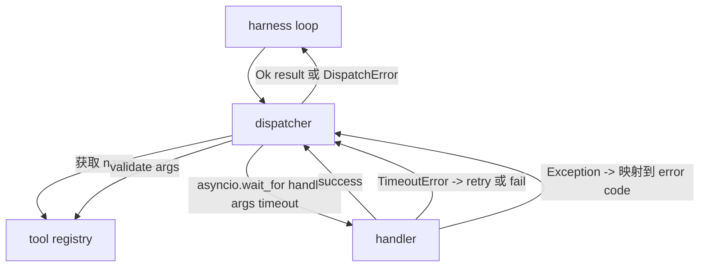
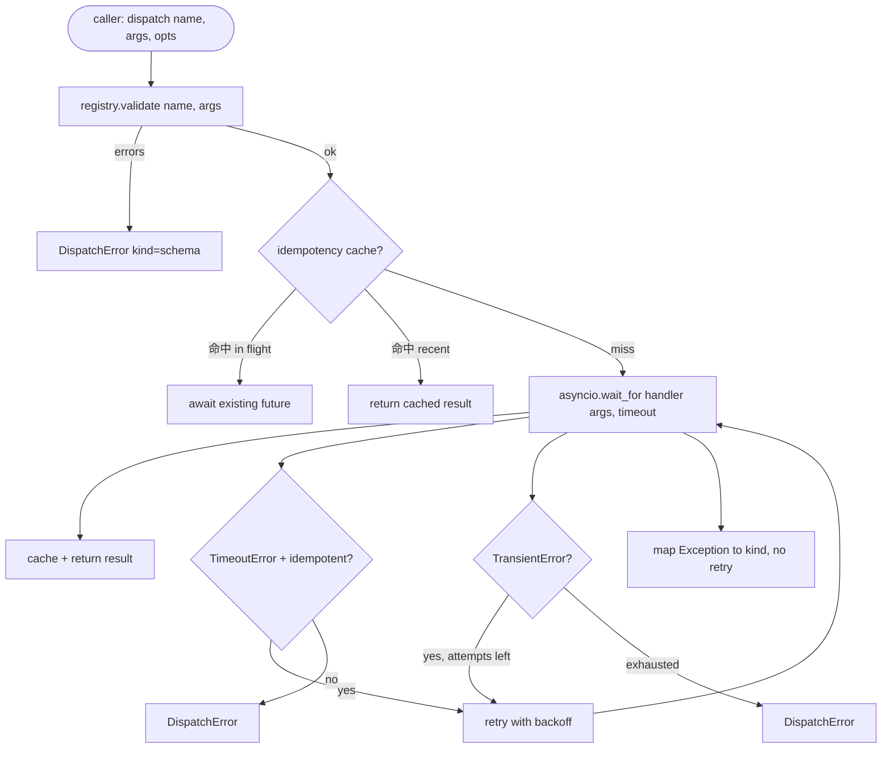

# Function Call Dispatcher

> Dispatcher là một hệ thống để thực hiện mọi giao ước mua đơn vị.

**Type:** Build
**Languages:** Python
**Prerequisites:** Phase 13 lessons 01-07, Phase 14 lesson 01
**Time:** ~90 minutes

## Mục tiêu học tập
- Sử dụng thời gian tạm thời mỗi cuộc gọi  gói trình xử lý công cụ, làm cho nó trả lại lỗi gõ, thay vì để vòng lặp 挂起──
- 应用带 jitter 和最大尝试次数的指数式反弹复试――
- Dựa trên khóa miễn phí cho các lần thử lại, như vậy với cuộc gọi ban đầu chậm 竞争的重试 不会运行两次──
- 将 xử lý ngoại lệ và lỗi vận chuyển 映射到束束 已理解的单一错误包
- Sử dụng giới hạn đồng thời 约束 đồng thời gửi, tránh bốn mươi tool call của fan-out 耗尽 sự kiện vòng lặp


```figure
cf-dispatch-retry
```

## Ở chỗ người vận chuyển ngồi

位于 harness loop(lần hai mươi) và tool registry(lần hai mươi một)之间──transport(lần hai mươi hai)向 loop 输入──loop 把 tool call 交给 dispatcher──dispatcher 调用 registry,运行处理器,并返回结果或 JSON-RPC 形状的错误包──



Người phát triển là người duy nhất biết thời gian, thời gian rút lại và không thể làm gì.

## Thời gian nghỉ

Mỗi công cụ đều có thời gian tạm thời mặc định.`timeout_ms` Khi đeo 传入 per call override 时, dispatcher 会用它覆盖默认值── 我们使用 `asyncio.wait_for`❖ Thời gian hết 时, nhiệm vụ xử lý sẽ bị hủy bỏ, người gửi  quay lại `DispatchError(kind="timeout")`

Đối với các công cụ không có sức mạnh, thời gian trôi qua không phải là lỗi có thể thử nghiệm.`db.write`Có thể đã nộp, cũng có thể không.`idempotent`cờ――Các công cụ không có khả năng 会 thử lại――Các công cụ không có khả năng 不会――

## Các thử nghiệm trở lại với backkoff theo hàm số

Chính sách thử lại, tối đa.

```text
attempt 1  -> delay 0
attempt 2  -> delay 0.1s * (1 + random[0..0.5])
attempt 3  -> delay 0.4s * (1 + random[0..0.5])
```

Chỉ có`timeout`和 `transient`lỗi sẽ thử lại.`schema`lỗi`not_found`Hoặc`internal`lỗi không sẽ cố gắng lại. Phỏng lẻo của kế hoạch là xác định.

Loop lặp sẽ tuân thủ sử dụng ngân sách được đưa ra. Nếu ngân sách của người gọi còn lại của công cụ gọi cho không, người gửi sẽ thất bại nhanh chóng khi lần đầu tiên,并 quay lại.`kind="budget_exceeded"`

## Chìa khóa khử năng lực

Khi cuộc gọi ban đầu  vẫn đang trên chuyến bay 时触发 tái thử, là một lỗi sản xuất thực sự.`payments.charge`Anh đã nhặt 2 lần rồi.

người vận chuyển  chấp nhận可选的 `idempotency_key`Nếu một cuộc gọi đến lúc cùng một chìa khóa đang bay, nhà phát triển sẽ chờ đợi tương lai trong chuyến bay, và trả lại kết quả của nó.

Chìa khóa là trách nhiệm của người gọi.`f"{step_id}:{tool_name}:{hash(args)}"`❖ Dispatcher không phát minh khóa, vì chỉ từ các lập luận  phái khóa sẽ làm cho hai cuộc gọi khác nhau có vẻ giống nhau.

## Bảng lỗi

失败的发送 返回单一形状──

```text
DispatchError
  kind        : "timeout" | "transient" | "schema" | "not_found" | "internal" | "budget_exceeded"
  message     : str
  attempts    : int
  jsonrpc_code: int   （-32601、-32602、-32603 之一）
```

vòng vòng sẽ `kind`映射到下一个状态――`schema`和 `not_found` vào `on_error`Không có kế hoạch nào.`timeout`和 `transient` vào `on_error`, có thể tái lập, cũng có thể không tái lập, tùy thuộc vào những nỗ lực.`budget_exceeded`触发 `on_budget_exceeded`

## Tỷ lệ tiền tệ đối với fan out

`gather(*calls)`会同时运行 tất cả các quy trình. 四十个工具调用意味着四十个开源插头或四十个子处理管.

Đưa máy dùng thùng 包装 `gather`△默认 đồng thời hạn là 八── mỗi cuộc gọi trong việc gửi  trước khi có được semaphore, và hoàn thành thời gian phát hành── người gọi  nhìn thấy là `gather`形状的输出, nhưng thực tế lập trình là có界的.

## Tạo dòng cho một cuộc gọi



## Làm thế nào để đọc mã

`code/main.py`定义了 `Dispatcher``DispatchError`和 `TransientError` nhà phát xuất trong xây dựng  đăng ký nhận  đồng bộ `dispatch(name, args, ...)`Đó là điểm nhập cảnh duy nhất.`_run_with_retries` 内用`asyncio.wait_for`Inline  ứng dụng:`gather_bounded(calls)`以 đồng thời giới hạn 运行多个发送──

`code/tests/test_dispatcher.py`覆盖 timeout 触发、transient 上的重试、方案错误 上不重试、idempotency dedupe(两个带相同的键的同时调用 折叠为一次处理器调用),以及同时限制(semaphore 生效) ⋅

dùng thử `asyncio.sleep(0)`Và dựa trên định nghĩa`Counter`Các bộ xử lý, vì vậy chúng sẽ hoàn thành trong vài giây, không phụ thuộc vào thời gian của đồng hồ tường.

## Đi xa hơn nữa

Các nhà phát triển sản xuất sẽ thêm hai mở rộng. Thứ nhất, trong mỗi quá trình chuyển tiếp trên thực hiện việc ghi chép có cấu trúc.`dispatch.attempt`和 `dispatch.retry`Các sự kiện: ■ 2 , phá vỡ mạch: trong một cửa sổ xảy ra N 次 thất bại sau, công cụ  vào thời gian làm mát xuống, gửi 会立即返回 `kind="circuit_open"`, thay vì cố gắng xử lý. Cả hai đều có thể được thêm vào trên máy phát sóng này, không thay đổi hợp đồng.

Bài học 24 会把发送 viên 粘合到计划执行代理,让你看四个部分一起运转――
