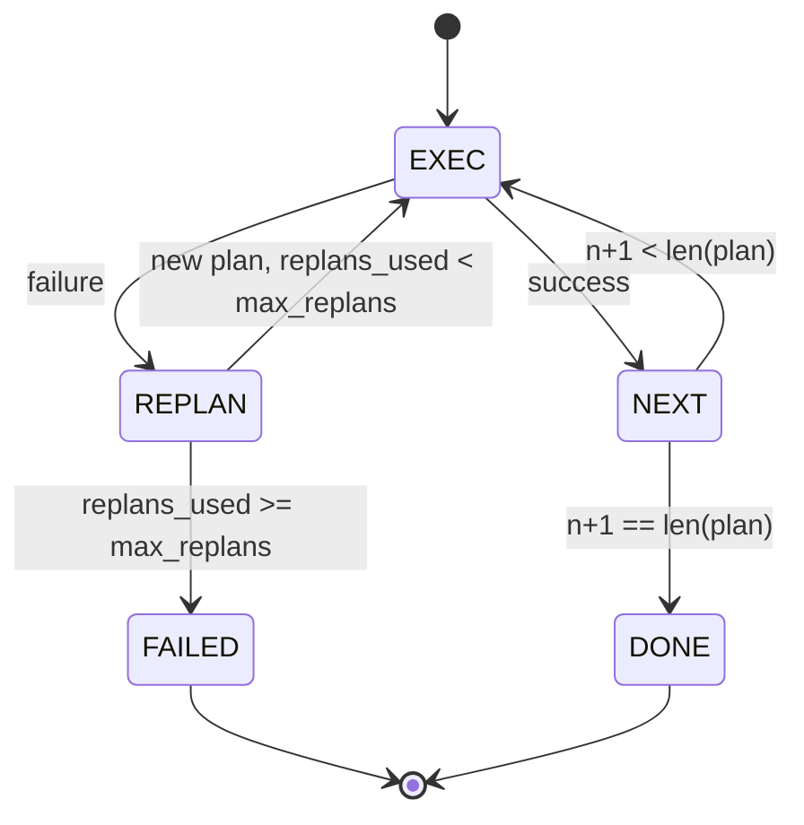

# Phong trào kiểm soát kế hoạch thực hiện

> 无法承受失败的计划是脚本――能重复的脚本才是代理――先构建重新规划者――

**Type:** Build
**Languages:** Python
**Prerequisites:** Phase 13 lessons 01-07, Phase 14 lesson 01
**Time:** ~90 minutes

## Mục tiêu học tập


```figure
cg-plan-replan
```
- Để biểu thị kế hoạch cho các bước được gõ, để người thực thi có thể tính toán tiến bộ và kết quả.
- 顺序执行步骤,并将失败 受控地交付 回规划者──
- Từ cursor hiện tại  bắt đầu tái lập, và trong bối cảnh mang lên lỗi trước, hãy làm kế hoạch tiếp theo 更有信息──
- Mỗi lần sửa đổi đều phát hành kế hoạch khác nhau, để theo dõi hoặc UI 能 hiển thị kế hoạch 为什么改变──
- 强制执行两个预算: 硬性阶梯上限和硬性重复计划上限──

## Kế hoạch và thực hiện, thay vì chuỗi suy nghĩ

Đội ngũ tư tưởng sẽ phát hành mã thông báo,并让循环 猜测 công cụ gọi 在哪里结束── kế hoạch và thực hiện đại lý trước tiên phát hành kế hoạch có cấu trúc, sau đó xác định地执行每个步骤── kế hoạch là khai thác có thể nhìn vào dữ liệu── thực hiện là khai thác 通过发送器 运行这些数据──

Một người lập kế hoạch tạo ra một kế hoạch. Một người thực thi kế hoạch.

```text
1. Abort         （返回 failed，暴露 error）
2. Skip          （将 step 标记为 failed，继续剩余部分）
3. Replan        （把 error 交给 planner，从 cursor 获取新 plan）
```

Replan là để biến kịch bản thành đại lý.

## hình dạng bước

```text
Step
  id              : int           （在一个 plan revision 内单调递增）
  tool_name       : str
  args            : dict
  expected_outcome: str           （planner 声明的 success condition）
  result          : Any | None
  error           : str | None
```

`expected_outcome`Đây là kế hoạch và bước một phát hành của câu ngắn. Người thực hiện sẽ không bắt buộc kiểm tra nó. Nó có hai mục đích: kế hoạch lại trong kế hoạch sửa đổi  đọc nó; Stream sự kiện phát hành nó, để tracer có thể hiển thị bước này.

## hình dạng của kế hoạch

```python
def planner(goal: str, history: list[Step], last_error: str | None) -> list[Step]:
    ...
```

Một chức năng tinh khiết.`goal`Đó là mục tiêu của người dùng.`history`Đã thực hiện các bước đã được hoàn thành kết quả và lỗi)`last_error`Trong lần đầu tiên调用 là Không, trong mỗi lần sau đó调用 là thông điệp thất bại gần đây nhất.

Planner không biết executor. Nó không biết retries. Nó không biết timeouts. Nó chỉ tạo ra kế hoạch.

## Người thực thi

thực thi là một máy nhỏ, máy tính của nhà nước. Mỗi bước đều qua máy phát triển. Kết quả có ba loại: thành công, thất bại, tái lập.`FAILED`Kết quả phiên họp.



## Phân tích 时的计划 diff

Khi kế hoạch thất bại sau khi quay lại kế hoạch mới, người thực thi sẽ phát hành một bao gồm ba đoạn.`plan.diff`Sự kiện

```text
removed: 旧 plan 中存在但新 plan 中不存在的 step ids 列表
added  : 新 plan 中存在但旧 plan 中不存在的 step ids 列表
revised: tool_name 或 args 已改变的 step ids 列表
```

Tracer hoặc UI có thể xem nó như là bước đột phá của các bước bị xóa, cũng như các bước nổi bật của những bước được thêm vào.

## 两个硬性预算

`max_steps`限制 toàn bộ phiên, bao gồm cả kế hoạch lại, 默认是十二── một kế hoạch 5 bước đường, nếu kế hoạch lại hai lần và mỗi lần tăng 3 bước, sẽ đạt được 16 lần thực hiện, do đó vượt quá ngân sách.

`max_replans`限制第一次计划 后规划者 被调用次数――默认是五――这是更重要的限制――一个连续五次回与一个破碎的计划规划者,否则会一直循环,直到步骤预算 抓住它――限制重规划会让失败更快发生,原因也更清楚――

## 本课中的 định nghĩa lập kế hoạch

Bài học này không sử dụng mô hình. Bài học này cung cấp một nhà hoạch định xác định, dựa trên nó.`last_error`选择 kế hoạch.

```text
last_error is None    -> emit 一个 four-step plan
last_error matches X  -> emit 一个绕过 X 的 three-step plan
last_error matches Y  -> emit 一个优雅放弃的 two-step plan
otherwise             -> return []（表示没有内容可 replan）
```

Đây là một hành vi của người thực thi thử nghiệm trên mỗi con đường chuyển đổi: thành công, lập kế hoạch lại một lần, lập kế hoạch lại hai lần, lập kế hoạch lại và làm giảm ngân sách.

## Tương tự của kết quả

```text
SessionResult
  status      : "completed" | "failed"
  reason      : str     ("goal_met" | "step_budget" | "replan_budget" | "no_plan")
  history     : list[Step]
  revisions   : list[PlanDiff]
  events      : list[Event]
```

Bài học 20 Trung tâm vòng xoay có thể trực tiếp đọc nó. Bài học 23 Trung tâm bộ chuyển giao thực hiện mỗi bước. Bài học 21 Trung tâm đăng ký xác nhận từng bước. Bài học 22 Trung tâm vận chuyển sẽ thông qua JSON-RPC sẽ phơi bày toàn bộ dòng chảy cho khách hàng mô hình.

## Làm thế nào để đọc mã

`code/main.py`定义了 `PlanExecuteAgent``Step``PlanDiff``SessionResult`Và kế hoạch định nghĩa.`run(goal)`Phương pháp, trả lại `SessionResult`◊ kế hoạch khác nhau 通过比较 bước ID 和 `(tool_name, args)`Túp 计算。

`code/tests/test_agent.py`覆盖 tuyến tính thành công 一次中计划失败 后重计划 返回 `failed:replan_budget` Phân tích dự án lại, phân tích ngân sách từng bước, cũng như định dạng sự kiện khác biệt kế hoạch.

## Đi xa hơn nữa

连接到真实模型 后,你需要两个扩展──第一,部分计划缓存:当一个计划的六个步骤 中前三个成功、后失败时,你不想重新运行前三个──执行者 已保留历史;planner 只需要读取它──第二,并行分支:当前执行者是严格序列的──发行独立分支(`gather_step`Không phải`next_step`) của lập kế hoạch có thể qua các nhà phát triển cùng lúc 运行 hai cuộc gọi công cụ.

两者都会增加真实复杂性――在线性执行器被固定后,两者都更容易添加――这就是本课做的事――
