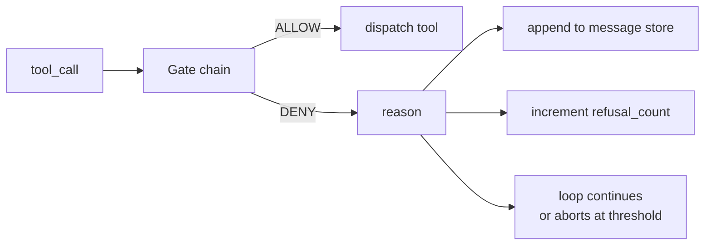
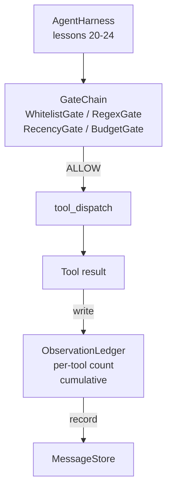

# Capstone 第 25 课: Cổng kiểm tra và ngân sách quan sát

> Không kiểm tra lớp sử dụng đại lý, chỉ đơn giản là theo ý muốn của trang phục. 本课会构建确定性门链, được sử dụng để quyết định liệu có cho phép một cuộc gọi công cụ 触发、 đại lý có thể xem bao nhiêu đầu ra, cũng như khi đại lý đã đọc quá nhiều nội dung khi vòng lặp 何时必须停止── chuỗi này được tạo ra bởi các cổng nhỏ, có tên, cộng với sổ cái quan sát 组成; sổ cái sẽ theo dõi đã hiển thị cho mỗi token của mô hình.

**Type:** Build
**Languages:** Python (stdlib)
**Prerequisites:** Phase 19 · 20-24（Track A1：agent loop、tool registry、message store、prompt builder、model router），Phase 14 · 33（instructions as constraints），Phase 14 · 36（scope contracts），Phase 14 · 38（verification gates）
**Time:** ~90 minutes

## Mục tiêu học tập

-  xây dựng có tính xác định `evaluate(call)` phương pháp của `VerificationGate`Quy tắc
- Để phân tích ngân sách, gần đây, danh sách trắng và regex gate 组合成 có một chuỗi ngắn mạch 语义的链――
- Thông qua công cụ và quay  xây dựng chỉ dẫn `ObservationLedger` theo dõi mỗi lần quan sát 
- Khi ngân sách quan sát tích lũy sẽ được vượt quá, từ chối một cuộc gọi công cụ.
-  Khám phá cấu trúc `GateDecision`ghi lại,供下游 quan sát được 摄取──

## 问题

Khi đại lý sử dụng 允许模型自由调用工具 时, trong vòng một giờ sử dụng thực sự sẽ xuất hiện ba loại lỗi.

Thứ nhất là quan sát vô hạn. Đối với một 200.000 dòng repo, sẽ đưa 5000.000 token ra vào vòng tiếp theo.

Thứ hai là tính gần đây không còn tồn tại. Một nhiệm vụ chạy dài sẽ tích lũy 50 lần gọi công cụ. Mô hình sẽ đưa read_file đầu tiên của vòng thứ ba khi thực hiện trạng thái đọc lại.

Thứ ba là một nhiệm vụ nghiên cứu từ việc sử dụng.`web_search`开始,随后不知怎么就运行了 `shell`, vì mô hình đã tạo ra một tên công cụ, và sử dụng 默认宽松──等有人读取痕迹 时,/tmp 里已经放一个垃圾文件,并且一次卷 已经打到了私有API──

Cổng xác minh là một hệ thống kiểm tra, nó không phải là mô hình, nó không phải là một thẩm phán.`(call, history, ledger)`                                                                                                                                                                                                                                                              

## 概念



Cổng là bất cứ điều gì có.`evaluate(call, ctx) -> GateDecision`方法的对象──chain 是一个有序列表──evaluation 在第一次拒绝时短路──序列很重要:便宜的结构性门 会先于昂贵的代币计数门 运行──

本课提供四门:

- `WhitelistGate`                                                                                                                                                                                                                                                              
- `RegexGate`◊ Công cụ tranh luận 会与regex 匹配──适合拒绝包含 `rm -rf`Các cuộc gọi shell, hoặc phát phát vào các cuộc gọi HTTP IP bên trong. Nó chỉ phụ thuộc vào tải trọng hữu ích của cuộc gọi.
- `RecencyGate`◊ mô hình chỉ có thể nhìn thấy các quan sát gần đây của N 轮 ◊ quan sát cũ hơn sẽ bị che phủ ◊ cổng này sẽ từ chối kết quả của nó sẽ mở rộng một cửa sổ quan sát đã hết hạn gọi công cụ ◊
- `BudgetGate` Mô hình trong suốt phiên học trong tích lũy đọc các token có một giới hạn trên  Khi sổ cái  cho thấy đã đạt được giới hạn trên, sau đó mỗi lần gọi công cụ sẽ bị từ chối 

sổ cái quan sát 负责记账―― mỗi lần gọi công cụ thành công 都会写入一行: công cụ tên, lượt, mã thông báo phát hành, tích lũy―― sổ cái  trả lời hai câu hỏi:模型总共看到了多少,以及它看到了多少的工具 X── ngân sách cổng 读取第一个──per-tool ngân sách cổng là nội dung bài tập của bạn, nó sẽ đọc读第二个──


```figure
cg-gate-chain
```

## 架构



harness 会询问链――链 要么点头,要么拒绝―― Nếu nó点头, công cụ 会运行, sổ cái 会计数, kết quả sẽ được thêm vào message store―― nếu nó từ chối, mô hình sẽ nhận được từ chối dưới dạng hệ thống tin nhắn, sau đó vòng quay quyết định là thử lại hay ngừng――

## Anh sẽ xây dựng cái gì

实现 một `main.py`+ Các xét nghiệm

1. `Observation`和 `ToolCall`Dataclasses  định hình dây.
2. `ObservationLedger`记录 `(turn, tool, tokens)`hàng,并回答 `cumulative()`和 `per_tool(name)`
3. `GateDecision`携带 `(allow, reason, gate_name)`
4. `VerificationGate`Đó là quy tắc. Mỗi cổng đều được thực hiện.`evaluate(call, ctx)`
5. `GateChain`包装一个有序列表――它 sẽ调用每个门, quay lại đầu tiên phủ nhận; nếu tất cả các cổng đều qua, thì quay lại cho phép――
6. demo 运行一个很小的合成代理循环──三轮──第三轮触发预算门,循环 会报告一次干净的拒绝,并带有非零拒绝计数──

Đơn vị đếm có ý định sử dụng rất thô lỗ `len(text) // 4`Heuristic──本课重点是门管, chứ không phải là tokenizer── trong môi trường sản xuất xin thay thế cho tokenizer thực sự──

## Tại sao chuỗi 顺序 quan trọng

Một lần phủ nhận hơn một lần cho phép hơn rẻ hơn.`WhitelistGate`运行 O(1) tìm kiếm hash`RegexGate`运行 O(mô hình * argv) 』`RecencyGate`读取 thư cửa hàng của một mảnh nhỏ.`BudgetGate`读取整个 sổ cái. Bạn cần phải theo chi phí tăng lên để xếp chúng, vì vậy được từ chối cuộc gọi.

Bạn cũng phải theo bán kính blast 排序──Whitelist là chủ đề mạnh nhất: công cụ này không trong hợp đồng 中──regex gate 其次: đây là lập luận không trong hợp đồng 中──Recentness 仍然关心, nhưng gọi trong cấu trúc là hợp pháp──Budget  đặt cuối cùng, vì theo định nghĩa, nó sẽ chỉ trong tất cả các kiểm tra khác đều thông qua sau触发──

## Nó được kết hợp với phần còn lại của Track A

 Chương trình trước đã cho bạn vòng lặp, sổ đăng ký công cụ, cửa hàng tin nhắn, trình tạo nhanh và bộ định tuyến mô hình.  Chương trình bổ sung mô hình và công cụ giữa các tầng.

## 运行方式

```bash
cd phases/19-capstone-projects/25-verification-gates-observation-budget
python3 code/main.py
python3 -m pytest code/tests/ -v
```

demo 会打印 từng vòng, bao gồm mỗi quyết định cổng,并以零退出──测试 覆盖 sổ cái、每个独立门、链短路,以及端到端合成循环──
