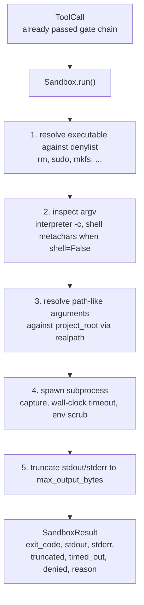
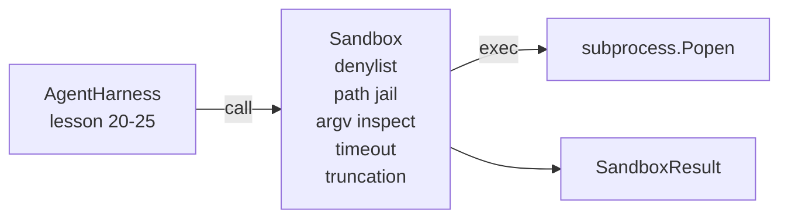

# Capstone 第 26 课:带 Denylist 与 Path Jail của Sandbox Runner

> Cổng xác minh quyết định một lần gọi công cụ có nên chạy không. Sandbox quyết định sẽ xảy ra gì khi nó chạy.

**Type:** Build
**Languages:** Python (stdlib)
**Prerequisites:** Phase 19 · 25（verification gates and observation budget），Phase 14 · 33（instructions as constraints），Phase 14 · 38（verification gates）
**Time:** ~90 minutes

## Mục tiêu học tập

-  xây dựng một gói `subprocess.run`của `Sandbox`lớp học,带有时间out, bắt và cắt đứt.
- 按名称通过 denylist、按结构通过 argv inspector 拒绝命令──
- 拒绝任何解析到声明的项目根之外的路径参数──
- Trong chế độ shell 关闭时拒绝 shell metacharacters──
-  trở lại cấu trúc hóa `SandboxResult`,供下游可观和 eval harness 摄取──

## 问题

能够 shell out của đại lý lập trình có thể trong một lượt cài đặt cửa sau, khóa thoát ra, lỗ hổng máy tính xách tay của nhà phát triển, và tạo ra hóa đơn đám mây.

Các dấu vết của đại lý 中反复出现三类失败──

Thứ nhất là các mô hình có thể thực hiện nguy hiểm.`sudo``chmod -R 777``rm -rf``mkfs``dd` Tất cả đều không thuộc về các đại lý chạy  Danylist 会按名称和别名 捕获它们

Thứ hai là những trò lừa đảo. Một người bị cáo không thể sử dụng mô hình của Shell, sẽ thông qua phiên dịch viên tấn công:`python3 -c "import os; os.system('rm -rf /')"``bash -c '...'``node -e '...'``perl -e '...'`✿ Sandbox 需要知道,任何带有类似的 ✿`-c`Đội diễn giải cờ chạy, thực tế là chỉ là một vài bước gọi shell.

Thứ ba là lối thoát.`./src/main.py`Nhưng đã đọc rồi.`../../etc/passwd`✿ Sandbox 会通过`os.path.realpath`解析 từng đường dẫn,并断言其前,从而将它们限制在监狱内──

Cái sandbox này không phải là ranh giới an ninh của hệ điều hành 意义上的安全界――一个拥有代码执行的坚定攻击者仍然可以逃逸――这个 sandbox này là một màn gác thời gian phát triển: nó làm cho các chế độ thất bại thường xuyên trở nên rõ ràng,并阻止代理因纯粹的拙而造成破坏――

## 概念



sandbox có bốn trục từ chối: tên, argv, đường, cấu trúc. Mỗi trục đều là hàm thuần của cuộc gọi, lúc này vẫn không có phụ quy trình.

`SandboxResult`Mã thoát sử dụng quen thuộc giá trị:0 biểu hiện thành công,非零 biểu hiện thất bại, còn có ba mã treo: từ chối (-100)、 thời gian_out (-101) 和 truncated( mã thoát đó là giá trị thực tế, đồng thời đặt cờ)。


```figure
cg-path-jail
```

## 架构



denylist là tên cơ bản có thể thực hiện được.`/bin/rm``/usr/bin/rm`)都会解析到相同的基名──argv 检查员 了解解释器形:任何 argv[0] 是解释器 且后续任一 arg 以`-c`Hoặc`-e`开头的 argv 都会被拒绝──当电话 没有显然请求 shell 时, shell metacharacters(`;``|``&``>``<`、cái đằng sau,`$()`) sẽ dẫn đến từ chối.

Đường tù là phần nhỏ nhất.`project_root` Bất cứ điều gì trông giống như đường dẫn của lập luận`/`Hoặc phù hợp với các tài liệu hiện có) đều sẽ thông qua`os.path.realpath`归一化,然后与项目根的真路比较──如果解析后的目标不在根下,则拒绝──Symlink thoát khỏi các nỗ lực(项目根中指向外部的 symlink) sẽ được kiểm tra thực路阻止, chứ không phải kiểm tra字面路径──

## Anh sẽ xây dựng cái gì

实现 là `main.py`Một bài kiểm tra nữa.

1. `SandboxResult`dataclass:exit_code、stdout、stderr、truncated、timed_out、denied、reason、duration_ms。
2. `SandboxConfig`dataclass:project_root、max_output_bytes、timeout_seconds、denylist、interpreter_block。
3. `Sandbox`lớp:`run(argv, *, shell=False, cwd=None)` quay lại `SandboxResult`
4. 内部 người giúp việc từ chối:`_check_executable_denylist``_check_argv_interpreter``_check_shell_metachars``_check_path_jail`
5. Truncation đầu ra,带清晰的 `truncated`cờ và dòng chảy bị bắt ở giữa.
6. 底部 демо: 一系列合法与反抗呼叫. Mỗi cuộc gọi sẽ cho thấy kết quả.

sandbox 默认使用 `subprocess.run`且 `shell=False``capture_output=True`△ Thời gian clock tường 使用 `timeout`tranh luận;`TimeoutExpired`Khi đó, Sandbox sẽ làm nhóm giết người và tạo ra một Sandbox Result.

## Tại sao đây không phải là một hộp cát thật sự

本课的沙盒 不使用名字空间、cgroup、seccomp、gVisor、Firecracker 或任何核心级别隔离──子进程 能做任何事情,沙盒 都能做──保护是结构性的:代理会被拒绝执行最常见的危险调用,而明显的拒绝会进入可观看性,而不是静默运行──

Đối với các đại lý sản xuất, bạn cần phải đặt trên nó: trong container Docker không ưu tiên trong một microVM, chạy trong một máy móc, giảm khả năng, sẽ kết nối gốc dự án, gắn cho đọc-chỉ và sẽ cạo dỡ, gắn cho đọc-tập, để bộ nhớ và CPU, đặt giới hạn, sẽ giải quyết môi trường, làm cho danh sách trắng an toàn được biết.

## 运行方式

```bash
cd phases/19-capstone-projects/26-sandbox-runner-denylist
python3 code/main.py
python3 -m pytest code/tests/ -v
```

Demo sẽ tạo một thư mục tạm thời, đặt vào một tài liệu sạch, sau đó vận hành một nhóm các cuộc gọi.`denied=True`Và lý do của Sandbox Kết quả.`timed_out=True`❖ Truncation 会设置 `truncated=True`△demo 会打印 kết quả của bảng JSON,并以零退出──

## Nó được kết hợp với phần còn lại của Track A

Chương 25 课产出门链. Chương 26 课后 gate ALLOW 运行执行人. Chương 27 课后 eval harness 会将 sandbox kết quả với mỗi nhiệm vụ 期望的出门代码 进行比较. Chương 28 课会围绕每次`Sandbox.run`调用发出一个 `gen_ai.tool.execution`n học tập 29 đối với các phần demo sẽ đưa một đại lý mã hóa thực sự n kết nối với hai tầng này
