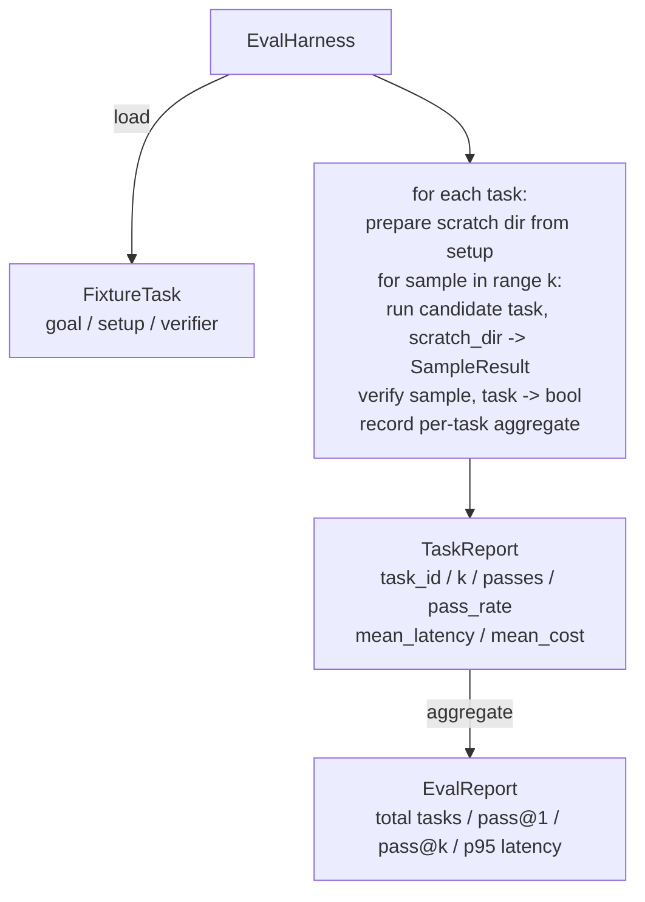

# Bài học 27 của Capstone: 带 gắn dây đeo bằng nhau

> Mức độ của một đại lý lập trình, phụ thuộc vào việc bạn sử dụng để đo lường bộ nhiệm vụ của nó. 本课会构建一个评估链:它接到一个固定任务文件,让候选人运行这些任务,通过确定性的验证器 评定通过或失败,并把结果聚合为 pass@1、pass@k、平均延迟和平均成本──harness 是事实来源,让你能区分回归和反因子──

**Type:** Build
**Languages:** Python (stdlib)
**Prerequisites:** Phase 19 · 25 (verification gates), Phase 19 · 26 (sandbox runner), Phase 14 · 30 (eval-driven agent development), Phase 14 · 19 (SWE-bench and GAIA benchmarks)
**Time:** ~90 minutes

## Mục tiêu học tập

- 将 fixture task 定义为目标、setup 和验证器的三元组──
- Đối với mỗi nhiệm vụ, nhiều lần mẫu chạy 打分,并计算 pass@1 和 pass@k。
- Để phân tích độ trễ và chi phí 聚为 trung bình với số liệu phần trăm 95 
- Sẽ xác định tính xác minh viên (File Diff, Exit Code, Regex match)
- 输出结构化 JSON báo cáo,供回归跟踪脚本 摄取──

## Vấn đề

Không có đánh giá về các tiêu chuẩn xây dựng đại lý, sẽ gặp 3 loại mô hình thất bại.

Thứ nhất là một thông qua chưa được chứng minh. Đại lý nói nó đã sửa lỗi, loài người một cái nhìn khác nhau, đã đặt bộ phận được đánh dấu màu xanh lá cây, 3 tuần sau khi xét nghiệm hồi quy ở ra cùng một lỗi.

Thứ hai là sự lùi lại không được phát hiện. Một lần thay đổi của mẫu đơn giản, để cho đại lý tăng 4% trên nhiệm vụ hiển nhiên, nhưng giảm 14% trên nhiệm vụ tĩnh. Không có số điểm vàng và từng nhiệm vụ, sự lùi sẽ vào chính, cho đến khi khách hàng phàn nàn khi xuất hiện.

Thứ ba là chuyển giao nhiệm vụ theo từng nhiệm vụ. Trong khi đó, thứ 5 chỉ sử dụng 95 nhiệm vụ, vì có người đã đổi tên 5 nhiệm vụ.

Harness là một quy trình chuyển những thất bại này thành sự thật. Nó mỗi lần đều được thực hiện theo thứ tự có thể được thực hiện, và sử dụng một trình xác minh, theo xác định kiểm tra trả lại đúng hoặc sai.

## Khái niệm

```mermaid
flowchart LR
  F1[fixtures/task_001/<br/>task.json + expected/] --> Harness
  F2[fixtures/task_002/<br/>...] --> Harness
  Harness[Harness<br/>for each task:<br/>setup / run agent k samples /<br/>verify each sample /<br/>record latency, cost]
  Harness --> Report[EvalReport<br/>pass@1 / pass@k<br/>mean ms / p95 ms<br/>mean cost]
```

`FixtureTask`là một tập tin JSON nhỏ, cộng với một tùy chọn `expected/`目录──JSON 声明 `id``goal`(给代理的提示)`setup`块(要放入划分 dir 的文件) cũng như `verifier`块──verifier 块指定 harness 块指定 harness 块指定 harness 块指定 harness 块指定 harness 块指定 harness 块指定 harness 块指定 harness 块指定 harness 块指定 harness 块指定 harness 块指定 harness 块指定 harness 块指定 harness 块指定 harness 块指定 harness 块指定 harness 块指定 harness 块指定 harness 块指定 harness 块指定 harness 块指定 harness 块指定 harness 块块指定 harness 块块块指定 harness 块块块指定 harness 块块块的参数 块的参数 块的参数 块的参数 块的参数 块的参数 块的参数 函数

三种验证器 形态覆盖大多数有用任务――

Thứ nhất là:`file_equals`◊agent  sau khi chạy, sẽ xác định các tập tin với nội dung dự kiến so sánh.

Thứ hai là:`regex_match` sẽ xác định nội dung của tệp phù hợp với regex .

Thứ ba là:`shell_exit_zero` Harness 运行一个 shell命令(通过课26的沙盒), chỉ khi lệnh bằng không 退出时才让任务通过──这能捕捉测试必须通过的任务──

Harness sẽ mỗi nhiệm vụ được vận hành`k`次──Pass@k 是 `1 - (1 - p)^k`, trong đó p là tỷ lệ vượt qua kinh nghiệm;harness cũng báo cáo số liệu thô, thuận tiện để bạn phát hiện sự khác biệt.

## Kiến trúc



ứng cử viên là một người có thể gọi:`Callable[[FixtureTask, str], SampleResult]`✿Hành động 通过 ✿`tempfile.mkdtemp()`创建 scratch directory,并把其路径作为普通字符串传入──harness 不关心候选人 如何工作──候选人 可以是确定性的补丁申请者(对 harness自测测试 很有用)、真实LLM代理、fuzzer──契约是 SampleResult──

## Những gì bạn sẽ xây dựng

`main.py`提供:

1. `FixtureTask`Dataclass:
2. `SampleResult`dataclass:success_self_reported、latency_ms、cost_units、edits。
3. 带 `to_dict()`của `TaskReport``EvalReport`Các lớp dữ liệu.
4. 将 xác minh tên 映射到函数 的`VerifierRegistry`内置 xác minh:file_equals、regex_match、shell_exit_zero。
5. `EvalHarness`class。 dùng một ứng cử viên 运行一个任务目录。返回EvalReport。
6. 捆绑在 `tasks/`Trung trong 5 nhiệm vụ cố định:
   - `fizzbuzz`Trung ợ-một
   - `factorial`Trung thiếu thu hồi
   - thông báo lỗi Trung của lỗi gõ
   - 空 cơ thể chức năng
   - Đường xuyên danh sách liên kết 中的 off-by-one
7. Một ứng cử viên tham khảo xác định`apply_known_fixes`),harness sử dụng nó để biểu diễn干净的 pass@1 = 1.0。
8. Demo 打印 EvalReport JSON không có bằng không 退出。

nhiệm vụ cố định 以 `tasks/`Trung  JSON 文件形式捆绑,并配有 `tasks/<id>/buggy/`和 `tasks/<id>/expected/`Trung ồn tài liệu: Harness sẽ buggy  sao chép đến cào dir, đưa nó cho ứng cử viên,并根据预期验证──

## Tại sao sử dụng pass@k, không chỉ pass@1

Thực tế đại lý LLM là tự nhiên.  Pass@1 = 0.6 trông giống như thất bại.  Pass@5 = 0.95    cho thấy đại lý 大多数时候能得到正确答案, nhưng trong các mẫu sớm 上选错了.

Pass@k 会和 pass@1 一起报告,因为 pass@k 会掩盖真实失败: Nếu mô hình 二十次里只有一次得到正确答案,你没有一个有用的代理――harness 会同时展示两者――

## Nó được kết hợp với phần còn lại của Track A

Bài học 25 产出门链―― Bài học 26 产出沙盒―― kề bất cứ thứ gì`shell_exit_zero`kiểm chứng sử dụng sandbox. Bài 28 会把每次 harness run 包进 OTel trace. Bài 29 针对其中一个捆绑装置运行端到端演示,并断言参考候选人的 pass@1 = 1.0。

## 运行方式

```bash
cd phases/19-capstone-projects/27-eval-harness-fixture-tasks
python3 code/main.py
python3 -m pytest code/tests/ -v
```

demo 以 JSON 打印 EvalReport, bao gồm pass@1、pass@5、 trung bình thời gian trễ 和逐任务 breakdown。 mã thoát 为零。tes 覆盖验证器功能、pass@k math、fixture loading,以及 harness 针对捆绑参考候选人的端到端行为──

```figure
pass-at-k
```
