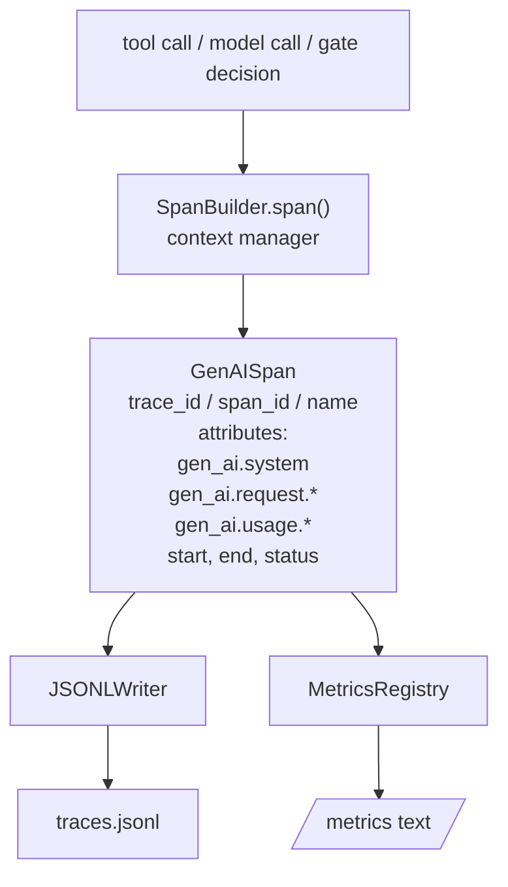
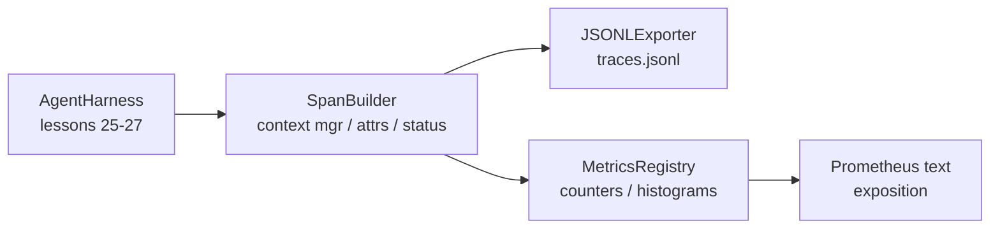

# Bài học 28: Sử dụng OTel GenAI Spans và Prometheus Metrics  đạt được khả năng quan sát

> 无可观察的代理 harness 是一个会花钱的黑盒──本课会手写一个跨度构造器,发发出符合OpenTelemetry GenAI ngữ nghĩa quy ước,把它们写入JSON-Lines文件,每行一个跨度,并以 Prometheus văn bản định dạng 暴露计和 histograms──整个实现都是 stdlib Python,并且可离线运行──

**Type:** Build
**Languages:** Python (stdlib)
**Prerequisites:** Phase 19 · 25 (verification gates), Phase 19 · 26 (sandbox), Phase 19 · 27 (eval harness), Phase 13 · 20 (OpenTelemetry GenAI), Phase 14 · 23 (OTel GenAI conventions)
**Time:** ~90 minutes

## Mục tiêu học tập

- 构建一个符合OpenTelemetry GenAI ngữ nghĩa quy ước 形态的跨度数据类──
- 实现 một nhà xuất khẩu JSONL, mỗi dòng viết vào một khoảng thời gian tự chứa.
- 构建带标签 和 Prometheus văn bản định dạng phơi bày các bộ đếm và histogram
- 用 span context manager 包装 tùy chọn có thể gọi, ghi thời gian, tình trạng và ngoại lệ
- 验证 phát sóng có thể thông qua `json.loads`Đi vòng,并匹配 hình dạng đặc điểm.

## Vấn đề

Mỗi vòng đều sẽ xuất hiện ba loại đồ tạo: một lần gọi mô hình, một lần thực hiện công cụ, cũng như một quyết định cửa kiểm tra. Không có điện từ có cấu trúc, tất cả đều không cần thiết.

Mô hình thất bại thứ nhất là mất dấu vết. Nhưng ghi lại duy nhất là một bản ghi 500 行 trò chuyện. Không ghi lại công cụ nào được chạy.

Thứ hai là mô hình thất bại không thể phân tích được. Harness đã viết các span, nhưng sử dụng tên trường ad-hoc của riêng mình.

Thứ ba, mô hình thất bại là một số liệu không tổng hợp. Bạn có thể thấy một lần gọi công cụ chậm trong các truy vấn, nhưng không thể trả lời được.

OpenTelemetry GenAI các quy ước ngữ nghĩa chính là vì vậy tồn tại. Chúng đã xác định một nhóm các thuộc tính tiêu chuẩn, cho các nhà phát phát phát của các khung LLM khác nhau chia sẻ. Nếu bạn sử dụng các thuộc tính này, tất cả các phần mềm hỗ trợ của OTel đều có thể đọc chúng.

## Khái niệm



Harness Trung trong mỗi hoạt động sẽ tạo ra một span.span  có dấu vết ID của tất cả các đại lý invocation) span id của một hoạt động này) 名称 (ví dụ:`gen_ai.chat``gen_ai.tool.execution`(■ tuân theo các thuộc tính của các quy ước GenAI, thời gian bắt đầu và kết thúc, cũng như tình trạng.

Các quy ước GenAI đã chuẩn hóa các khóa thuộc tính này:`gen_ai.system`(Nhà cung cấp nào, ví dụ `anthropic``openai`)`gen_ai.request.model`(tình hình ID)`gen_ai.request.max_tokens``gen_ai.usage.input_tokens``gen_ai.usage.output_tokens``gen_ai.response.model``gen_ai.response.id``gen_ai.operation.name`, cũng như các khóa cụ thể cho công cụ `gen_ai.tool.name`和 `gen_ai.tool.call.id`

EXPORTER 写 JSONL──每行一个 JSON对象──这是下游工具 可以流、grep 和进口的最简单格式──真实OTel EXPORTER 会使用OTLP gRPC;本课的 JSONL EXPORTER 是离线等价,并且在每个工作站上都以零退出──

Metrics và traces không tồn tại. Mỗi lần gọi công cụ sẽ tăng một bộ đếm:`tools_called_total{tool="read_file"}`◊histogram 记录观察到的延迟:`tool_latency_ms{tool="read_file"}`△两者都会序列化为 Prometheus text exposition format, đây là thực tế tiêu chuẩn của các métrics dựa trên kéo.

## Kiến trúc



span builder là một lớp nhỏ,带有 `span(name, attrs)`Phương pháp, quay lại một quản lý ngữ cảnh;. quản lý ngữ cảnh trong khi nhập 时 ghi bắt đầu thời gian, trong khi thoát 时 ghi kết thúc thời gian, nếu bỏ ra ngoại lệ, hãy thêm vào ngoại lệ này,并把 hoàn thành thời gian 推送给出口者──

Đăng ký số liệu là hai chữ cái.`{(name, frozen_labels): int}`❖Histogram sẽ giữ mẫu nguyên trong danh sách tồn tại, và trong bài phát hiện 时序列化为Prometheus histogram buckets。

## Những gì bạn sẽ xây dựng

`main.py`提供:

1. `GenAISpan`dataclass:trace_id、span_id、parent_span_id、name、attribut、start_unix_nano、end_unix_nano、status、status_message、events。
2. 带 `span(name, attrs, parent=None)`quản lý bối cảnh của `SpanBuilder`lớp học
3. 带 `export(span)`của `JSONLExporter`lớp, thêm viết vào một dòng.
4. `Counter`和 `Histogram`các lớp học,`MetricsRegistry`
5. 生成 văn bản-phát lượng xuất của `prometheus_exposition(registry)`
6. 发发发 span 并 cập nhật métrics của `wrap_tool_call(name)`Nhà trang trí
7. Demo: sintet一次完整代理调用 (tạm dịch: )  (tạm dịch: )  (tạm dịch: )  (tạm dịch: )  (tạm dịch: )  (tạm dịch: )  (tạm dịch: )  (tạm dịch: )  (tạm dịch: )  (tạm dịch: )  (tạm dịch: )  (tạm dịch: )  (tạm dịch: )  (tạm dịch: )  (tạm dịch: )  (tạm dịch: )  (tạm dịch: )  (tạm dịch: )  (tạm dịch: )  (tạm dịch: )  (tạm dịch: )  (tạm dịch: )  (tạm dịch: )  (tạm dịch: )  (tạm dịch: )  (tạm dịch: )

span id 和 trace id là 16 byte hex string, bởi `os.urandom`生成──đây phù hợp với bối cảnh theo dõi W3C của OTel── xuất khẩu 永不抛出; lỗi IO 会被浮现, nhưng khai thác 会 tiếp tục vận hành──

histogram có một nhóm các bộ buýt cố định(OTel đối với độ trễ của milimet giây: 5、10、25、50、100、250、500、1000、2500、5000、10000、+Inf)  Các ví theo danh sách 保存; bài tiếp xúc 会按需计算每个 buýt的数量──

## Tại sao viết bằng tay, thay vì sử dụng opentelemetry-sdk

OTel Python SDK là một sự phụ thuộc thực sự. Nó cũng có hàng ngàn dòng mã ̋otLP xuất khẩu nhiều quá trình, cũng như sẽ bị chìm một phần ngân sách của khóa học runtime cost.

Các quy ước là ổn định. Các định dạng dây phát ra trong bài học này sẽ tiếp tục được phân tích cho đến năm 2030, vì OTel không phá hủy tên thuộc tính GenAI; chúng chỉ sẽ thêm tên mới.

## Nó được kết hợp với phần còn lại của Track A

Bài học 25 产出门链―― Bài học 26 产出沙盒―― Bài học 27 产出 eval harness―― Bài học 28 让这三者都可观测―― Bài học 29 会把端到端的演示的每一步都包进范围,最后打印 Prometheus text――

## 运行方式

```bash
cd phases/19-capstone-projects/28-observability-otel-traces
python3 code/main.py
python3 -m pytest code/tests/ -v
```

Demo sẽ được phát hành trong lớp học này`traces.jsonl`(最后清理), sau đó in ấn ba vòng tròn mẫu, tái in đếm và histogram của Prometheus bài tiết.

```figure
trace-spans
```
