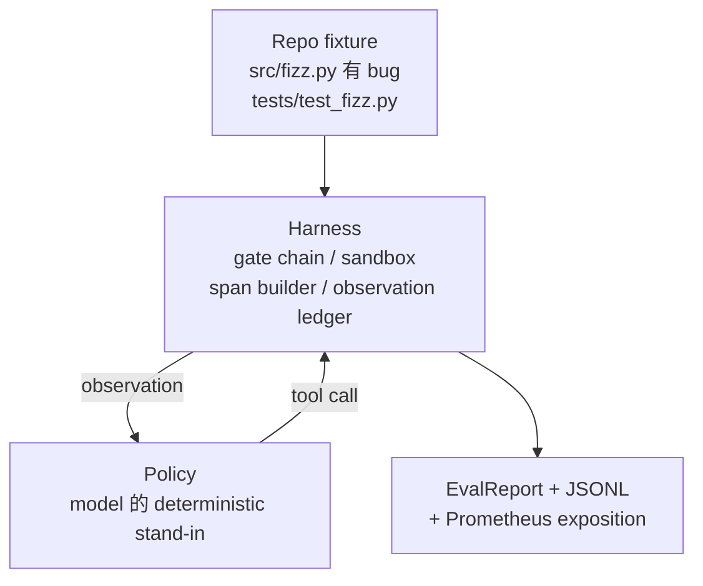
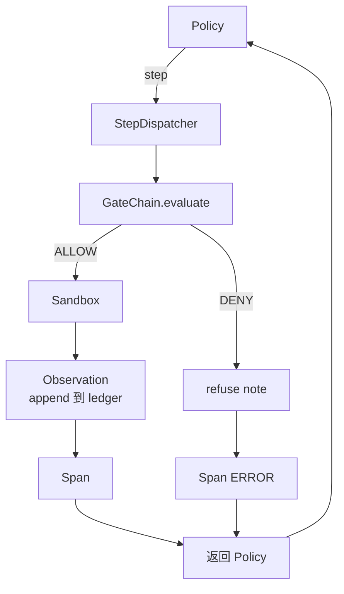

# Capstone  Chương trình 29: Harness 上的端到端 Coding Agent

> Track A's kết quả──本课程把门链、沙盒、eval harness 和 OTel spans 串接成一个可工作的编码代理,用来修复一个多文件Python项目中真实的(小型固定规模)bug──这个代理是确定性政策,不是LLM;这个替换让课程可复现,并说明 harness 才始终是最关键部分──合同 完全相同:真实模型可以插入政策──

**Type:** Build
**Languages:** Python (stdlib)
**Prerequisites:** Phase 19 · 25 (verification gates), Phase 19 · 26 (sandbox), Phase 19 · 27 (eval harness), Phase 19 · 28 (observability), Phase 14 · 38 (verification gates), Phase 14 · 41 (workbench for real repos), Phase 14 · 42 (agent workbench capstone)
**Time:** ~90 minutes

## Mục tiêu học tập

- Để tạo ra chuỗi cổng, hộp cát, dây thắt và bộ xây dựng khoảng thời gian, tạo ra một vòng lặp đơn vị.
- 实现一个使用 read_file、run_tests 和 write_file 修复 cố định chính sách của lỗi cài đặt。
- Trong một kết thúc đến kết thúc hoạt động trong thực hiện toàn bộ ngân sách giai đoạn và ngân sách biểu tượng quan sát.
- Để hoàn chỉnh hoạt động phát triển hoàn chỉnh của OTel GenAI dấu vết và Prometheus métrics.
- Trình kiểm tra trong ít hơn 12 bước trong giải quyết cài đặt, và các công cụ hợp pháp trên không có chuyến đi cổng.

## Vấn đề

Hầu hết các đại lý demo đều là các công việc riêng biệt: một hộp cát độc lập, một vòng đánh giá độc lập, một phát phát phát dài độc lập.

chuỗi cổng  cấp phép, nhưng sandbox vì chuỗi  không có lý do dự đoán được từ chối                                                                                                                                                                                                                                                    

Chương trình này là thử nghiệm tích hợp toàn bộ đường đua. Đại lý phải hoàn thành theo thứ tự bốn điều: đọc dự án, chạy thử nghiệm, từ thất bại thử nghiệm, nhận ra lỗi, viết ra sửa chữa, chạy lại thử nghiệm, sau đó dừng lại. Mỗi hoạt động đều đi qua chuỗi cổng.

## Khái niệm



Chính sách của đại lý là một máy nhà nước.

`SURVEY`:agent 读取 dự án danh sách. 下一个状态 是 RUN_TESTS.

`RUN_TESTS`:agent 运行 test command── nếu các thử nghiệm qua, state machine 以 thành công 停止──否则下一个状态 是 INSPECT──

`INSPECT`:agent 读取失败的源文件──下一个状态是 FIX──

`FIX`:agent 写入修正后的文件──下一个状态是 VERIFY──

`VERIFY`:agent 再次运行 test command── nếu các thử nghiệm qua, thì dừng thành công──否则 dừng với thất bại──

Mỗi quốc gia đều đối phó với một cuộc gọi công cụ. Mỗi cuộc gọi công cụ đều đi qua chuỗi cổng. Nếu một cuộc gọi công cụ nào đó bị từ chối, đại lý sẽ theo dõi báo cáo từ chối và dừng lại.

lỗi thiết bị là `fizz.py`Trung ở ngoài một-một-một── định nghĩa chính sách  thông qua regex Từ test failure message 中检测出 bug,并发出修改后的文件──把 chính sách 替换成 LLM 不会改变利用合同──


```figure
cg-harness-weave
```

## Kiến trúc



Bài học này tự chứa đựng. Mỗi bài học trước tiên học được thực hiện ở các thành phố.`main.py`Trung với quy mô tối thiểu tái thực hiện (gate, sandbox, ledger, span), vì vậy, các bài học này không cần phải nhập vào các em trai và em trai để có thể vận hành.

## Những gì bạn sẽ xây dựng

`main.py`提供:

1. Ước tính của các bài học 25-28 相同:`GateChain``Sandbox``ObservationLedger``SpanBuilder``MetricsRegistry`
2. `CodingAgentPolicy`lớp: chứa 5 tiểu bang của máy nhà nước.
3. `Repo`- Đưa một cái cọp vào trong đó có một bộ phận gắn buggy.
4. `AgentRun`lớp: chính sách lái, thông qua vận chuyển vòng xoay,并返回 `AgentRunReport`
5. Một bộ phận kết hợp`fixture_repo/`), bao gồm src/fizz.py、test/test_fizz.py, cũng như dự kiến/ cây được sử dụng để sử dụng evalu harness
6. Demo:端到端运行 chính sách,印逐步追踪,断言通过,并印测量──

Bộ kết hợp hợp với cấu trúc nhiệm vụ của bài học 27  hình dạng giống nhau: một tệp lỗi và một tệp thử nghiệm. Thông điệp thất bại thử nghiệm chứa đủ thông tin, để chính sách xác định 能识别 fix.

## Tại sao chính sách không phải là LLM

Thực tế LLM  cần API key 网络 call,以及无法验证的 stochasticity──harness 才是本课程关心的一部分──替换为决定主义政策 能让课程在任何开发人员笔记本电脑上运行,零外部依赖,并让测试套件 断言精确的步骤数──

Chính sách của khóa học này là LLM đại lý làm việc trong một tập hợp nghiêm ngặt. Chính sách đọc repo, xem xét thử nghiệm thất bại, nhận ra các dự án, sau đó đưa ra sửa chữa.

## demo 会断言什么

端到端 demo 在退出时断言五件事,test suite cũng sẽ lập trình lại lại chúng.

Chính sách trong vòng 12 bước trong giải quyết sự cố.

Ngân sách quan sát 从未超出──

Các công cụ hợp pháp 上触发了零次门拒绝──(agent 从未凭空发明一个被拒绝的工具名──)

Traces.jsonl trong mỗi bước đều có khoảng thời gian đối phó.

Khám phá Prometheus 包含一个 `tools_called_total{tool="read_file"}`nhập và một `tool_latency_ms`HISTOMGRAM:

## Nó được kết hợp với phần còn lại của Track A

本课程是集成──Lớp 25 编写门链──Lớp 26 编写 sandbox──Lớp 27 编写 eval harness──Lớp 28 编写 observability──Lớp 29 证明它们作为一个系统可以工作──真实代理 harness 从这里扩展:把确定性政策 换成模型,把捆绑的固定 换成实例任务,把 JSONL exporter 换成 OTLP──

## 运行方式

```bash
cd phases/19-capstone-projects/29-end-to-end-coding-task-demo
python3 code/main.py
python3 -m pytest code/tests/ -v
```

Demo 会打印 từng bước dấu vết, báo cáo đánh giá cuối cùng và bài báo Prometheus.
