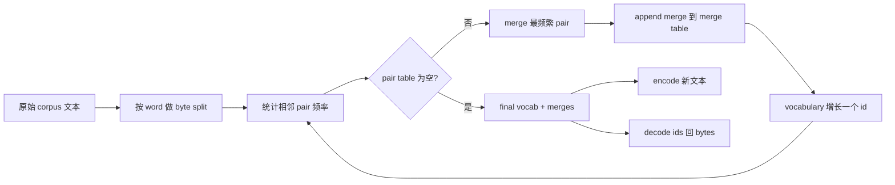
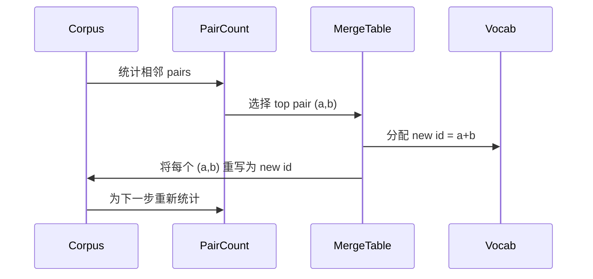

# Từ零 cấu trúc BPE Tokenizer

> 字节进,字节出,字节再回到相同字节──构建每个现代文本模型仍然起步于此的Tokenizer──

**Type:** Build
**Languages:** Python
**Prerequisites:** Phase 04 lessons, Phase 07 transformer lessons
**Time:** ~90 minutes

## Mục tiêu học tập
- 通过反复 merge 最频繁的相邻符号对, từ nguyên bản văn bản corpus 训练 Byte-Pair Mã hóa từ vựng。
- 实现 xác định kết hợp bảng,并将其应用到新文本上,生成字母 id 流──
- Để bất kỳ input UTF-8 往返转换为 id 并恢复,且不丢失信息──
- 保留并保护 mã thông báo đặc biệt`<|endoftext|>``<|pad|>`), để chúng có thể được giữ vững trong đào tạo và giải mã ếch đại.
- 推理为什么字母字节水平是通用Tokenizer的正确下限──


```figure
cap-bpe-merge
```

## Tâm

mô hình ngôn ngữ 永远看不到文本──它 nhìn thấy là số nguyên tố──把 string 映射为整数列并再映射回来的东西,就是Tokenizer──这个层做错了,训练运行中每条 Loss curve都在衡量错误的东西──

Trong mô hình văn bản chung chiếm chủ yếu của các chữ ký Tokenizers 家族是 Byte-Pair Encoding。 идея很小。 Từ một bảng chữ cái đã biết 开始。 tìm thấy cặp biểu tượng hàng xóm xuất hiện thường xuyên nhất trong tập thể dục。把它合并成一个新符号。重复,直到词汇 达到目标大小──编码 新文本会按同顺序重复使用相同的合并列──

Chúng tôi sẽ xây dựng biến thể cấp bayt. Alphabet là 256 byte thô, chứ không phải là các điểm mã Unicode.

## Đường ống



Bên đào tạo 和 bên suy luận 共享 merge table──这个共享就是合同── nếu bạn trong suy luận 时改变 merge order,就会解码出不同的 id 流──

## Biểu đồ byte

Trước 256 IDs Bảo tồn cho các byte thô 0x00 đến 0xFF。 Điều này đảm bảo mỗi chuỗi đầu vào đều có thể được biểu hiện bằng từ vựng trước khi bất kỳ sự kết hợp nào xảy ra。 Sau đó, chúng tôi dành cho các token đặc biệt Bảo tồn một phần nhỏ phạm vi── vòng đào tạo 永远 không đưa ra các ID này như mục tiêu kết hợp, bởi vì chúng tôi sẽ loại bỏ chúng hoàn toàn ngoài dòng tiền công nghệ hóa 。

Pretokenizer 会在训练 见体 之前,按白空间和点击界限 进行分化──如果没有这个分化,BPE merge step 会很乐意学习跨越词界限的合并,词汇会被常见整句短语填满──有这个分化,会留在词内,结果也更能泛化──

## Chuyển tập

Trong mỗi bước đào tạo, vòng làm ba điều. Nó trải qua mỗi từ trong cơ thể, thống kê mỗi cặp biểu tượng hiện tại, và theo từ tự xuất hiện tăng cường tần suất xuất hiện. Nó chọn số lượng cặp cao nhất. Nó viết lại mỗi lần xuất hiện của cặp này thành một biểu tượng mới, ID của nó là một vị trí trống tiếp theo trong từ vựng.



Chi phí của mỗi bước và corpus như danh sách chuỗi biểu tượng biểu hiện thời gian lớn, hiển thị trực tuyến. Đối với một triệu từ và mười ngàn id, vòng lặp sẽ hoàn thành trong vài giây, vì chuỗi biểu tượng sẽ rút ngắn theo cách hợp nhất.

## Mã hóa văn bản tươi

inference 不调用 merge counter──它按学习到的相同顺序应用 merge表── đối với một từ mới, mã hóa từ phân chia octet 开始── nó quét chuỗi hiện tại, tìm vị trí tối thiểu của merge(最早学习到且可应用的那个)── nó thực hiện该 merge──然后再次扫描── trong bảng đó không có bất kỳ merge nào 适用于 chuỗi hiện tại 时,loop 结束──

按排序 排序 属性使编码 xác định, và phù hợp với việc đào tạo trong cùng đầu vào trên hành vi.

## Các token đặc biệt

Các mã thông báo đặc biệt là dòng byte không thể tạo ra mãi mãi. Chúng tôi đang giữ chúng.

- `<|endoftext|>`Trong quá trình đào tạo 期间分隔文件──它告诉模型:一个新文档 从这里开始, đừng để ngữ cảnh của một tài liệu trước 泄漏进来──
- `<|pad|>`填充短序列,让批可以成为矩形 tensor──Loss mask 会在训练期间藏藏它──

mã hóa  chấp nhận một cờ, để cho phép nhập vào xuất hiện các mã thông báo đặc biệt.`<|endoftext|>`和 `<|pad|>`会按拼写它们的字节来标记化. Khi cờ 打开时,字符串 会映射到其保留的ID,并且不会参与任何合并.

## Bảo đảm đi lại

Mã hóa 后再解码 必须精确返回输入字节──decoder 会按顺序拼接每个 id 的字节扩展──由于每个 id 要么是原字节,要么是两个以前已知 id 的连锁,复发式扩展 总会终止于原字节──decoding 随后返回这些字节 拼出的 UTF-8 string──

Bộ thử nghiệm của khóa học này sẽ được tạo thành trong một câu không thể nhìn thấy, một câu chứa emoji Unicode, và một câu chứa chữ`<|endoftext|>`Đơn vị của biểu tượng 上检查这个属性──

## Bài học này không làm gì

Nó sẽ xây dựng các sản phẩm lớn nhất Tokenizers 风格的 regex-driven pretokenizer. Preokenizer trong đây là một không gian trắng nhỏ và phân vùng điểm. Nó đủ để tạo ra các hợp nhất hợp lý trên cơ thể đào tạo nhỏ, và hợp đồng với phần tiếp theo của chuỗi khóa học.

Nó sẽ không song song với số lượng cặp. Trong Python, một vòng làm cho một tập hợp của vài ngàn từ sẽ được hoàn thành trong ít hơn một giây. Đối với các tập thể lớn hơn, cách thức rõ ràng là làm theo thống kê từng cặp từ, sau đó giảm.

## Làm thế nào để đọc mã

`main.py`定义四个物体――`BPETokenizer`Có từ vựng, bảng hợp nhất và bảng đặc biệt.`train`Đó là vòng huấn luyện.`encode`Đó là con đường suy luận.`decode`Đây là một phần của một bản demo. Một phần của một phần demo. Một phần nhỏ của một phần mềm token.`code/tests/test_bpe.py`Trung trong các thử nghiệm đã xác định tính năng đi lại và đi lại, đặt thẻ đặc biệt và sắp xếp hợp nhất.

运行 demo──然后把 demo 中的目标词汇规模从300 改成600,观察 如何下降──那条曲线就是BPE compression curve──
