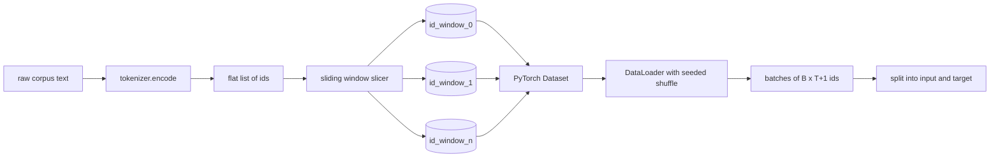
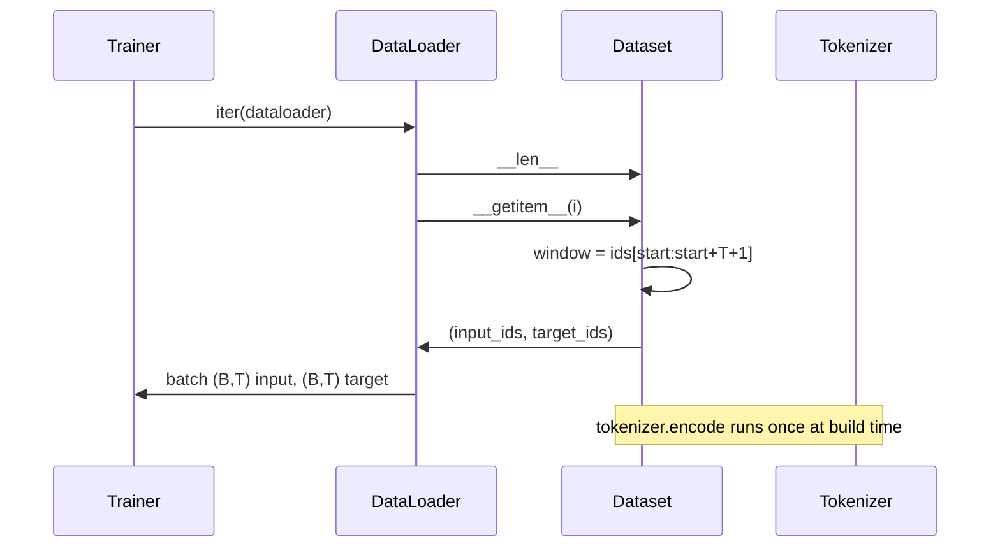

# Sử dụng Sliding Window của Đồ sơ dữ liệu được mã hóa

> Một lần huấn luyện vận hành, là một từ Token ID đến hàm của Gradient.

**Type:** Build
**Languages:** Python
**Prerequisites:** Phase 04 lessons, Phase 07 transformer lessons, 本 phase 的 Lesson 30
**Time:** ~90 分钟

## Mục tiêu học tập


```figure
cap-sliding-window
```
- 通过只调用一次 Tokenizer,把原始 corpus 转换为 Token ids 流──
- Sử dụng bước xếp chồng lên có thể cấu hình, hãy đưa id 流切 thành cửa sổ dài cố định.
- Construct a PyTorch Dataset, cho dự đoán token tiếp theo  trả về đầu vào và các tensor mục tiêu.
- 用 DataLoader 包装 dataset,并使用按时代 设定种子的决定性混动──
- Ưu điểm giữa bước 冗余 và kích thước tập dữ liệu hiệu quả 

## 框架

Một lần trước tập luyện vận hành mỗi lần đọc một loạt mã thông báo,并更新 mô hình.`(B, T)`ID đầu vào 和 `(B, T)`mục tiêu id, trong đó mục tiêu là đầu vào 左移一位;; dữ liệu ống dẫn của công việc, là từ có thể có một số GB trong cơ thể của văn bản nguyên thủy, theo yêu cầu、 định nghĩa 且可复现地 tạo ra hợp đồng này;;

本课会构建这条管道──上一课的 Tokenizer 会将文本转换为一个长长的平 ids 列表──Sliding Window 会把这个列表切成训练示例──自定义数据集 会把示例 暴露于子──DataLoader会把它们组成批量,并使用已知种子 进行混动──

## 形状 hợp đồng

LM nguyên nhân 消费形状为 `(B, T)``B`là kích thước lô,`T`Đó là chiều dài của ngữ cảnh.`t`Mục tiêu là vị trí`t+1`Đó là mỗi bài tập ví dụ                                 `T+1`个原始 ids──window step 控制相邻 ví dụ 之间有多少重叠──



Slicer sẽ không bao giờ vượt qua biên giới của cơ thể. Nếu cửa sổ cuối cùng không có đủ ID, hãy điền vào nó.`T+1`个位置, slicer sẽ bỏ nó đi.`<|pad|>`填充尾部 cũng là một lựa chọn hiệu quả, nhưng nó sẽ làm cho Loss Mask trở nên phức tạp.

## Tại sao sử dụng cửa sổ trượt

预训练 corpus là một dòng dài ID 流―― Nếu mô hình chỉ nhìn thấy cửa sổ không chồng lên, mỗi mô hình đào tạo sẽ dạy nó giống nhau `T`个边界――调整步骤 会移动这些边界,让模型看更多这样的预测下一个标记任务――

bước đi`T`会产生不重叠的窗户――stride 为 `T // 2`会产生百分之五十的重叠,并使有效数据集 翻倍――stride 为 `1`会产生最大重叠,并让数据集 增大 `T`倍──代价是每时代 需要更多的计算──收益是边界多样性更高──大多数预训运行使用等于背景长度的步骤,因为 corpus 已经远大于模型 在一个时代内能跑完的规模,所以边界多样性的论点更弱──

## Nhóm dữ liệu

PyTorch Dataset có hai phương pháp cần thiết.`__len__`返回 ví dụ 数量。`__getitem__`以一对 tensor形式返回一个例子――我们的数据集 存储编码后的 id 流和步骤――对其进行索引时,会即时计算窗口的起点,因此无论步骤 产生多少例,记忆成本都只是一个副本的 id 流――



Thay đổi từng người xảy ra`__getitem__`内部──Dataset 返回 `(input, target)`, trong số đó `input = window[:-1]`- Tôi không biết.`target = window[1:]`Cả hai đều là các tensor dài PyTorch.

## Đánh trộn quyết định

Sử dụng `shuffle=True`của DataLoader 会从 PyTorch 读取──通过传入一个按时代 设定种子的显式 `torch.Generator`, mỗi lần khởi động lại đều có thể nhận được sự nhầm lẫn tương tự. Khi bạn muốn so sánh hai chỉ với một siêu tham số, đặc tính này rất quan trọng.

Hợp đồng hạt giống của 本课 很简单.`epoch_seed = base_seed + epoch_index` hạt giống cơ bản trong quá trình xây dựng  chỉ số thời đại bởi huấn luyện viên trong mỗi thời đại  tăng trưởng  sử dụng giống giống giống cơ bản 重新运行,总会在每个时代看到相同顺序──

## Máy lấy mẫu lô

Phác thảo của PyTorch sẽ không trả lời bất cứ thứ gì.`B`Thứ hai`__getitem__`Không xếp kết quả để lắp ráp một lô. Vì mỗi ví dụ trong cấu trúc có cùng độ dài, do đó không cần logic đệm.

本课为了简单起见保留 `num_workers=0`Trong quá trình sản xuất, công nhân sẽ được hợp tác.`__getitem__`Đối với đường ống của chúng tôi, đây là cơ bản là không hoạt động, vì công việc chỉ là làm một mảnh với tensor trong bộ nhớ, nhưng cùng một API Dataset có thể làm sạch để hỗ trợ lao động.

## 计算 ví dụ

对于长度为 `N` 流                                                                                                                                                                                                                                                             `T`和 bước `S`, ví dụ số lượng là `max(0, 1 + (N - (T + 1)) // S)` 本课把这个计算暴露为数据集上的静态方法,这样教练可以不过代代就计算每时代的总步骤

## 本课不做什么

Nó sẽ không được mã hóa hoàn toàn từ đĩa streaming. Trong bộ nhớ, nó sẽ được lưu trữ như một tensor đơn. Đối với vài triệu id, nó còn thấp hơn một trăm MB, và có hình dạng phù hợp với bản học.

Nó không xử lý nhiều tài liệu. Cục được xem là một dòng id liên tục. Khi cục được xây dựng từ nhiều tài liệu, sẽ được nhúng vào.`<|endoftext|>`IDs 来编码下文边界――模型 会学习围绕边界进行预测――

## 如何阅读代码

`main.py`定义了两个类和一个助手.`SlidingWindowDataset`Đó là bộ dữ liệu PyTorch.`make_dataloader`Trở lại một bộ tải dữ liệu được cấu hình tốt,并带有种子发电机.`_encode_corpus_to_ids`là một lần gọi Tokenizer.`code/tests/test_dataset.py`Các thử nghiệm trung ợ ợ ợ ợ ợ ợ ợ ợ ợ ợ ợ ợ ợ ợ ợ ợ ợ ợ ợ ợ ợ ợ ợ ợ ợ ợ ợ ợ ợ ợ ợ ợ ợ ợ ợ ợ ợ ợ ợ ợ ợ ợ ợ ợ ợ ợ ợ ợ ợ ợ ợ ợ ợ ợ ợ ợ ợ ợ ợ ợ ợ ợ ợ ợ ợ ợ ợ ợ ợ ợ ợ ợ ợ ợ ợ ợ ợ ợ ợ ợ ợ ợ ợ ợ ợ ợ ợ ợ ợ ợ ợ ợ ợ ợ ợ ợ ợ ợ ợ ợ ợ ợ ợ ợ ợ ợ ợ ợ ợ ợ ợ ợ ợ ợ ợ ợ ợ ợ ợ ợ ợ ợ ợ ợ ợ ợ ợ ợ ợ ợ ợ ợ ợ ợ ợ ợ ợ ợ ợ ợ ợ ợ ợ ợ ợ ợ ợ ợ ợ ợ ợ ợ ợ ợ ợ ợ ợ ợ ợ ợ ợ ợ ợ ợ ợ ợ ợ ợ ợ ợ ợ ợ ợ ợ ợ ợ ợ ợ ợ ợ ợ ợ ợ ợ ợ ợ ợ ợ ợ ợ ợ ợ                                                                                                                          

运行 demo──然后把语境长度从16 改为 32,观察每个时代的例子 数量如何下降──这个数字就是你的阶段按时代预算──
