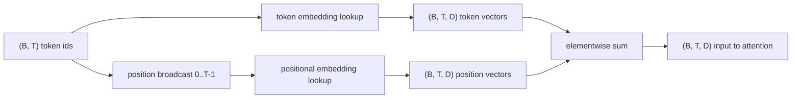
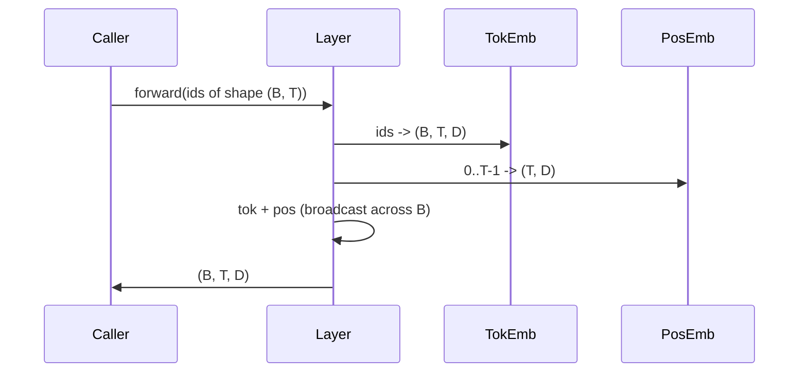

# Địa chỉ và Địa vị

> ID là số nguyên. mô hình cần vector. hai张 tìm kiếm bảng nằm giữa hai người.

**Type:** Build
**Languages:** Python
**Prerequisites:** Phase 04 lessons, Phase 07 transformer lessons, 本 phase 的 Lessons 30 和 31
**Time:** ~90 分钟

## Mục tiêu học tập


```figure
cc-embedding-lookup
```
- 构建一个代号嵌入式查找表,把词汇IDs 映射到密集向量──
- 构建一个按位置索引的学习位置嵌入式查找表──
- 构建一个按位置索引、没有参数的固定 sinusoidal positional embedding──
- 把 Token và vị trí nhúng 组合成 Transformer block một đầu vào
- Đối với học và pha trục được nhúng trong chiều dài tổng quát và số lượng tham số trên khác biệt.

## 框架

Lần đầu tiên tiếp xúc với mã thông báo, được thực hiện trong mã thông báo-đã nhúng trong matrix.

Địa chỉ ID 本身无序.模型 需要第二信号,告诉它位置一 不同于位置十七. 这个信号的两种主流选择是学习位置嵌入 (嵌入) 两个张查找表,每个位置一行) 和固定突状位置嵌入 (嵌入) 一个没有参数的数学公式.`SinusoidalPositionalEmbedding` 会在`max_context_length`预计算一张固定 table, của nó `forward`Sẽ được tăng lên hơn biên giới này; do đó, ở đây hai mô-đun sẽ bắt buộc thực hiện chiều dài ngữ cảnh tối đa.

Bài học này sẽ xây dựng hai, và đưa chúng vào cùng với token embedding 组合成

## 形状 hợp đồng

                                                                                                                                                                                                                                                              `(B, T)`                                                                                                                                                                                                                                                              `(B, T, D)`của tensor, trong đó `D`là kích thước mô hình. Mỗi phần tử hàng đều có cùng chiều dài ngữ cảnh.`T` Mỗi vị trí đều có cùng chiều hướng vector `D`



组合方式是 sum, không phải là kết nối.`D`Trong mạng, giữ nguyên,并让 mô hình dựa trên mỗi tính năng quyết định ý nghĩa hoặc vị trí của biểu tượng trong mỗi tầng chiếm ưu thế.

## Mã mã hóa nhúng Matrix

Đơn vị nhúng là một hình dạng`(V, D)`của các tham số tensor, trong đó `V`Đó là quy mô từ vựng.`nn.Embedding(V, D)`暴露它──init 时 时 条目 从一个小高西亚 中抽取, đối với mô hình quy mô biến thể, truyền thống có nghĩa là 为零, lệch tiêu chuẩn 约为`0.02`❖ Định rõ init không quan trọng, quan trọng là nó phù hợp giữa các hoạt động khác nhau.

đi về phía trước là một lần chỉ mục hoạt động.`(B, T)`int64 ids 映射为 `(B, T, D)`floats──backward pass 只有将渐进积累到前进通过 中被触碰过的行──两个从未出现的行 在该阶段 收到零渐进──

Một chi tiết nhỏ nhỏ. Một phần nhỏ của việc gắn mã và một phần cuối của mô hình dự đoán đầu ra thường chia sẻ trọng lượng.

## Học được việc tích hợp vị trí

Học được việc tích hợp vị trí là thứ hai `nn.Embedding`, hình dạng`(max_context_length, D)`❖ nhìn từ vị trí id `0, 1, 2, ..., T-1`Như một khóa. Chuyển tiếp.

Đồ học của thiếu điểm là, nếu mô hình chỉ tập luyện đến vị trí `T-1`, nó không thể tìm kiếm vị trí `T`那一行不存在──使用这种方案的生产单独解码模型会把最大的文本长度进建筑,并拒绝处理更长输入──

## Thiết lập vị trí chân lưng

Sự nhúng vị trí sinusoidal là từ vị trí đến hàm của vector.`p`和 tính năng `i` tạo ra:

```python
angle = p / (10000 ** (2 * (i // 2) / D))
emb[p, 2k]     = sin(angle)
emb[p, 2k + 1] = cos(angle)
```

Hàm này không có tham số. Mỗi vị trí đều có một Dường Đường Đường Đường Đường Đường Đường Đường.

由同时选择 `sin`和 `cos` nhận được tính chất là, vị trí `p + k`处的向量是位置 `p`处 Vector's linear function── đây cung cấp một lớp chú ý  một cách đơn giản để học các phương pháp bù đắp vị trí tương đối── mô hình không cần một tham số riêng biệt để biểu hiện 向后看五个代币──

Bài học này sẽ được xây dựng trong khi tính toán toàn bộ bảng sinus một lần, và hướng dẫn nó trước.

## 组合

đường ống đầu vào 按顺序做三件事──读取 Token ids──查找 token vector──加上位置 vector──返回 sum──



Sum step 中的广播 会沿批量尺寸 复制 `(T, D)`Tăng áp vị trí──PyTorch 会 tự động xử lý, vì tensor vị trí trong dạng không nén 后为`(1, T, D)`

## Đối với phân tích so sánh

本课会在相同输入上运行两种变体,并打印两种诊断――

Thứ nhất là số lượng tham số. Phân biến được học sẽ được tích hợp token tăng lên.`max_context_length * D`个参数──sinusoidal variant 增加零个──

Thứ hai là sự tương đồng cosine giữa các nhúng của các vị trí lân cận. Phụ thể sinus có sự suy giảm dễ dàng và có thể dự đoán, vì hàm là liên tục. Phụ thể học được có sự tương đồng gần như bất thường khi bắt đầu, vì các hàng là tách rời. Sau khi luyện tập, biến thể học được thường phát triển thành cấu trúc dễ dàng tương tự, nhưng nó phải tìm thấy cấu trúc này từ dữ liệu.

## 本课不做什么

Nó sẽ không xây dựng mã hóa vị trí xoay (RoPE) hoặc AliBi. Chúng là sản xuất của các biến thể trong sự lựa chọn hiện đại. Chúng đều theo các nhúng tương tự của hợp đồng hình dạng.`(B, T, D)`Các vector  ứng dụng tùy thuộc vào vị trí của chuyển đổi), nhưng chúng được áp dụng trong bước chiếu chú ý, chứ không phải đầu vào.

Nó không phải là tập luyện để nhúng vào. Trình luyện cần mất mát.

## 如何阅读代码

`main.py`定义了三个模块――`TokenEmbedding`包装 `nn.Embedding(V, D)``LearnedPositionalEmbedding`包装 `nn.Embedding(L, D)``SinusoidalPositionalEmbedding`预计算表,并把它暴露为缓冲.`EmbeddingComposer`Hãy đặt biểu tượng và vị trí gắn kết với nhau.`code/tests/test_embeddings.py`Các thử nghiệm trong số đó đã xác định hình dạng, hành vi phát sóng, số parameter và công thức hình âm.

运行 demo──然后把 mô hình kích thước `D`Từ 64 改为 32, quan sát các băng tần sóng hình âm 如何变化──
