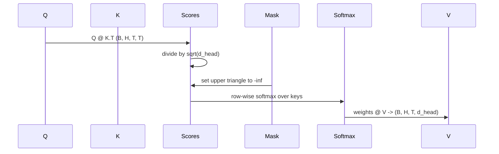

# Sự chú ý nhiều người

> Một hình ảnh, 3 hình ảnh, đầu, một mặt nạ.

**Type:** Build
**Languages:** Python
**Prerequisites:** Phase 04 lessons, Phase 07 transformer lessons, Lessons 30 through 32 of this phase
**Time:** ~90 minutes

## Mục tiêu học tập
- Để thực hiện lượng Query/Key/Value 投影 thành một lớp tính, và chia thành H 个 head.
- Sử dụng đúng sự phân tích và dtype  xử lý tính toán quy mô chú ý sản phẩm điểm-
-  áp dụng mặt nạ nguyên nhân, ngăn chặn một vị trí quan tâm đến vị trí tương lai.
- 检查固定输入下 Mỗi đầu của trọng lượng chú ý,并推理 mỗi đầu 关注的内容──
- Trong nhiệm vụ đồ chơi 上训练 một khối chú ý nhỏ, quan sát Loss 随着各头 专门化而下降──


```figure
cap-multihead-attention
```

## Tâm

Attention là một hàm, nó cho phép biểu hiện của một token có thể thu được thông tin từ các token khác trong cùng chuỗi.

Mẫu thực hiện hiệu quả cao là sử dụng một lớp tính từ `D`投影到 `3 * D`, cắt lại thành 3 hình ảnh, sau đó hình thành lại thành H 个头, mỗi kích thước nhỏ`D // H`◊mức độ mỏng và tăng lực và tất cả như khối lượng tensor 操作 执行, do đó mỗi đầu có thể trên bộ đẩy và chạy trên ◊

本课会构建这个块――它也会加入因果化面膜,使同一段代码可以作为单独编码语言模型 中的注意层使用――下课会把这个块 堆叠成完整的变压器,再下课会训练它――

## Hợp đồng hình dạng

输入是 `(B, T, D)`   `(B, T, D)`✿ mặt nạ ✿`(T, T)`, hoặc có thể phát sóng đến nó. Trong khối, hình dạng của tensor trung gian là`(B, H, T, d_head)`, trong số đó `d_head = D // H`约束条件是 `D % H == 0`

```mermaid
flowchart LR
    A["(B, T, D) 输入"] --> B[Linear D -> 3D]
    B --> C["拆分为 Q, K, V"]
    C --> D["reshape 为 (B, H, T, d_head)"]
    D --> E["scores = Q @ K.T / sqrt(d_head)"]
    E --> F[应用 causal mask]
    F --> G[对 keys 做 softmax]
    G --> H["context = weights @ V"]
    H --> I["reshape 为 (B, T, D)"]
    I --> J[输出 Linear D -> D]
    J --> K["(B, T, D) 输出"]
```



两个线性层(QKV chiếu và đầu ra chiếu) là khối trong khối duy nhất của các参数── mặt nạ、softmax、matmuls 和 reshapes đều không có参数──

## Sự chia rẽ của QKV

朴实实现将有三个独立线性层,分别用于 Q、K 和 V──高效实现只有一个层,输出 `3 * D`个特征并分分结果──二者在数学上等价,因为三分乘以 `(D, D)`Ưu điểm của các nhân vật tử hình, đúng như một lần được nhân bởi chúng được xếp chồng lên`(3D, D)`权重的矩阵乘法──

High efficiency version nhanh hơn, vì bộ tăng tốc chỉ khởi động một lần matmul, thay vì ba lần. Nó cũng dễ dàng hơn để khởi động, vì ba phần tử Matrix nằm trong cùng một tensor tham số, có thể cùng khởi động.

## Đầu hình dạng lại

Sau khi chia tay, tôi đã biết.`(B, T, D)`Để biến nó thành một đường H 个 ở bên nhau`(B, T, H, d_head)`, tái chuyển đổi vì `(B, H, T, d_head)`△ đầu 维度现在位于批量旁边, vì vậy PyTorch 会把每头关注 视为跨 `B * H`Một ví dụ độc lập về hoạt động hàng loạt.

`d_head`维度 giữ ở cuối cùng, do đó điểm số matmul `Q @ K.transpose(-2, -1)`Sẽ thu hẹp lên chiều kích này. Kết quả là:`(B, H, T, T)`Điểm chú ý mỗi đầu của người:

## Tăng quy mô

điểm sẽ được giảm nhẹ`sqrt(d_head)`Nếu không có quy mô này, các sản phẩm điểm sẽ đi theo.`d_head`增大而增大, đưa softmax 推到一种 quasi-all qualities are concentrated on one item 其他条目 are nearing to disappear                                                                                                                                                                                                                                              `sqrt(d_head)`Hãy để điểm số khác nhau ở kích thước đầu khác nhau

## Mặt nạ nguyên nhân

Mô hình ngôn ngữ chỉ có trình giải mã trong dự đoán trong giao thức giao thức giao thức giao thức giao thức giao thức giao thức giao thức giao thức giao thức giao thức giao thức giao thức giao thức giao thức giao thức giao thức giao thức giao thức giao thức giao thức giao thức giao thức giao thức giao thức giao thức giao thức giao thức giao thức giao thức giao thức giao thức giao thức giao thức giao thức giao thức giao thức giao thức giao thức giao thức giao thức giao thức giao thức giao thức giao thức giao thức giao thức giao thức giao thức giao thức giao thức giao thức giao thức giao thức giao thức giao thức giao thức giao thức giao thức giao thức giao thức giao thức giao thức giao thức giao thức giao thức giao thức giao thức giao thức giao thức giao thức giao thức giao thức giao thức giao thức giao thức giao thức giao thức giao thức giao thức giao thức giao thức giao thức giao thức giao thức giao thức giao thức giao thức giao thức giao thức giao thức giao thức giao thức giao thức giao thức giao thức giao thức giao thức giao thức giao dịch giao thức giao thức giao dịch giao dịch giao dịch giao dịch giao dịch giao dịch giao dịch giao dịch giao dịch giao dịch giao dịch giao dịch giao dịch giao dịch giao dịch giao dịch giao dịch giao dịch giao dịch giao dịch giao dịch giao dịch giao dịch giao dịch giao dịch giao dịch giao dịch giao dịch giao dịch giao dịch giao dịch giao dịch giao dịch giao dịch giao dịch giao dịch giao dịch giao dịch giao dịch giao dịch giao dịch giao dịch giao dịch giao dịch giao dịch giao dịch giao dịch`(T, T)`điểm Matrix đối với mỗi mục trên đường góc đều được thay thế thành âm không穷――softmax  sau đó, trọng lượng của các vị trí này sẽ biến thành không――



Chúng tôi đã đăng ký mặt nạ trong quá trình xây dựng để bú đer, vì vậy nó sẽ nằm trên cùng một thiết bị, và không phải là một phần của biểu đồ Gradient.`(T, T)`Khu vực:

## Dự án đầu ra

 nhận được các vector ngữ cảnh mỗi đầu `(B, H, T, d_head)`后,我们 chuyển回 `(B, T, H, d_head)`, đổi hình vì `(B, T, D)`,并 áp dụng cuối cùng `(D, D)`线性投影──output projection 让模型可以混合各个头――没有它,H个头只能通过后层重组,块会受到人为限制──

## Kiểm tra trọng lượng chú ý

Bài học này được chuyển tiếp lên một bài học`return_weights=True`Đường cờ,đài đặt,đài chặn sẽ ở bên ngoài xuất phát và quay lại hình dạng vì`(B, H, T, T)`Ưu điểm của mỗi đầu Ưu điểm trọng lượng Ưu điểm trọng lượng Ưu điểm Ưu điểm trọng lượng Ưu điểm trọng lượng Ưu điểm trọng lượng Ưu điểm trọng lượng Ưu điểm trọng lượng Ưu điểm trọng lượng Ưu điểm trọng lượng Ưu điểm trọng lượng Ưu điểm trọng lượng Ưu điểm trọng lượng Ưu điểm trọng lượng Ưu điểm trọng lượng Ưu điểm trọng lượng Ưu điểm trọng lượng Ưu điểm trọng lượng Ưu điểm trọng lượng Ưu điểm trọng lượng Ưu điểm trọng lượng Ưu điểm trọng lượng Ưu điểm trọng lượng Ưu điểm trọng lượng Ưu điểm trọng lượng Ưu điểm trọng lượng Ưu điểm trọng lượng Ưu điểm trọng lượng Ưu điểm trọng lượng Ưu điểm trọng lượng Ưu điểm trọng lượng Ưu điểm trọng lượng Ưu điểm trọng lượng Ưu điểm trọng lượng Ưu điểm trọng lượng Ưu điểm trọng lượng Ưu điểm trọng lượng Ưu điểm trọng điểm Ưu điểm trọng điểm Ưu điểm trọng điểm trọng lượng Ưu điểm trọng điểm Ưu điểm Ưu điểm Ưu điểm

Trong mô hình được đào tạo tốt, một số đầu sẽ tập trung vào một mô hình khác nhau. Một số đầu sẽ tập trung vào một đầu đầu đầu đầu đầu đầu đầu đầu đầu đầu đầu đầu đầu đầu đầu đầu đầu đầu đầu đầu đầu đầu đầu đầu đầu đầu đầu đầu đầu đầu đầu đầu đầu đầu đầu đầu đầu đầu đầu đầu đầu đầu đầu đầu đầu đầu đầu đầu đầu đầu đầu đầu đầu đầu đầu đầu đầu đầu đầu đầu đầu đầu đầu đầu đầu đầu đầu đầu đầu đầu đầu đầu đầu đầu đầu đầu đầu đầu đầu đầu đầu đầu đầu đầu đầu đầu đầu đầu đầu đầu đầu đầu đầu đầu đầu đầu đầu đầu đầu đầu đầu đầu đầu đầu đầu đầu đầu đầu đầu đầu đầu đầu đầu đầu đầu đầu đầu đầu đầu đầu đầu đầu đầu đầu đầu đầu đầu đầu đầu đầu đầu đầu đầu đầu đầu đầu đầu đầu đầu đầu đầu đầu đầu đầu đầu đầu đầu đầu đầu đầu đầu đầu đầu đầu đầu đầu đầu đầu đầu đầu đầu đầu đầu đầu đầu đầu đầu đầu đầu đầu đầu đầu đầu đầu đầu đầu đầu đầu đầu đầu đầu đầu đầu đầu đầu đầu đầu đầu đầu đầu đầu đầu đầu đầu đầu đầu đầu đầu đầu đầu đầu đầu đầu đầu đầu đầu đầu đầu đầu đầu đầu đầu đầu đầu đầu đầu đầu đầu đầu đầu đầu đầu đầu đầu đầu đầu đầu đầu đầu đầu đầu đầu đầu đầu đầu đầu đầu đầu đầu đầu đầu đầu đầu đầu đầu đầu đầu đầu đầu đầu đầu đầu đầu đầu đầu đầu đầu đầu đầu đầu đầu đầu đầu đầu đầu đầu đầu đầu đầu đầu đầu đầu đầu đầu đầu đầu đầu đầu đầu đầu đầu đầu đầu đầu đầu đầu đầu đầu đầu đầu đầu đầu đầu đầu đầu đầu đầu đầu đầu đầu đầu đầu đầu đầu đầu đầu đầu đầu đầu đầu đầu đầu đầu đầu đầu đầu đầu đầu đầu đầu đầu đầu đầu đầu đầu đầu đầu đầu đầu đầu đầu đầu đầu đầu đầu đầu đầu đầu đầu đầu đầu đầu đầu đầu đầu đầu đầu đầu đầu đầu đầu đầu đầu đầu đầu đầu đầu đầu đầu đầu đầu đầu đầu đầu đầu đầu đầu đầu đầu đầu đầu đầu đầu đầu đầu đầu đầu đầu đầu đầu đầu đầu đầu đầu đầu đầu đầu đầu đầu đầu đầu đầu đầu đầu đầu đầu đầu đầu đầu đầu đầu đầu đầu đầu đầu đầu đầu đầu đầu đầu đầu đầu đầu đầu đầu đầu đầu đầu đầu đầu đầu đầu đầu đầu đầu đầu đầu đầu đầu đầu đầu đầu đầu đầu đầu đầu đầu đầu đầu đầu đầu đầu đầu đầu đầu đầu đầu đầu đầu đầu đầu đầu đầu đầu đầu đầu đầu đầu đầu đầu đầu đầu đầu đầu đầu đầu đầu đầu đầu đầu đầu đầu đầu đầu đầu đầu đầu đầu đầu đầu đầu

## Đạo diễn tập luyện

`main.py`底部的演示会把注意区块 接到一个很小的LM头,然后重复任务 上训练整个模型──输入中的每行都是随机 id,在整个上下文中复制──目标是右移一个人的输入,所以模型必须学会下一个代币与前一个代币相似──损失是交叉化──使用H=4、D=32、T=12 和大小为64的词汇时,Loss会在CPU上 经过三个时代后从随机水平约`log(64) ~ 4.16`) giảm xuống còn thấp hơn`1.0`

Mục đích của demo không phải là đào tạo một mô hình hữu ích. Mục đích là xác định từng phần của khối được chuyển qua, và mỗi đầu có thể học được một thứ gì đó trên một câu hỏi rõ ràng.

## Bài học này không làm gì

Nó sẽ không thêm vào khối chuyển tiếp tiếp. Lớp biến thể trong mô hình thực tế là Attention 后接两层 MLP, và mỗi phần xung quanh có kết nối dư thừa và chuẩn lớp.

Nó sẽ không thực hiện mã hóa vị trí xoay hoặc AliBi. Các thứ hai đều được áp dụng trong các bước dự đoán QKV của cùng một khối, nhưng chúng là các đơn vị giảng dạy độc lập.

Nó sẽ không thể thực hiện suy luận sử dụng cache KV.

## Làm thế nào để đọc mã

`main.py`定义了 `MultiHeadSelfAttention` Chuyện này bao gồm hai lớp 线性层和一个注册的面具缓冲――前传会次执行投影、重型、重点、重量、重量、重量、重量,并重型,并重型──底部的演示 构建一个小模型,使用 Token 和位置嵌入以及 LM head 包装 注意,在复制任务上训练三个时代,并打印损失曲线 和按头注意热图──`code/tests/test_attention.py`Trung trong các thử nghiệm đã cố định hình dạng hợp đồng tính chất nguyên nhân tính chất mềmmax tính chất đầu chia và dòng chảy cấp độ.

运行 demo―然后把 `n_heads`Từ 4  tăng lên 8                                                                                                                                                                                                                                                                                                                                                                                                                                                                                                                        `d_model=32`, vì vậy `d_head=4`), để xem heatmap 如何变化──
