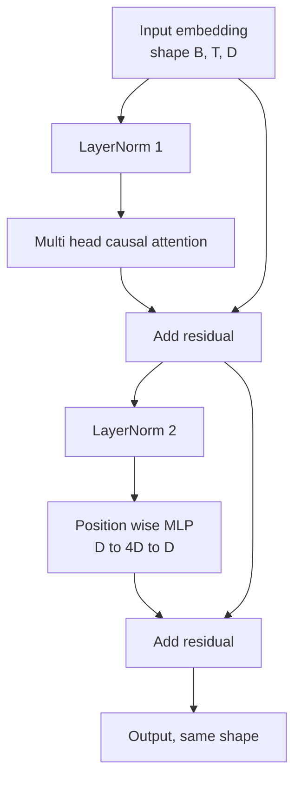
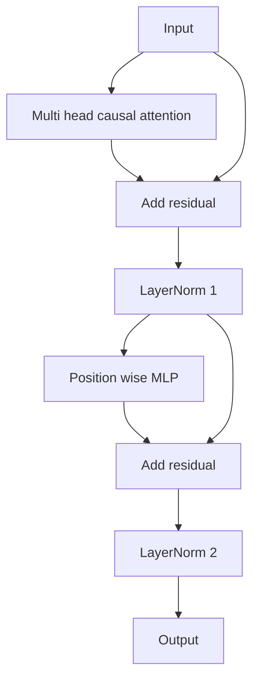

# Từ zero thực hiện khối Transformer

> Một khối là các đơn vị cơ bản của mỗi decoder hiện đại LLM. Một khối là các đơn vị cơ bản của LLM.

**Type:** Build
**Languages:** Python
**Prerequisites:** Phase 19 lessons 30 to 33 (tokenizer, embeddings, attention math, batched data loader)
**Time:** ~90 minutes

## Mục tiêu học tập

- Từ bốn bộ phận vận động cấu trúc trong PyTorch khối biến thể:LayerNorm, đa đầu chú ý nguyên nhân, kết nối dư thừa, vị trí thông minh MLP,
- 将 LayerNorms  đặt trong hai cấu hình (pre-LN và post-LN),并解释 tại sao một trong số đó không cần được sưởi ấm cũng có thể được tập luyện ổn định.
- Trong nhiều đầu chú ý trong thực hiện nhân quả che giấu, làm cho Token `i`Không thấy token `j > i`
- Theo 12 lớp xếp hàng giữa hai biến thể dòng chảy, không dựa vào các thuật ngữ
- Trong next class 组装 1.24 tỷ số GPT, hãy xem khối này như đơn vị có thể thay thế trực tiếp.

## Vấn đề

transformator là lặp lại một khối. Nếu khối này một lần bắt đầu đã sai, lặp lại hai lần, mô hình bạn nhận được hoặc trong thời đại đầu tiên đã phát triển, hoặc là tất cả các phương pháp cần được làm nóng.

Một khi nhìn rõ, sửa chữa là cơ khí. Bảng này 恰恰 có hai con đường dư và hai vị trí bình thường hóa.

## Khái niệm

Mỗi bộ giải mã chỉ khối biến đổi đều là một hàm, nó nhận hình dạng vì `(batch, sequence, embedding)`của tensor,并返回相同的形状的 tensor── bên trong由两个子层 完成工作──



Đây là pre-LN 变体──LayerNorm  nằm trong nhánh dư thừa 内部,在子层 之前── dư thừa kết nối 会把未归一化的信号向前传递──

sau LN 变体会把 LayerNorm 移到残留添加 之后──



hình dạng hoàn toàn giống nhau. Hành vi tập luyện không giống nhau. Sử dụng sau LN.`3e-4`下, Gradient 会缩小得足够快, đến mức cần lịch trình nóng lên. Pre-LN 让残路保持未归化, do đó Gradient 能干净地传播到嵌入层.

### Sự chú ý về nguyên nhân đa đầu

Attention sublayer sẽ đưa vào trong 3 cách để chiếu vào các tensor giá trị.`(B, T, D)`hình thành lại đến`(B, H, T, D/H)`, trong số đó `H`                                                                                                                                                                                                                                                              `softmax(Q K^T / sqrt(d_k))`, Đặt mặt nạ trên góc để không bị mất, thông qua mặt nạ mềm, rồi nhân lên`V`✿ Đầu sẽ được đinh lại một lần ✿`(B, T, D)`Tensor,并再次投投影──mask là để mô hình có tính kết quả duy nhất── quên mặt nạ là trong việc tập luyện một mô hình sẽ lừa dối──

### MLP

MLP 会把同一个两层网络独立应用到每个代币──隐藏宽是嵌入宽的四倍,激活是 GELU,并且在第二线线的后接落――MLP 内部没有代币相互交流──所有代币混合都发生在注意中──

### Các kết nối còn lại làm hai điều

Chúng làm cho đường độ cao độ của các cấp độ trở thành hình thức gia tăng, do đó giữ được quy mô của các chuẩn độ cao qua 12 tầng. Chúng cũng cho phép mỗi khối học tập về sự gia tăng của đại diện trong hoạt động, thay vì thay thế hoàn toàn.


```figure
cc-transformer-block
```

## Hãy xây dựng nó

`code/main.py`实现:

- `class LayerNorm`,带可学习的规模 和 shift、偏见 eps,并 áp dụng cho mỗi Địa chỉ Vector。
- `class MultiHeadAttention`,带 `num_heads``head_dim = d_model // num_heads`、đối hợp chiếu QKV、注册的因果化面具、注意失落 和残留失落──
- `class FeedForward`, bao gồm hai tầng đường, kích hoạt GELU và bỏ qua.
- `class TransformerBlock`,带 `pre_ln`cờ, được sử dụng để trao đổi giữa hai biến thể.
- Một demo, xây dựng 6 lớp pre-LN stack và 6 lớp post-LN stack, sử dụng cùng một输入,并打印 (a) hình dạng đầu ra,(b) Một lần ngược qua 后 后 嵌入处的 Gradient norma。

运行 nó:

```bash
python3 code/main.py
```

输出: kiểm tra hình dạng của hai chồng, cũng như các chuẩn Gradient của并排.

## Thống

- `torch`Sử dụng toán học tensor, tự cấp và`nn.Module`ống nước
- Không sử dụng `transformers`, không sử dụng trọng lượng được huấn luyện trước.

## Các mô hình sản xuất trong tự nhiên

Ba mô hình sẽ biến khối trong sách giáo khoa thành thứ có thể giao.

**Fused QKV projection.**Ba tầng tự do sẽ tiêu thụ ba lần khởi động hạt nhân và ba lần kết hợp.`3 * d_model`Lớp đường bộ có thể hoàn thành cùng một công việc trong một lần phóng, sau đó dọc theo trục cuối cùng  phân chia ra và ra.

**Registered causal mask buffer.**Mặt nạ chỉ phụ thuộc tối đa trên chiều dài của văn bản.`register_buffer`Chia sẻ một lần, mỗi lần chuyển tiếp 切出活窗,并跳过每次调用分配── Nếu quên điều này, mặt nạ 会在长上下文中变成分配器热点──

**Dropout in two places, not three.**Trượt giảm  nên nằm trong Attention softmax 之后 (trượt giảm) và sau (trượt giảm) tuyến tính thứ hai của MLP.

## Sử dụng nó

- Các khối trong bài học này có thể được sửa đổi trực tiếp vào bài học 35 của GPT 组装.
- pre-LN 变体是每个现代开权LLM 使用形式──post-LN 变体是 2017年原始注意 论文使用形式──了解二者就足以阅读你会遇到的任何解码架构──
- Để GELU được chuyển thành SiLU, bạn sẽ có được LLaMA 系列 kích hoạt.

## Các bài tập

1. 给 khối 中每个线路 添加 `bias=False`cờ──现代 mở trọng lượng LLM 发布时线性层 不带偏见──测量在12层、768 dim 模型中能节省多少参数──
2. 用手写 RMSNorm 替换 `nn.LayerNorm`,并验证 hình dạng đầu ra 不变──
3. 添加一旗, quay lại đầu đầu tiên của chú ý trọng lượng, như `(B, T, T)`tensor── vẽ trên三角, xác nhận softmax 后它为零──
4. Hãy xây dựng một kiểm tra tinh thần, hãy`(2, 16, 384)`tensor trong `H=6`下送进两个变体,并断言在权重初始化相同且 dropup 设为零时,前进输出 不同(例如 `not torch.allclose`(■)

## Các điều khoản chính

| Term | What people say | What it actually means |
|------|-----------------|------------------------|
| Pre-LN | "Pre norm" | LayerNorm 位于 residual branch 内部，在每个 sublayer 之前；residual 携带未归一化的 signal |
| Post-LN | "Post norm" | LayerNorm 位于 residual add 之后；这是 2017 年论文发布的形式，并且需要 warmup |
| Causal mask | "Triangle mask" | Attention logits 的上三角被设为负无穷，因此当 j 大于 i 时，Token i 不能读取 Token j |
| Fused QKV | "Combined projection" | 一个宽度为 3D 的 linear，而不是三个宽度为 D 的 linears；一个 kernel，一次 matmul |
| Residual stream | "Skip connection" | 自上而下流过每个 block 的未归一化 tensor；也是每个 block 添加到的对象 |

## Đọc thêm

- Chương 7 bài học 02 ((trong đầu tiên), hiểu được khối này 底层 của chú ý toán học。
- Giai đoạn 7 bài học 05(full transformer), hiểu cùng một xương架的编码解码器 版本。
- Giai đoạn 10 bài học 04 ((pre training mini GPT), hiểu được khối này cần phải tiếp tục quá trình đào tạo
- Giai đoạn 19 bài học 35 ((các bài hát này), sẽ đưa 12 khối như vậy  xếp chồng lên một mô hình GPT.
