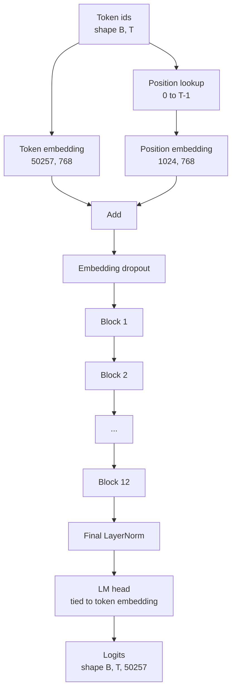
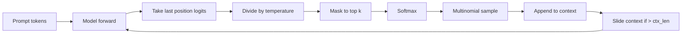

# GPT 模型组装

> 12 khối 堆叠, một Token Embedding, một học được Position Embedding, một LayerNorm cuối cùng, cũng như một đầu mô hình ngôn ngữ bị ràng buộc权重── đây là một bộ phận toàn bộ 1.24 tỷ tham số GPT 模型──本课将这些组件组装 thành một lớp có thể vận hành, thống kê tham số để xác định mô hình phù hợp tham khảo 124M 形状,并使用多元样本、温度 和 top-k 生成文本──

**Type:** Build
**Languages:** Python
**Prerequisites:** Phase 19 lessons 30 到 34
**Time:** ~90 分钟

## Mục tiêu học tập

- 将 bài học 34 中的变压器块 组装成完整 GPT 模型:Token Embedding、Position Embedding、N 个块、最终 LayerNorm、语言模型头──
- 复现 1.24 tỷ tham số cấu trúc: từ 50257 文本 1024 嵌入 768 十二个头十二层
- Để phân tích mô hình ngôn ngữ đầu 权重绑定到代币嵌入,并解释 tại sao nó có thể tiết kiệm khoảng 3800 triệu tham số trên quy mô này.
- Sử dụng lấy mẫu đa số, quy mô nhiệt độ và cắt giảm trên-k Từ nhanh sinh成文本,并用 cửa sổ trượt 保持 ngữ cảnh chiều dài.
- 对照 124M  mục tiêu đo số parameter và vượt qua phía trước 成本。

## Vấn đề

khối biến đổi 单独存在时什么也做不了―― bạn cần để chuyển mã biểu tượng 转成向,混入位置信息,让它们穿过堆,再投投回词汇逻辑―― bỏ qua bất kỳ bước nào trong bốn bước này, mô hình hoặc không thể tiến về phía trước, hoặc位置信息漂移, hoặc không thể nói lại――

Hình dạng của mô hình cũng rất quan trọng. Reference GPT-2 small ở trên là 1.24 tỷ tham số. Những con số này không bí ẩn. Vocab 50257 nhân bằng việc nhúng 768 là bảng mã thông báo.

## Khái niệm



Các mã mã mã hóa  chuyển thành các vector mã hóa. Mã vị trí  chuyển thành các vector vị trí.

### Tắt trọng lượng

hình dạng của token Embedding là `(vocab, d_model)`◊lời học mô hình đầu 需要从 `d_model`投影回 `vocab`△ chúng được chuyển đổi. ・ sẽ được ràng buộc, nghĩa là bằng chữ sử dụng cùng một tensor tham số, sử dụng hai lần.

### Đơn vị nhúng là học được của, không phải là sinusidal

GPT-2 使用学习得到的位置嵌入──位置表是一个形状为`(1024, 768)`Các mô hình trong mỗi lần tiến lên tìm vị trí 0 đến T-1,并把搜索结果加到 Token Embedding 上―― đây là các giải pháp vị trí đơn giản nhất (RoPE, ALiBi, T5 tương đối thiên vị là một giải pháp thay thế), cũng là 124M 参考模型使用方案――

### Tạo: nhiệt độ, top-k, đa số

Thế hệ là tự do giảm dần của. Mỗi bước, mô hình đều sẽ ở mỗi vị trí trở lại toàn bộ từ vựng trên các logits. Bạn chỉ lấy một vị trí cuối cùng, trừ nhiệt độ, có thể chọn để đặt tất cả các logits bên ngoài top k logits.



三旋,对应三种不同行为──温度 接近零会退化成贪──温度 为一时匹配模型的自然分布──顶-k 为一就是贪──顶-k 为四十会过长尾──组合方式很重要; 下一课关于训练内容将代子用作定性评估信号──


```figure
cc-gpt-assembly
```

## Hãy xây dựng nó

`code/main.py`实现:

- `class GPTConfig`Dataclass, có giá trị cố định 124M:`vocab_size=50257``context_length=1024``d_model=768``num_heads=12``num_layers=12``mlp_expansion=4``dropout=0.1``use_bias=True``weight_tying=True`
- `class GPTModel`,包含 Token Embedding、Position Embedding、Embedding dropout、十二个 `TransformerBlock`、 cuối cùng LayerNorm, cũng như trong cờ 打开时绑定到代币嵌入的 `lm_head`
- `count_parameters`trợ lý, quay lại số lượng tham số duy nhất (đ vậy, thống kê sẽ xử lý đúng cách việc gắn bó trọng lượng)
- `generate`chức năng, thực hiện nhiệt độ, top-k, đa số và bối cảnh cửa sổ trượt.
- Một demo, xây dựng mô hình, in số parameter và tham khảo 124M đối tượng, sau đó từ cố định prompt sinh thành một chuỗi ngắn, hiển thị đường ống 端到端可运行──

运行 nó:

```bash
python3 code/main.py
```

输出: số parameter với 124M 参考值的对照、随机随机 生成的代币ID,以及在绑定时打开时 LM head 和 Token Embedding共享存储的确认信息──

Để làm cho demo  giữ nhanh, script cũng sẽ kết thúc đến kết thúc vận hành một cấu hình nhỏ`d_model=64``num_layers=2`),并 inline 打印生成的代码序列──124M cấu hình 会被构建,但只执行参数计和一次向前传──

## Thống

- `torch`Sử dụng toán học tensor, tự cấp và ống nước module.
- `code/main.py`Trong bản địa tái hiện mô hình khối tương tự trong bài học 34.

## Các mô hình sản xuất trong tự nhiên

Ba mô hình quyết định một mô hình chỉ có thể chạy, hay có thể thực sự giao tiếp.

**把 residual projections 初始化得小一些。**Dự án đầu ra của sự chú ý và MLP của thứ hai tuyến tính sẽ trực tiếp vào phần dư thừa. Nếu sử dụng các bước lệch chuẩn tương tự với các tuyến tính khác, dòng dư thừa sẽ tăng lên theo chiều sâu, và đưa LayerNorm cuối cùng vào vùng nhiệt.`1 / sqrt(2 * num_layers)`缩放; lưu lượng dư lượng 就能在十二层中保持合理范围──

**缓存 position id tensor，不要重复计算。** `torch.arange(T)`会在每次前来时分配新内存.`__init__`Trung theo ngữ cảnh tối đa phân chia một lần, mỗi lần调用时 slice 前 T 个 mục, nhảy qua phân bổ 往返──

**在 parameter 层面 tie weights，而不只是 copy。**设置 `lm_head.weight = token_embedding.weight`会共享 tensor;copy 不会──optimizer 需要更新一个参数,自动化图也需要一次积累──如果你复制,头 会从嵌入 漂走,权重绑定就没有任何收益──

## Sử dụng nó

- Mô hình lớp học này giống với mô hình lớp học tiếp theo cần được đào tạo.
- Sẽ học được vị trí Trình lắp  thay thế cho RoPE, được nhận được gia đình LLaMA, và không cần phải thay đổi khối hoặc đầu.
- Để thay thế GELU thành SiLU,并将 LayerNorm thay thế thành RMSNorm,就能得到LLaMA家族的剩余变化──
- Chức năng tạo có thể được sử dụng cho bất kỳ logits nào Source, không giới hạn trong mô hình này. Bạn có thể lấy logits từ tập tin GPT-2 được đào tạo trước trong bài học 37.

## Các bài tập

1. 解除 LM head 与 Token Embedding 的绑定并重新统计参数──验证差值为 50257 乘以 768 = 3800 万──
2. Sẽ học được vị trí Trình lắp đặt thay thế cho cấu trúc khi tính toán bảng hình âm.
3. 为 thế hệ 添加 `greedy=True`cờ, nhảy qua mẫu 并 chọn argmax;; xác nhận chuỗi trong nhiều lần chạy trong đó là xác định của;;
4. 添加 `repetition_penalty`旋, trước softmax, sẽ prompt hoặc đã được tạo trong lịch sử logit của bất kỳ token nào trừ một số thường xuyên.
5. Trong `top_k`旁边添加 `top_p`(nucleus) sampling── dùng hai行检查 xác nhận xác định khả năng giữ token 之和超过 `top_p`

## Các điều khoản chính

| Term | What people say | What it actually means |
|------|-----------------|------------------------|
| Weight tying | “Tied embeddings” | LM head 和 Token Embedding 共享同一个 parameter tensor；节省 vocab times d_model 参数，并匹配 GPT-2 参考模型 |
| Position embedding | “Learned positions” | 一个单独的 table，形状为 (context length, d_model)，加到 token vectors 上；端到端学习得到 |
| Sliding window context | “Context cap” | 当 prompt 加生成 tokens 超过 context length 时，丢弃最旧的 tokens，让 active window 能放下 |
| Top-k sampling | “K truncation” | 保留值最高的 K 个 logits，把其余 logits mask 成 negative infinity，并在剩余项上 softmax |
| Temperature | “Sampling temperature” | 在 softmax 前用 T 除以 logits；T 小于 1 会变尖锐，T 等于 1 保持自然 distribution，T 大于 1 会变平坦 |

## Đọc thêm

- Giai đoạn 19 bài học 34, hiểu được mô hình này nầy.
- Giai đoạn 19 bài học 36, hiểu sử dụng mất entropi chéo 驱动本模型的训练循环──
- Chương 37: Học cách chuyển trọng lượng GPT-2 được đào tạo trước
- GPT mô hình hóa ngôn ngữ nguyên nhân), hiểu dự đoán biểu tượng tiếp theo của toán học.
- Giai đoạn 10 bài học 04(pre training mini GPT), hiểu được kiến trúc chung 上的原始训练过程──
