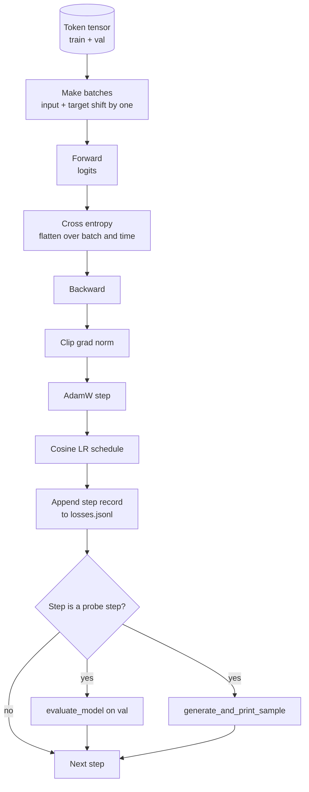

# Loop đào tạo và đánh giá

> vòng lặp không đo lường là nói dối.`calc_loss_batch`trợ lý  đang giữ ra dữ liệu trên `evaluate_model`Đi qua mỗi bước một lần`generate_and_print_sample`Hình ảnh định tính, cũng như các bản ghi mất mát JSONL có thể vẽ sau đó.

**Type:** Build
**Languages:** Python
**Prerequisites:** Phase 19 lessons 30 到 35
**Time:** ~90 分钟

## Mục tiêu học tập

- Xây dựng một vòng tròn đào tạo, để dự đoán token tiếp theo Sử dụng đầu vào chính xác và sắp xếp mục tiêu để tính toán mất entropi chéo.
- 配置 AdamW, làm cho sự suy giảm trọng lượng 应用于 trọng lượng tensor, không应用于 LayerNorm hoặc bias tensor。
- 实现带线性变暖和宇宙衰退的学习率时间表,并读取 LR 随时间的变化──
- Sử dụng `evaluate_model`Trong việc phân chia trên đánh giá, làm cho đánh giá mất có thể qua vận hành so sánh.
- Mỗi bước`generate_and_print_sample`生成 một mẫu định tính, để trong đường cong mất mát  hiển thị trước khi bắt đầu sự khác biệt.
- Để chuyển tải lại, vẽ, và đưa nhật ký đào tạo như một giao hàng.

## Vấn đề

Một bản in chỉ mất và bất cứ điều gì không làm được là một bản thảo tập luyện 会在三方面失败── nó không thể nói cho bạn biết liệu mất có phải vì nguyên nhân chính xác đang giảm xuống không. mô hình có thể chỉ là quá phù hợp trong tập hợp tập luyện, nhưng chưa bao giờ thực sự học được. Nó không thể nói cho bạn biết sự khác biệt có phải bắt đầu không.

Trong bài học này, vòng lặp sử dụng ba cách đo lường. Mỗi bước trong tập trận trên mất. Mỗi bước trong tập trận trên mất. Mỗi bước từ tập trung cố định tạo ra một tiếp tục.

## Khái niệm



2 phần rõ ràng là sự sắp xếp mất mát và sự phân chia phân rã của AdamW.

### Định hướng thua lỗ

模型在每个位置预测下一个代币―― Nếu số lượng đầu vào là代币`[t0, t1, t2, t3]`, thì mục tiêu đợt  phải là `[t1, t2, t3, t4]`❖ Thân trí chéo trong hình phẳng `(batch * seq, vocab)`上计算,并对照 `(batch * seq,)` quên thay đổi, sẽ tập luyện mô hình để dự đoán bản thân; nó sẽ nhận được đến 0 mất, nhưng không học được bất cứ điều gì hữu ích

### AdamW phân rã chia

Sự suy giảm trọng lượng sẽ điều chỉnh các tensor trọng lượng, nhưng không điều chỉnh các thang bình thường hóa hoặc thiên vị. Sự suy giảm sẽ được đặt trên thang LayerNorm, sẽ chậm rãi đưa thang lên, và sẽ phá hoại sự bình thường hóa. Sự suy giảm sẽ được đặt trên thang bình thường.

### Tháp lại cộng với lịch trình cosine

Warmup sẽ trong vài trăm bước đưa tốc độ học tập từ nốc nốc đến giá trị mục tiêu, để Optimizer trạng thái có thời gian để lấp đầy.

### Thử nghiệm được thực hiện

`evaluate_model`会从验证分分 运行固定数批,累积损失,除以批数,然后返回──没有 Gradient──没有落下──在同样的种子和同样的分下,这个数字可跨运行复现──把保持损失与训练损失并排报告,就是你发现过的方法──

### Tiêu chuẩn mẫu như một tín hiệu sớm

Một sự mất tập, giảm rất tốt, nhưng các mẫu được tạo ra đều là mô hình của cùng một token là xấu. Một đường cong mất mát trông bình thường, nhưng các mẫu được tạo ra dần dần trở thành mô hình của các từ đơn liên tục đang học.


```figure
cap-training-loop
```

## Hãy xây dựng nó

`code/main.py`实现:

- `make_batches(token_ids, batch_size, context_length)`, sẽ là một đoạn tensor biểu tượng dài 成 input và mục tiêu cặp.
- `calc_loss_batch(model, inputs, targets)`, thực hiện tiến lên, phẳng,并 quay lại entropy chéo thang.
- `evaluate_model(model, val_loader, max_batches)`,在没有毕业生 下代固定数量的验证批次,并返回平均损失──
- `generate_and_print_sample(model, prompt, max_new_tokens)`, trong cố định prompt 上运行 bài học 35 của hàm thế hệ 并印结果──
- `build_param_groups(model, weight_decay)`,生成两组 AdamW danh sách tham số.
- `cosine_with_warmup(step, warmup_steps, total_steps, max_lr, min_lr)`, quay lại cho bước nhất định của LR。
- `train(...)`,运行循环,持久化 `outputs/losses.jsonl`,并每 `eval_every`bước 打印 đánh giá mất và mẫu
- Một demo, trên dữ liệu tổng hợp 上训练 mô hình nhỏ, viết vào nhật ký JSONL, và in điểm thăm dò 打印 đánh giá mất và mẫu.

运行 nó:

```bash
python3 code/main.py
```

输出: mỗi bước mất 行、 mỗi bước thăm dò của đánh giá mất、 mỗi bước thăm dò của mẫu tạo, cũng như cuối cùng `outputs/losses.jsonl`, anh có thể dùng nó`json.loads`按行加载它.

## Thống

- `torch`Sử dụng cho Autograd, Optimizer và các mô-đun.
- `main.py`Trong bản địa tái thực hiện bài học 35 của `GPTModel`和 hỗ trợ các mô-đun.

## Các mô hình sản xuất trong tự nhiên

Ba mô hình sẽ biến vòng sách giáo khoa thành thứ mà bạn có thể làm suốt đêm.

**Gradient norm clipping 不可协商。**Một loạt dữ liệu bất thường, tăng độ rào, số lượng biên giới sẽ tạo ra một số lượng lớn, xóa bỏ một số giờ kết quả đào tạo.`backward`之后,`step`之前调用 `torch.nn.utils.clip_grad_norm_(params, max_norm=1.0)`,可让优化器 保持在安全范围内;;clipping value là một freefall;1 là hầu hết các thiết lập đều có thể 住的默认值;;

**可恢复的 JSONL logging，而不是 pickled state。**Để ghi lại từng bước mất mát`{"step": int, "train_loss": float, "lr": float}`行写入 JSONL là bền vững: bất kỳ tai nạn nào sẽ để lại một tác phẩm có thể đọc được, bạn có thể nắm bắt, bạn có thể sử dụng 30 dòng Python vẽ, bạn cũng có thể thông qua đọc bước cuối để phục hồi đào tạo.

**Eval batches 来自固定 slice。**Các mã xác nhận trong script  khởi động được cắt thành hàng, thay vì động tạo. Có thể tái hiện dựa trên các hàng đánh giá trong mỗi lần chạy hoàn toàn giống nhau. Nếu không so sánh hai lần chạy đánh giá mất, các bộ đúc của các bộ đúc có thể giống như mô hình tự nó.

## Sử dụng nó

- Loop trong bài học này giống như trong thực dữ liệu đào tạo 124M mô hình cùng cấu trúc.`datasets`风格的载体,循环 就能不变地运行──
- JSONL log là chuyển khóa đào tạo thành chứng cứ được đưa ra.
- Chuẩn mẫu thăm dò là mất tích scalar không thể thay thế của kiểm tra dưới.

## Các bài tập

1. 添加 `weight_decay_groups()`Các thử nghiệm đơn vị, xác nhận quy mô và các tham số thiên vị không rơi vào nhóm phân hủy, và trọng lượng nhúng đường thẳng và rơi vào nhóm phân hủy.
2. Sử dụng một bit trong file văn bản nhỏ  thay thế các token ngẫu nhiên tổng hợp, để demo trong bài đọc được đào tạo trên nội dung.
3. Vì lịch trình cosine 添加一个 `min_lr`tầng, giá trị`max_lr`10% của,并重新绘图.
4. Ngoài JSONL log 外, mỗi `eval_every`bước 保存一个检查点──添加 `resume_from`cờ để tải lại trạng thái mô hình và trạng thái Optimizer
5. Trong mất 旁边 ghi lại mỗi bước thông qua (tốc hiệu mỗi giây),并 xác nhận nó giữ trong vùng ổn định.

## Các điều khoản chính

| Term | What people say | What it actually means |
|------|-----------------|------------------------|
| Loss alignment | “Shift by one” | Input tokens 位于 positions 0..T-1，target tokens 位于 positions 1..T；cross entropy 在 flattened shapes 上计算 |
| Decay split | “Two groups” | AdamW 接收带 weight decay 的 matrix shaped tensors，以及不带 decay 的 scale 或 bias tensors |
| Warmup | “Ramp” | learning rate 在固定步数内从零爬升到目标值，让 Optimizer state 可以填充 |
| Eval batches | “Held out batches” | validation token tensor 的一个固定 slice，在 script 启动时 slice 一次，并在每个 probe 中相同使用 |
| Qualitative probe | “Sample print” | 每 K steps 从固定 prompt 打印一次短 generation，用于捕捉单靠 loss 会隐藏的 failure modes |

## Đọc thêm

- Giai đoạn 19 bài học 35, hiểu được vòng 驱动的模型――
- Chương 37: Học cách chuyển trọng lượng được tập luyện lên cùng một mô hình.
- Giai đoạn 10 bài học 04 ((pre training mini GPT), hiểu quá trình trên dữ liệu thực tế
- Giai đoạn 10 bài học 10 ((đánh giá), hiểu được sự mất entropy chéo  ngoài hơn广的 eval表面──
