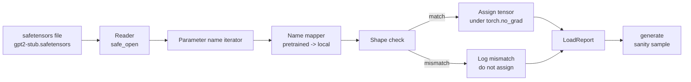

# 加载 Cánh nặng được tập luyện

> Từ zero training một mô hình parameter 124 triệu là quyết định ngân sách; tải một điểm kiểm soát công khai là hoạt động hàng ngày. 本课将 gơtên xơ trong tệp gPT-2 kiểu được đào tạo trước được tải vào cùng một kiến trúc trong bài học 35, từng đoạn giải thích bản đồ tên parameter, và thông qua sự thông minh tạo ra một tiếp tục để chứng minh tải thành công. Không mạng, không người tải bên thứ ba, không có phép thuật không minh bạch.

**Type:** Build
**Languages:** Python
**Prerequisites:** Phase 19 lessons 30 to 36
**Time:** ~90 minutes

## Mục tiêu học tập

- Sử dụng `safetensors`Thư viện Python 读取 file safetensors,并检查 tensor names 和 shapes。
- 将每个预训参数名称映射到课 35 GPT mô hình 内部一个参数──
- 处理 xuất bản trọng lượng GPT-2 với mô hình đường đua này  giữa hai bộ tên gọi khác nhau:`wte/wpe/h.N.attn.c_attn/c_proj`和 `mlp.c_fc/c_proj`, đối với 应本地命名`tok_embed/pos_embed/blocks.N.attn.qkv/out_proj`和 `mlp.fc1/fc2`
- Trong bất kỳ việc gán trọng lượng nào xảy ra trước khi, kiểm tra không từ chối sự không phù hợp hình dạng, không đưa ra một sai lầm rõ ràng.
- Sử dụng trọng lượng tải 生成一个短续,并确认 token từ phân phối tải, thay vì phân phối ban đầu ngẫu nhiên.

## Vấn đề

Các trọng lượng được xuất bản không phải là cho kiến trúc của bạn 打包的. Chúng mang theo là tên gọi sử dụng thực hiện ban đầu.`(2304, 768)`của `transformer.h.0.attn.c_attn.weight`; mô hình của bạn 期望形 为 `(2304, 768)`của `blocks.0.attn.qkv.weight`(Đây là cùng một Matrix, chỉ đơn giản là quy định khác nhau), hoặc mô hình của bạn sử dụng `nn.Linear`, nó sẽ được chuyển đổi thành dạng lưu trữ Matrix. . . cùng một tham số sẽ xuất hiện với ba dạng nhỏ khác nhau như:

盲复制的载体会把正确的 tensor 放到错误位置,得到一个生成胡言乱语的模型──形态 不同时拒绝复制但不记录任何日志的载体,将让你猜测哪个 tensor 没有落位──本课的载体是显而易见的:每次任务都会记录日志,每个形态都会检查,并且`LoadReport`会汇总 hits,misses và hình dạng không phù hợp, để bạn có thể đọc hiểu những gì đã xảy ra.

## Khái niệm



Name mapper  chỉ là một từ chuỗi đến chuỗi của hàm。Shape check là một nếu。Tổ chức  xảy ra `torch.no_grad()`内部, vì vậy autograd không theo dõi quá trình tải.

### Công ước đặt tên GPT-2

Các cân GPT-2 được xuất bản 使用如下名称:

| Pretrained name | Shape | Meaning |
|-----------------|-------|---------|
| `wte.weight` | (50257, 768) | Token Embedding |
| `wpe.weight` | (1024, 768) | Position Embedding |
| `h.N.ln_1.weight` | (768,) | block N 的 LayerNorm 1 scale |
| `h.N.ln_1.bias` | (768,) | block N 的 LayerNorm 1 shift |
| `h.N.attn.c_attn.weight` | (768, 2304) | 融合 QKV linear weight |
| `h.N.attn.c_attn.bias` | (2304,) | 融合 QKV linear bias |
| `h.N.attn.c_proj.weight` | (768, 768) | Attention output projection |
| `h.N.attn.c_proj.bias` | (768,) | Attention output projection bias |
| `h.N.ln_2.weight` | (768,) | LayerNorm 2 scale |
| `h.N.ln_2.bias` | (768,) | LayerNorm 2 shift |
| `h.N.mlp.c_fc.weight` | (768, 3072) | MLP fc1 weight |
| `h.N.mlp.c_fc.bias` | (3072,) | MLP fc1 bias |
| `h.N.mlp.c_proj.weight` | (3072, 768) | MLP fc2 weight |
| `h.N.mlp.c_proj.bias` | (768,) | MLP fc2 bias |
| `ln_f.weight` | (768,) | Final LayerNorm scale |
| `ln_f.bias` | (768,) | Final LayerNorm shift |

Có hai sự bất ngờ cần phải xử lý trước.`c_attn``c_proj``c_fc`Những đường thẳng này của Matrix  lưu trữ cách, so với `nn.Linear.weight`期望方式是转置的.Loader 会在任务时转置.LM đầu hoàn toàn không có trong tập tin; mô hình phụ thuộc vào`wte`của trọng lượng liên kết, do đó một khi `wte`落位, đầu 通过伪称 设置好.

### Hội nghị đặt tên địa phương

本 track 的模型 使用描述性名称:

| Local name | Meaning |
|------------|---------|
| `tok_embed.weight` | Token Embedding |
| `pos_embed.weight` | Position Embedding |
| `blocks.N.ln1.scale` | block N 的 LayerNorm 1 scale |
| `blocks.N.ln1.shift` | LayerNorm 1 shift |
| `blocks.N.attn.qkv.weight` | 融合 QKV |
| `blocks.N.attn.qkv.bias` | 融合 QKV bias |
| `blocks.N.attn.out_proj.weight` | Attention output projection |
| `blocks.N.attn.out_proj.bias` | Output projection bias |
| `blocks.N.ln2.scale` | LayerNorm 2 scale |
| `blocks.N.ln2.shift` | LayerNorm 2 shift |
| `blocks.N.mlp.fc1.weight` | MLP fc1 |
| `blocks.N.mlp.fc1.bias` | MLP fc1 bias |
| `blocks.N.mlp.fc2.weight` | MLP fc2 |
| `blocks.N.mlp.fc2.bias` | MLP fc2 bias |
| `final_ln.scale` | Final LayerNorm scale |
| `final_ln.shift` | Final LayerNorm shift |

Bản đồ là một chức năng cố định. Bốn lớp đưa nó như một lệnh giao dịch, tải máy 会代这个 lệnh.

### Thiết bị đệm

Real GPT-2 có trọng lượng khoảng 0,5 GB. Demo không tải chúng xuống; nó sẽ tạo ra một bộ phận cảm biến an toàn nhỏ khi chạy lần đầu tiên, sử dụng quy ước đặt tên GPT-2 hoàn toàn giống nhau, và sử dụng phù hợp với mô hình 12 khối, thay vì mô hình 768 ⋅ bộ phận này có cấu trúc chính xác, có thể kích hoạt các mã trong bộ tải.


```figure
cc-weight-remap
```

## Hãy xây dựng nó

`code/main.py`实现:

- Một bài học 35 `GPTModel`n n n n n n n n n n n n n n n n n n n n n n n n n n n n n n n n n n n n n n n n n n n n n n n n n n n n n n n n n n n n n n n n n n n n
- `make_pretrained_to_local(num_layers)`,展开每层条目──
- `load_safetensors(model, path)`,代 tên, tên chụp, hình dạng kiểm tra, chuyển đổi trọng lượng kiểu con và`torch.no_grad()`Nhiệm vụ... trở lại.`LoadReport`
- `make_stub_safetensors(path, cfg)`, tạo ra một tập tin cố định sử dụng định nghĩa đặt tên được đào tạo trước.
- Một demo: lần đầu tiên运行时创建 `outputs/gpt2-stub.safetensors`, xây dựng một mô hình mới, bắt đầu ngẫu nhiên 生成 một tiếp theo, tải stub, tái bắt lại một tiếp theo khác, print二者,并验证两者不同(加载确实改变了模型) 

运行:

```bash
python3 code/main.py
```

Output:phát cố định ∆ tên của tải log ∆`LoadReport`Kết luận  tải trước  tải sau  tải, cũng như một tensor xấu  cố tình được tiêm vào trong thiết bị  tạo ra sự không phù hợp hình dạng, được sử dụng để phủ kín đường thất bại

## Thống

- `safetensors`Được sử dụng trên định dạng đĩa và đọc trực tuyến.
- `torch`Sử dụng mô hình và toán học nhiệm vụ.
- Không sử dụng `transformers`, không sử dụng `huggingface_hub`, không thực hiện các cuộc gọi mạng.

## Các mô hình sản xuất trong tự nhiên

Ba mô hình có thể làm cho bộ tải vẫn đáng tin cậy khi đối mặt với trọng lượng bạn không tạo ra.

**始终在任何 assignment 前验证 file。**打开文件,列出每个数名称 及其dtype 和形状,运行完整映射和形状检查, chỉ在成功后才开始分配──半加载模型 是静默失败机器──

**每次 assignment 都记录 source name 和 destination name。**Khi một cái gì đó trông không phù hợp, nó sẽ cho bạn biết tensor nào đã rơi vào đâu; thay thế là đọc hexdumps.`LoadReport`Dataclass 会跟踪 `loaded``missing``unexpected`和 `shape_mismatch`danh sách, và cuối cùng in bản tóm tắt.

**LM head 是 weight tying alias，不是单独 copy。**Lên`tok_embed`后设置 `model.lm_head.weight = model.tok_embed.weight`Đó là quy tắc mô hình.`lm_head.weight`tham số 会破坏绑定,并让 tham số đếm 翻倍。

## Sử dụng nó

- Loader 适用于任何使用预训命名公约的安全感器文件──真实GPT-2文件(small / medium / large / xl)无需代码变更 即可工作;只有模型配置 不同──
- Khi cập nhật bản đồ tên, mô hình tương tự có thể mở rộng đến LLaMA、Mistral、Qwen trọng lượng。Shapes checks 和 report 保持不变。
- Lưu ý: nếu các mẫu sau tải trông giống như mẫu trước tải, tải không thay đổi mô hình, cũng có nghĩa là bản đồ  lặng lẽ bị mất đi từng tensor.

## Các bài tập

1. 为 loader 添加 `dtype`Đối số, trong nhiệm vụ sẽ mỗi tensor ném đến mục tiêu dtype(`bfloat16``float16``float32`❖ xác nhận `float32`mô hình có thể hạ xuống đến `bfloat16`Không còn tạo ra.
2. 添加 `expected_layers`tranh luận, từ chối tải `h.N`Chỉ số và mô hình của`num_layers`Không phù hợp điểm kiểm soát.
3. 把 loader 接入 bài học 35 hệ thống hàm,并生成 hai并排 mẫu: một từ sự cố định ngẫu nhiên, một từ cài đặt tải.
4. 添加出口路径: sử dụng quy ước đặt tên trước được đào tạo 将当前模型状态 写入一个新的安全感器文件──圆路载机 并确认报告 中形状不匹配 为零──
5. 扩展 `NAME_MAP`以 xử lý LLaMA naming convention ((无偏见、RMSNorm、fused qkv layout), và bạn tạo ra các stub LLaMA cố định 上重新运行 loader。

## Các điều khoản chính

| Term | What people say | What it actually means |
|------|-----------------|------------------------|
| Name map | "Key remapping" | 从 pretrained tensor names 到 local parameter names 的 function；通常是一个 literal dict，每个 layer index 一个 entry，并在 loop 中展开 |
| Shape mismatch | "Bad shape" | Pretrained tensor 存在于 mapped name 下，但其 dimensions 与 local parameter 不一致；loader 会拒绝 assignment 并记录这对 name |
| Transpose-on-load | "Conv1d layout" | Published GPT-2 将 Attention 和 MLP projections 存储为 nn.Linear 期望形式的转置；loader 会在 assignment 时转置 |
| Weight tying alias | "Shared LM head" | 设置 model.lm_head.weight = model.tok_embed.weight，让 head 和 Embedding 共享 storage；正因为如此，head 不在 file 中 |
| Load report | "Coverage summary" | 一个小型 dataclass，跟踪 loaded、missing、unexpected 和 shape_mismatch lists；打印它可以判断加载是否成功 |

## Đọc thêm

- Giai đoạn 19 bài học 35: Thiết kế nhận trọng lượng.
- Giai đoạn 19 bài học 36: tạo ra vòng lặp đào tạo của điểm kiểm soát cùng hình dạng.
- Giai đoạn 10 bài học 11 ((quantization):memory 紧张时如何处理负载重量──
- Giai đoạn 10 bài học 13 ((làm việc xây dựng một đường ống LLM hoàn chỉnh): tải trọng và suy luận 周边的完整生命周期──
