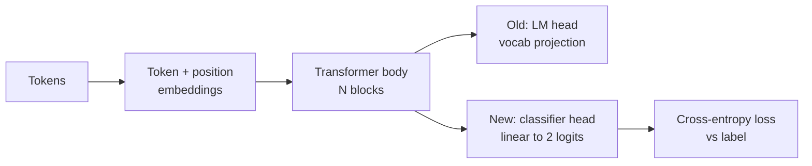
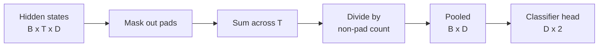
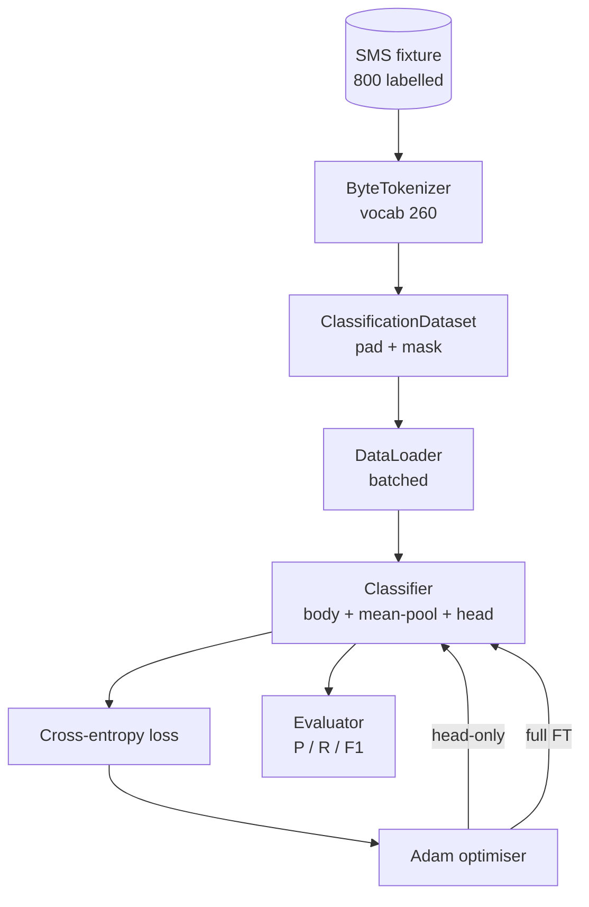

# Bài học Capstone 38: Thông qua Head Swap  thực hiện Classifier Fine-Tuning

> Trọng điểm thứ nhất của bài hát B。 Mô hình ngôn ngữ được đào tạo là một chồng khối tự chú ý, kết thúc là đầu dự đoán token── khi bạn muốn làm spam vs ham 时, đầu là sai, nhưng cơ thể cơ bản là đối với──本课会拆除 đầu, đưa một lớp đường thẳng hai lớp 接到集合表示 上,并使用两种方式训练分类器:

**Type:** Build
**Languages:** Python (torch, numpy)
**Prerequisites:** Phase 19 lessons 30-37 (NLP LLM track: tokenizer, embedding table, attention block, transformer body, pre-training loop, checkpointing, generation, perplexity)
**Time:** ~90 minutes

## Mục tiêu học tập

- Trong trường hợp cơ thể không tái khởi động, hãy chuyển đầu mô hình ngôn ngữ thành đầu phân loại.
- 实现两种训练模式: đông lạnh cơ thể ( chỉ có đầu) và hoàn chỉnh điều chỉnh,并共享同一个训练循环──
- 构建 tokeniser-aware data pipeline,负责填充,填充面具,并对注意输出做聚合,
- Từ các log nguyên liệu  tính toán chính xác, nhớ lại, F1 và các matrix nhầm lẫn.
- 推理 số parameter │ thời gian đào tạo và phòng chủ │

## Vấn đề

Bạn đã được đào tạo trước trên cơ quan chung  một bộ biến đổi nhỏ  Đầu sản xuất sẽ đưa trạng thái ẩn cuối cùng 投影 đến từ vựng 1000 token  Bây giờ bạn có 800 bài đăng được đánh dấu cho spam hoặc tin nhắn SMS của ham, mong muốn xây dựng một phân loại nhị phân  Ở đây có ba lựa chọn:

错误选择是基于800 ví dụ từ zero训练一个新的分类器―― thân thể của mô hình được đào tạo đã lập trình cấu trúc hữu ích:word identity、position、simple co-occurrence――丢失它就是浪费构建它时消耗的计算――

两个正确选择是头交换 后结身体,以及头交换 后让身体可训练――头交换 可训练――头交换 可训练――头交换 可训练――头交换 可训练――头交换 可训练――头交换 可训练 可训练――头交换 可训练 可训练――头交换 可训练 可训练――头交换 可训练 可训练――头交换 可训练 可训练 可训练――头交换 可训练 可训练 可训练 可训练 可训练 可训练 可训练 可训练 可训练 可训练 可训练 可训练 可训练 可训练 可训练 可训练 可训练 可训练 可训练 可训练 可训练 可训练 可训练 可训练 可训练 可训练 可训练 可训练 可训练 可训练 可训练 可训练 可训练 可训练 可训练 可训练 可训练 可训练 可训练 可训练 可训练 可训练 可训练 可训练 可训练 可训练 可训练 可训练 可训练 可训练 可训练 可训练 可训练 可训练可训练可训练可训练可训练可训练可训练可训练可训练可训练可训练可训练可训练可训练可训练可训练可训练可训练可训练可训练可训练可训练可训练可训练可训练可训练可训练可训练可训练可训练可训练可训练可训练可训练可训练可训时时时时时时可训练可训练可训练可训练可训练可

本课会同时构建二者,让你能在同一节目上比较──

## Khái niệm



Mô hình là một chức năng:`f_theta(tokens) -> hidden_states`❖ Đầu là một chức năng:`g_phi(hidden) -> logits`❖ Thay đổi đầu có nghĩa là giữ lại`theta`Và thay thế`g_phi`Các tham số của cơ thể là một phần đắt tiền. Đầu chỉ là một lớp tuyến tính.

Có hai nhóm các tham số có thể đào tạo  rất quan trọng:

- `theta`Mỗi khối chú ý có hàng triệu trọng lượng.
- `phi`(đầu):`hidden_dim * num_classes`trọng lượng thêm một thiên vị.

Trong huấn luyện chỉ bằng đầu, bạn nhắm mục tiêu`phi`计算 gradients,并让 `theta`của gradients 为零──PyTorch 允许你通过在体参数上设置 `requires_grad=False`Để làm điều này. Để tối ưu hóa.

Trong sự điều chỉnh hoàn chỉnh, bạn cho phép các gradient quay chảy qua toàn bộ hàng.

## Câu hỏi về sự hợp nhất

Classifier  cần mỗi chuỗi một vector, thay vì mỗi token một vector.

- **Mean pool**:按注意面具加权, đối với chuỗi 上的隐藏状态 取平均──
- **CLS pool**:前置一个特殊代币,并只使用其输出──这是BERT的做法──
- **Last-token pool**: sử dụng token không đệm cuối cùng. Đây là cách thức của các phân loại lớp GPT.

本课使用带显式注意-面具权重的意思聚合──它最简单,在不同序列长度上给出稳定信号,也不需要预训 CLS token──



## Dữ liệu

800 SMS, 400 spam và 400 ham, tất cả đều ở đây.`code/main.py`Trung xác định 生成──Generator Sử dụng hạt giống cố định, chọn mẫu và thay thế các bộ sơn khe,输出 độ dài trong 5 đến 25 token 之间的 tin nhắn──trực tế tập hợp dữ liệu 会有这个 fixture 没有的噪音──Fixture的重点是可复制性──

Dữ liệu 按 80/20 chia: 640 tàu, 160 test。 Splits 使用 stratified, therefore test set 保持 50/50 balance。 một cân bằng 已知的 held-out set 能让精度 和回忆 被当作可信数字 解读。

## Các số liệu

Binary Classification 中 class 1 là lớp tích cực (spam) ⋅计数如下:

- `TP`:预测为垃圾邮件, thực tế là spam.
- `FP`:预测为垃圾邮件, thực tế là ham。
- `FN`:预测为, thực tế là spam.
- `TN`:预测为, thực tế là.

Ba tiêu đề tiêu đề:

- `precision = TP / (TP + FP)`Trong các tin nhắn được đánh dấu là spam, tỷ lệ spam thực tế là bao nhiêu?
- `recall = TP / (TP + FN)`Trong spam thực tế, tỷ lệ mô hình được đánh dấu là bao nhiêu?
- `F1 = 2 * P * R / (P + R)`◊ 2 người trung bình hài hòa

Matrix confusion 会把四个计数打印为2x2 grid。Demo 会把两种训练模式的结果都写到stdout。


```figure
cap-classifier-head-swap
```

## Kiến trúc



Cơ thể là một bộ biến đổi rất nhỏ: âm thanh 260 ̊ ẩn 64 ̊4 đầu ̊ 2 khối ̊ chuỗi tối đa 32 ̊. Nó đủ nhỏ, có thể được tập luyện trong 90 giây trên CPU để tập hợp hai chế độ.`pretrain_quick`trợ lý sẽ tập trung vào cùng một tập hợp trên 5 thời đại của LM đào tạo, để cơ thể có một điểm khởi đầu bất thường.

## Những gì bạn sẽ xây dựng

Thực hiện là một`main.py`加一个测试模块(`code/tests/test_main.py`(■)

1. `ByteTokenizer`:把字节 映射到 id,并保留一个pad id──
2. `Block`Một带 Multi-Head Attention 和 feed-forward layer của khối biến đổi.
3. `LMBody`:Token + vị trí Nhập thêm trên các khối ︎♦ quay lại trạng thái ẩn︎
4. `MeanPool`: trên trục chuỗi thực hiện trung bình trọng lượng mặt nạ
5. `Classifier`:body、pool、linear head──body trong các chế độ khác nhau là cùng một trường hợp──
6. `freeze_body`和 `unfreeze_body`: chuyển đổi các tham số cơ thể 上 `requires_grad`
7. `train_classifier`: một vòng chia sẻ. mô hình nhận và một nhóm tham số có thể đào tạo hiện tại.
8. `evaluate`:运行 test set 并返回 `Metrics(precision, recall, f1, confusion)`
9. `run_demo`:先简短预训练 body,然后训练并评估 chỉ bằng đầu,再训练并评估 đầy đủ, in hai báo cáo,并以零 退出。

## Tại sao việc so sánh lại quan trọng

Trình độ chỉ đầu thường tập luyện nhanh hơn,并以更平滑的方式 kém phù hợp. Trong bộ này, tập luyện chỉ đầu.

本课不选择赢家──它教你读懂数字和成本──对800个例子和小体来说,头脑只有是正确的选择──对80,000个例子和更大的体来说,全面调整 开始值得投入──你从本课带走的合同是API:同一个`train_classifier`Phụ thể: Phụ thể: Phụ thể: Phụ thể: Phụ thể: Phụ thể: Phụ thể: Phụ thể: Phụ thể: Phụ thể: Phụ thể: Phụ thể: Phụ thể: Phụ thể: Phụ thể: Phụ thể: Phụ thể: Phụ thể: Phụ thể: Phụ thể: Phụ thể: Phụ thể: Phụ thể: Phụ thể: Phụ thể: Phụ thể: Phụ thể: Phụ thể: Phụ thể: Phụ thể: Phụ thể: Phụ thể: Phụ thể: Phụ thể: Phụ thể: Phụ thể: Phụ thể: Phụ thể: Phụ thể: Phụ thể: Phụ thể: Phụ thể: Phụ thể: Phụ thể: Phụ thể: Phụ thể: Phụ thể: Phụ thể: Phụ thể: Phụ thể: Phụ thể: Phụ thể: Phụ thể: Phụ thể: Phụ thể: Phụ thể: Phụ thể: Phụ thể: Phụ thể: Phụ thể: Phụ thể: Phụ thể: Phụ thể: Phụ

## Cải hướng mục tiêu

- Thêm chế độ thứ ba, chỉ tháo đông, khối cuối cùng. Đôi khi được gọi là điều chỉnh tinh tế một phần.
- 添加学习率调度器──对头 用共数调度,并对身体 使用更小的常率,是常见的生产设置──
- Sử dụng tập trung chú ý học tập  thay thế trung bình tập hợp: một带有一个学习查询的小注意层――在较长的序列上它通常优于平均池――

Thực hiện đã cho bạn những cái móng. Các thử nghiệm đã xác định hợp đồng. Số liệu của bạn tiếp tục tiến hành.
