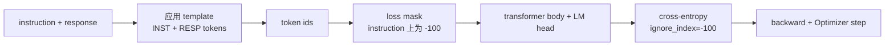
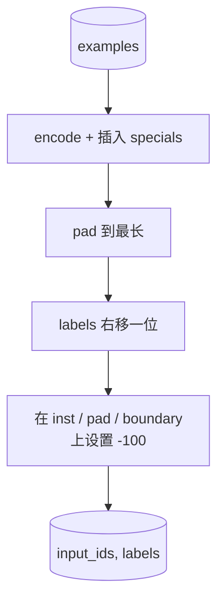
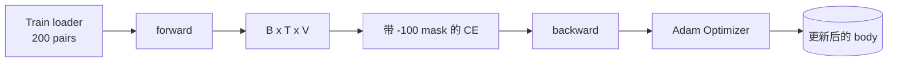

# Capstone 课程 39: Thông qua Supervised Fine-Tuning  thực hiện hướng dẫn Tuning

> Mô hình cơ bản được đào tạo trước có thể kéo dài một chuỗi, nhưng không thể tuân theo một chỉ thị. Việc điều chỉnh tinh tế được giám sát là sự thay đổi tối thiểu của sửa đổi này:向模型进入通过指示 和期望响应 配对组成的样本,并训练主体来预测响应代币.`ignore_index=-100`屏蔽 lệnh token, trong 200 cặp lệnh phản ứng 上训练,并使用精确匹配 在持久分分上评估──

**Type:** Build
**Languages:** Python (torch, numpy)
**Prerequisites:** Phase 19 lessons 30-37 (NLP LLM track: tokenizer, embedding table, attention block, transformer body, pre-training loop, checkpointing, generation, perplexity)
**Time:** ~90 minutes

## Mục tiêu học tập

- sẽ được định dạng thành một chuỗi nguyên nhân đơn với các token biên giới rõ ràng.
- Xây dựng một chức năng collate, ngăn chặn các mã chỉ dẫn, tạo ra sự xâm nhập chéo chỉ tính các mã phản ứng.
- Trong mục tiêu SFT 下训练 một cơ thể biến đổi nhỏ,并观察 đánh giá métric của sự thay đổi.
- 实现 tham lam 和 nhiệt độ mẫu sản xuất,并 tuân thủ đáp ứng- khởi động giới hạn。
- Đối với các kết quả tạo ra  tính toán giữ ra phù hợp chính xác.

## Vấn đề

Sử dụng dự đoán mã thông báo tiếp theo  mô hình cơ bản của tập luyện không biết là gì hướng dẫn `"What is the capital of France?"`, nó sẽ tiếp tục vấn đề này, hoặc tạo ra một câu mới. mô hình có khả năng ngôn ngữ, nhưng không có hợp đồng định dạng.

Hợp đồng SFT là một mẫu chuỗi. Mỗi mẫu tập luyện sẽ trở thành một chuỗi đơn gồm ba khu vực:

```text
<INST> What is the capital of France? <RESP> The capital of France is Paris.
```

Các token biên giới là các token đặc biệt được giữ lại trong quá trình tập luyện.`<RESP>`Tất cả mọi thứ sau đó là phản ứng, và phản ứng chỉ là một phần được đánh giá. Mục tiêu biểu tượng tiếp theo của mô hình cơ bản vẫn còn áp dụng. Nó chỉ đơn giản là tập luyện trên một ví dụ nào đó có hình dạng này.

Nhưng có một cái bẫy ở đây. Nếu bạn đưa toàn bộ chuỗi vào một sự mất mát trật tự trật tự, bạn cũng đang trong một mô hình đào tạo.

## Khái niệm



`ignore_index` `torch.nn.functional.cross_entropy`Một chức năng. Bất kỳ vị trí mục tiêu nào cũng như vậy.`ignore_index`Thành phố đóng góp零 Loss 和零 Gradient。PyTorch 中的惯例是 `-100`◊ chức năng collate cho mỗi trường hợp xây dựng hai tensor:`input_ids`(完整序列) và `labels`(`input_ids`của副本, trong đó các vị trí hướng dẫn được bao phủ`-100`(■)

模型在前传期间看整个序列;注意可以参加到指示――丢掉只计算响应代币――这正是你想要的:条件在指示上,预测响应――

## Dữ liệu

`main.py`Trung xác định tạo ra 200 cặp lệnh-đáp ứng.

- thực tế một cú bắn ((X 的首都)
- số học
- Thu thập danh sách
- Tổng kết một câu
- code(phác thảo, sắp xếp)
- định nghĩa

Mỗi nhiệm vụ có một hướng dẫn mẫu và một phản ứng xác định. Đây là một kế hoạch để giữ một thiết kế đơn giản.

Chia thành 160 tàu ≈ 40 test ≈ test set ≈ cover ≈6 task types, do đó có thể báo cáo cho mỗi loại chính xác-chớp ≈

## Đánh dấu và đệm

tokeniser là cấp độ byte,并带有三个保留特色:

- `INST_ID = 256`:标记 hướng dẫn vùng của bắt đầu
- `RESP_ID = 257`: Đánh dấu biên giới giữa hướng dẫn và phản ứng 
- `PAD_ID = 258`: được sử dụng để lấp các lô dài thay đổi

序列 là `[INST] inst_bytes [RESP] resp_bytes [PAD]*` chức năng collate:

1. Các biểu tượng.
2. Đưa từng mẫu trong lô vào lô trong chuỗi dài nhất.
3.  xây dựng `labels`= 右移一位的 `input_ids`(cố định LM nguyên nhân), và:
   - 将 instruction region 替换为 `-100`
   - 将 vùng lấp 替换为 `-100`
   - sẽ`RESP_ID`vị trí biên giới 本身替换为 `-100`(你不训练模型预测 biên giới token; nó预测后续内容)



Shift là một thủ thuật nguyên nhân tiêu chuẩn:`input_ids`Đề vị của `i`预测 vị trí `i+1`, vì vậy `labels[i] = input_ids[i+1]`(input 丢弃最终位置, target 丢弃第一个位置) mask 在转换 后应用,以落在正确位置上

## Việc đào tạo



loop là một vòng lặp PyTorch SFT tiêu chuẩn. Adam, tốc độ học tập khoảng 3e-4 đến 1e-3, trong bộ này 上训练十到二十个时代, không sử dụng lập trình.

Mỗi năm thời đại, vòng lặp sẽ được tổ chức trên một tập hợp được vận hành một đánh giá rất nhỏ và in kết hợp chính xác. Xem kết hợp chính xác từ thời đại một 0.0 đến thời đại mười lăm 左右 0.85, là kết quả quan trọng của bài học này: bạn có thể cùng lúc xem mô hình học hình thức và câu trả lời.

## Thế hệ

eval 时,模型获得 hướng dẫn tiền tố `[INST] inst_bytes [RESP]`,并生成 token, cho đến:

- 序列 đạt được `max_len`, hoặc
- 模型触发一个特殊停止 heuristic:连续两个句子结束字节(`.``!``?`(■)

本课提供贪码,并附带一个可选温度样本――精确匹配 使用贪,因为温度会让计变为止──真实系统通常会样本,然后进行模糊判断;

## Đánh giá phù hợp chính xác

Sự phù hợp chính xác là các metric văn bản nghiêm ngặt nhất. Dòng phản ứng dự đoán sẽ được chuẩn hóa (đồng chữ cái, dải trắng, không gian kép sụp đổ),并 với các phản ứng tham chiếu bình thường hóa tương tự.

Thực tế SFT ống dẫn sẽ sử dụng F1 cấp mã thông báo (đọc 41) và mô hình thẩm phán  bổ sung phù hợp chính xác。 phù hợp chính xác  vẫn hữu ích, vì nó không có sự khác biệt; nếu nó hiển thị 0,7, thì chỉ ra rằng đúng 70% các hướng dẫn thử nghiệm 字符 tạo ra phản ứng vàng。


```figure
cc-sft-loss-mask
```

## Những gì bạn sẽ xây dựng

实现由一个 `main.py`加 kiểm tra 组成.

1. `InstructionTokenizer`:带 được lưu trữ đặc biệt của trình mã hóa cấp bay.
2. `make_dataset`: sử dụng hạt giống cố định 生成覆盖六种任务类型的200 cặp
3. `SFTDataset`: vì mỗi trường hợp quay lại `(input_ids, labels)`, và đã sẵn sàng để đeo mặt nạ.
4. `sft_collate`:phép động, xây dựng tensor lô, trong hướng dẫn và vị trí đệm 上设置 `-100`
5. `TinyGPT`: thân biến chuyển 加 bị buộc hoặc không bị buộc đầu LM
6. `train_sft`:SFT vòng,带 per-epoch đánh giá gan。
7. `generate`Từ tiền tố  tiến hành giải mã nguyên nhân, tham lam hoặc lấy mẫu,并带 dừng heuristic。
8. `exact_match`:được so sánh chuỗi bình thường, trả lại `[0, 1]`Trong nước lơ lửng
9. `run_demo`: xây dựng dữ liệu, đào tạo 20 thời đại, đánh giá, in theo phân loại,并成功时以零退出──

## Tại sao mặt nạ quan trọng

没有面具时,Loss会把指示令牌当作目标――模型会学习预测指示―― Đây là một mục tiêu khác,并将从两方面产生更差的模型――首先, mô hình dung lượng được lãng phí để xây dựng lại các đầu vào của người dùng总会提供.

## Cải hướng mục tiêu

- Tăng tốc độ học tập nóng lên, sau đó sử dụng sự suy giảm cosine。SFT đối với LR hơn so với trước khi tập luyện。
- 添加 per token Loss logging,并绘制训练过程中的 Loss curve──注意早期时代 由模板代币(`<RESP>`、được dùng để giải thích) 主导,后期 epochs 由真实答案代币 主导。
- sẽ mở rộng đến BLEU-1 hoặc chrF.
- 添加带有多轮格式的聊天模板,并包含后续的设置 上训练──

实现会给你格式合约、面具 和循环── từ mô hình cơ bản đến mục tiêu của người theo dõi hướng dẫn 变化,就是一个拼接函数──
