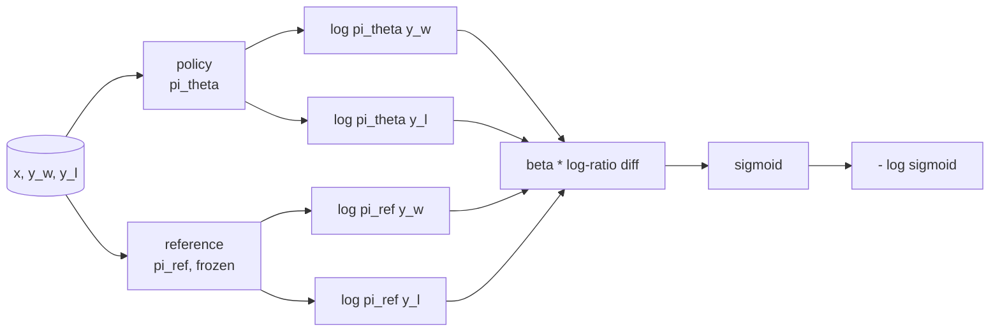
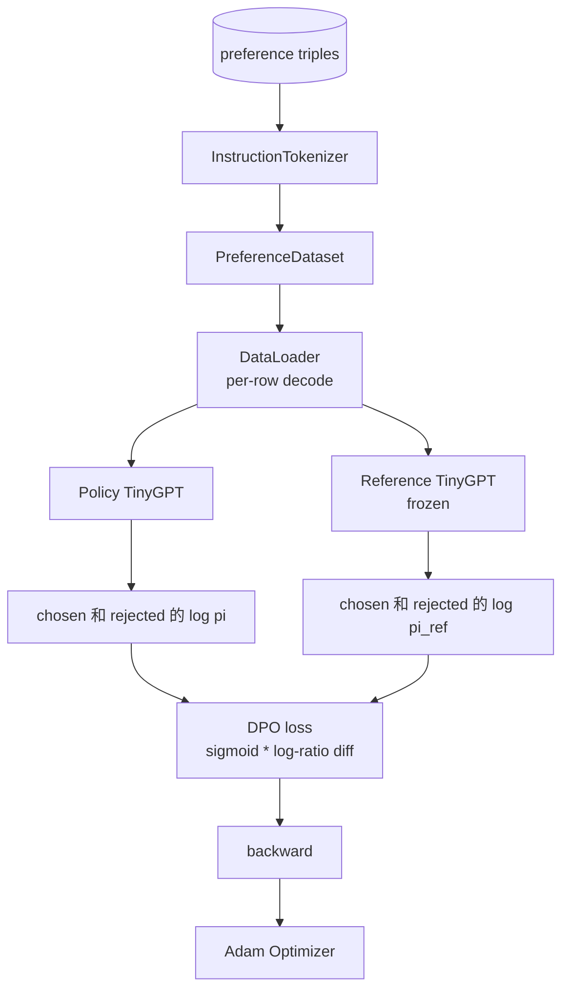

# Capstone  Chương 40: Từ zero bắt đầu thực hiện Optimize Preference Direct

> Mô hình thưởng và PPO là một tập hợp RLHF cổ điển. DPO sẽ tập hợp tập hợp này thành một lỗ hổng được giám sát, trực tiếp sử dụng cặp ưu tiên  hợp chính sách. 本课会从奖励差异身份推导 DPO mất mát,提供可工作的参考模型 加政策模型,计算每代币日志概率,并在一个由选和拒绝完成组成的偏好固定上训练小变压器.

**Type:** Build
**Languages:** Python (torch, numpy)
**Prerequisites:** Phase 19 lessons 30-37 (NLP LLM track: tokenizer, embedding table, attention block, transformer body, pre-training loop, checkpointing, generation, perplexity)
**Time:** ~90 minutes

## Mục tiêu học tập

- Để giảm DPO 推导 cho sự khác biệt tỷ lệ log trên của sigmoid,并把它 kết nối với phần thưởng ngầm.
-  xây dựng mô hình tham chiếu + cặp mô hình chính sách, trong đó tham chiếu được đóng băng, chính sách có thể đào tạo.
- Trong hai mô hình dưới tính toán các khả năng đăng ký cấp chuỗi,并 che dấu hiệu prompt.
- Trong `(prompt, chosen, rejected)`3 lần 上训练 chính sách,并观察 được chọn log-prob 相对拒绝 上升──
- Sử dụng các bài kiểm tra  cố định Loss toán học、Thiên hiệu gradient và sự bất biến tham chiếu

## Vấn đề

Bạn có một mô hình SFT. Nó sẽ theo hướng dẫn, nhưng输出 không ổn định. Có một số hoàn thành 清晰,有些冗长或错误. Bạn cũng có một bộ dữ liệu các cặp ưu tiên nhỏ: đối với cùng một prompt, con người sẽ chọn một hoàn thành 标为, một khác 标为 từ chối.

经典 RLHF 答案是两阶段管道――先用偏好――训练奖励模型――再用 PPO 根据奖励政策――优化政策――这是可行的,但成本很高:PPO 期间内存中有两个模型,需要 KL控制让政策 接近参考,且当奖励模型 脆弱时会出现奖励黑客――

DPO sử dụng một lỗ giám sát  thay thế hai giai đoạn này. Mô hình phần thưởng Từ chưa rõ ràng tồn tại. Chính sách trực tiếp trên cặp ưu tiên.

## Khái niệm

Từ mô hình Bradley-Terry bắt đầu.`x`Và hai hoàn thành `y_w`(được chọn)`y_l`(được từ chối), người偏好 `y_w`√

```text
P(y_w > y_l | x) = sigmoid( r(x, y_w) - r(x, y_l) )
```

Trong số đó `r`là một chức năng thưởng ẩn số.`r`, rồi huấn luyện chính sách `pi`, dùng neo KL tối đa hóa`r`- Có thể là:

```text
max_pi   E_{x, y~pi} [ r(x, y) ] - beta * KL(pi || pi_ref)
```

DPO  khuyến cáo quan sát, trong mục tiêu này, dưới đây, chính sách tối ưu `pi*`Có thể dùng `r`写成 hình thức đóng:

```text
pi*(y | x) = (1/Z(x)) * pi_ref(y | x) * exp( r(x, y) / beta )
```

Đối với`r`重新整理:

```text
r(x, y) = beta * ( log pi*(y | x) - log pi_ref(y | x) ) + beta * log Z(x)
```

`log Z(x)`项对 `y_w`和 `y_l`相同( nó phụ thuộc `x`, thay vì `y`), do đó trong tính toán sự khác biệt ưu tiên 时会抵消:

```text
r(x, y_w) - r(x, y_l) = beta * ( log pi_theta(y_w|x) - log pi_ref(y_w|x)
                                - log pi_theta(y_l|x) + log pi_ref(y_l|x) )
```

代入 Bradley-Terry sigmoid,并 đối với cặp ưu tiên 取 âm log xác suất:

```text
L_DPO(theta) = - E_{(x, y_w, y_l)} [
  log sigmoid( beta * ( log pi_theta(y_w|x) - log pi_ref(y_w|x)
                       - log pi_theta(y_l|x) + log pi_ref(y_l|x) ) )
]
```

Đây là Loss. Nó là mỗi ví dụ của một dấu hiệu trên một khối lượng, khối lượng được tính bởi bốn log-chỉ có thể được. Không có mô hình phần thưởng riêng biệt. Không có PPO.



## Chứng chỉ của sự trượt dần

Trước khi bất kỳ bài tập nào được thực hiện, có một kiểm tra tinh thần hữu ích.`log pi_theta(y_w | x)`求 Gradient:

```text
d L_DPO / d log pi_theta(y_w | x) = - beta * (1 - sigmoid(z))
```

Trong số đó `z`Đó là lập luận của Sigmoid.`z`Thành phố có ý nghĩa là: nâng cao chính sách cho việc hoàn thành được chọn log-chân lý sẽ giảm Loss.`log pi_theta(y_l | x)`Ưu điểm: nâng cao xác suất ghi chép bị từ chối sẽ tăng Loss.

## Dữ liệu

Bài học này cung cấp 12 ưu tiên gấp ba... mỗi người là `(prompt, chosen, rejected)` chọn hoàn thành 短且精确── từ chối 冗长、偏题或错误──这些对 覆盖与课39 相同任务族(资本、算法、列表), do đó từ cơ sở SFT 开始的政策将有一个合理起点──

DPO trong sản xuất sẽ sử dụng hàng triệu đối với cặp; trọng tâm của nó là Loss math và loop 能够运行 trên một tập dữ liệu nhỏ trên cùng đến cuối, và chọn-versus-đánh chối log-prob khoảng cách sẽ tăng rõ ràng.

## Không thay đổi tham chiếu

DPO 实现 phải cẩn thận xử lý mô hình tham chiếu                                                                                                                                                                                                                                                         

- Các tham số tham chiếu 永远不会 nhận gradient.
- Các xác suất log tham chiếu trong các thời đại sẽ không bao giờ thay đổi.
- chính sách Từ và tham chiếu tương đương trọng lượng  bắt đầu.`theta`là tham chiếu cộng với cập nhật được học;将政策初始化为参考的副本是明确的开始──)

实现 qua cách sau đây:

- đi trước 期间用 `torch.no_grad()`包裹引用.
- Đối với mỗi tham số tham chiếu  thiết lập `requires_grad=False`
- Trong tham chiếu  xây dựng sau, thông qua `policy.load_state_dict(reference.state_dict())`Chính sách xây dựng.


```figure
cap-dpo-preference
```

## Kiến trúc



模型与课39 中使用的TinyGPT 相同的(chỉ dùng giải mã, nguyên nhân, biểu tượngbyte) ⋅ tham chiếu 和 chính sách chia sẻ kiến trúc; trọng lượng chính sách trong quá trình tập luyện từ tham chiếu 发生漂移,而 tham chiếu 保持固定──

## Những gì bạn sẽ xây dựng

实现由一个 `main.py`加 kiểm tra 组成.

1. `InstructionTokenizer`:带 `INST`和 `RESP`hình dạng và bài học 39 相同──
2. `TinyGPT`: chỉ có bộ chuyển đổi decoder ⋅ hình dạng tương tự như bài học 39, do đó ngay lập tức bạn nhảy qua 39, 本课也保持自主 ⋅
3. `make_preferences`Trở lại 12 `(prompt, chosen, rejected)`gấp ba lần.
4. `sequence_log_prob`:给定 model、prompt prefix 和 hoàn thành, quay lại hoàn thành 上 tiếp theo-token log-chỉ có thể của tổng和(不包含 prompt-position contribution)。
5. `dpo_loss`:接收四个 log-probabilities 和 `beta`, trả lại tensor mất tích mỗi ví dụ và delta phần thưởng ngầm được sử dụng để ghi lại.
6. `train_dpo`:per-epoch loop, trong chính sách và tham chiếu 下计算 chọn với bị từ chối log-probs, ứng dụng Loss,并执行 Adam bước。
7. `evaluate_margins`: trong bất cứ thời điểm nào chính sách quay lại 下 trung bình được chọn từ chối log-chỉ lệ biên giới.
8. `run_demo`Từ một bộ phận nhỏ nóng lên trước khi tập luyện  xây dựng tham chiếu và chính sách, sao chép trọng lượng, tập luyện三十步, in mỗi bước Loss 和 margin,并成功时以零 退出。

## Tại sao DPO hoạt động

Trong mô hình ưu tiên Bradley-Terry, DPO trên toán học bằng giá RLHF, chỉ khác nhau các tham số của phần thưởng.`r(x, y) = beta * (log pi(y|x) - log pi_ref(y|x))`Có thể nhận ra từ sở thích, nhiều nhất khác nhau về `x`Các hàm, trong khi nó sẽ được giảm trong giá trị khác nhau. Chính sách hình thức đóng cửa.`pi`相对 `pi_ref`Bất kỳ sự lệch nào cũng sẽ làm cho tỷ lệ ghi chép 变大, và sigmoid 会和, do đó trong chính sách 走得太远时湿 Gradient.

## Cải hướng mục tiêu

- 给 log-probability sum 添加长度规范化:除以完成长度. 长度偏差 là một chế độ thất bại DPO được biết đến, mô hình sẽ ưu tiên chọn các hoàn thành ngắn hơn, vì khả năng log của chúng ở mức tuyệt đối lớn hơn.
- 添加 Loss của IPO biến thể:用 `(z - 1)^2`替代 sigmoid + log──比较它在固定上的融合──
- 添加一个标签-smoothing参数, trong khó chọn từ chối nhãn 和 đồng nhất 0.5 之间插值──
- 用更小、更便宜的模型替换参考(knowledge distillation 风格) ]]

实现会给你 Loss,truyền định liên tục và vòng đào tạo.
