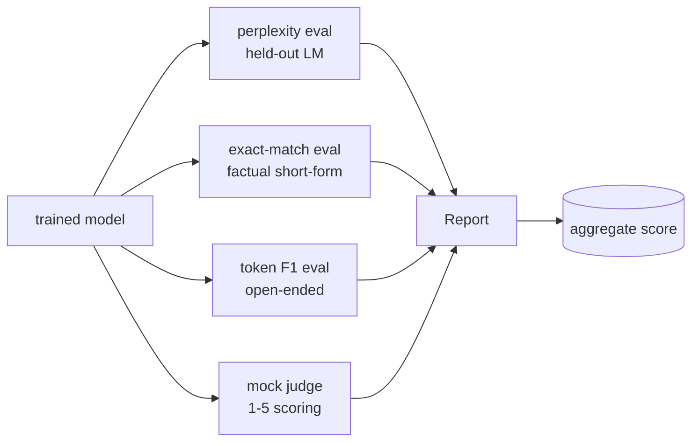
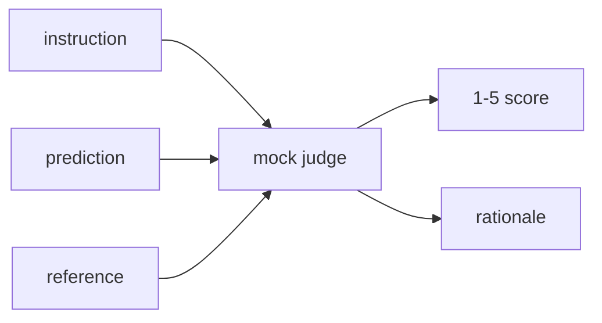
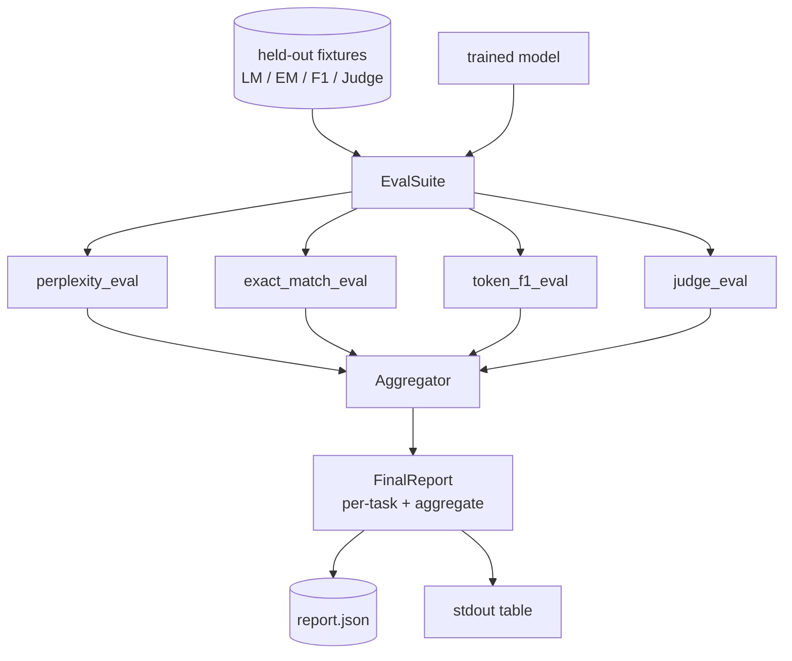

# Bài học Capstone 41: 完整 Thống kê đánh giá

> Việc đào tạo là một phần của việc kiểm soát. Việc đánh giá là một phần của việc bạn phải thiết kế. Bài học này sẽ xây dựng một hệ thống đánh giá thống nhất: nó sẽ nhận được mô hình ngôn ngữ được đào tạo tốt, chạy trên nó bốn loại đánh giá khác nhau, kết quả sẽ tập hợp để phân chia theo nhiệm vụ, và cung cấp một báo cáo LLM-as-judge, để toàn bộ vòng lặp 无需网络也能运行.

**Type:** Build
**Languages:** Python (torch, numpy)
**Prerequisites:** Phase 19 lessons 30-37 (NLP LLM track: tokenizer, embedding table, attention block, transformer body, pre-training loop, checkpointing, generation, perplexity)
**Time:** ~90 minutes

## Mục tiêu học tập

- Trong một biến đổi nhỏ, sử dụng mã hóa che giấu để tính toán sự phức tạp.
- Trong ngắn thực tế yêu cầu 上运行 chính xác phù hợp đánh giá.
- Thông qua chuẩn hóa 计算 dự đoán với tham chiếu 字符串 giữa cấp token F1。
- Xây dựng một bản địa giả LLM như một thẩm phán, sử dụng 1-5 分制给模型输出 打分.
- Toàn bộ 4 loại đánh giá được tổng hợp thành một báo cáo đơn lẻ về quyền tăng cường phân chia theo nhiệm vụ.

## Vấn đề

单一指标永远无法描述一个语言模型――                                                                                                                                                                                                                                                         

Bạn thực sự muốn một đường ống cũng có bốn loại năng lực này. Mỗi đánh giá  bao gồm các đánh giá khác  bỏ lỡ một chiều. Mỗi đánh giá  chạy trong các dữ liệu khác nhau được thiết kế cho métric này.

Bài học này sẽ được thực hiện trong một tài liệu, từ đầu đến cuối, xây dựng đường ống này.

## Khái niệm



Mỗi đánh giá đều là một từ .`(model, dataset) -> EvalResult`Các hàm, kết quả bao gồm giá trị métric, các chi tiết cho mỗi ví dụ được sử dụng để kiểm tra, cũng như tên của tổng hợp.

## Sự bối rối, được đếm đúng cách

Sự bối rối là`exp(mean negative log-likelihood per token)`❖ Thực hiện trong hai rẫy:

- nghĩa  phải dựa trên vị trí token thực sự, chứ không phải theo chuỗi số.
- model 预测下一个 Token,所以位置 `i`预测位置 `i+1`Trong đó, những người bị mất đi một lần là những người bị mất đi, nhưng các phép tính sẽ trở nên vô nghĩa.

Các đánh giá sẽ theo lô  tính toán vị trí phi pad `-log p(token)`总和与Token count,最后再相除──这比平均每批复杂性更数值安全(后者会低估短序列的权重),并且符合教科书的定义──

## Sự phù hợp chính xác, với việc chuẩn hóa

Harness 会在比较前 bình thường hóa dự đoán và tham chiếu:

- 转为 chữ cái nhỏ.
- Để rời khỏi không gian trắng đầu tiên.
- Sẽ liên tục mở ra không gian trắng bên trong.
- Nếu hai bên chỉ vì điểm không giống nhau, thì bỏ đi末尾终止 điểm`.``!``?`(■)

Tiêu chuẩn hóa 让精确匹配 在实践中有用──模型说`"Paris"`   `"Paris."`cũng là đối với; nói `"  paris  "`Cũng là đối với của. Metric này vẫn yêu cầu chuẩn hóa.

## Địa chỉ F1, đúng hướng

Hình hiệu F1 dựa trên tính toán chính xác và thu hồi của trung bình hài hòa.

1. Tiêu chuẩn dự đoán và tham chiếu((với phù hợp chính xác 相同规则)
2. 将每个字符串 chia为代币 列表(tài báo không gian trắng)
3. 统计 đa bộ giao thông
4. Độ chính xác = `intersection_count / len(pred_tokens)`❖ Nhớ lại = `intersection_count / len(ref_tokens)`F1 = trung bình hài hòa

Nếu dự đoán và tham chiếu 都为空,F1 为 1(cái khớp trống)。 Nếu chỉ có một bên为空,F1 为 0。 mô hình này phù hợp với tham chiếu đánh giá SQuAD,并能在表达上产生稳定数字。

## Luật pháp giả mạo địa phương - như một thẩm phán

Trọng tài thực sự là mô hình biên giới phía sau API. Trọng tài trong bài học này phải đi trên mạng. Trọng tài giả mạo là một người ghi điểm xác định, nó nhận được hướng dẫn, dự đoán và tham chiếu của mô hình, và trả lại.`{1, 2, 3, 4, 5}`Một điểm trong số đó và một dòng lý luận.

- Nếu dự đoán bình thường giống như tham chiếu bình thường, thì为 5。
- Nếu dự đoán và mã thông báo giữa F1 ít nhất là 0,8, thì là 4 ⋅
- Nếu token F1  nằm `[0.5, 0.8)`,则为3
- Nếu token F1  nằm `[0.2, 0.5)`,则为 2
- 其他情况为 1──

Đây không phải là một thẩm phán thực tế, nhưng nó có giao diện chính xác. Sau đó chỉ cần thay đổi một hàm để kết nối với mô hình thực tế.



## Tổng hợp

tổng là trung bình trọng lượng của điểm đánh giá bình thường. Mỗi đánh giá đều báo cáo bản thân trong`[0, 1]`Số trung:

- Sự bối rối: bình thường hóa 为 `1 / (1 + log(perplexity))`                                                                                                                                                                                                                                                              
- Đúng là đã có.`[0, 1]`Ở giữa.
- Tín hiệu F1: đã có`[0, 1]`Ở giữa.
- Thẩm phán:

Đánh nặng có thể cấu hình. 默认组合是0.2 phức tạp. ∆0.3 chính xác phù hợp. ∆0.3 mã F1 ∆0.2 phán. ∆0.3 lựa chọn của trọng lượng là một quyết định sản phẩm.


```figure
cg-eval-quadrant
```

## Kiến trúc



`EvalSuite`Đó là một nhạc công rất yếu. Mỗi đánh giá độc lập đều là một chức năng miễn phí, nhận.`(model, tokenizer, dataset, config)`Và quay lại`EvalResult``Aggregator`收集结果并生成最终报告──demo 会打印表格,并写入一个 JSON bản sao,供下游CI摄入──

## Những gì bạn sẽ xây dựng

实现 một `main.py`+ Các xét nghiệm

1. `TinyGPT`:lections 38-40 中使用的同一个单独解码架构,内置在本课中以便独立运行──
2. `InstructionTokenizer`:带 INST / RESP / PAD đặc biệt của tokenizer byte
3. 4 thiết bị: LM corpus, EM set, F1 set, và bộ thẩm phán.
4. `perplexity_eval`: trả lại chứa giá trị phức tạp và histogram mất tích mỗi token của `EvalResult`
5. `exact_match_eval`: trả lại trung bình EM 和 trên mỗi ví dụ ghi lại.
6. `token_f1_eval`: trả lại trung bình token F1 和 mỗi ví dụ ghi lại.
7. `mock_judge`和 `judge_eval`:chỉ số trên mỗi ví dụ với lý luận, cũng như điểm trung bình trên bộ 
8. `Aggregator.normalise`: quy tắc bình thường hóa theo từng năm
9. `Aggregator.aggregate`: trung bình trọng lượng và báo cáo sau khi thành lập
10. `run_demo`: ngắn hạn tập một mô hình nhỏ, chạy tất cả bốn loại đánh giá, in bảng báo cáo và ghi vào JSON, thành công khi 0 退出。

## Đọc báo cáo

báo cáo có ba tầng. Lớp trên nhất là điểm tổng cộng. Dưới đây là bốn số mỗi giai đoạn.

JSON dump sử dụng các khóa ổn định, để bảng điều khiển CI có thể xuyên phiên bản vẽ các dòng xu hướng.

## Cải hướng mục tiêu

- 添加校准 eval:model's softmax probabilities 是否匹配其准确性?按信心对预测 分桶,并报告每桶的实验准确性──
- 添加强度评估:给每个例子 标注扰乱(typo、paraphrase、distractor),并报告每类扰乱的度量下降──
- Sử dụng HTTP call 后面的真实模型 替换假判定──函数签名 不变──
- 添加 per task weight learning: không sử dụng trọng lượng cố định, mà dựa trên các mô hình trên mục tiêu ưu tiên thứ tự 拟合 trọng lượng。

本实现给你四种种、 evalaggregator 和报告── thực tế đánh giá ống dẫn 会在此叠加更多维度;模式保持不变: mỗi eval một hàm, một tổng hợp, một báo cáo──
