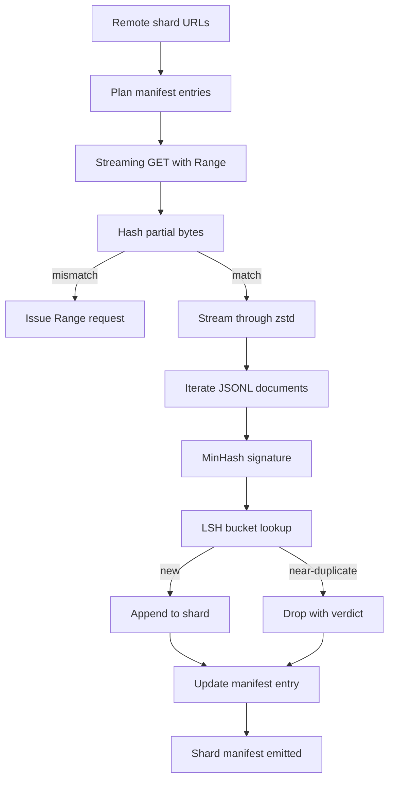

# Máy tải xuống lớn

> 训练语言模型 早在第一次前进通过 之前就开始了──corpus 必须落到磁盘上,完成解压缩,除复制,并且可地址; 在网络 4% 处断掉之前,再写故事就已经要设计好──本课会构建一个流媒体下载器:它拉取压缩片,使用Zstandard 边下边解压缩,通过 MinHash加本地敏感哈希为近复制生成指纹,并写片表,让管道的其余部分可以信任──

**Type:** Build
**Languages:** Python
**Prerequisites:** Phase 19 lessons 30-37
**Time:** ~90 minutes

## Mục tiêu học tập

- Sử dụng `urllib`dòng các mảnh từ xa,并用 `zstandard`Dỡ nén, tránh đưa toàn bộ bộ bộ nhớ bộ nhớ.
- 针对 xác minh byte offset 发起 HTTP `Range`yêu cầu, để tiếp tục tải xuống một phần.
- Để mỗi tài liệu  xây dựng chữ ký MinHash, và sử dụng LSH 分桶, để gần như trùng lặp  xảy ra va chạm.
- 输出包含内容 hash、byte size、document count 和 dedup verdict 的 shard manifest──

## Vấn đề

Lần đầu tiên trong 200 GB tập luyện, mạng trong 41% bị gián đoạn, script như vậy.`urllib`ngoại lệ 退出──第二次它在百分百78处断掉──到了百分百99,你已经把循环重写了三次──你从第一分钟起就必须设计应对的两个失败点是部分下载简历和重复文件删除──两者都有成熟方案;两者也经常被跳过,因为管道一开始只是一个长出问题单行.`requests.get`gọi.

Thường hồi là một vấn đề HTTP. Server phải hỗ trợ.`Range`, khách hàng phải theo ghi trên đĩa , theo dõi được xác minh , và xác minh được xác minh được xác định phải được giữ lại sau khi quá trình chết . Nếu được xác định và tập tin 哪怕差一个字节, tiếp tục tải xuống sẽ bị ghi vào rác, cơ thể sẽ bị hư hỏng theo cách chỉ trong quá trình Tokenization .

Sự sao chép là một ký 问题――Exact-hash dedup 会漏掉 gần sao chép: cùng một bài viết Wikipedia 带有三个不同的 boilerplate footers xuất hiện, cùng một tập tin mã 带有不同的许可头, cùng một bài đăng trên blog mỗi liên kết đều có tham số theo dõi──MinHash加 LSH 能以线下成本 捕捉这些情况──成本是每个文件一个签名,以及每个签名一个桶查找──

## Khái niệm



### Chuyển trực tuyến với `urllib`

thư viện tiêu chuẩn `urllib.request.urlopen`返回 file-like object──将它包在 `zstandard.ZstdDecompressor().stream_reader`Trong,bytes ngay từ mạng 流经解压缩器, tái vào trình lặp tài liệu, hoàn toàn không cần trong bộ nhớ vật chất hóa mảnh bị nén hoặc mảnh bị nén.

### Đặt lại với `Range`

downloader cho mỗi mảnh  viết hai file:`.partial.json`Địa điểm kiểm soát`verified_bytes``expected_size``sha256_prefix`(Bằng trước `verified_bytes`Byte 计算) và URL nguồn.`sha256_prefix`, và chỉ trong tính toán lại hash 匹配 时才恢复. Nếu hash 错误, một phần sẽ bị bỏ rơi, tải xuống từ byte không 重新开始. Bởi vì các byte được xác minh được kiểm tra thay vì được giả định, vì vậy tham nhũng im lặng không thể xảy ra.

### MinHash cộng LSH

MinHash sử dụng không gian cố định ước tính hai bộ giống nhau của Jaccard. Đối với tài liệu, bộ này là rìa của văn bản của nó.`k`个最小 hash giá trị, mỗi từ một hàm hash độc lập.`s`Các tài liệu, trong bất kỳ thành phần đơn lẻ của chữ ký trên xác suất phù hợp là`s`

Sau đó LSH sẽ`k`个 thành phần 分为 `b`Mỗi ban nhạc đều có`r`hàng, trong đó `k = b * r`◊ 2 tài liệu trong ít nhất một băng thông có khả năng va chạm là `1 - (1 - s^r)^b`, nó sẽ được sử dụng cho bạn .`(b, r)`调优的 `s`值附近形成尖门──典型 corpus dedup 的门是`s = 0.8`, LHH nghiên cứu văn học sử dụng`k = 128``b = 32``r = 4` đạt được điểm này.

### Bản ghi dấu như hợp đồng

downloader 唯一持久的输出是 manifest──manifest 按 shard 保存 URL、decompressed byte count、document count、dedup 后的独特文件数,以及最后的 shard file 的 sha256──下游Tokenization 读取 manifest,而不是目录列表──如果某个 shard 缺失或其 sha256 错误,manifest 会告诉下一阶段拒启──manifest 是 数据 已下载与 已下载和可验证 之间的决定性边界──


```figure
cap-corpus-downloader
```

## Hãy xây dựng nó

`code/main.py`实现:

- `ShardPlanner`- 读取 shard URL 列表并生成 dự kiến hiển thị mục nhập。
- `StreamingDownloader`- 打开带 tùy chọn `Range`của `urllib`Stream, viết vào tệp tạm thời, trong mỗi phần 更新 `.partial.json`Checkpoint, và tiếp tục 时验证 sha256 tiền đề
- `ZstdDocIterator`- sẽ file-like stream 包在 `zstandard.ZstdDecompressor`Trung,并逐行 yield 一文──
- `MinHasher`- Sử dụng hạt hash cố định gia đình để sinh sản chuỗi `k`- chữ ký thành phần.
- `LSHIndex`- 按带, ký kết, phân tích và báo cáo vụ va chạm.
- `Dedup`- 组合 hasher 和 index, sẽ mỗi tài liệu 标记为 `keep`Hoặc`near_duplicate`,并附带 phù hợp ID mảnh
- `ManifestWriter`-  thu thập số liệu thống kê mỗi phân mảnh và ghi vào `manifest.json`

文件底部的演示会在磁盘上构建一个小型合成体,用`zstandard`     `file://`URL 下载,执行 sao chép,并打印 manifest。

运行 nó:

```bash
python3 code/main.py
```

chữ 以 zero 退出并印 简介简介

## Các mẫu sản xuất

Bốn mô hình có thể mở rộng ra các cơ quan thực tế.

**Checkpoint before write.** `.partial.json`必须在字节 添加到碎片 之前完成 `fsync`△否则电源损失 会颠倒顺序:shard byte trên đĩa 上,checkpoint 中没有它们,次次再历 认为验证字节比实际更少,复制后音字节 会损坏文件──先检查点,再写──这与写前日记是同样的纪律──

**Sharded LSH index.**Trong quy mô 200 GB, bao gồm cả chỉ số LSH đơn lẻ của toàn bộ bộ bộ phận 放不进 RAM。 theo chỉ số LSH phân vùng băng tần đầu tiên, sẽ có các phân vùng trên đĩa, và chỉ truy vấn ký hiệu mới sẽ được cài đặt phân vùng。 chi phí là mỗi tài liệu một lần đọc đĩa phụ; lợi ích là chỉ số LSH không còn là giới hạn bộ nhớ cứng。

**Tombstone, not delete.**Những bản sao bị bỏ rơi sẽ được đưa ra phán quyết .`near_duplicate`Và các tài liệu của sự va chạm của chúng  ghi chép trong biểu hiện  xóa chúng sẽ bị mất liên kết giữa hai bản sao và người giữ  Tombstoning giữ lại đường viếng kiểm toán,并让下游通过 之后可以改变门的决定──

**Per-shard sha256 in the manifest, plus a manifest sha256.**manifest 自身也会获得内容 hash──下游阶段 会在信任每分片入口 之前验证 manifest hash──没有这个机制,manifest 就是沉默攻击表面:能编辑单个文件的攻击者 可以破坏整个管道──

## Sử dụng nó

Các mô hình sản xuất:

- **Resume on every CI run.**Các bộ chạy CI là tạm thời của ⋅ downloader ⋅ phải giả định mỗi lần chạy ⋅ là đĩa mới,并 từ cache hoặc từ xa ⋅ phục hồi ⋅`--cache-dir`Đó là lá cờ hạng nhất.
- **Dedup before tokenization.**Tokenization  rất đắt tiền. Trong cùng một tài liệu 上运行两次,为了同样的损失曲线 支付两倍成本.
- **Manifest as merge gate.**đào tạo chạy từ tập lệnh đính kèm 读取 manifesto sha256。 phiên bản bộ dữ liệu mới 需要新的 manifesto commit──code与数据之间的链接是 git,而不是口口相传──

## Chuyển nó

`outputs/skill-corpus-downloader.md`Trong thực tế dự án sẽ mô tả những URL cung cấp trình tải xuống  thư mục điểm kiểm tra  làm thế nào thiết kế  giảm sử dụng                                          `(k, b, r)`triple, cũng như manifest trong vị trí kiểm soát phiên bản trong.

## Các bài tập

1. 添加 `--shingle-width`cờ,并测量 dedup phán quyết trong chiều rộng 3、5、9 下如何变化──为选择的默认值辩护──
2. 通过嗅探魔术字节,在 zstd 旁边添加gzip 支持── downloader 不应要求调用者 指定代码──
3. 添加 `--resume-only`Mode: Nếu không tìm đến điểm kiểm soát, thì từ chối bắt đầu tải xuống mới.
4. Để chuyển chỉ số LSH  đến kệ hoặc tệp sqlite,并 đo thông qua với sự khác biệt của biến thể trong bộ nhớ.
5. Trong khi khởi động thêm biểu đồ sha256 kiểm tra. Nếu đĩa trên của biểu đồ với`manifest.lock`Trung's manifest hash 不一致, downloader 应 fail closed──

## Các điều khoản chính

| Term | What people say | What it actually means |
|------|-----------------|------------------------|
| Shard | “一个 file” | corpus 的一个自包含 slice，拥有自己的 sha256，并作为 resume 和 dedup 的单位 |
| MinHash signature | “Fingerprint” | 一个 set 的 `k`-component sketch，其中每个 component 是该 set 上一个 independent hash 的最小值 |
| LSH band | “Bucket” | 一组 `r` 个 signature components，用作 collision detection 的单个 bucket key |
| Verified bytes | “Resume offset” | disk 上 sha256 prefix 与 checkpoint 匹配的 bytes；唯一安全的 resume offset |
| Manifest | “The index” | downloader 产出的单一 durable record，包含 content hashes |

## Đọc thêm

- [RFC 7233](https://datatracker.ietf.org/doc/html/rfc7233)- HTTP Range yêu cầu, tức tiếp tục giao thức
- [Zstandard format specification](https://datatracker.ietf.org/doc/html/rfc8478)- 让 dòng chảy decompression Format khung an toàn
- [MinHash](https://en.wikipedia.org/wiki/MinHash)- 本课使用的 chữ ký gia đình
- [Locality-sensitive hashing](https://en.wikipedia.org/wiki/Locality-sensitive_hashing)- thâm suất giảm 背后的带线方案
- Giai đoạn 19 · 43 - trình tải  cung cấp HDF5 tokenized corpus
- Giai đoạn 19 · 44 - Trong tập tập tập trên cơ thể
- Giai đoạn 19 · 45 - 消耗该时间表的 AMP loop
