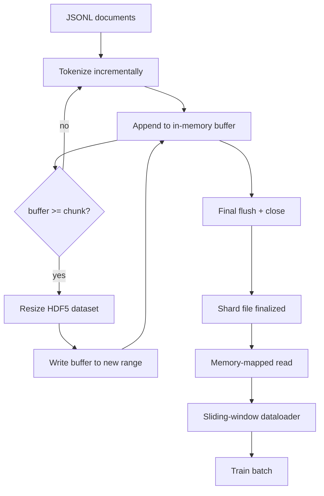

# HDF5 Tokenized 语料库

> Download Good语料 phải rơi vào một huấn luyện viên có thể sử dụng tốc độ lưu lượng đọc trong cấu trúc. JSONL trên đĩa không chứa 16 người lao động tải dữ liệu.

**Type:** Build
**Languages:** Python
**Prerequisites:** Phase 19 lessons 30-37
**Time:** ~90 分钟

## Mục tiêu học tập

- 将文档流式写入一个带决定性分断的可调整大小 HDF5整体数据集──
- sẽ viết phần vào nhiều tệp HDF5, làm cho thất bại biên giới có thể kiểm soát, và làm cho việc làm có thể.
- Thông qua HDF5 từ trang cache 支 của bố cục chia nhỏ  đọc lại các mã thông báo, làm cho bộ tải dữ liệu chỉ trong thời gian lô 复制 đến búffer lô。
- 实现一个滑窗数据载机,使用显式包装 规则发发出固定长度训练序列──

## Vấn đề

现代语言模型培训运会在数十名工人上以每秒数万样本的速度读取代码. JSONL trên đĩa trong lần đầu tiên lỗi trang lưu trữ lạnh 时就会崩: JSON parser 很慢,文档边界无法寻址,而寻找到"样本 4,217,884" 需要扫描文件──即使压缩效果很好.

HDF5  thích hợp, vì nó cung cấp một bộ dữ liệu nhỏ, có thể điều chỉnh, chỉ có số, các bộ dữ liệu của nó 在读取时对页面缓存 友好──trainer 请求`tokens[3,200,000 : 3,200,8192]`Phần này, HDF5 sẽ đưa ra các yêu cầu của hyperslab từ trang cache  sao chép đến phân phối mới NumPy mảng.

构建问题在于让写入端诚实可靠――Dữ liệu có thể đo lường được dễ bị nhầm lẫn: một lần viết một tài liệu, HDF5 文件会碎碎化到不可用―― một lần kích thước 写入所有文件,进程死亡会丢失整个碎片―― đúng 纪律 là búffer-then-extend, búffer size phải phù hợp với kích thước của mảnh,并用碎片写把工作量拆分成多个文件,这样崩 最多只会丢失一个碎片――

## Khái niệm



### 正确使用 Hình ảnh HDF5

token dataset 使用 `maxshape=(None,)`Và cố định `chunks=(chunk_size,)`创建──写入时,将代币 缓存在长度为 `chunk_size`của NumPy array 中──当缓冲 填满时,dataset 精确地按 `chunk_size`扩展,并把缓冲 写入新范围──在 shard 结束时,剩余缓冲 会写入最后一个部分范围──除了最后一次写入外,每次写入都是连接的和分类的;读者会根据 shard 的 HDF5属性 中记录的`token_count`截断最后一次写入──

### Tác phẩm bị chia nhỏ

单个 HDF5 文件是单点故障──管线 会并行写入片段:Phase 19 lesson 42 Trong mỗi input shard 生成一个 HDF5 output shard──`shards.json`index 会按片 记录 file path、tōken count、document count,以及 tōken của sha256──trainer 读取`shards.json`Để tính toán các khoản bù trừ toàn cầu và xác minh các khoản bù trừ.

### Đọc theo bộ nhớ

Trong quá trình đào tạo, mỗi công nhân sẽ được`swmr=True`Mode 打开自己负责的 HDF5 file,并请求 `tokens[start:stop]`Một khi phần 变热, bố cục phần của HDF5 就会让它成为页面缓存-backed read──worker 永远不会实现 整个文件:slice 会被复制到数据库的批量缓冲,之后数据库在批量时间将其复制到固定记忆训练器──热路 在每次块转换时有一个系统调用;其余是 RAM访问──

### Bộ tải dữ liệu cửa sổ trượt

Dataloader là giai đoạn dài của chuỗi đào tạo duy nhất biết. Nó nằm trong dòng token toàn cầu.`window_size + 1`个 token, rồi quay lại `(input, target) = (tokens[:-1], tokens[1:])`Không bắt buộc phải tuân thủ biên giới tài liệu: một cửa sổ có thể vượt qua hai tài liệu, giữa có rõ ràng.`boundary_token_id`,让模型学会使用分隔器── đây là quy tắc đóng gói tiêu chuẩn; nó cũng là quy tắc dễ bị người học đầu quên, cuối cùng thu được các bộ nhớ ngôn ngữ sẽ trở thành 8% mã giới hạn đào tạo và 92% văn bản tự nhiên──


```figure
cc-hdf5-corpus
```

## Hãy xây dựng nó

`code/main.py`实现:

- `Tokenizer`- Một token định nghĩa cấp độ byte, đối với demo 足够好──接口是`encode(text) -> list[int]`和 `vocab_size`
- `HDF5ShardWriter`-  mở một bộ dữ liệu toàn bộ có thể điều chỉnh kích thước, sẽ buffer token đến kích thước của phần, cố định kích thước bước nhỏ và ghi vào, trong thời gian đóng 把 `token_count`和 `sha256`记录为 HDF5 thuộc tính。
- `ShardedTokenizationPipeline`- Tham khảo các tài liệu nhập, sẽ chuyển chúng đến nhà văn,并输出`shards.json`chỉ số
- `MmapTokenStore`- 打开 shard file  thực hiện đọc được lập bản đồ bộ nhớ, tính toán các sự bù đắp toàn cầu, tiết lộ đơn lẻ `get_slice(start, stop)`API.
- `SlidingWindowDataloader`- Từ dòng chảy toàn cầu 中 chọn cửa sổ ngẫu nhiên,并 yield `(input_ids, target_ids)`Số lượng các mảng:

文件底部的演示会构建一个很小的内存库,代码到两个片段,通过内存地图打开它们,运行数据载体10批,并打印每个批的形状和检查数量――

运行:

```bash
python3 code/main.py
```

脚本以 0 退出并印批次检查量──

## Các mẫu sản xuất

Bốn mô hình có thể mở rộng bài học này sang thực tế đào tạo.

**Chunk size 等于典型读取大小。**huấn luyện viên Mỗi mẫu 读取 `window_size + 1`个 token──把 HDF5 piece 设置为 `window_size`Số lượng nhiều, đọc lấy trên trang-đồ sơ bộ bị sắp xếp.

**Token count 放在 attributes 中，而不是 dataset 中。**Phần cuối của bộ dữ liệu có thể không hoàn toàn được lấp đầy, vì kích thước của phần không nhất thiết phải hoàn toàn loại bỏ giới hạn tài liệu.`token_count`作为 HDF5属性 存在数据集 上,并让读者 在该值处截断──否则读者 会越过真实末尾读到零填的代币,模型也会学会预测零──

**带 parallel verification 的 sharded sha256。**Mỗi mảnh có các byte token riêng của mình Sha256── huấn luyện viên có thể kiểm tra tất cả các mảnh trước khi bắt đầu tập luyện── sai lầm của Sha256 sẽ khiến chạy 提前失败, thay vì 1016h sau thời đại thứ ba 才失败──

**两侧都使用 `swmr=True`，writer 使用 `libver="latest"`。**Chế độ Single-Writer-Multiple-Reader  yêu cầu writer 以 `libver="latest"`打开, trước tạo mỗi bộ dữ liệu, rồi đặt `file.swmr_mode = True` sau đó người viết phải trong mỗi lần thay đổi kích thước 后调用 `dataset.flush()`, như thế này `swmr=True`打开的读者工人 才能见一致数据――跳过`libver="latest"`, hoặc trong cấu trúc thay đổi sau khi bật lại SWMR, là "tệp bị khóa" 失败的常见来源──

## Sử dụng nó

Các mô hình sản xuất:

- **每个 source shard 一个 HDF5。**downloader(lần 42) mỗi URL 输出一个片;tokenization(本课) mỗi source shard 输出一个 HDF5──1:1 mapping 让恢复 和部分故障恢复 变得简单──
- **Boundary token id。**Điểm giới hạn là một phần của từ vựng token, cũng là token duy nhất của dataloader nhập vào. Nếu mô hình nên bỏ qua nó, training loss sẽ che giấu token giới hạn; nếu không mô hình sẽ học cách sử dụng nó như một bộ tách chuỗi.
- **`shards.json` 是 source of truth。**添加新 shard nghĩa là viết vào HDF5、计算它的 sha256,并添加一个入口──trainer 在启动时读取该文件一次,之后永远不碰目录列表──

## Chuyển nó

Trong một dự án thực tế,`outputs/skill-hdf5-tokenized-corpus.md`会 mô tả mã thông báo nào 输入管道                                                                                                                                                                                                                                                         `shards.json`Trong kiểm soát phiên bản, đặt ở đâu, cũng như nhân viên tải dữ liệu 如何跨文件 分片──本课交付引擎──

## Các bài tập

1. 给 HDF5 writer 添加 `--compression gzip`cờ, và trên biểu diễn trên con số tiêu thụ.
2. 给滑窗数据加定性种子,并验证相同种子的两次运行 会产生相同批量――
3. 添加 `--validate`mode,读取每个碎片,重新计算其代币的 sha256,并与 `shards.json`Đối với CI 应在训练开始前运行它
4. Đối với kích thước của các phần như kích thước cửa sổ ∙ 1/2 kích thước cửa sổ ∙ 2 lần kích thước cửa sổ 时的数据载体 吞吐──报告页面缓存效应──
5. 添加 `--max-document-tokens`cờ, trong thời gian viết截断非常长的文档.

## Các điều khoản chính

| Term | What people say | What it actually means |
|------|-----------------|------------------------|
| Resizable dataset | "Append-only" | 一个带 `maxshape=(None,)` 的 HDF5 dataset，通过按 chunk 大小 stride 调用 `resize` 增长 |
| Chunked layout | "How HDF5 stores it" | 固定大小的 on-disk pages，kernel 可 memory-map，dataloader 可连续读取 |
| `swmr` mode | "Read-while-write" | Single-Writer-Multiple-Reader mode，使 dataloader workers 能安全共享文件 |
| Shard index | "shards.json" | 包含 offsets 和 content hashes 的所有 token shards 的 durable index |
| Sliding window | "Training sample" | global token stream 的固定长度 slice，trainer 会把它与 shift-by-one target 配对 |

## Đọc thêm

- [HDF5 chunking documentation](https://docs.hdfgroup.org/hdf5/v1_14/)- 本课使用的碎片式,可 dimension hóa dataset layout
- [h5py user guide](https://docs.h5py.org/en/stable/)- HDF5 của Python liên kết
- [NumPy memory mapping](https://numpy.org/doc/stable/reference/generated/numpy.memmap.html)- HDF5  thông qua h5py 暴露 读侧 nguyên thủy
- Giai đoạn 19 · 42 - 输出由本课代码的下载器
- Giai đoạn 19 · 44 - 消费这个数据包的 cosine时间表
- Giai đoạn 19 · 45 - 包裹 training step của vòng AMP
