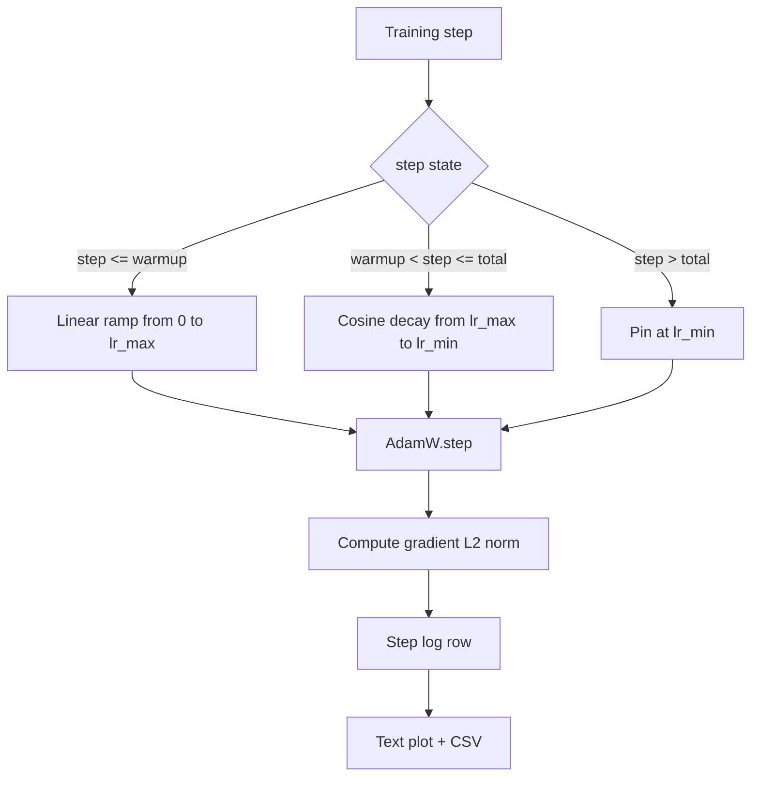

# 带 Linear Warmup 的 Cosine LR

> Chương trình học tốc độ là chỉ theo hàm mất đi. Đó là quyết định quan trọng thứ hai của chức năng mất đi. AdamW là lựa chọn chuẩn mực hiện đại của đào tạo mô hình ngôn ngữ, bởi vì nó cho phép mô hình trong các bản cập nhật trước 1000 lần dễ bị tổn thương nhìn thấy kích thước bước hiệu quả nhỏ hơn, dần dần tăng lên đỉnh điểm của cấu hình, sau đó làm phẳng suy giảm trở lại gần zero.

**Type:** Build
**Languages:** Python
**Prerequisites:** Phase 19 lessons 30-37
**Time:** ~90 分钟

## Mục tiêu học tập

- 实现一个 AdamW Optimizer,并接入带线性变暖的共性学习率时间表.
- Trong bất kỳ bước 精确计算 lịch trình của giá trị, tránh chạy xuyên xuất hiện drift điểm nổi.
- Để làm cho điều kiện L2 theo chuẩn độ và tốc độ học tập và ghi lại, để làm cho tình trạng sức khỏe tập luyện có thể quan sát được.
- Tự định lịch trình 染 cho mắt người đọc bản đồ văn bản, cũng như bất kỳ công cụ nào đều có thể tiêu thụ CSV.

## Vấn đề

Trước đây, các bản cập nhật đào tạo nhất ──: 模型的重量 仍然接近初始化──: 优化器的运行第二时刻估计 尚未稳定──: 渐进标准还大又.──:  如果学习率在这些更新中处于峰值,模型要么直接 diverge,要么陷入永远逃不出的损失平原──: 两个众所周知的修复方法是梯度剪裁,也就是阶段19课45 的主题,以及一个从小开始并步步升级学习时间表――:

Chương trình cosine-with-warmup có ba khu vực. Từ bước 0 đến `warmup_steps`, tốc độ học tập từ 0 tuyến tính giảm xuống đỉnh độ phân phối`lr_max` Từ `warmup_steps`Đến`total_steps`,tốc độ học tập theo đường cong cosine của nửa trên, từ`lr_max`衰减到 `lr_min` `total_steps`ếch, tỷ lệ học tập  cố định `lr_min`, một người huấn luyện viên không thể rời khỏi lịch trình.

构建问题在日程中 很容易出现一个人. 六小时后的表现为学习率 在模型开始过时时高出或低出 1%. trừ khi làm hết sức kiểm tra về biên giới của lịch trình, nếu không thì không thể nhìn thấy được.

## Khái niệm



### Công thức làm nóng

 Đối với `warmup_steps > 0`时位于 `[0, warmup_steps]`của `step`, tỷ lệ học là `lr_max * step / warmup_steps`❖ Sự biến đổi`warmup_steps = 0`trường hợp được xem là "không nóng lên": lịch trình ở bước 0  trực tiếp từ `lr_max`开始,并立即进入 cosine decay. Một số vòng kiểm tra sẽ truyền vào.`warmup_steps = 0`, để kiểm tra lịch trình  vẫn có thể tạo ra đường cong có thể sử dụng.

### Công thức cosine

 Đối với `(warmup_steps, total_steps]`Trung `step`, tỷ lệ học là `lr_min + 0.5 * (lr_max - lr_min) * (1 + cos(pi * progress))`, trong số đó `progress = (step - warmup_steps) / max(1, total_steps - warmup_steps)` `step = warmup_steps`,cosine 求值为 `cos(0) = 1`, nhận được`lr_max`, với điểm cuối nóng 精确匹配.`step = total_steps`,cosine 求值为 `cos(pi) = -1`, nhận được`lr_min`, với điểm cuối của sự phân hủy 精确匹配

2 điểm cuối trên không phải là ngẫu nhiên. Vì vậy, lịch trình được thực hiện như một`step`của một chức năng đơn lẻ, thay vì ba chức năng khác nhau 拼接在一起──拼接的时间表 在第一次改变`lr_max`Khi ta sẽ mất một giới hạn.

### Lầu sau các bước tổng thể

 Đối với `step > total_steps`, tốc độ học tập  giữ `lr_min` hợp đồng là rõ ràng: lịch trình không báo cáo sai, cũng không phân tích; nó cố định trên sàn,并让 huấn luyện viên ghi nhận cảnh báo.`total_steps`, thay vì modification vòng.

### Để chuẩn độ và tỷ lệ một ghi lại

Chương trình là một nửa trạng thái khỏe mạnh của tập luyện. Biểu chuẩn cấp độ là một nửa khác. Loop tập luyện Mỗi bước ghi lại hai. Điện trình tập luyện khác nhau sẽ xuất hiện trước khi mức độ tăng lên, sau đó mất mát sẽ thay đổi.`step, lr, grad_l2_norm, loss`CSV là hồ sơ duy nhất bền vững.


```figure
cap-cosine-warmup
```

## Hãy xây dựng nó

`code/main.py`实现:

- `CosineWithWarmup`- Một chức năng không có quốc tịch, hình thức dựa trên lịch trình định vị của `lr(step) -> float`
- `TrainState`- Để làm như thế.`AdamW`Optimizer và lịch trình 封装 thành một chức năng bước.
- `TrainState.step`- 运行 một lần đi về phía trước, một lần đi ngược, ghi lại chuẩn độ L2,并把 `lr(step)` ứng dụng đến Optimizer.
- `plot_schedule_ascii`- sẽ lập trình 染为人眼可读的文字插图──
- `write_schedule_csv`- Đối với mỗi bước 输出一行学习率

文件底部的演示会构建一个很小的`nn.Linear`模型, trong đợt đầu vào cố định 上训练 20 bước,并打印 từng bước của tốc độ học ̊n chuẩn và mất mát.

运行:

```bash
python3 code/main.py
```

脚本以 0 退出,并打印 từng bước nhật ký đào tạo và lịch trình kế hoạch.

## Các mẫu sản xuất

4 mô hình có thể đưa lịch trình lên sản phẩm

**Schedule 放在 config 中，而不是 code 中。**trainer từ trình gửi đến git của YAML hoặc JSON config 读取 `warmup_steps``total_steps``lr_max``lr_min`❖ lịch trình là có thể hoàn thành, vì cấu hình là nội dung được giải quyết; lịch trình là có thể kiểm tra, vì cấu hình là một phần của PR khác biệt.

**Step counter 是 monotonic，并与 epochs 解耦。**Khi bộ dữ liệu bị chia nhỏ hoặc bộ tải dữ liệu được khởi động lại, một số khung sẽ được kết hợp bước và thời gian.`global_step`, thay vì từ bộ đếm địa phương 读取;; tiếp tục chạy 会在正确的时间表位置 继续,因为 bước đếm là trục bền.

**Schedule plot 放在 run directory 中。**Mỗi buổi tập đều có thể được thực hiện.`outputs/lr_schedule.png`(或本课中的文本图片)写入它的运行目录──评论家 浏览目录时,无需重新运行任何东西就能智能检查时间表──这能在 PR时间 捕获错误配置时间表类 bug──

**Log row schema 固定。** `step, lr, grad_l2_norm, loss`,顺序如此──下游 notebook 或仪表板 会读取这个方案;不弹版本就重新命名列,会让所有现有仪表板失效──

## Sử dụng nó

Các mô hình sản xuất:

- **先 sweep peak，再 sweep 其他任何东西。** `lr_max`Đây là vòng quay nhạy cảm nhất. Trước đó là mô hình nhỏ.`lr_max`Với mô hình lớn của quy mô rất yếu, vì vậy mô hình nhỏ là một ưu tiên mạnh.
- **Warmup 是 total steps 的 fraction，不是绝对 count。**Một chạy 200 triệu bước nếu chỉ có 2.000 bước làm nóng, gần như đạt đến đỉnh điểm; một chạy 20.000 bước sử dụng cùng số lượng thì sẽ làm nóng 10%──把 warmup 配置为分数 ((典型:1-3%)),让时间表随训时长缩放──
- **`lr_min` 非零是有意的。**Một vì`lr_max`10% của sàn, sẽ cho phép Optimizer trong đuôi dài tiếp tục học.`lr_min = 0`Chương trình sẽ có một hình vẽ rất tốt về đường cong đào tạo, cũng như một mô hình thực tế chưa hoàn thành đào tạo.

## Chuyển nó

Trong một dự án thực tế,`outputs/skill-cosine-warmup.md`会 mô tả cấu hình 承载时间表 全球计数 读取,以及什么样`lr_max`trôi dạt 产出 triển khai giá trị.

## Các bài tập

1. Thêm lịch trình của biến thể ngược-square-root, và chạy 200 bước huấn luyện đồ chơi trên đối với tỷ lệ.
2. 添加 `--restart`cờ, trong `total_steps / 2`增加第二次加热――为热重启 在玩具运行 上是升升还是伤害做辩护――
3. 添加一个单位测试验证时间表是连续的:对于 `[0, total_steps]`Trung trong mỗi bước,差值 `|lr(step+1) - lr(step)|`Được `lr_max / warmup_steps`约束.
4. sẽ lập lịch 接入 `torch.optim.lr_scheduler.LambdaLR`, để nó có thể với mã khung 组合.
5. 添加 `--plot-png`cờ, qua `matplotlib`写出真实图片──为本课的文本图片 和 PNG 哪个更适合合作为CI runs 默认做出辩护──

## Các điều khoản chính

| Term | What people say | What it actually means |
|------|-----------------|------------------------|
| Warmup | "Slow start" | 在前 `warmup_steps` 次 updates 中，从 zero 到 `lr_max` 的 linear ramp |
| Cosine decay | "Smooth drop" | 在剩余 steps 中，从 `lr_max` 到 `lr_min` 的上半段 cosine curve |
| Floor | "After training" | schedule 在超过 `total_steps` 后固定的 `lr_min` 值 |
| Gradient norm | "L2 of grads" | 拼接后的 gradient vector 的 Euclidean norm，每 step 记录 |
| Global step | "Schedule axis" | 一个能跨 restart 保留的 monotonic step counter，用于驱动 schedule |

## Đọc thêm

- [Loshchilov and Hutter, SGDR: Stochastic Gradient Descent with Warm Restarts (arXiv 1608.03983)](https://arxiv.org/abs/1608.03983)- giấy tham chiếu của lịch trình cosine
- [Loshchilov and Hutter, Decoupled Weight Decay Regularization (arXiv 1711.05101)](https://arxiv.org/abs/1711.05101)- Báo cáo của AdamW
- [PyTorch torch.optim.lr_scheduler](https://docs.pytorch.org/docs/stable/optim.html#how-to-adjust-learning-rate)- các chức năng bước 如何与框架安排组合
- Giai đoạn 19 · 42 - 产出此表 所消费语料的下载器
- Giai đoạn 19 · 43 - Cùng với lịch trình này  cùng phát triển bộ tải dữ liệu
- Giai đoạn 19 · 45 - cắt gradient và AMP, cũng là tầng dưới của vòng lặp
